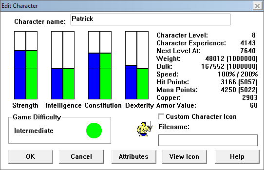

# File Header

```
       00 01 02 03 04 05 06 07 08 09 0A 0B 0C 0D 0E 0F
00000: 76 77 01 01 00 43 00 00 80 00 00 00 B1 09 00 00
00010: F1 09 00 00 FD 0A 00 00 E4 11 00 00 AA 12 00 00
00020: B7 0D 01 00
```

| offset | type | value h | value d | description                                |
|-------:|------|--------:|--------:|--------------------------------------------|
|      0 | u1   |      76 |     118 | file version?, 76 == Castle1, 77 = Castle2 |
|      8 | u4   |      80 |     128 | character data offset                      |
|      C | u4   |     9B1 |    2481 | unknown offset                             |
|     10 | u4   |     9F1 |    2545 | unknown offset                             |
|     14 | u4   |     AFD |    2813 | shops offset                               |
|     18 | u4   |    11E4 |    4580 | unknown offset                             |
|     1C | u4   |    12AA |    4778 | unknown offset                             |
|     20 | u4   |   10DB7 |   69047 | end of file offset, 4 bytes before EOF     |

# Unused?

```
       00 01 02 03 04 05 06 07 08 09 0A 0B 0C 0D 0E 0F
00020:             00 00 00 00 00 00 00 00 00 00 00 00
00030: 00 00 00 00 00 00 00 00 00 00 00 00 00 00 00 00
00040: 00 00 00 00 00 00 00 00 00 00 00 00 00 00 00 00
00050: 00 00 00 00 00 00 00 00 00 00 00 00 00 00 00 00
00060: 00 00 00 00 00 00 00 00 00 00 00 00 00 00 00 00
00070: 00 00 00 00 00 00 00 00 00 00 00 00 00 00 00 00
```

# Player Header


```
       00 01 02 03 04 05 06 07 08 09 0A 0B 0C 0D 0E 0F
00080: 48 2D 44 2D 48 2D 44 32 00 00 00 00 00 00 00 00
00090: 00 00 00 05 5E 0C C1 13 9A 10 9E 13 08 00 2F 10
000A0: 00 00 2F 10 00 00 44 00 0A 00 05 00 64 00 64 00
000B0: 32 00 00 00 0B 04 0B 05 01 00 00
```

| offset | type |     value h | value d | description                                   |
|-------:|------|------------:|--------:|-----------------------------------------------|
|     80 | s1   |          48 |      72 | Strength base                                 |
|     81 | s1   |          2D |      45 | Intelligence base                             |
|     82 | s1   |          44 |      68 | Constitution base                             |
|     83 | s1   |          2D |      45 | Dexterity base                                |
|     84 | s1   |          48 |      72 | Strength                                      |
|     85 | s1   |          2D |      45 | Intelligence                                  |
|     86 | s1   |          44 |      68 | Constitution                                  |
|     87 | s1   |          32 |      50 | Dexterity                                     |
|     88 | s1   |           0 |       0 | Strength penalty                              |
|     89 | s1   |           0 |       0 | Intelligence penalty                          |
|     8A | s1   |           0 |       0 | Constitution penalty                          |
|     8B | s1   |           0 |       0 | Dexterity penalty                             |
|     8C | ??   | 00 00 00 00 |       0 | unknown                                       |
|     90 | s1   |           0 |       0 | Strength bonus                                |
|     91 | s1   |           0 |       0 | Intelligence bonus                            |
|     92 | s1   |           0 |       0 | Constitution bonus                            |
|     93 | s1   |           5 |       5 | Dexterity bonus                               |
|     94 | s2   |         C5E |    3166 | Hit points                                    |
|     96 | s2   |        13C1 |    5057 | Hit points max                                |
|     98 | s2   |        109A |    4250 | Mana                                          |
|     9A | s2   |        139E |    5022 | Mana max                                      |
|     9C | s2   |           8 |       8 | Character level                               |
|     9E | s4   |        102F |    4143 | Experience  (can be less than max?)           |
|     A2 | s4   |        102F |    4143 | Experience max                                |
|     A6 | s2   |          44 |      68 | Armor Value                                   |
|     A8 | s2   |           A |      10 | To Hit bonus                                  |
|     AA | s2   |           5 |       5 | To Damage bonus                               |
|     AC | s2   |          64 |     100 | Speed                                         |
|     AE | s2   |          64 |     100 | Speed Base                                    |
|     B0 | s2   |          32 |      50 | Speed Burden (as % from weight vs weight max) |
|     B2 | s2   |           0 |       0 | Game Version? (observed 00 in 1 and 02 in 2)  |
|     B4 | s1   |           B |      11 | Position, current Y                           |
|     B5 | s1   |           4 |       4 | Position, current X                           |
|     B6 | s1   |           B |      11 | Position, previous Y                          |
|     B7 | s1   |           5 |       5 | Position, previous X                          |
|     B8 | ??   |       01 00 |       1 | unknown                                       |
|     BA | s1   |           0 |       0 | Gender                                        |

# Unknown

```
       00 01 02 03 04 05 06 07 08 09 0A 0B 0C 0D 0E 0F
000B0:                                  00 A6 13 00 00
000C0: 00 00 00 00 00 00 00
```

# Story Progression


```
       00 01 02 03 04 05 06 07 08 09 0A 0B 0C 0D 0E 0F
000C0:                      01 01 01 00 01 01 00 00 00
000D0: 00 00 00 00 00 00
```

| offset | type | value h | value d | description     |
|-------:|------|--------:|--------:|-----------------|
|     C7 | s1   |       1 |       1 | burining_farm   |
|     C8 | s1   |       1 |       1 | parchment       |
|     C9 | s1   |       1 |       1 | burining_hamlet |
|     CA | s1   |       0 |       0 | page_gap_0      |
|     CB | s1   |       1 |       1 | patrol_orders   |
|     CC | s1   |       1 |       1 | bandit_chest    |
|     CD | s1   |       0 |       0 | hrugnir_first   |
|     CE | s1   |       0 |       0 | page_gap_1      |
|     CF | s1   |       0 |       0 | hrugnir_spell   |
|     D0 | s1   |       0 |       0 | hrugnir_final   |
|     D1 | s1   |       0 |       0 | page_gap_2      |
|     D2 | s1   |       0 |       0 | father_speach   |
|     D3 | s1   |       0 |       0 | page_gap_3      |
|     D4 | s1   |       0 |       0 | page_gap_4      |
|     D5 | s1   |       0 |       0 | end_game_1      |

# Unknown

```
       00 01 02 03 04 05 06 07 08 09 0A 0B 0C 0D 0E 0F
000D0:                   00 00 00 00 00 00 00 00 00 00
000E0: 00 00 00 00 00 00 00 00 00 00 00 00 00 00 00 00
000F0: 00 00 00 00 00 00 00 00 00 00 00 00 00 00 00 00
```

# Player name

```
       00 01 02 03 04 05 06 07 08 09 0A 0B 0C 0D 0E 0F
00100: 50 61 74 72 69 63 6B 00 00 00 00 00 00 00 00 00
00110: 00 00 00 00 00 00 00 00 00 00 00 00 00 00 00 00
00120: 00 00 00 00 00 00 00 00 00 00 00 00 00 00 00 00
00130: 00 00 00 00 00 00 00 00 00 00 00 00 00 00 00 00
00140: 00 00 00 00 00 00 00 00 00 00 00 00 00 00 00 00
```

nul terminator at: 107
Hex: 50 61 74 72 69 63 6B
Ascii: Patrick

# Player Resistances

```
       00 01 02 03 04 05 06 07 08 09 0A 0B 0C 0D 0E 0F
00150: 00 00 00 00 01 00 00 00 00 00 00 00
```

| offset | type | value h | value d | description       |
|-------:|------|--------:|--------:|-------------------|
|    150 | s2   |       0 |       0 | Resist Fire       |
|    152 | s2   |       0 |       0 | Resist Cold       |
|    154 | s2   |       1 |       1 | Resist Lightning  |
|    156 | s2   |       0 |       0 | Resist Acid       |
|    158 | s2   |       0 |       0 | Resist Fear       |
|    15A | s2   |       0 |       0 | Resist Drain Life |

# Unknown

```
       00 01 02 03 04 05 06 07 08 09 0A 0B 0C 0D 0E 0F
00150:                                     00 00 00 00
00160: 00 00 00 00 00 00 01 00 00 00 00 00 00 00 00 00
00170: 00 00 00 00 00 00 00 00 00 00 00 00 00 00 00 00
00180: 00 00 00 00 00 00 00 00 00 00 00 00 00 00 00 00
00190: 0A 00 01 00 00 00 00 00 00 00 00 00 00 00 00 00
001A0: 00 00 00 00 00 00 00 00 00 00 00 00 00 00
```

# Spell Book

## Heal Minor Wounds

```
       00 01 02 03 04 05 06 07 08 09 0A 0B 0C 0D 0E 0F
001A0:                                           00 02
001B0: 01 01 01 02 32 00 08 00 0B 00
```

| offset | type | value h |          value d | description             |
|-------:|------|--------:|-----------------:|-------------------------|
|    1AE | s2   |     200 |              512 | Identity?               |
|    1B0 | s1   |       1 |                1 | Level                   |
|    1B1 | s1   |       1 |                1 | Default mana cost       |
|    1B2 | s1   |       1 |                1 | Mana cost               |
|    1B3 | s1   |       2 |                2 | Category                |
|    1B4 | s2   |      32 |               50 | Time to cast * 1/10 sec |
|    1B6 | b16  |    0800 | 0001000000000000 | Effect?                 |
|    1B8 | b16  |    0B00 | 1101000000000000 | Unknown                 |

## Detect Objects

```
       00 01 02 03 04 05 06 07 08 09 0A 0B 0C 0D 0E 0F
001B0:                               02 02 01 01 01 04
001C0: 2C 01 10 00 00 00
```

| offset | type | value h |          value d | description             |
|-------:|------|--------:|-----------------:|-------------------------|
|    1BA | s2   |     202 |              514 | Identity?               |
|    1BC | s1   |       1 |                1 | Level                   |
|    1BD | s1   |       1 |                1 | Default mana cost       |
|    1BE | s1   |       1 |                1 | Mana cost               |
|    1BF | s1   |       4 |                4 | Category                |
|    1C0 | s2   |     12C |              300 | Time to cast * 1/10 sec |
|    1C2 | b16  |    1000 | 0000100000000000 | Effect?                 |
|    1C4 | b16  |    0000 | 0000000000000000 | Unknown                 |

## Light

```
       00 01 02 03 04 05 06 07 08 09 0A 0B 0C 0D 0E 0F
001C0:                   A3 02 01 01 01 05 32 00 00 00
001D0: 00 00
```

| offset | type | value h |          value d | description             |
|-------:|------|--------:|-----------------:|-------------------------|
|    1C6 | s2   |     2A3 |              675 | Identity?               |
|    1C8 | s1   |       1 |                1 | Level                   |
|    1C9 | s1   |       1 |                1 | Default mana cost       |
|    1CA | s1   |       1 |                1 | Mana cost               |
|    1CB | s1   |       5 |                5 | Category                |
|    1CC | s2   |      32 |               50 | Time to cast * 1/10 sec |
|    1CE | b16  |    0000 | 0000000000000000 | Effect?                 |
|    1D0 | b16  |    0000 | 0000000000000000 | Unknown                 |

## Magic Arrow

```
       00 01 02 03 04 05 06 07 08 09 0A 0B 0C 0D 0E 0F
001D0:       FE 01 01 01 01 00 32 00 00 00 03 00
```

| offset | type | value h |          value d | description             |
|-------:|------|--------:|-----------------:|-------------------------|
|    1D2 | s2   |     1FE |              510 | Identity?               |
|    1D4 | s1   |       1 |                1 | Level                   |
|    1D5 | s1   |       1 |                1 | Default mana cost       |
|    1D6 | s1   |       1 |                1 | Mana cost               |
|    1D7 | s1   |       0 |                0 | Category                |
|    1D8 | s2   |      32 |               50 | Time to cast * 1/10 sec |
|    1DA | b16  |    0000 | 0000000000000000 | Effect?                 |
|    1DC | b16  |    0300 | 1100000000000000 | Unknown                 |

## Phase Door

```
       00 01 02 03 04 05 06 07 08 09 0A 0B 0C 0D 0E 0F
001D0:                                           01 02
001E0: 01 01 01 03 32 00 00 00 02 00
```

| offset | type | value h |          value d | description             |
|-------:|------|--------:|-----------------:|-------------------------|
|    1DE | s2   |     201 |              513 | Identity?               |
|    1E0 | s1   |       1 |                1 | Level                   |
|    1E1 | s1   |       1 |                1 | Default mana cost       |
|    1E2 | s1   |       1 |                1 | Mana cost               |
|    1E3 | s1   |       3 |                3 | Category                |
|    1E4 | s2   |      32 |               50 | Time to cast * 1/10 sec |
|    1E6 | b16  |    0000 | 0000000000000000 | Effect?                 |
|    1E8 | b16  |    0200 | 0100000000000000 | Unknown                 |

## Shield

```
       00 01 02 03 04 05 06 07 08 09 0A 0B 0C 0D 0E 0F
001E0:                               43 01 01 01 01 01
001F0: 32 00 00 00 00 00
```

| offset | type | value h |          value d | description             |
|-------:|------|--------:|-----------------:|-------------------------|
|    1EA | s2   |     143 |              323 | Identity?               |
|    1EC | s1   |       1 |                1 | Level                   |
|    1ED | s1   |       1 |                1 | Default mana cost       |
|    1EE | s1   |       1 |                1 | Mana cost               |
|    1EF | s1   |       1 |                1 | Category                |
|    1F0 | s2   |      32 |               50 | Time to cast * 1/10 sec |
|    1F2 | b16  |    0000 | 0000000000000000 | Effect?                 |
|    1F4 | b16  |    0000 | 0000000000000000 | Unknown                 |

## Clairvoyance

```
       00 01 02 03 04 05 06 07 08 09 0A 0B 0C 0D 0E 0F
001F0:                   78 03 02 03 FF 04 2C 01 10 00
00200: 00 00
```

| offset | type | value h |          value d | description             |
|-------:|------|--------:|-----------------:|-------------------------|
|    1F6 | s2   |     378 |              888 | Identity?               |
|    1F8 | s1   |       2 |                2 | Level                   |
|    1F9 | s1   |       3 |                3 | Default mana cost       |
|    1FA | s1   |      FF |               -1 | Mana cost               |
|    1FB | s1   |       4 |                4 | Category                |
|    1FC | s2   |     12C |              300 | Time to cast * 1/10 sec |
|    1FE | b16  |    1000 | 0000100000000000 | Effect?                 |
|    200 | b16  |    0000 | 0000000000000000 | Unknown                 |

## Cold Bolt

```
       00 01 02 03 04 05 06 07 08 09 0A 0B 0C 0D 0E 0F
00200:       0A 02 02 02 FF 00 32 00 02 00 03 00
```

| offset | type | value h |          value d | description             |
|-------:|------|--------:|-----------------:|-------------------------|
|    202 | s2   |     20A |              522 | Identity?               |
|    204 | s1   |       2 |                2 | Level                   |
|    205 | s1   |       2 |                2 | Default mana cost       |
|    206 | s1   |      FF |               -1 | Mana cost               |
|    207 | s1   |       0 |                0 | Category                |
|    208 | s2   |      32 |               50 | Time to cast * 1/10 sec |
|    20A | b16  |    0200 | 0100000000000000 | Effect?                 |
|    20C | b16  |    0300 | 1100000000000000 | Unknown                 |

## Detect Monsters

```
       00 01 02 03 04 05 06 07 08 09 0A 0B 0C 0D 0E 0F
00200:                                           12 02
00210: 02 02 01 04 2C 01 10 00 00 00
```

| offset | type | value h |          value d | description             |
|-------:|------|--------:|-----------------:|-------------------------|
|    20E | s2   |     212 |              530 | Identity?               |
|    210 | s1   |       2 |                2 | Level                   |
|    211 | s1   |       2 |                2 | Default mana cost       |
|    212 | s1   |       1 |                1 | Mana cost               |
|    213 | s1   |       4 |                4 | Category                |
|    214 | s2   |     12C |              300 | Time to cast * 1/10 sec |
|    216 | b16  |    1000 | 0000100000000000 | Effect?                 |
|    218 | b16  |    0000 | 0000000000000000 | Unknown                 |

## Detect Traps

```
       00 01 02 03 04 05 06 07 08 09 0A 0B 0C 0D 0E 0F
00210:                               FF 01 02 02 FF 04
00220: 2C 01 10 00 00 00
```

| offset | type | value h |          value d | description             |
|-------:|------|--------:|-----------------:|-------------------------|
|    21A | s2   |     1FF |              511 | Identity?               |
|    21C | s1   |       2 |                2 | Level                   |
|    21D | s1   |       2 |                2 | Default mana cost       |
|    21E | s1   |      FF |               -1 | Mana cost               |
|    21F | s1   |       4 |                4 | Category                |
|    220 | s2   |     12C |              300 | Time to cast * 1/10 sec |
|    222 | b16  |    1000 | 0000100000000000 | Effect?                 |
|    224 | b16  |    0000 | 0000000000000000 | Unknown                 |

## Identify

```
       00 01 02 03 04 05 06 07 08 09 0A 0B 0C 0D 0E 0F
00220:                   4B 02 02 02 FF 04 58 02 10 00
00230: 00 00
```

| offset | type | value h |          value d | description             |
|-------:|------|--------:|-----------------:|-------------------------|
|    226 | s2   |     24B |              587 | Identity?               |
|    228 | s1   |       2 |                2 | Level                   |
|    229 | s1   |       2 |                2 | Default mana cost       |
|    22A | s1   |      FF |               -1 | Mana cost               |
|    22B | s1   |       4 |                4 | Category                |
|    22C | s2   |     258 |              600 | Time to cast * 1/10 sec |
|    22E | b16  |    1000 | 0000100000000000 | Effect?                 |
|    230 | b16  |    0000 | 0000000000000000 | Unknown                 |

## Levitation

```
       00 01 02 03 04 05 06 07 08 09 0A 0B 0C 0D 0E 0F
00230:       84 01 02 02 FF 03 32 00 00 00 00 00
```

| offset | type | value h |          value d | description             |
|-------:|------|--------:|-----------------:|-------------------------|
|    232 | s2   |     184 |              388 | Identity?               |
|    234 | s1   |       2 |                2 | Level                   |
|    235 | s1   |       2 |                2 | Default mana cost       |
|    236 | s1   |      FF |               -1 | Mana cost               |
|    237 | s1   |       3 |                3 | Category                |
|    238 | s2   |      32 |               50 | Time to cast * 1/10 sec |
|    23A | b16  |    0000 | 0000000000000000 | Effect?                 |
|    23C | b16  |    0000 | 0000000000000000 | Unknown                 |

## Neutralize Poison

```
       00 01 02 03 04 05 06 07 08 09 0A 0B 0C 0D 0E 0F
00230:                                           A4 02
00240: 02 03 FF 02 32 00 08 00 0B 00
```

| offset | type | value h |          value d | description             |
|-------:|------|--------:|-----------------:|-------------------------|
|    23E | s2   |     2A4 |              676 | Identity?               |
|    240 | s1   |       2 |                2 | Level                   |
|    241 | s1   |       3 |                3 | Default mana cost       |
|    242 | s1   |      FF |               -1 | Mana cost               |
|    243 | s1   |       2 |                2 | Category                |
|    244 | s2   |      32 |               50 | Time to cast * 1/10 sec |
|    246 | b16  |    0800 | 0001000000000000 | Effect?                 |
|    248 | b16  |    0B00 | 1101000000000000 | Unknown                 |

## Cold Ball

```
       00 01 02 03 04 05 06 07 08 09 0A 0B 0C 0D 0E 0F
00240:                               0D 02 03 04 FF 00
00250: 32 00 02 00 04 00
```

| offset | type | value h |          value d | description             |
|-------:|------|--------:|-----------------:|-------------------------|
|    24A | s2   |     20D |              525 | Identity?               |
|    24C | s1   |       3 |                3 | Level                   |
|    24D | s1   |       4 |                4 | Default mana cost       |
|    24E | s1   |      FF |               -1 | Mana cost               |
|    24F | s1   |       0 |                0 | Category                |
|    250 | s2   |      32 |               50 | Time to cast * 1/10 sec |
|    252 | b16  |    0200 | 0100000000000000 | Effect?                 |
|    254 | b16  |    0400 | 0010000000000000 | Unknown                 |

## Heal Medium Wounds

```
       00 01 02 03 04 05 06 07 08 09 0A 0B 0C 0D 0E 0F
00250:                   8B 02 03 03 FF 02 32 00 08 00
00260: 0B 00
```

| offset | type | value h |          value d | description             |
|-------:|------|--------:|-----------------:|-------------------------|
|    256 | s2   |     28B |              651 | Identity?               |
|    258 | s1   |       3 |                3 | Level                   |
|    259 | s1   |       3 |                3 | Default mana cost       |
|    25A | s1   |      FF |               -1 | Mana cost               |
|    25B | s1   |       2 |                2 | Category                |
|    25C | s2   |      32 |               50 | Time to cast * 1/10 sec |
|    25E | b16  |    0800 | 0001000000000000 | Effect?                 |
|    260 | b16  |    0B00 | 1101000000000000 | Unknown                 |

## Fire Bolt

```
       00 01 02 03 04 05 06 07 08 09 0A 0B 0C 0D 0E 0F
00260:       0C 02 03 03 FF 00 32 00 01 00 03 00
```

| offset | type | value h |          value d | description             |
|-------:|------|--------:|-----------------:|-------------------------|
|    262 | s2   |     20C |              524 | Identity?               |
|    264 | s1   |       3 |                3 | Level                   |
|    265 | s1   |       3 |                3 | Default mana cost       |
|    266 | s1   |      FF |               -1 | Mana cost               |
|    267 | s1   |       0 |                0 | Category                |
|    268 | s2   |      32 |               50 | Time to cast * 1/10 sec |
|    26A | b16  |    0100 | 1000000000000000 | Effect?                 |
|    26C | b16  |    0300 | 1100000000000000 | Unknown                 |

## Lightening Bolt

```
       00 01 02 03 04 05 06 07 08 09 0A 0B 0C 0D 0E 0F
00260:                                           0B 02
00270: 03 03 FF 00 32 00 04 00 11 00
```

| offset | type | value h |          value d | description             |
|-------:|------|--------:|-----------------:|-------------------------|
|    26E | s2   |     20B |              523 | Identity?               |
|    270 | s1   |       3 |                3 | Level                   |
|    271 | s1   |       3 |                3 | Default mana cost       |
|    272 | s1   |      FF |               -1 | Mana cost               |
|    273 | s1   |       0 |                0 | Category                |
|    274 | s2   |      32 |               50 | Time to cast * 1/10 sec |
|    276 | b16  |    0400 | 0010000000000000 | Effect?                 |
|    278 | b16  |    1100 | 1000100000000000 | Unknown                 |

## Remove Curse

```
       00 01 02 03 04 05 06 07 08 09 0A 0B 0C 0D 0E 0F
00270:                               8C 02 03 03 02 05
00280: 58 02 00 00 00 00
```

| offset | type | value h |          value d | description             |
|-------:|------|--------:|-----------------:|-------------------------|
|    27A | s2   |     28C |              652 | Identity?               |
|    27C | s1   |       3 |                3 | Level                   |
|    27D | s1   |       3 |                3 | Default mana cost       |
|    27E | s1   |       2 |                2 | Mana cost               |
|    27F | s1   |       5 |                5 | Category                |
|    280 | s2   |     258 |              600 | Time to cast * 1/10 sec |
|    282 | b16  |    0000 | 0000000000000000 | Effect?                 |
|    284 | b16  |    0000 | 0000000000000000 | Unknown                 |

## Resist Fire

```
       00 01 02 03 04 05 06 07 08 09 0A 0B 0C 0D 0E 0F
00280:                   86 02 03 03 FF 01 32 00 01 00
00290: 00 00
```

| offset | type | value h |          value d | description             |
|-------:|------|--------:|-----------------:|-------------------------|
|    286 | s2   |     286 |              646 | Identity?               |
|    288 | s1   |       3 |                3 | Level                   |
|    289 | s1   |       3 |                3 | Default mana cost       |
|    28A | s1   |      FF |               -1 | Mana cost               |
|    28B | s1   |       1 |                1 | Category                |
|    28C | s2   |      32 |               50 | Time to cast * 1/10 sec |
|    28E | b16  |    0100 | 1000000000000000 | Effect?                 |
|    290 | b16  |    0000 | 0000000000000000 | Unknown                 |

## Resist Cold

```
       00 01 02 03 04 05 06 07 08 09 0A 0B 0C 0D 0E 0F
00290:       87 02 03 03 FF 01 32 00 02 00 00 00
```

| offset | type | value h |          value d | description             |
|-------:|------|--------:|-----------------:|-------------------------|
|    292 | s2   |     287 |              647 | Identity?               |
|    294 | s1   |       3 |                3 | Level                   |
|    295 | s1   |       3 |                3 | Default mana cost       |
|    296 | s1   |      FF |               -1 | Mana cost               |
|    297 | s1   |       1 |                1 | Category                |
|    298 | s2   |      32 |               50 | Time to cast * 1/10 sec |
|    29A | b16  |    0200 | 0100000000000000 | Effect?                 |
|    29C | b16  |    0000 | 0000000000000000 | Unknown                 |

## Resist Lightning

```
       00 01 02 03 04 05 06 07 08 09 0A 0B 0C 0D 0E 0F
00290:                                           88 02
002A0: 03 03 FF 01 32 00 04 00 00 00
```

| offset | type | value h |          value d | description             |
|-------:|------|--------:|-----------------:|-------------------------|
|    29E | s2   |     288 |              648 | Identity?               |
|    2A0 | s1   |       3 |                3 | Level                   |
|    2A1 | s1   |       3 |                3 | Default mana cost       |
|    2A2 | s1   |      FF |               -1 | Mana cost               |
|    2A3 | s1   |       1 |                1 | Category                |
|    2A4 | s2   |      32 |               50 | Time to cast * 1/10 sec |
|    2A6 | b16  |    0400 | 0010000000000000 | Effect?                 |
|    2A8 | b16  |    0000 | 0000000000000000 | Unknown                 |

## Resist Acid

```
       00 01 02 03 04 05 06 07 08 09 0A 0B 0C 0D 0E 0F
002A0:                               89 02 03 03 FE 01
002B0: 32 00 00 00 00 00
```

| offset | type | value h |          value d | description             |
|-------:|------|--------:|-----------------:|-------------------------|
|    2AA | s2   |     289 |              649 | Identity?               |
|    2AC | s1   |       3 |                3 | Level                   |
|    2AD | s1   |       3 |                3 | Default mana cost       |
|    2AE | s1   |      FE |               -2 | Mana cost               |
|    2AF | s1   |       1 |                1 | Category                |
|    2B0 | s2   |      32 |               50 | Time to cast * 1/10 sec |
|    2B2 | b16  |    0000 | 0000000000000000 | Effect?                 |
|    2B4 | b16  |    0000 | 0000000000000000 | Unknown                 |

## Resist Fear

```
       00 01 02 03 04 05 06 07 08 09 0A 0B 0C 0D 0E 0F
002B0:                   8A 02 03 03 FE 01 32 00 00 00
002C0: 00 00
```

| offset | type | value h |          value d | description             |
|-------:|------|--------:|-----------------:|-------------------------|
|    2B6 | s2   |     28A |              650 | Identity?               |
|    2B8 | s1   |       3 |                3 | Level                   |
|    2B9 | s1   |       3 |                3 | Default mana cost       |
|    2BA | s1   |      FE |               -2 | Mana cost               |
|    2BB | s1   |       1 |                1 | Category                |
|    2BC | s2   |      32 |               50 | Time to cast * 1/10 sec |
|    2BE | b16  |    0000 | 0000000000000000 | Effect?                 |
|    2C0 | b16  |    0000 | 0000000000000000 | Unknown                 |

## Sleep Monster

```
       00 01 02 03 04 05 06 07 08 09 0A 0B 0C 0D 0E 0F
002C0:       31 03 03 04 FF 00 32 00 00 00 00 00
```

| offset | type | value h |          value d | description             |
|-------:|------|--------:|-----------------:|-------------------------|
|    2C2 | s2   |     331 |              817 | Identity?               |
|    2C4 | s1   |       3 |                3 | Level                   |
|    2C5 | s1   |       4 |                4 | Default mana cost       |
|    2C6 | s1   |      FF |               -1 | Mana cost               |
|    2C7 | s1   |       0 |                0 | Category                |
|    2C8 | s2   |      32 |               50 | Time to cast * 1/10 sec |
|    2CA | b16  |    0000 | 0000000000000000 | Effect?                 |
|    2CC | b16  |    0000 | 0000000000000000 | Unknown                 |

## Slow Monster

```
       00 01 02 03 04 05 06 07 08 09 0A 0B 0C 0D 0E 0F
002C0:                                           32 03
002D0: 03 04 FF 00 32 00 00 00 00 00
```

| offset | type | value h |          value d | description             |
|-------:|------|--------:|-----------------:|-------------------------|
|    2CE | s2   |     332 |              818 | Identity?               |
|    2D0 | s1   |       3 |                3 | Level                   |
|    2D1 | s1   |       4 |                4 | Default mana cost       |
|    2D2 | s1   |      FF |               -1 | Mana cost               |
|    2D3 | s1   |       0 |                0 | Category                |
|    2D4 | s2   |      32 |               50 | Time to cast * 1/10 sec |
|    2D6 | b16  |    0000 | 0000000000000000 | Effect?                 |
|    2D8 | b16  |    0000 | 0000000000000000 | Unknown                 |

## Teleport

```
       00 01 02 03 04 05 06 07 08 09 0A 0B 0C 0D 0E 0F
002D0:                               A6 02 03 03 02 03
002E0: 32 00 00 00 02 00
```

| offset | type | value h |          value d | description             |
|-------:|------|--------:|-----------------:|-------------------------|
|    2DA | s2   |     2A6 |              678 | Identity?               |
|    2DC | s1   |       3 |                3 | Level                   |
|    2DD | s1   |       3 |                3 | Default mana cost       |
|    2DE | s1   |       2 |                2 | Mana cost               |
|    2DF | s1   |       3 |                3 | Category                |
|    2E0 | s2   |      32 |               50 | Time to cast * 1/10 sec |
|    2E2 | b16  |    0000 | 0000000000000000 | Effect?                 |
|    2E4 | b16  |    0200 | 0100000000000000 | Unknown                 |

## Rune of Return

```
       00 01 02 03 04 05 06 07 08 09 0A 0B 0C 0D 0E 0F
002E0:                   B6 02 03 03 02 03 32 00 00 00
002F0: 02 00
```

| offset | type | value h |          value d | description             |
|-------:|------|--------:|-----------------:|-------------------------|
|    2E6 | s2   |     2B6 |              694 | Identity?               |
|    2E8 | s1   |       3 |                3 | Level                   |
|    2E9 | s1   |       3 |                3 | Default mana cost       |
|    2EA | s1   |       2 |                2 | Mana cost               |
|    2EB | s1   |       3 |                3 | Category                |
|    2EC | s2   |      32 |               50 | Time to cast * 1/10 sec |
|    2EE | b16  |    0000 | 0000000000000000 | Effect?                 |
|    2F0 | b16  |    0200 | 0100000000000000 | Unknown                 |

## Heal Major Wounds

```
       00 01 02 03 04 05 06 07 08 09 0A 0B 0C 0D 0E 0F
002F0:       E0 02 04 05 FF 02 32 00 08 00 0B 00
```

| offset | type | value h |          value d | description             |
|-------:|------|--------:|-----------------:|-------------------------|
|    2F2 | s2   |     2E0 |              736 | Identity?               |
|    2F4 | s1   |       4 |                4 | Level                   |
|    2F5 | s1   |       5 |                5 | Default mana cost       |
|    2F6 | s1   |      FF |               -1 | Mana cost               |
|    2F7 | s1   |       2 |                2 | Category                |
|    2F8 | s2   |      32 |               50 | Time to cast * 1/10 sec |
|    2FA | b16  |    0800 | 0001000000000000 | Effect?                 |
|    2FC | b16  |    0B00 | 1101000000000000 | Unknown                 |

## Fireball

```
       00 01 02 03 04 05 06 07 08 09 0A 0B 0C 0D 0E 0F
002F0:                                           0F 02
00300: 04 05 FF 00 32 00 01 00 04 00
```

| offset | type | value h |          value d | description             |
|-------:|------|--------:|-----------------:|-------------------------|
|    2FE | s2   |     20F |              527 | Identity?               |
|    300 | s1   |       4 |                4 | Level                   |
|    301 | s1   |       5 |                5 | Default mana cost       |
|    302 | s1   |      FF |               -1 | Mana cost               |
|    303 | s1   |       0 |                0 | Category                |
|    304 | s2   |      32 |               50 | Time to cast * 1/10 sec |
|    306 | b16  |    0100 | 1000000000000000 | Effect?                 |
|    308 | b16  |    0400 | 0010000000000000 | Unknown                 |

## Ball Lightning

```
       00 01 02 03 04 05 06 07 08 09 0A 0B 0C 0D 0E 0F
00300:                               0E 02 04 04 FF 00
00310: 32 00 04 00 04 00
```

| offset | type | value h |          value d | description             |
|-------:|------|--------:|-----------------:|-------------------------|
|    30A | s2   |     20E |              526 | Identity?               |
|    30C | s1   |       4 |                4 | Level                   |
|    30D | s1   |       4 |                4 | Default mana cost       |
|    30E | s1   |      FF |               -1 | Mana cost               |
|    30F | s1   |       0 |                0 | Category                |
|    310 | s2   |      32 |               50 | Time to cast * 1/10 sec |
|    312 | b16  |    0400 | 0010000000000000 | Effect?                 |
|    314 | b16  |    0400 | 0010000000000000 | Unknown                 |

## Healing

```
       00 01 02 03 04 05 06 07 08 09 0A 0B 0C 0D 0E 0F
00310:                   A7 01 05 06 FF 02 32 00 08 00
00320: 0B 00
```

| offset | type | value h |          value d | description             |
|-------:|------|--------:|-----------------:|-------------------------|
|    316 | s2   |     1A7 |              423 | Identity?               |
|    318 | s1   |       5 |                5 | Level                   |
|    319 | s1   |       6 |                6 | Default mana cost       |
|    31A | s1   |      FF |               -1 | Mana cost               |
|    31B | s1   |       2 |                2 | Category                |
|    31C | s2   |      32 |               50 | Time to cast * 1/10 sec |
|    31E | b16  |    0800 | 0001000000000000 | Effect?                 |
|    320 | b16  |    0B00 | 1101000000000000 | Unknown                 |

## Transmorgify Monster

```
       00 01 02 03 04 05 06 07 08 09 0A 0B 0C 0D 0E 0F
00320:       36 03 05 06 FF 00 32 00 00 00 00 00
```

| offset | type | value h |          value d | description             |
|-------:|------|--------:|-----------------:|-------------------------|
|    322 | s2   |     336 |              822 | Identity?               |
|    324 | s1   |       5 |                5 | Level                   |
|    325 | s1   |       6 |                6 | Default mana cost       |
|    326 | s1   |      FF |               -1 | Mana cost               |
|    327 | s1   |       0 |                0 | Category                |
|    328 | s2   |      32 |               50 | Time to cast * 1/10 sec |
|    32A | b16  |    0000 | 0000000000000000 | Effect?                 |
|    32C | b16  |    0000 | 0000000000000000 | Unknown                 |

## Create Traps

```
       00 01 02 03 04 05 06 07 08 09 0A 0B 0C 0D 0E 0F
00320:                                           30 03
00330: 0A 06 FF 05 32 00 00 00 00 00
```

| offset | type | value h |          value d | description             |
|-------:|------|--------:|-----------------:|-------------------------|
|    32E | s2   |     330 |              816 | Identity?               |
|    330 | s1   |       A |               10 | Level                   |
|    331 | s1   |       6 |                6 | Default mana cost       |
|    332 | s1   |      FF |               -1 | Mana cost               |
|    333 | s1   |       5 |                5 | Category                |
|    334 | s2   |      32 |               50 | Time to cast * 1/10 sec |
|    336 | b16  |    0000 | 0000000000000000 | Effect?                 |
|    338 | b16  |    0000 | 0000000000000000 | Unknown                 |

## Haste Monster

```
       00 01 02 03 04 05 06 07 08 09 0A 0B 0C 0D 0E 0F
00330:                               33 03 0A 06 FF 05
00340: 32 00 00 00 00 00
```

| offset | type | value h |          value d | description             |
|-------:|------|--------:|-----------------:|-------------------------|
|    33A | s2   |     333 |              819 | Identity?               |
|    33C | s1   |       A |               10 | Level                   |
|    33D | s1   |       6 |                6 | Default mana cost       |
|    33E | s1   |      FF |               -1 | Mana cost               |
|    33F | s1   |       5 |                5 | Category                |
|    340 | s2   |      32 |               50 | Time to cast * 1/10 sec |
|    342 | b16  |    0000 | 0000000000000000 | Effect?                 |
|    344 | b16  |    0000 | 0000000000000000 | Unknown                 |

## Teleport Away

```
       00 01 02 03 04 05 06 07 08 09 0A 0B 0C 0D 0E 0F
00340:                   34 03 0A 06 FF 05 32 00 00 00
00350: 00 00
```

| offset | type | value h |          value d | description             |
|-------:|------|--------:|-----------------:|-------------------------|
|    346 | s2   |     334 |              820 | Identity?               |
|    348 | s1   |       A |               10 | Level                   |
|    349 | s1   |       6 |                6 | Default mana cost       |
|    34A | s1   |      FF |               -1 | Mana cost               |
|    34B | s1   |       5 |                5 | Category                |
|    34C | s2   |      32 |               50 | Time to cast * 1/10 sec |
|    34E | b16  |    0000 | 0000000000000000 | Effect?                 |
|    350 | b16  |    0000 | 0000000000000000 | Unknown                 |

## Clone Monster

```
       00 01 02 03 04 05 06 07 08 09 0A 0B 0C 0D 0E 0F
00350:       35 03 0A 06 FF 05 32 00 00 00 00 00
```

| offset | type | value h |          value d | description             |
|-------:|------|--------:|-----------------:|-------------------------|
|    352 | s2   |     335 |              821 | Identity?               |
|    354 | s1   |       A |               10 | Level                   |
|    355 | s1   |       6 |                6 | Default mana cost       |
|    356 | s1   |      FF |               -1 | Mana cost               |
|    357 | s1   |       5 |                5 | Category                |
|    358 | s2   |      32 |               50 | Time to cast * 1/10 sec |
|    35A | b16  |    0000 | 0000000000000000 | Effect?                 |
|    35C | b16  |    0000 | 0000000000000000 | Unknown                 |

# Unknown

```
       00 01 02 03 04 05 06 07 08 09 0A 0B 0C 0D 0E 0F
00350:                                           00 00
00360: 00 00 00 00 00 00 00 00 00 00 00 00 00 00 00 00
00370: 00 00 00 00 00 00 00 00 00 00 00 00 00 00 00 00
00380: 00 00 00 00 00 00 00 00 00 00 00 00 00 00
```

# Spell Bar

```
       00 01 02 03 04 05 06 07 08 09 0A 0B 0C 0D 0E 0F
00380:                                           00 00
00390: 19 00 1A 00 01 00 02 00 03 00 08 00 11 00 04 00
003A0: 05 00
```

| offset | type | value h | value d | description |
|-------:|------|--------:|--------:|-------------|
|    38E | s2   |       0 |       0 | Spell 0     |
|    390 | s2   |      19 |      25 | Spell 1     |
|    392 | s2   |      1A |      26 | Spell 2     |
|    394 | s2   |       1 |       1 | Spell 3     |
|    396 | s2   |       2 |       2 | Spell 4     |
|    398 | s2   |       3 |       3 | Spell 5     |
|    39A | s2   |       8 |       8 | Spell 6     |
|    39C | s2   |      11 |      17 | Spell 7     |
|    39E | s2   |       4 |       4 | Spell 8     |
|    3A0 | s2   |       5 |       5 | Spell 9     |

# Unknown

```
       00 01 02 03 04 05 06 07 08 09 0A 0B 0C 0D 0E 0F
003A0:       00 00 00 00 00 00 00 00 00 00 00 00 00 00
003B0: 00 00 00 00 00 00 00 00 00 00 00 00 00 00 00 00
003C0: 00 00 00 00 00 00 00 00 00 00 00 00 00 00 00 00
003D0: 00 00 00 00 00 00 00 00 00 00 00 00 00 00 00 00
003E0: 00 00 00 00 00 00 00 00 00 00 00 00 00 00 00 00
003F0: 00 00 00 00 00 00 00 00 00 00 00 C0 00 00
```

# Weight and Bulk

```
       00 01 02 03 04 05 06 07 08 09 0A 0B 0C 0D 0E 0F
003F0:                                           8C BB
00400: 00 00 80 8E 02 00 40 42 0F 00 40 42 0F 00
```

| offset | type | value h | value d | description |
|-------:|------|--------:|--------:|-------------|
|    3FE | s4   |    BB8C |   48012 | Weight      |
|    402 | s4   |   28E80 |  167552 | Bulk        |
|    406 | s4   |   F4240 | 1000000 | Weight max  |
|    40A | s4   |   F4240 | 1000000 | Bulk max    |

# Unknown

```
       00 01 02 03 04 05 06 07 08 09 0A 0B 0C 0D 0E 0F
00400:                                           00 00
00410: 00 00 00 00 00 00
```

# Inventory

```
       00 01 02 03 04 05 06 07 08 09 0A 0B 0C 0D 0E 0F
00410:                   0F 00 0F 00
```

| offset | type | value h | value d | description          |
|-------:|------|--------:|--------:|----------------------|
|    416 | s2   |       F |      15 | Slot count           |
|    418 | s2   |       F |      15 | Allocated slot count |

## Slot 0

```
       00 01 02 03 04 05 06 07 08 09 0A 0B 0C 0D 0E 0F
00410:                               07 00 00 E2 94
```

| offset | type | value h | value d | description                                 |
|-------:|------|--------:|--------:|---------------------------------------------|
|    41A | s2   |       7 |       7 | Required Type                               |
|    41C | s1   |       0 |       0 | Required Sub Type                           |
|    41D | s2   |    94E2 |  -27422 | Object Id (probably from a runtime pointer) |

## Slot 1

```
       00 01 02 03 04 05 06 07 08 09 0A 0B 0C 0D 0E 0F
00410:                                              0A
00420: 00 00 E6 94
```

| offset | type | value h | value d | description                                 |
|-------:|------|--------:|--------:|---------------------------------------------|
|    41F | s2   |       A |      10 | Required Type                               |
|    421 | s1   |       0 |       0 | Required Sub Type                           |
|    422 | s2   |    94E6 |  -27418 | Object Id (probably from a runtime pointer) |

## Slot 2

```
       00 01 02 03 04 05 06 07 08 09 0A 0B 0C 0D 0E 0F
00420:             00 00 00 EA 94
```

| offset | type | value h | value d | description                                 |
|-------:|------|--------:|--------:|---------------------------------------------|
|    424 | s2   |       0 |       0 | Required Type                               |
|    426 | s1   |       0 |       0 | Required Sub Type                           |
|    427 | s2   |    94EA |  -27414 | Object Id (probably from a runtime pointer) |

## Slot 3

```
       00 01 02 03 04 05 06 07 08 09 0A 0B 0C 0D 0E 0F
00420:                            0D 00 00 EE 94
```

| offset | type | value h | value d | description                                 |
|-------:|------|--------:|--------:|---------------------------------------------|
|    429 | s2   |       D |      13 | Required Type                               |
|    42B | s1   |       0 |       0 | Required Sub Type                           |
|    42C | s2   |    94EE |  -27410 | Object Id (probably from a runtime pointer) |

## Slot 4

```
       00 01 02 03 04 05 06 07 08 09 0A 0B 0C 0D 0E 0F
00420:                                           00 00
00430: 00 F2 94
```

| offset | type | value h | value d | description                                 |
|-------:|------|--------:|--------:|---------------------------------------------|
|    42E | s2   |       0 |       0 | Required Type                               |
|    430 | s1   |       0 |       0 | Required Sub Type                           |
|    431 | s2   |    94F2 |  -27406 | Object Id (probably from a runtime pointer) |

## Slot 5

```
       00 01 02 03 04 05 06 07 08 09 0A 0B 0C 0D 0E 0F
00430:          08 00 00 8E 90
```

| offset | type | value h | value d | description                                 |
|-------:|------|--------:|--------:|---------------------------------------------|
|    433 | s2   |       8 |       8 | Required Type                               |
|    435 | s1   |       0 |       0 | Required Sub Type                           |
|    436 | s2   |    908E |  -28530 | Object Id (probably from a runtime pointer) |

## Slot 6

```
       00 01 02 03 04 05 06 07 08 09 0A 0B 0C 0D 0E 0F
00430:                         0B 00 00 92 90
```

| offset | type | value h | value d | description                                 |
|-------:|------|--------:|--------:|---------------------------------------------|
|    438 | s2   |       B |      11 | Required Type                               |
|    43A | s1   |       0 |       0 | Required Sub Type                           |
|    43B | s2   |    9092 |  -28526 | Object Id (probably from a runtime pointer) |

## Slot 7

```
       00 01 02 03 04 05 06 07 08 09 0A 0B 0C 0D 0E 0F
00430:                                        00 00 00
00440: 9A 90
```

| offset | type | value h | value d | description                                 |
|-------:|------|--------:|--------:|---------------------------------------------|
|    43D | s2   |       0 |       0 | Required Type                               |
|    43F | s1   |       0 |       0 | Required Sub Type                           |
|    440 | s2   |    909A |  -28518 | Object Id (probably from a runtime pointer) |

## Slot 8

```
       00 01 02 03 04 05 06 07 08 09 0A 0B 0C 0D 0E 0F
00440:       0D 00 00 9E 90
```

| offset | type | value h | value d | description                                 |
|-------:|------|--------:|--------:|---------------------------------------------|
|    442 | s2   |       D |      13 | Required Type                               |
|    444 | s1   |       0 |       0 | Required Sub Type                           |
|    445 | s2   |    909E |  -28514 | Object Id (probably from a runtime pointer) |

## Slot 9

```
       00 01 02 03 04 05 06 07 08 09 0A 0B 0C 0D 0E 0F
00440:                      0E 00 00 A2 90
```

| offset | type | value h | value d | description                                 |
|-------:|------|--------:|--------:|---------------------------------------------|
|    447 | s2   |       E |      14 | Required Type                               |
|    449 | s1   |       0 |       0 | Required Sub Type                           |
|    44A | s2   |    90A2 |  -28510 | Object Id (probably from a runtime pointer) |

## Slot 10

```
       00 01 02 03 04 05 06 07 08 09 0A 0B 0C 0D 0E 0F
00440:                                     05 00 00 A6
00450: 90
```

| offset | type | value h | value d | description                                 |
|-------:|------|--------:|--------:|---------------------------------------------|
|    44C | s2   |       5 |       5 | Required Type                               |
|    44E | s1   |       0 |       0 | Required Sub Type                           |
|    44F | s2   |    90A6 |  -28506 | Object Id (probably from a runtime pointer) |

## Slot 11

```
       00 01 02 03 04 05 06 07 08 09 0A 0B 0C 0D 0E 0F
00450:    0C 00 00 AE 90
```

| offset | type | value h | value d | description                                 |
|-------:|------|--------:|--------:|---------------------------------------------|
|    451 | s2   |       C |      12 | Required Type                               |
|    453 | s1   |       0 |       0 | Required Sub Type                           |
|    454 | s2   |    90AE |  -28498 | Object Id (probably from a runtime pointer) |

## Slot 12

```
       00 01 02 03 04 05 06 07 08 09 0A 0B 0C 0D 0E 0F
00450:                   09 00 00 B2 90
```

| offset | type | value h | value d | description                                 |
|-------:|------|--------:|--------:|---------------------------------------------|
|    456 | s2   |       9 |       9 | Required Type                               |
|    458 | s1   |       0 |       0 | Required Sub Type                           |
|    459 | s2   |    90B2 |  -28494 | Object Id (probably from a runtime pointer) |

## Slot 13

```
       00 01 02 03 04 05 06 07 08 09 0A 0B 0C 0D 0E 0F
00450:                                  90 00 00 B6 90
```

| offset | type | value h | value d | description                                 |
|-------:|------|--------:|--------:|---------------------------------------------|
|    45B | s2   |      90 |     144 | Required Type                               |
|    45D | s1   |       0 |       0 | Required Sub Type                           |
|    45E | s2   |    90B6 |  -28490 | Object Id (probably from a runtime pointer) |

## Slot 14

```
       00 01 02 03 04 05 06 07 08 09 0A 0B 0C 0D 0E 0F
00460: 10 00 0D 56 79
```

| offset | type | value h | value d | description                                 |
|-------:|------|--------:|--------:|---------------------------------------------|
|    460 | s2   |      10 |      16 | Required Type                               |
|    462 | s1   |       D |      13 | Required Sub Type                           |
|    463 | s2   |    7956 |   31062 | Object Id (probably from a runtime pointer) |

## Item 0

```
       00 01 02 03 04 05 06 07 08 09 0A 0B 0C 0D 0E 0F
00460:                07 05 98 3A 00 00 00 00 83 01 11
00470: 00 38 0C 00 00 1E 00 00 00 00 00
```

| offset | type | value h | value d | description                               |
|-------:|------|--------:|--------:|-------------------------------------------|
|    465 | s1   |       7 |       7 | Type                                      |
|    466 | s1   |       5 |       5 | Sub Type                                  |
|    467 | s4   |    3A98 |   15000 | Value                                     |
|    46B | s2   |       0 |       0 | Name offset (has custom name if non-zero) |
|  46D.0 | b1   |      83 |       1 | Wield                                     |
|  46D.1 | b1   |      83 |       1 | Unwield                                   |
|  46D.2 | b1   |      83 |       0 | Activate                                  |
|  46D.3 | b1   |      83 |       0 | Use                                       |
|  46D.4 | b1   |      83 |       0 | Delete On Activate                        |
|  46D.5 | b1   |      83 |       0 | Charged                                   |
|  46D.6 | b2   |      83 |       1 | Identify                                  |
|  46E.0 | b1   |       1 |       1 | Identified                                |
|  46E.1 | b2   |       1 |       0 | Enchantment                               |
|  46E.3 | b1   |       1 |       0 | Multiple                                  |
|  46E.4 | b1   |       1 |       0 | HasFixedWeight                            |
|  46E.5 | b1   |       1 |       0 | HasFixedBulk                              |
|  46E.6 | b1   |       1 |       0 | NoExpand                                  |
|  46E.7 | b1   |       1 |       0 | ObjectList                                |
|  46F.0 | b4   |      11 |       1 | Attribute count                           |
|  46F.4 | b4   |      11 |       1 | Allocated attribute count                 |
|  470.0 | b3   |       0 |       0 | Description type                          |
|  470.5 | b5   |       0 |         | unused                                    |

## Item 0, Attribute 0

```
       00 01 02 03 04 05 06 07 08 09 0A 0B 0C 0D 0E 0F
00470:    38 0C 00 00 1E 00 00 00 00 00
```

| offset | type | value h |    value d | description  |
|-------:|------|--------:|-----------:|--------------|
|  471.0 | b10  |   38 0C | 0001110000 | Attributes   |
|  472.2 | b1   |       C |          1 | Wield        |
|  472.3 | b1   |       C |          1 | Unwield      |
|  472.4 | b1   |       C |          0 | Activate     |
|  472.5 | b1   |       C |          0 | Use          |
|  472.6 | b1   |       C |          0 | TimeActivate |
|  472.7 | b1   |       C |          0 | Fuse         |
|  473.0 | b14  |   00 00 |          0 | Count        |
|  474.7 | b2   |   00 00 |          0 | Count x      |
|    475 | s2   |      1E |         30 | WParam       |
|    477 | s4   |       0 |          0 | LParam       |

## Item 1

```
       00 01 02 03 04 05 06 07 08 09 0A 0B 0C 0D 0E 0F
00470:                                  0A 02 A4 06 00
00480: 00 00 00 83 03 22 00 38 0C 00 00 03 00 00 00 00
00490: 00 03 0C 00 00 05 00 00 00 00 00
```

| offset | type | value h | value d | description                               |
|-------:|------|--------:|--------:|-------------------------------------------|
|    47B | s1   |       A |      10 | Type                                      |
|    47C | s1   |       2 |       2 | Sub Type                                  |
|    47D | s4   |     6A4 |    1700 | Value                                     |
|    481 | s2   |       0 |       0 | Name offset (has custom name if non-zero) |
|  483.0 | b1   |      83 |       1 | Wield                                     |
|  483.1 | b1   |      83 |       1 | Unwield                                   |
|  483.2 | b1   |      83 |       0 | Activate                                  |
|  483.3 | b1   |      83 |       0 | Use                                       |
|  483.4 | b1   |      83 |       0 | Delete On Activate                        |
|  483.5 | b1   |      83 |       0 | Charged                                   |
|  483.6 | b2   |      83 |       1 | Identify                                  |
|  484.0 | b1   |       3 |       1 | Identified                                |
|  484.1 | b2   |       3 |       2 | Enchantment                               |
|  484.3 | b1   |       3 |       0 | Multiple                                  |
|  484.4 | b1   |       3 |       0 | HasFixedWeight                            |
|  484.5 | b1   |       3 |       0 | HasFixedBulk                              |
|  484.6 | b1   |       3 |       0 | NoExpand                                  |
|  484.7 | b1   |       3 |       0 | ObjectList                                |
|  485.0 | b4   |      22 |       2 | Attribute count                           |
|  485.4 | b4   |      22 |       2 | Allocated attribute count                 |
|  486.0 | b3   |       0 |       0 | Description type                          |
|  486.5 | b5   |       0 |         | unused                                    |

## Item 1, Attribute 0

```
       00 01 02 03 04 05 06 07 08 09 0A 0B 0C 0D 0E 0F
00480:                      38 0C 00 00 03 00 00 00 00
00490: 00
```

| offset | type | value h |    value d | description  |
|-------:|------|--------:|-----------:|--------------|
|  487.0 | b10  |   38 0C | 0001110000 | Attributes   |
|  488.2 | b1   |       C |          1 | Wield        |
|  488.3 | b1   |       C |          1 | Unwield      |
|  488.4 | b1   |       C |          0 | Activate     |
|  488.5 | b1   |       C |          0 | Use          |
|  488.6 | b1   |       C |          0 | TimeActivate |
|  488.7 | b1   |       C |          0 | Fuse         |
|  489.0 | b14  |   00 00 |          0 | Count        |
|  48A.7 | b2   |   00 00 |          0 | Count x      |
|    48B | s2   |       3 |          3 | WParam       |
|    48D | s4   |       0 |          0 | LParam       |

## Item 1, Attribute 1

```
       00 01 02 03 04 05 06 07 08 09 0A 0B 0C 0D 0E 0F
00490:    03 0C 00 00 05 00 00 00 00 00
```

| offset | type | value h |    value d | description  |
|-------:|------|--------:|-----------:|--------------|
|  491.0 | b10  |   03 0C | 1100000000 | Attributes   |
|  492.2 | b1   |       C |          1 | Wield        |
|  492.3 | b1   |       C |          1 | Unwield      |
|  492.4 | b1   |       C |          0 | Activate     |
|  492.5 | b1   |       C |          0 | Use          |
|  492.6 | b1   |       C |          0 | TimeActivate |
|  492.7 | b1   |       C |          0 | Fuse         |
|  493.0 | b14  |   00 00 |          0 | Count        |
|  494.7 | b2   |   00 00 |          0 | Count x      |
|    495 | s2   |       5 |          5 | WParam       |
|    497 | s4   |       0 |          0 | LParam       |

## Item 2

```
       00 01 02 03 04 05 06 07 08 09 0A 0B 0C 0D 0E 0F
00490:                                  06 0D 70 17 00
004A0: 00 00 00 83 03 33 00 0D 0C 00 00 00 00 01 00 0A
004B0: 00 01 0C 00 00 05 00 00 00 00 00 02 0C 00 00 01
004C0: 00 00 00 00 00
```

| offset | type | value h | value d | description                               |
|-------:|------|--------:|--------:|-------------------------------------------|
|    49B | s1   |       6 |       6 | Type                                      |
|    49C | s1   |       D |      13 | Sub Type                                  |
|    49D | s4   |    1770 |    6000 | Value                                     |
|    4A1 | s2   |       0 |       0 | Name offset (has custom name if non-zero) |
|  4A3.0 | b1   |      83 |       1 | Wield                                     |
|  4A3.1 | b1   |      83 |       1 | Unwield                                   |
|  4A3.2 | b1   |      83 |       0 | Activate                                  |
|  4A3.3 | b1   |      83 |       0 | Use                                       |
|  4A3.4 | b1   |      83 |       0 | Delete On Activate                        |
|  4A3.5 | b1   |      83 |       0 | Charged                                   |
|  4A3.6 | b2   |      83 |       1 | Identify                                  |
|  4A4.0 | b1   |       3 |       1 | Identified                                |
|  4A4.1 | b2   |       3 |       2 | Enchantment                               |
|  4A4.3 | b1   |       3 |       0 | Multiple                                  |
|  4A4.4 | b1   |       3 |       0 | HasFixedWeight                            |
|  4A4.5 | b1   |       3 |       0 | HasFixedBulk                              |
|  4A4.6 | b1   |       3 |       0 | NoExpand                                  |
|  4A4.7 | b1   |       3 |       0 | ObjectList                                |
|  4A5.0 | b4   |      33 |       3 | Attribute count                           |
|  4A5.4 | b4   |      33 |       3 | Allocated attribute count                 |
|  4A6.0 | b3   |       0 |       0 | Description type                          |
|  4A6.5 | b5   |       0 |         | unused                                    |

## Item 2, Attribute 0

```
       00 01 02 03 04 05 06 07 08 09 0A 0B 0C 0D 0E 0F
004A0:                      0D 0C 00 00 00 00 01 00 0A
004B0: 00
```

| offset | type | value h |    value d | description  |
|-------:|------|--------:|-----------:|--------------|
|  4A7.0 | b10  |   0D 0C | 1011000000 | Attributes   |
|  4A8.2 | b1   |       C |          1 | Wield        |
|  4A8.3 | b1   |       C |          1 | Unwield      |
|  4A8.4 | b1   |       C |          0 | Activate     |
|  4A8.5 | b1   |       C |          0 | Use          |
|  4A8.6 | b1   |       C |          0 | TimeActivate |
|  4A8.7 | b1   |       C |          0 | Fuse         |
|  4A9.0 | b14  |   00 00 |          0 | Count        |
|  4AA.7 | b2   |   00 00 |          0 | Count x      |
|    4AB | s2   |       0 |          0 | WParam       |
|    4AD | s4   |   A0001 |     655361 | LParam       |

## Item 2, Attribute 1

```
       00 01 02 03 04 05 06 07 08 09 0A 0B 0C 0D 0E 0F
004B0:    01 0C 00 00 05 00 00 00 00 00
```

| offset | type | value h |    value d | description  |
|-------:|------|--------:|-----------:|--------------|
|  4B1.0 | b10  |   01 0C | 1000000000 | Attributes   |
|  4B2.2 | b1   |       C |          1 | Wield        |
|  4B2.3 | b1   |       C |          1 | Unwield      |
|  4B2.4 | b1   |       C |          0 | Activate     |
|  4B2.5 | b1   |       C |          0 | Use          |
|  4B2.6 | b1   |       C |          0 | TimeActivate |
|  4B2.7 | b1   |       C |          0 | Fuse         |
|  4B3.0 | b14  |   00 00 |          0 | Count        |
|  4B4.7 | b2   |   00 00 |          0 | Count x      |
|    4B5 | s2   |       5 |          5 | WParam       |
|    4B7 | s4   |       0 |          0 | LParam       |

## Item 2, Attribute 2

```
       00 01 02 03 04 05 06 07 08 09 0A 0B 0C 0D 0E 0F
004B0:                                  02 0C 00 00 01
004C0: 00 00 00 00 00
```

| offset | type | value h |    value d | description  |
|-------:|------|--------:|-----------:|--------------|
|  4BB.0 | b10  |   02 0C | 0100000000 | Attributes   |
|  4BC.2 | b1   |       C |          1 | Wield        |
|  4BC.3 | b1   |       C |          1 | Unwield      |
|  4BC.4 | b1   |       C |          0 | Activate     |
|  4BC.5 | b1   |       C |          0 | Use          |
|  4BC.6 | b1   |       C |          0 | TimeActivate |
|  4BC.7 | b1   |       C |          0 | Fuse         |
|  4BD.0 | b14  |   00 00 |          0 | Count        |
|  4BE.7 | b2   |   00 00 |          0 | Count x      |
|    4BF | s2   |       1 |          1 | WParam       |
|    4C1 | s4   |       0 |          0 | LParam       |

## Item 3

```
       00 01 02 03 04 05 06 07 08 09 0A 0B 0C 0D 0E 0F
004C0:                0D 01 AC 0D 00 00 00 00 83 03 11
004D0: 00 03 0C 00 00 05 00 00 00 00 00
```

| offset | type | value h | value d | description                               |
|-------:|------|--------:|--------:|-------------------------------------------|
|    4C5 | s1   |       D |      13 | Type                                      |
|    4C6 | s1   |       1 |       1 | Sub Type                                  |
|    4C7 | s4   |     DAC |    3500 | Value                                     |
|    4CB | s2   |       0 |       0 | Name offset (has custom name if non-zero) |
|  4CD.0 | b1   |      83 |       1 | Wield                                     |
|  4CD.1 | b1   |      83 |       1 | Unwield                                   |
|  4CD.2 | b1   |      83 |       0 | Activate                                  |
|  4CD.3 | b1   |      83 |       0 | Use                                       |
|  4CD.4 | b1   |      83 |       0 | Delete On Activate                        |
|  4CD.5 | b1   |      83 |       0 | Charged                                   |
|  4CD.6 | b2   |      83 |       1 | Identify                                  |
|  4CE.0 | b1   |       3 |       1 | Identified                                |
|  4CE.1 | b2   |       3 |       2 | Enchantment                               |
|  4CE.3 | b1   |       3 |       0 | Multiple                                  |
|  4CE.4 | b1   |       3 |       0 | HasFixedWeight                            |
|  4CE.5 | b1   |       3 |       0 | HasFixedBulk                              |
|  4CE.6 | b1   |       3 |       0 | NoExpand                                  |
|  4CE.7 | b1   |       3 |       0 | ObjectList                                |
|  4CF.0 | b4   |      11 |       1 | Attribute count                           |
|  4CF.4 | b4   |      11 |       1 | Allocated attribute count                 |
|  4D0.0 | b3   |       0 |       0 | Description type                          |
|  4D0.5 | b5   |       0 |         | unused                                    |

## Item 3, Attribute 0

```
       00 01 02 03 04 05 06 07 08 09 0A 0B 0C 0D 0E 0F
004D0:    03 0C 00 00 05 00 00 00 00 00
```

| offset | type | value h |    value d | description  |
|-------:|------|--------:|-----------:|--------------|
|  4D1.0 | b10  |   03 0C | 1100000000 | Attributes   |
|  4D2.2 | b1   |       C |          1 | Wield        |
|  4D2.3 | b1   |       C |          1 | Unwield      |
|  4D2.4 | b1   |       C |          0 | Activate     |
|  4D2.5 | b1   |       C |          0 | Use          |
|  4D2.6 | b1   |       C |          0 | TimeActivate |
|  4D2.7 | b1   |       C |          0 | Fuse         |
|  4D3.0 | b14  |   00 00 |          0 | Count        |
|  4D4.7 | b2   |   00 00 |          0 | Count x      |
|    4D5 | s2   |       5 |          5 | WParam       |
|    4D7 | s4   |       0 |          0 | LParam       |

## Item 4

```
       00 01 02 03 04 05 06 07 08 09 0A 0B 0C 0D 0E 0F
004D0:                                  0F 01 19 00 00
004E0: 00 00 00 00 C1 DA 94 3A 07 00 00 D0 07 00 00 34
004F0: 08 00 00 1C 0C 00 00 00 00 00 00 00 00 00 00 02
00500: 00 02 00 00 00 00 F6 94 00 00 00 52 95 10 07 32
00510: 00 00 00 00 00 00 81 F2 94 78 05 00 00 DC 05 00
00520: 00 98 3A 00 00 50 46 00 00 00 00 00 00 00 00 00
00530: 00 03 00 03 00 00 00 00 FE 94 00 00 00 02 95 00
00540: 00 00 1A 95 02 0A B0 04 00 00 00 00 54 03 11 00
00550: 7E 10 00 00 00 00 00 00 00 00 01 01 90 01 00 00
00560: 00 00 54 03 22 00 3E 90 78 00 FF FF 00 00 00 00
00570: 3E 10 00 00 01 00 00 00 00 00 02 08 E8 03 00 00
00580: 00 00 54 02 11 00 69 10 00 00 08 00 00 00 00 00
00590: 02 1B DC 05 00 00 00 00 54 03 11 00 69 10 00 00
005A0: 14 00 00 00 00 00
```

| offset | type | value h | value d | description                               |
|-------:|------|--------:|--------:|-------------------------------------------|
|    4DB | s1   |       F |      15 | Type                                      |
|    4DC | s1   |       1 |       1 | Sub Type                                  |
|    4DD | s4   |      19 |      25 | Value                                     |
|    4E1 | s2   |       0 |       0 | Name offset (has custom name if non-zero) |
|  4E3.0 | b1   |       0 |       0 | Wield                                     |
|  4E3.1 | b1   |       0 |       0 | Unwield                                   |
|  4E3.2 | b1   |       0 |       0 | Activate                                  |
|  4E3.3 | b1   |       0 |       0 | Use                                       |
|  4E3.4 | b1   |       0 |       0 | Delete On Activate                        |
|  4E3.5 | b1   |       0 |       0 | Charged                                   |
|  4E3.6 | b2   |       0 |       0 | Identify                                  |
|  4E4.0 | b1   |      C1 |       1 | Identified                                |
|  4E4.1 | b2   |      C1 |       0 | Enchantment                               |
|  4E4.3 | b1   |      C1 |       0 | Multiple                                  |
|  4E4.4 | b1   |      C1 |       0 | HasFixedWeight                            |
|  4E4.5 | b1   |      C1 |       0 | HasFixedBulk                              |
|  4E4.6 | b1   |      C1 |       1 | NoExpand                                  |
|  4E4.7 | b1   |      C1 |       1 | ObjectList                                |
|    4E5 | s2   |    94DA |  -27430 | Parent object list handle                 |
|    4E7 | s4   |     73A |    1850 | Weight                                    |
|    4EB | s4   |     7D0 |    2000 | Bulk                                      |
|    4EF | s4   |     834 |    2100 | Weight max                                |
|    4F3 | s4   |     C1C |    3100 | Bulk max                                  |
|    4F7 | s4   |       0 |       0 | Weight fixed                              |
|    4FB | s4   |       0 |       0 | Bulk fixed                                |
|    4FF | s2   |       2 |       2 | Slot count                                |
|    501 | s2   |       2 |       2 | Allocated slot count                      |

## Slot 4.0

```
       00 01 02 03 04 05 06 07 08 09 0A 0B 0C 0D 0E 0F
00500:          00 00 00 F6 94
```

| offset | type | value h | value d | description                                 |
|-------:|------|--------:|--------:|---------------------------------------------|
|    503 | s2   |       0 |       0 | Required Type                               |
|    505 | s1   |       0 |       0 | Required Sub Type                           |
|    506 | s2   |    94F6 |  -27402 | Object Id (probably from a runtime pointer) |

## Slot 4.1

```
       00 01 02 03 04 05 06 07 08 09 0A 0B 0C 0D 0E 0F
00500:                         00 00 00 52 95
```

| offset | type | value h | value d | description                                 |
|-------:|------|--------:|--------:|---------------------------------------------|
|    508 | s2   |       0 |       0 | Required Type                               |
|    50A | s1   |       0 |       0 | Required Sub Type                           |
|    50B | s2   |    9552 |  -27310 | Object Id (probably from a runtime pointer) |

## Item 4.0

```
       00 01 02 03 04 05 06 07 08 09 0A 0B 0C 0D 0E 0F
00500:                                        10 07 32
00510: 00 00 00 00 00 00 81 F2 94 78 05 00 00 DC 05 00
00520: 00 98 3A 00 00 50 46 00 00 00 00 00 00 00 00 00
00530: 00 03 00 03 00 00 00 00 FE 94 00 00 00 02 95 00
00540: 00 00 1A 95 02 0A B0 04 00 00 00 00 54 03 11 00
00550: 7E 10 00 00 00 00 00 00 00 00 01 01 90 01 00 00
00560: 00 00 54 03 22 00 3E 90 78 00 FF FF 00 00 00 00
00570: 3E 10 00 00 01 00 00 00 00 00 02 08 E8 03 00 00
00580: 00 00 54 02 11 00 69 10 00 00 08 00 00 00 00 00
```

| offset | type | value h | value d | description                               |
|-------:|------|--------:|--------:|-------------------------------------------|
|    50D | s1   |      10 |      16 | Type                                      |
|    50E | s1   |       7 |       7 | Sub Type                                  |
|    50F | s4   |      32 |      50 | Value                                     |
|    513 | s2   |       0 |       0 | Name offset (has custom name if non-zero) |
|  515.0 | b1   |       0 |       0 | Wield                                     |
|  515.1 | b1   |       0 |       0 | Unwield                                   |
|  515.2 | b1   |       0 |       0 | Activate                                  |
|  515.3 | b1   |       0 |       0 | Use                                       |
|  515.4 | b1   |       0 |       0 | Delete On Activate                        |
|  515.5 | b1   |       0 |       0 | Charged                                   |
|  515.6 | b2   |       0 |       0 | Identify                                  |
|  516.0 | b1   |      81 |       1 | Identified                                |
|  516.1 | b2   |      81 |       0 | Enchantment                               |
|  516.3 | b1   |      81 |       0 | Multiple                                  |
|  516.4 | b1   |      81 |       0 | HasFixedWeight                            |
|  516.5 | b1   |      81 |       0 | HasFixedBulk                              |
|  516.6 | b1   |      81 |       0 | NoExpand                                  |
|  516.7 | b1   |      81 |       1 | ObjectList                                |
|    517 | s2   |    94F2 |  -27406 | Parent object list handle                 |
|    519 | s4   |     578 |    1400 | Weight                                    |
|    51D | s4   |     5DC |    1500 | Bulk                                      |
|    521 | s4   |    3A98 |   15000 | Weight max                                |
|    525 | s4   |    4650 |   18000 | Bulk max                                  |
|    529 | s4   |       0 |       0 | Weight fixed                              |
|    52D | s4   |       0 |       0 | Bulk fixed                                |
|    531 | s2   |       3 |       3 | Slot count                                |
|    533 | s2   |       3 |       3 | Allocated slot count                      |

## Slot 4.0.0

```
       00 01 02 03 04 05 06 07 08 09 0A 0B 0C 0D 0E 0F
00530:                00 00 00 FE 94
```

| offset | type | value h | value d | description                                 |
|-------:|------|--------:|--------:|---------------------------------------------|
|    535 | s2   |       0 |       0 | Required Type                               |
|    537 | s1   |       0 |       0 | Required Sub Type                           |
|    538 | s2   |    94FE |  -27394 | Object Id (probably from a runtime pointer) |

## Slot 4.0.1

```
       00 01 02 03 04 05 06 07 08 09 0A 0B 0C 0D 0E 0F
00530:                               00 00 00 02 95
```

| offset | type | value h | value d | description                                 |
|-------:|------|--------:|--------:|---------------------------------------------|
|    53A | s2   |       0 |       0 | Required Type                               |
|    53C | s1   |       0 |       0 | Required Sub Type                           |
|    53D | s2   |    9502 |  -27390 | Object Id (probably from a runtime pointer) |

## Slot 4.0.2

```
       00 01 02 03 04 05 06 07 08 09 0A 0B 0C 0D 0E 0F
00530:                                              00
00540: 00 00 1A 95
```

| offset | type | value h | value d | description                                 |
|-------:|------|--------:|--------:|---------------------------------------------|
|    53F | s2   |       0 |       0 | Required Type                               |
|    541 | s1   |       0 |       0 | Required Sub Type                           |
|    542 | s2   |    951A |  -27366 | Object Id (probably from a runtime pointer) |

## Item 4.0.0

```
       00 01 02 03 04 05 06 07 08 09 0A 0B 0C 0D 0E 0F
00540:             02 0A B0 04 00 00 00 00 54 03 11 00
00550: 7E 10 00 00 00 00 00 00 00 00
```

| offset | type | value h | value d | description                               |
|-------:|------|--------:|--------:|-------------------------------------------|
|    544 | s1   |       2 |       2 | Type                                      |
|    545 | s1   |       A |      10 | Sub Type                                  |
|    546 | s4   |     4B0 |    1200 | Value                                     |
|    54A | s2   |       0 |       0 | Name offset (has custom name if non-zero) |
|  54C.0 | b1   |      54 |       0 | Wield                                     |
|  54C.1 | b1   |      54 |       0 | Unwield                                   |
|  54C.2 | b1   |      54 |       1 | Activate                                  |
|  54C.3 | b1   |      54 |       0 | Use                                       |
|  54C.4 | b1   |      54 |       1 | Delete On Activate                        |
|  54C.5 | b1   |      54 |       0 | Charged                                   |
|  54C.6 | b2   |      54 |       2 | Identify                                  |
|  54D.0 | b1   |       3 |       1 | Identified                                |
|  54D.1 | b2   |       3 |       2 | Enchantment                               |
|  54D.3 | b1   |       3 |       0 | Multiple                                  |
|  54D.4 | b1   |       3 |       0 | HasFixedWeight                            |
|  54D.5 | b1   |       3 |       0 | HasFixedBulk                              |
|  54D.6 | b1   |       3 |       0 | NoExpand                                  |
|  54D.7 | b1   |       3 |       0 | ObjectList                                |
|  54E.0 | b4   |      11 |       1 | Attribute count                           |
|  54E.4 | b4   |      11 |       1 | Allocated attribute count                 |
|  54F.0 | b3   |       0 |       0 | Description type                          |
|  54F.5 | b5   |       0 |         | unused                                    |

## Item 4.0.0, Attribute 0

```
       00 01 02 03 04 05 06 07 08 09 0A 0B 0C 0D 0E 0F
00550: 7E 10 00 00 00 00 00 00 00 00
```

| offset | type | value h |    value d | description  |
|-------:|------|--------:|-----------:|--------------|
|  550.0 | b10  |   7E 10 | 0111111000 | Attributes   |
|  551.2 | b1   |      10 |          0 | Wield        |
|  551.3 | b1   |      10 |          0 | Unwield      |
|  551.4 | b1   |      10 |          1 | Activate     |
|  551.5 | b1   |      10 |          0 | Use          |
|  551.6 | b1   |      10 |          0 | TimeActivate |
|  551.7 | b1   |      10 |          0 | Fuse         |
|  552.0 | b14  |   00 00 |          0 | Count        |
|  553.7 | b2   |   00 00 |          0 | Count x      |
|    554 | s2   |       0 |          0 | WParam       |
|    556 | s4   |       0 |          0 | LParam       |

## Item 4.0.1

```
       00 01 02 03 04 05 06 07 08 09 0A 0B 0C 0D 0E 0F
00550:                               01 01 90 01 00 00
00560: 00 00 54 03 22 00 3E 90 78 00 FF FF 00 00 00 00
00570: 3E 10 00 00 01 00 00 00 00 00
```

| offset | type | value h | value d | description                               |
|-------:|------|--------:|--------:|-------------------------------------------|
|    55A | s1   |       1 |       1 | Type                                      |
|    55B | s1   |       1 |       1 | Sub Type                                  |
|    55C | s4   |     190 |     400 | Value                                     |
|    560 | s2   |       0 |       0 | Name offset (has custom name if non-zero) |
|  562.0 | b1   |      54 |       0 | Wield                                     |
|  562.1 | b1   |      54 |       0 | Unwield                                   |
|  562.2 | b1   |      54 |       1 | Activate                                  |
|  562.3 | b1   |      54 |       0 | Use                                       |
|  562.4 | b1   |      54 |       1 | Delete On Activate                        |
|  562.5 | b1   |      54 |       0 | Charged                                   |
|  562.6 | b2   |      54 |       2 | Identify                                  |
|  563.0 | b1   |       3 |       1 | Identified                                |
|  563.1 | b2   |       3 |       2 | Enchantment                               |
|  563.3 | b1   |       3 |       0 | Multiple                                  |
|  563.4 | b1   |       3 |       0 | HasFixedWeight                            |
|  563.5 | b1   |       3 |       0 | HasFixedBulk                              |
|  563.6 | b1   |       3 |       0 | NoExpand                                  |
|  563.7 | b1   |       3 |       0 | ObjectList                                |
|  564.0 | b4   |      22 |       2 | Attribute count                           |
|  564.4 | b4   |      22 |       2 | Allocated attribute count                 |
|  565.0 | b3   |       0 |       0 | Description type                          |
|  565.5 | b5   |       0 |         | unused                                    |

## Item 4.0.1, Attribute 0

```
       00 01 02 03 04 05 06 07 08 09 0A 0B 0C 0D 0E 0F
00560:                   3E 90 78 00 FF FF 00 00 00 00
```

| offset | type | value h |    value d | description  |
|-------:|------|--------:|-----------:|--------------|
|  566.0 | b10  |   3E 90 | 0111110000 | Attributes   |
|  567.2 | b1   |      90 |          0 | Wield        |
|  567.3 | b1   |      90 |          0 | Unwield      |
|  567.4 | b1   |      90 |          1 | Activate     |
|  567.5 | b1   |      90 |          0 | Use          |
|  567.6 | b1   |      90 |          0 | TimeActivate |
|  567.7 | b1   |      90 |          1 | Fuse         |
|  568.0 | b14  |   78 00 |        376 | Count        |
|  569.7 | b2   |   78 00 |          0 | Count x      |
|    56A | s2   |    FFFF |         -1 | WParam       |
|    56C | s4   |       0 |          0 | LParam       |

## Item 4.0.1, Attribute 1

```
       00 01 02 03 04 05 06 07 08 09 0A 0B 0C 0D 0E 0F
00570: 3E 10 00 00 01 00 00 00 00 00
```

| offset | type | value h |    value d | description  |
|-------:|------|--------:|-----------:|--------------|
|  570.0 | b10  |   3E 10 | 0111110000 | Attributes   |
|  571.2 | b1   |      10 |          0 | Wield        |
|  571.3 | b1   |      10 |          0 | Unwield      |
|  571.4 | b1   |      10 |          1 | Activate     |
|  571.5 | b1   |      10 |          0 | Use          |
|  571.6 | b1   |      10 |          0 | TimeActivate |
|  571.7 | b1   |      10 |          0 | Fuse         |
|  572.0 | b14  |   00 00 |          0 | Count        |
|  573.7 | b2   |   00 00 |          0 | Count x      |
|    574 | s2   |       1 |          1 | WParam       |
|    576 | s4   |       0 |          0 | LParam       |

## Item 4.0.2

```
       00 01 02 03 04 05 06 07 08 09 0A 0B 0C 0D 0E 0F
00570:                               02 08 E8 03 00 00
00580: 00 00 54 02 11 00 69 10 00 00 08 00 00 00 00 00
```

| offset | type | value h | value d | description                               |
|-------:|------|--------:|--------:|-------------------------------------------|
|    57A | s1   |       2 |       2 | Type                                      |
|    57B | s1   |       8 |       8 | Sub Type                                  |
|    57C | s4   |     3E8 |    1000 | Value                                     |
|    580 | s2   |       0 |       0 | Name offset (has custom name if non-zero) |
|  582.0 | b1   |      54 |       0 | Wield                                     |
|  582.1 | b1   |      54 |       0 | Unwield                                   |
|  582.2 | b1   |      54 |       1 | Activate                                  |
|  582.3 | b1   |      54 |       0 | Use                                       |
|  582.4 | b1   |      54 |       1 | Delete On Activate                        |
|  582.5 | b1   |      54 |       0 | Charged                                   |
|  582.6 | b2   |      54 |       2 | Identify                                  |
|  583.0 | b1   |       2 |       0 | Identified                                |
|  583.1 | b2   |       2 |       2 | Enchantment                               |
|  583.3 | b1   |       2 |       0 | Multiple                                  |
|  583.4 | b1   |       2 |       0 | HasFixedWeight                            |
|  583.5 | b1   |       2 |       0 | HasFixedBulk                              |
|  583.6 | b1   |       2 |       0 | NoExpand                                  |
|  583.7 | b1   |       2 |       0 | ObjectList                                |
|  584.0 | b4   |      11 |       1 | Attribute count                           |
|  584.4 | b4   |      11 |       1 | Allocated attribute count                 |
|  585.0 | b3   |       0 |       0 | Description type                          |
|  585.5 | b5   |       0 |         | unused                                    |

## Item 4.0.2, Attribute 0

```
       00 01 02 03 04 05 06 07 08 09 0A 0B 0C 0D 0E 0F
00580:                   69 10 00 00 08 00 00 00 00 00
```

| offset | type | value h |    value d | description  |
|-------:|------|--------:|-----------:|--------------|
|  586.0 | b10  |   69 10 | 1001011000 | Attributes   |
|  587.2 | b1   |      10 |          0 | Wield        |
|  587.3 | b1   |      10 |          0 | Unwield      |
|  587.4 | b1   |      10 |          1 | Activate     |
|  587.5 | b1   |      10 |          0 | Use          |
|  587.6 | b1   |      10 |          0 | TimeActivate |
|  587.7 | b1   |      10 |          0 | Fuse         |
|  588.0 | b14  |   00 00 |          0 | Count        |
|  589.7 | b2   |   00 00 |          0 | Count x      |
|    58A | s2   |       8 |          8 | WParam       |
|    58C | s4   |       0 |          0 | LParam       |

## Item 4.1

```
       00 01 02 03 04 05 06 07 08 09 0A 0B 0C 0D 0E 0F
00590: 02 1B DC 05 00 00 00 00 54 03 11 00 69 10 00 00
005A0: 14 00 00 00 00 00
```

| offset | type | value h | value d | description                               |
|-------:|------|--------:|--------:|-------------------------------------------|
|    590 | s1   |       2 |       2 | Type                                      |
|    591 | s1   |      1B |      27 | Sub Type                                  |
|    592 | s4   |     5DC |    1500 | Value                                     |
|    596 | s2   |       0 |       0 | Name offset (has custom name if non-zero) |
|  598.0 | b1   |      54 |       0 | Wield                                     |
|  598.1 | b1   |      54 |       0 | Unwield                                   |
|  598.2 | b1   |      54 |       1 | Activate                                  |
|  598.3 | b1   |      54 |       0 | Use                                       |
|  598.4 | b1   |      54 |       1 | Delete On Activate                        |
|  598.5 | b1   |      54 |       0 | Charged                                   |
|  598.6 | b2   |      54 |       2 | Identify                                  |
|  599.0 | b1   |       3 |       1 | Identified                                |
|  599.1 | b2   |       3 |       2 | Enchantment                               |
|  599.3 | b1   |       3 |       0 | Multiple                                  |
|  599.4 | b1   |       3 |       0 | HasFixedWeight                            |
|  599.5 | b1   |       3 |       0 | HasFixedBulk                              |
|  599.6 | b1   |       3 |       0 | NoExpand                                  |
|  599.7 | b1   |       3 |       0 | ObjectList                                |
|  59A.0 | b4   |      11 |       1 | Attribute count                           |
|  59A.4 | b4   |      11 |       1 | Allocated attribute count                 |
|  59B.0 | b3   |       0 |       0 | Description type                          |
|  59B.5 | b5   |       0 |         | unused                                    |

## Item 4.1, Attribute 0

```
       00 01 02 03 04 05 06 07 08 09 0A 0B 0C 0D 0E 0F
00590:                                     69 10 00 00
005A0: 14 00 00 00 00 00
```

| offset | type | value h |    value d | description  |
|-------:|------|--------:|-----------:|--------------|
|  59C.0 | b10  |   69 10 | 1001011000 | Attributes   |
|  59D.2 | b1   |      10 |          0 | Wield        |
|  59D.3 | b1   |      10 |          0 | Unwield      |
|  59D.4 | b1   |      10 |          1 | Activate     |
|  59D.5 | b1   |      10 |          0 | Use          |
|  59D.6 | b1   |      10 |          0 | TimeActivate |
|  59D.7 | b1   |      10 |          0 | Fuse         |
|  59E.0 | b14  |   00 00 |          0 | Count        |
|  59F.7 | b2   |   00 00 |          0 | Count x      |
|    5A0 | s2   |      14 |         20 | WParam       |
|    5A2 | s4   |       0 |          0 | LParam       |

## Item 5

```
       00 01 02 03 04 05 06 07 08 09 0A 0B 0C 0D 0E 0F
005A0:                   08 07 B8 0B 00 00 00 00 83 01
005B0: 11 00 38 0C 00 00 0C 00 00 00 00 00
```

| offset | type | value h | value d | description                               |
|-------:|------|--------:|--------:|-------------------------------------------|
|    5A6 | s1   |       8 |       8 | Type                                      |
|    5A7 | s1   |       7 |       7 | Sub Type                                  |
|    5A8 | s4   |     BB8 |    3000 | Value                                     |
|    5AC | s2   |       0 |       0 | Name offset (has custom name if non-zero) |
|  5AE.0 | b1   |      83 |       1 | Wield                                     |
|  5AE.1 | b1   |      83 |       1 | Unwield                                   |
|  5AE.2 | b1   |      83 |       0 | Activate                                  |
|  5AE.3 | b1   |      83 |       0 | Use                                       |
|  5AE.4 | b1   |      83 |       0 | Delete On Activate                        |
|  5AE.5 | b1   |      83 |       0 | Charged                                   |
|  5AE.6 | b2   |      83 |       1 | Identify                                  |
|  5AF.0 | b1   |       1 |       1 | Identified                                |
|  5AF.1 | b2   |       1 |       0 | Enchantment                               |
|  5AF.3 | b1   |       1 |       0 | Multiple                                  |
|  5AF.4 | b1   |       1 |       0 | HasFixedWeight                            |
|  5AF.5 | b1   |       1 |       0 | HasFixedBulk                              |
|  5AF.6 | b1   |       1 |       0 | NoExpand                                  |
|  5AF.7 | b1   |       1 |       0 | ObjectList                                |
|  5B0.0 | b4   |      11 |       1 | Attribute count                           |
|  5B0.4 | b4   |      11 |       1 | Allocated attribute count                 |
|  5B1.0 | b3   |       0 |       0 | Description type                          |
|  5B1.5 | b5   |       0 |         | unused                                    |

## Item 5, Attribute 0

```
       00 01 02 03 04 05 06 07 08 09 0A 0B 0C 0D 0E 0F
005B0:       38 0C 00 00 0C 00 00 00 00 00
```

| offset | type | value h |    value d | description  |
|-------:|------|--------:|-----------:|--------------|
|  5B2.0 | b10  |   38 0C | 0001110000 | Attributes   |
|  5B3.2 | b1   |       C |          1 | Wield        |
|  5B3.3 | b1   |       C |          1 | Unwield      |
|  5B3.4 | b1   |       C |          0 | Activate     |
|  5B3.5 | b1   |       C |          0 | Use          |
|  5B3.6 | b1   |       C |          0 | TimeActivate |
|  5B3.7 | b1   |       C |          0 | Fuse         |
|  5B4.0 | b14  |   00 00 |          0 | Count        |
|  5B5.7 | b2   |   00 00 |          0 | Count x      |
|    5B6 | s2   |       C |         12 | WParam       |
|    5B8 | s4   |       0 |          0 | LParam       |

## Item 6

```
       00 01 02 03 04 05 06 07 08 09 0A 0B 0C 0D 0E 0F
005B0:                                     0B 05 AC 0D
005C0: 00 00 00 00 83 03 22 00 01 0C 00 00 05 00 00 00
005D0: 00 00 02 0C 00 00 01 00 00 00 00 00
```

| offset | type | value h | value d | description                               |
|-------:|------|--------:|--------:|-------------------------------------------|
|    5BC | s1   |       B |      11 | Type                                      |
|    5BD | s1   |       5 |       5 | Sub Type                                  |
|    5BE | s4   |     DAC |    3500 | Value                                     |
|    5C2 | s2   |       0 |       0 | Name offset (has custom name if non-zero) |
|  5C4.0 | b1   |      83 |       1 | Wield                                     |
|  5C4.1 | b1   |      83 |       1 | Unwield                                   |
|  5C4.2 | b1   |      83 |       0 | Activate                                  |
|  5C4.3 | b1   |      83 |       0 | Use                                       |
|  5C4.4 | b1   |      83 |       0 | Delete On Activate                        |
|  5C4.5 | b1   |      83 |       0 | Charged                                   |
|  5C4.6 | b2   |      83 |       1 | Identify                                  |
|  5C5.0 | b1   |       3 |       1 | Identified                                |
|  5C5.1 | b2   |       3 |       2 | Enchantment                               |
|  5C5.3 | b1   |       3 |       0 | Multiple                                  |
|  5C5.4 | b1   |       3 |       0 | HasFixedWeight                            |
|  5C5.5 | b1   |       3 |       0 | HasFixedBulk                              |
|  5C5.6 | b1   |       3 |       0 | NoExpand                                  |
|  5C5.7 | b1   |       3 |       0 | ObjectList                                |
|  5C6.0 | b4   |      22 |       2 | Attribute count                           |
|  5C6.4 | b4   |      22 |       2 | Allocated attribute count                 |
|  5C7.0 | b3   |       0 |       0 | Description type                          |
|  5C7.5 | b5   |       0 |         | unused                                    |

## Item 6, Attribute 0

```
       00 01 02 03 04 05 06 07 08 09 0A 0B 0C 0D 0E 0F
005C0:                         01 0C 00 00 05 00 00 00
005D0: 00 00
```

| offset | type | value h |    value d | description  |
|-------:|------|--------:|-----------:|--------------|
|  5C8.0 | b10  |   01 0C | 1000000000 | Attributes   |
|  5C9.2 | b1   |       C |          1 | Wield        |
|  5C9.3 | b1   |       C |          1 | Unwield      |
|  5C9.4 | b1   |       C |          0 | Activate     |
|  5C9.5 | b1   |       C |          0 | Use          |
|  5C9.6 | b1   |       C |          0 | TimeActivate |
|  5C9.7 | b1   |       C |          0 | Fuse         |
|  5CA.0 | b14  |   00 00 |          0 | Count        |
|  5CB.7 | b2   |   00 00 |          0 | Count x      |
|    5CC | s2   |       5 |          5 | WParam       |
|    5CE | s4   |       0 |          0 | LParam       |

## Item 6, Attribute 1

```
       00 01 02 03 04 05 06 07 08 09 0A 0B 0C 0D 0E 0F
005D0:       02 0C 00 00 01 00 00 00 00 00
```

| offset | type | value h |    value d | description  |
|-------:|------|--------:|-----------:|--------------|
|  5D2.0 | b10  |   02 0C | 0100000000 | Attributes   |
|  5D3.2 | b1   |       C |          1 | Wield        |
|  5D3.3 | b1   |       C |          1 | Unwield      |
|  5D3.4 | b1   |       C |          0 | Activate     |
|  5D3.5 | b1   |       C |          0 | Use          |
|  5D3.6 | b1   |       C |          0 | TimeActivate |
|  5D3.7 | b1   |       C |          0 | Fuse         |
|  5D4.0 | b14  |   00 00 |          0 | Count        |
|  5D5.7 | b2   |   00 00 |          0 | Count x      |
|    5D6 | s2   |       1 |          1 | WParam       |
|    5D8 | s4   |       0 |          0 | LParam       |

## Item 7

```
       00 01 02 03 04 05 06 07 08 09 0A 0B 0C 0D 0E 0F
005D0:                                     02 01 10 0E
005E0: 00 00 00 00 54 02 11 00 68 10 00 00 10 00 00 00
005F0: 00 00
```

| offset | type | value h | value d | description                               |
|-------:|------|--------:|--------:|-------------------------------------------|
|    5DC | s1   |       2 |       2 | Type                                      |
|    5DD | s1   |       1 |       1 | Sub Type                                  |
|    5DE | s4   |     E10 |    3600 | Value                                     |
|    5E2 | s2   |       0 |       0 | Name offset (has custom name if non-zero) |
|  5E4.0 | b1   |      54 |       0 | Wield                                     |
|  5E4.1 | b1   |      54 |       0 | Unwield                                   |
|  5E4.2 | b1   |      54 |       1 | Activate                                  |
|  5E4.3 | b1   |      54 |       0 | Use                                       |
|  5E4.4 | b1   |      54 |       1 | Delete On Activate                        |
|  5E4.5 | b1   |      54 |       0 | Charged                                   |
|  5E4.6 | b2   |      54 |       2 | Identify                                  |
|  5E5.0 | b1   |       2 |       0 | Identified                                |
|  5E5.1 | b2   |       2 |       2 | Enchantment                               |
|  5E5.3 | b1   |       2 |       0 | Multiple                                  |
|  5E5.4 | b1   |       2 |       0 | HasFixedWeight                            |
|  5E5.5 | b1   |       2 |       0 | HasFixedBulk                              |
|  5E5.6 | b1   |       2 |       0 | NoExpand                                  |
|  5E5.7 | b1   |       2 |       0 | ObjectList                                |
|  5E6.0 | b4   |      11 |       1 | Attribute count                           |
|  5E6.4 | b4   |      11 |       1 | Allocated attribute count                 |
|  5E7.0 | b3   |       0 |       0 | Description type                          |
|  5E7.5 | b5   |       0 |         | unused                                    |

## Item 7, Attribute 0

```
       00 01 02 03 04 05 06 07 08 09 0A 0B 0C 0D 0E 0F
005E0:                         68 10 00 00 10 00 00 00
005F0: 00 00
```

| offset | type | value h |    value d | description  |
|-------:|------|--------:|-----------:|--------------|
|  5E8.0 | b10  |   68 10 | 0001011000 | Attributes   |
|  5E9.2 | b1   |      10 |          0 | Wield        |
|  5E9.3 | b1   |      10 |          0 | Unwield      |
|  5E9.4 | b1   |      10 |          1 | Activate     |
|  5E9.5 | b1   |      10 |          0 | Use          |
|  5E9.6 | b1   |      10 |          0 | TimeActivate |
|  5E9.7 | b1   |      10 |          0 | Fuse         |
|  5EA.0 | b14  |   00 00 |          0 | Count        |
|  5EB.7 | b2   |   00 00 |          0 | Count x      |
|    5EC | s2   |      10 |         16 | WParam       |
|    5EE | s4   |       0 |          0 | LParam       |

## Item 8

```
       00 01 02 03 04 05 06 07 08 09 0A 0B 0C 0D 0E 0F
005F0:       0D 05 AC 0D 00 00 00 00 83 03 11 00 07 0C
00600: 00 00 05 00 08 00 00 00
```

| offset | type | value h | value d | description                               |
|-------:|------|--------:|--------:|-------------------------------------------|
|    5F2 | s1   |       D |      13 | Type                                      |
|    5F3 | s1   |       5 |       5 | Sub Type                                  |
|    5F4 | s4   |     DAC |    3500 | Value                                     |
|    5F8 | s2   |       0 |       0 | Name offset (has custom name if non-zero) |
|  5FA.0 | b1   |      83 |       1 | Wield                                     |
|  5FA.1 | b1   |      83 |       1 | Unwield                                   |
|  5FA.2 | b1   |      83 |       0 | Activate                                  |
|  5FA.3 | b1   |      83 |       0 | Use                                       |
|  5FA.4 | b1   |      83 |       0 | Delete On Activate                        |
|  5FA.5 | b1   |      83 |       0 | Charged                                   |
|  5FA.6 | b2   |      83 |       1 | Identify                                  |
|  5FB.0 | b1   |       3 |       1 | Identified                                |
|  5FB.1 | b2   |       3 |       2 | Enchantment                               |
|  5FB.3 | b1   |       3 |       0 | Multiple                                  |
|  5FB.4 | b1   |       3 |       0 | HasFixedWeight                            |
|  5FB.5 | b1   |       3 |       0 | HasFixedBulk                              |
|  5FB.6 | b1   |       3 |       0 | NoExpand                                  |
|  5FB.7 | b1   |       3 |       0 | ObjectList                                |
|  5FC.0 | b4   |      11 |       1 | Attribute count                           |
|  5FC.4 | b4   |      11 |       1 | Allocated attribute count                 |
|  5FD.0 | b3   |       0 |       0 | Description type                          |
|  5FD.5 | b5   |       0 |         | unused                                    |

## Item 8, Attribute 0

```
       00 01 02 03 04 05 06 07 08 09 0A 0B 0C 0D 0E 0F
005F0:                                           07 0C
00600: 00 00 05 00 08 00 00 00
```

| offset | type | value h |    value d | description  |
|-------:|------|--------:|-----------:|--------------|
|  5FE.0 | b10  |   07 0C | 1110000000 | Attributes   |
|  5FF.2 | b1   |       C |          1 | Wield        |
|  5FF.3 | b1   |       C |          1 | Unwield      |
|  5FF.4 | b1   |       C |          0 | Activate     |
|  5FF.5 | b1   |       C |          0 | Use          |
|  5FF.6 | b1   |       C |          0 | TimeActivate |
|  5FF.7 | b1   |       C |          0 | Fuse         |
|  600.0 | b14  |   00 00 |          0 | Count        |
|  601.7 | b2   |   00 00 |          0 | Count x      |
|    602 | s2   |       5 |          5 | WParam       |
|    604 | s4   |       8 |          8 | LParam       |

## Item 9

```
       00 01 02 03 04 05 06 07 08 09 0A 0B 0C 0D 0E 0F
00600:                         0E 02 10 27 00 00 00 00
00610: 83 03 11 00 3E 0C 00 00 01 00 00 00 00 00
```

| offset | type | value h | value d | description                               |
|-------:|------|--------:|--------:|-------------------------------------------|
|    608 | s1   |       E |      14 | Type                                      |
|    609 | s1   |       2 |       2 | Sub Type                                  |
|    60A | s4   |    2710 |   10000 | Value                                     |
|    60E | s2   |       0 |       0 | Name offset (has custom name if non-zero) |
|  610.0 | b1   |      83 |       1 | Wield                                     |
|  610.1 | b1   |      83 |       1 | Unwield                                   |
|  610.2 | b1   |      83 |       0 | Activate                                  |
|  610.3 | b1   |      83 |       0 | Use                                       |
|  610.4 | b1   |      83 |       0 | Delete On Activate                        |
|  610.5 | b1   |      83 |       0 | Charged                                   |
|  610.6 | b2   |      83 |       1 | Identify                                  |
|  611.0 | b1   |       3 |       1 | Identified                                |
|  611.1 | b2   |       3 |       2 | Enchantment                               |
|  611.3 | b1   |       3 |       0 | Multiple                                  |
|  611.4 | b1   |       3 |       0 | HasFixedWeight                            |
|  611.5 | b1   |       3 |       0 | HasFixedBulk                              |
|  611.6 | b1   |       3 |       0 | NoExpand                                  |
|  611.7 | b1   |       3 |       0 | ObjectList                                |
|  612.0 | b4   |      11 |       1 | Attribute count                           |
|  612.4 | b4   |      11 |       1 | Allocated attribute count                 |
|  613.0 | b3   |       0 |       0 | Description type                          |
|  613.5 | b5   |       0 |         | unused                                    |

## Item 9, Attribute 0

```
       00 01 02 03 04 05 06 07 08 09 0A 0B 0C 0D 0E 0F
00610:             3E 0C 00 00 01 00 00 00 00 00
```

| offset | type | value h |    value d | description  |
|-------:|------|--------:|-----------:|--------------|
|  614.0 | b10  |   3E 0C | 0111110000 | Attributes   |
|  615.2 | b1   |       C |          1 | Wield        |
|  615.3 | b1   |       C |          1 | Unwield      |
|  615.4 | b1   |       C |          0 | Activate     |
|  615.5 | b1   |       C |          0 | Use          |
|  615.6 | b1   |       C |          0 | TimeActivate |
|  615.7 | b1   |       C |          0 | Fuse         |
|  616.0 | b14  |   00 00 |          0 | Count        |
|  617.7 | b2   |   00 00 |          0 | Count x      |
|    618 | s2   |       1 |          1 | WParam       |
|    61A | s4   |       0 |          0 | LParam       |

## Item 10

```
       00 01 02 03 04 05 06 07 08 09 0A 0B 0C 0D 0E 0F
00610:                                           05 04
00620: 10 27 00 00 00 00 83 03 11 00 25 0C 00 00 01 00
00630: 00 00 00 00
```

| offset | type | value h | value d | description                               |
|-------:|------|--------:|--------:|-------------------------------------------|
|    61E | s1   |       5 |       5 | Type                                      |
|    61F | s1   |       4 |       4 | Sub Type                                  |
|    620 | s4   |    2710 |   10000 | Value                                     |
|    624 | s2   |       0 |       0 | Name offset (has custom name if non-zero) |
|  626.0 | b1   |      83 |       1 | Wield                                     |
|  626.1 | b1   |      83 |       1 | Unwield                                   |
|  626.2 | b1   |      83 |       0 | Activate                                  |
|  626.3 | b1   |      83 |       0 | Use                                       |
|  626.4 | b1   |      83 |       0 | Delete On Activate                        |
|  626.5 | b1   |      83 |       0 | Charged                                   |
|  626.6 | b2   |      83 |       1 | Identify                                  |
|  627.0 | b1   |       3 |       1 | Identified                                |
|  627.1 | b2   |       3 |       2 | Enchantment                               |
|  627.3 | b1   |       3 |       0 | Multiple                                  |
|  627.4 | b1   |       3 |       0 | HasFixedWeight                            |
|  627.5 | b1   |       3 |       0 | HasFixedBulk                              |
|  627.6 | b1   |       3 |       0 | NoExpand                                  |
|  627.7 | b1   |       3 |       0 | ObjectList                                |
|  628.0 | b4   |      11 |       1 | Attribute count                           |
|  628.4 | b4   |      11 |       1 | Allocated attribute count                 |
|  629.0 | b3   |       0 |       0 | Description type                          |
|  629.5 | b5   |       0 |         | unused                                    |

## Item 10, Attribute 0

```
       00 01 02 03 04 05 06 07 08 09 0A 0B 0C 0D 0E 0F
00620:                               25 0C 00 00 01 00
00630: 00 00 00 00
```

| offset | type | value h |    value d | description  |
|-------:|------|--------:|-----------:|--------------|
|  62A.0 | b10  |   25 0C | 1010010000 | Attributes   |
|  62B.2 | b1   |       C |          1 | Wield        |
|  62B.3 | b1   |       C |          1 | Unwield      |
|  62B.4 | b1   |       C |          0 | Activate     |
|  62B.5 | b1   |       C |          0 | Use          |
|  62B.6 | b1   |       C |          0 | TimeActivate |
|  62B.7 | b1   |       C |          0 | Fuse         |
|  62C.0 | b14  |   00 00 |          0 | Count        |
|  62D.7 | b2   |   00 00 |          0 | Count x      |
|    62E | s2   |       1 |          1 | WParam       |
|    630 | s4   |       0 |          0 | LParam       |

## Item 11

```
       00 01 02 03 04 05 06 07 08 09 0A 0B 0C 0D 0E 0F

       00 01 02 03 04 05 06 07 08 09 0A 0B 0C 0D 0E 0F
00630:             0C 02 C4 09 00 00 00 00 83 03 11 00
00640: 03 0C 00 00 05 00 00 00 00 00
```

| offset | type | value h | value d | description                               |
|-------:|------|--------:|--------:|-------------------------------------------|
|    634 | s1   |       C |      12 | Type                                      |
|    635 | s1   |       2 |       2 | Sub Type                                  |
|    636 | s4   |     9C4 |    2500 | Value                                     |
|    63A | s2   |       0 |       0 | Name offset (has custom name if non-zero) |
|  63C.0 | b1   |      83 |       1 | Wield                                     |
|  63C.1 | b1   |      83 |       1 | Unwield                                   |
|  63C.2 | b1   |      83 |       0 | Activate                                  |
|  63C.3 | b1   |      83 |       0 | Use                                       |
|  63C.4 | b1   |      83 |       0 | Delete On Activate                        |
|  63C.5 | b1   |      83 |       0 | Charged                                   |
|  63C.6 | b2   |      83 |       1 | Identify                                  |
|  63D.0 | b1   |       3 |       1 | Identified                                |
|  63D.1 | b2   |       3 |       2 | Enchantment                               |
|  63D.3 | b1   |       3 |       0 | Multiple                                  |
|  63D.4 | b1   |       3 |       0 | HasFixedWeight                            |
|  63D.5 | b1   |       3 |       0 | HasFixedBulk                              |
|  63D.6 | b1   |       3 |       0 | NoExpand                                  |
|  63D.7 | b1   |       3 |       0 | ObjectList                                |
|  63E.0 | b4   |      11 |       1 | Attribute count                           |
|  63E.4 | b4   |      11 |       1 | Allocated attribute count                 |
|  63F.0 | b3   |       0 |       0 | Description type                          |
|  63F.5 | b5   |       0 |         | unused                                    |

## Item 11, Attribute 0

```
       00 01 02 03 04 05 06 07 08 09 0A 0B 0C 0D 0E 0F
00640: 03 0C 00 00 05 00 00 00 00 00
```

| offset | type | value h |    value d | description  |
|-------:|------|--------:|-----------:|--------------|
|  640.0 | b10  |   03 0C | 1100000000 | Attributes   |
|  641.2 | b1   |       C |          1 | Wield        |
|  641.3 | b1   |       C |          1 | Unwield      |
|  641.4 | b1   |       C |          0 | Activate     |
|  641.5 | b1   |       C |          0 | Use          |
|  641.6 | b1   |       C |          0 | TimeActivate |
|  641.7 | b1   |       C |          0 | Fuse         |
|  642.0 | b14  |   00 00 |          0 | Count        |
|  643.7 | b2   |   00 00 |          0 | Count x      |
|    644 | s2   |       5 |          5 | WParam       |
|    646 | s4   |       0 |          0 | LParam       |

## Item 12

```
       00 01 02 03 04 05 06 07 08 09 0A 0B 0C 0D 0E 0F
00640:                               09 01 D0 07 00 00
00650: 00 00 83 03 22 00 38 0C 00 00 03 00 00 00 00 00
00660: 03 0C 00 00 05 00 00 00 00 00
```

| offset | type | value h | value d | description                               |
|-------:|------|--------:|--------:|-------------------------------------------|
|    64A | s1   |       9 |       9 | Type                                      |
|    64B | s1   |       1 |       1 | Sub Type                                  |
|    64C | s4   |     7D0 |    2000 | Value                                     |
|    650 | s2   |       0 |       0 | Name offset (has custom name if non-zero) |
|  652.0 | b1   |      83 |       1 | Wield                                     |
|  652.1 | b1   |      83 |       1 | Unwield                                   |
|  652.2 | b1   |      83 |       0 | Activate                                  |
|  652.3 | b1   |      83 |       0 | Use                                       |
|  652.4 | b1   |      83 |       0 | Delete On Activate                        |
|  652.5 | b1   |      83 |       0 | Charged                                   |
|  652.6 | b2   |      83 |       1 | Identify                                  |
|  653.0 | b1   |       3 |       1 | Identified                                |
|  653.1 | b2   |       3 |       2 | Enchantment                               |
|  653.3 | b1   |       3 |       0 | Multiple                                  |
|  653.4 | b1   |       3 |       0 | HasFixedWeight                            |
|  653.5 | b1   |       3 |       0 | HasFixedBulk                              |
|  653.6 | b1   |       3 |       0 | NoExpand                                  |
|  653.7 | b1   |       3 |       0 | ObjectList                                |
|  654.0 | b4   |      22 |       2 | Attribute count                           |
|  654.4 | b4   |      22 |       2 | Allocated attribute count                 |
|  655.0 | b3   |       0 |       0 | Description type                          |
|  655.5 | b5   |       0 |         | unused                                    |

## Item 12, Attribute 0

```
       00 01 02 03 04 05 06 07 08 09 0A 0B 0C 0D 0E 0F
00650:                   38 0C 00 00 03 00 00 00 00 00
```

| offset | type | value h |    value d | description  |
|-------:|------|--------:|-----------:|--------------|
|  656.0 | b10  |   38 0C | 0001110000 | Attributes   |
|  657.2 | b1   |       C |          1 | Wield        |
|  657.3 | b1   |       C |          1 | Unwield      |
|  657.4 | b1   |       C |          0 | Activate     |
|  657.5 | b1   |       C |          0 | Use          |
|  657.6 | b1   |       C |          0 | TimeActivate |
|  657.7 | b1   |       C |          0 | Fuse         |
|  658.0 | b14  |   00 00 |          0 | Count        |
|  659.7 | b2   |   00 00 |          0 | Count x      |
|    65A | s2   |       3 |          3 | WParam       |
|    65C | s4   |       0 |          0 | LParam       |

## Item 12, Attribute 1

```
       00 01 02 03 04 05 06 07 08 09 0A 0B 0C 0D 0E 0F
00660: 03 0C 00 00 05 00 00 00 00 00
```

| offset | type | value h |    value d | description  |
|-------:|------|--------:|-----------:|--------------|
|  660.0 | b10  |   03 0C | 1100000000 | Attributes   |
|  661.2 | b1   |       C |          1 | Wield        |
|  661.3 | b1   |       C |          1 | Unwield      |
|  661.4 | b1   |       C |          0 | Activate     |
|  661.5 | b1   |       C |          0 | Use          |
|  661.6 | b1   |       C |          0 | TimeActivate |
|  661.7 | b1   |       C |          0 | Fuse         |
|  662.0 | b14  |   00 00 |          0 | Count        |
|  663.7 | b2   |   00 00 |          0 | Count x      |
|    664 | s2   |       5 |          5 | WParam       |
|    666 | s4   |       0 |          0 | LParam       |

## Item 13

```
       00 01 02 03 04 05 06 07 08 09 0A 0B 0C 0D 0E 0F
00660:                               10 01 19 00 00 00
00670: 00 00 00 81 DA 94 3A 52 00 00 8E F3 00 00 40 42
00680: 0F 00 40 42 0F 00 00 00 00 00 00 00 00 00 0D 00
00690: 0D 00 00 00 00 BA 90 00 00 00 CE 90 00 00 00 D6
006A0: 90 00 00 00 DE 90 00 00 00 F6 90 00 00 00 FE 90
006B0: 00 00 00 02 91 00 00 00 06 91 00 00 00 42 79 00
006C0: 00 00 46 79 00 00 00 4A 79 00 00 00 4E 79 00 00
006D0: 00 52 79 10 01 19 00 00 00 00 00 00 81 B6 90 4E
006E0: 0C 00 00 C0 2B 00 00 E0 2E 00 00 50 C3 00 00 00
006F0: 00 00 00 00 00 00 00 03 00 03 00 00 00 00 BE 90
00700: 00 00 00 C2 90 00 00 00 CA 90 0E 01 19 00 00 00
00710: 00 00 83 01 11 00 38 0C 00 00 03 00 00 00 00 00
00720: 0C 01 19 00 00 00 00 00 83 01 11 00 38 0C 00 00
00730: 01 00 00 00 00 00 02 04 90 01 00 00 00 00 54 02
00740: 11 00 69 10 00 00 05 00 00 00 00 00 01 01 90 01
00750: 00 00 00 00 54 03 22 00 3E 90 78 00 FF FF 00 00
00760: 00 00 3E 10 00 00 01 00 00 00 00 00 01 0A 20 03
00770: 00 00 00 00 54 02 11 00 64 10 00 00 28 00 10 00
00780: 00 00 10 0D 19 00 00 00 00 00 00 C1 B6 90 2C 01
00790: 00 00 2C 01 00 00 CC 87 01 00 CC 87 01 00 00 00
007A0: 00 00 00 00 00 00 04 00 04 00 12 00 00 E2 90 12
007B0: 00 00 EA 90 12 00 00 EE 90 12 00 00 F2 90 12 01
007C0: 00 00 00 00 00 00 00 09 00 00 00 00 00 00 00 00
007D0: 00 00 00 00 12 02 00 00 00 00 00 00 00 09 00 00
007E0: 00 00 00 00 00 00 00 00 00 00 12 03 00 00 00 00
007F0: 00 00 00 09 00 00 00 00 00 00 00 00 00 00 00 00
00800: 12 04 00 00 00 00 00 00 00 09 00 00 00 00 00 00
00810: 00 00 00 00 00 00 01 0A 20 03 00 00 00 00 54 02
00820: 11 00 64 10 00 00 28 00 10 00 00 00 07 05 2C 4C
00830: 00 00 00 00 83 02 22 00 38 0C 00 00 1E 00 00 00
00840: 00 00 03 0C 00 00 05 00 00 00 00 00 06 0B 00 00
00850: 00 00 00 00 83 04 33 00 0D 0C 00 00 00 00 01 00
00860: 08 00 01 0C 00 00 FB FF 00 00 00 00 02 0C 00 00
00870: FE FF 00 00 00 00 06 01 64 00 00 00 00 00 83 00
00880: 11 00 0D 0C 00 00 00 00 01 00 03 00 01 11 B8 0B
00890: 00 00 00 00 54 02 11 00 72 10 00 00 3C 00 19 00
008A0: 00 00 09 02 E8 03 00 00 00 00 83 00 11 00 38 0C
008B0: 00 00 06 00 00 00 00 00 0C 02 C4 09 00 00 00 00
008C0: 83 02 11 00 03 0C 00 00 05 00 00 00 00 00 01 01
008D0: 90 01 00 00 00 00 54 02 22 00 3E 90 78 00 FF FF
008E0: 00 00 00 00 3E 10 00 00 01 00 00 00 00 00 03 05
008F0: C5 24 00 00 00 00 64 03 22 00 00 00 A0 00 00 00
00900: 00 00 00 00 3A 10 00 00 02 00 00 00 00 00
```

| offset | type | value h | value d | description                               |
|-------:|------|--------:|--------:|-------------------------------------------|
|    66A | s1   |      10 |      16 | Type                                      |
|    66B | s1   |       1 |       1 | Sub Type                                  |
|    66C | s4   |      19 |      25 | Value                                     |
|    670 | s2   |       0 |       0 | Name offset (has custom name if non-zero) |
|  672.0 | b1   |       0 |       0 | Wield                                     |
|  672.1 | b1   |       0 |       0 | Unwield                                   |
|  672.2 | b1   |       0 |       0 | Activate                                  |
|  672.3 | b1   |       0 |       0 | Use                                       |
|  672.4 | b1   |       0 |       0 | Delete On Activate                        |
|  672.5 | b1   |       0 |       0 | Charged                                   |
|  672.6 | b2   |       0 |       0 | Identify                                  |
|  673.0 | b1   |      81 |       1 | Identified                                |
|  673.1 | b2   |      81 |       0 | Enchantment                               |
|  673.3 | b1   |      81 |       0 | Multiple                                  |
|  673.4 | b1   |      81 |       0 | HasFixedWeight                            |
|  673.5 | b1   |      81 |       0 | HasFixedBulk                              |
|  673.6 | b1   |      81 |       0 | NoExpand                                  |
|  673.7 | b1   |      81 |       1 | ObjectList                                |
|    674 | s2   |    94DA |  -27430 | Parent object list handle                 |
|    676 | s4   |    523A |   21050 | Weight                                    |
|    67A | s4   |    F38E |   62350 | Bulk                                      |
|    67E | s4   |   F4240 | 1000000 | Weight max                                |
|    682 | s4   |   F4240 | 1000000 | Bulk max                                  |
|    686 | s4   |       0 |       0 | Weight fixed                              |
|    68A | s4   |       0 |       0 | Bulk fixed                                |
|    68E | s2   |       D |      13 | Slot count                                |
|    690 | s2   |       D |      13 | Allocated slot count                      |

## Slot 13.0

```
       00 01 02 03 04 05 06 07 08 09 0A 0B 0C 0D 0E 0F
00690:       00 00 00 BA 90
```

| offset | type | value h | value d | description                                 |
|-------:|------|--------:|--------:|---------------------------------------------|
|    692 | s2   |       0 |       0 | Required Type                               |
|    694 | s1   |       0 |       0 | Required Sub Type                           |
|    695 | s2   |    90BA |  -28486 | Object Id (probably from a runtime pointer) |

## Slot 13.1

```
       00 01 02 03 04 05 06 07 08 09 0A 0B 0C 0D 0E 0F
00690:                      00 00 00 CE 90
```

| offset | type | value h | value d | description                                 |
|-------:|------|--------:|--------:|---------------------------------------------|
|    697 | s2   |       0 |       0 | Required Type                               |
|    699 | s1   |       0 |       0 | Required Sub Type                           |
|    69A | s2   |    90CE |  -28466 | Object Id (probably from a runtime pointer) |

## Slot 13.2

```
       00 01 02 03 04 05 06 07 08 09 0A 0B 0C 0D 0E 0F
00690:                                     00 00 00 D6
006A0: 90
```

| offset | type | value h | value d | description                                 |
|-------:|------|--------:|--------:|---------------------------------------------|
|    69C | s2   |       0 |       0 | Required Type                               |
|    69E | s1   |       0 |       0 | Required Sub Type                           |
|    69F | s2   |    90D6 |  -28458 | Object Id (probably from a runtime pointer) |

## Slot 13.3

```
       00 01 02 03 04 05 06 07 08 09 0A 0B 0C 0D 0E 0F
006A0:    00 00 00 DE 90
```

| offset | type | value h | value d | description                                 |
|-------:|------|--------:|--------:|---------------------------------------------|
|    6A1 | s2   |       0 |       0 | Required Type                               |
|    6A3 | s1   |       0 |       0 | Required Sub Type                           |
|    6A4 | s2   |    90DE |  -28450 | Object Id (probably from a runtime pointer) |

## Slot 13.4

```
       00 01 02 03 04 05 06 07 08 09 0A 0B 0C 0D 0E 0F
006A0:                   00 00 00 F6 90
```

| offset | type | value h | value d | description                                 |
|-------:|------|--------:|--------:|---------------------------------------------|
|    6A6 | s2   |       0 |       0 | Required Type                               |
|    6A8 | s1   |       0 |       0 | Required Sub Type                           |
|    6A9 | s2   |    90F6 |  -28426 | Object Id (probably from a runtime pointer) |

## Slot 13.5

```
       00 01 02 03 04 05 06 07 08 09 0A 0B 0C 0D 0E 0F
006A0:                                  00 00 00 FE 90
```

| offset | type | value h | value d | description                                 |
|-------:|------|--------:|--------:|---------------------------------------------|
|    6AB | s2   |       0 |       0 | Required Type                               |
|    6AD | s1   |       0 |       0 | Required Sub Type                           |
|    6AE | s2   |    90FE |  -28418 | Object Id (probably from a runtime pointer) |

## Slot 13.6

```
       00 01 02 03 04 05 06 07 08 09 0A 0B 0C 0D 0E 0F
006B0: 00 00 00 02 91
```

| offset | type | value h | value d | description                                 |
|-------:|------|--------:|--------:|---------------------------------------------|
|    6B0 | s2   |       0 |       0 | Required Type                               |
|    6B2 | s1   |       0 |       0 | Required Sub Type                           |
|    6B3 | s2   |    9102 |  -28414 | Object Id (probably from a runtime pointer) |

## Slot 13.7

```
       00 01 02 03 04 05 06 07 08 09 0A 0B 0C 0D 0E 0F
006B0:                00 00 00 06 91
```

| offset | type | value h | value d | description                                 |
|-------:|------|--------:|--------:|---------------------------------------------|
|    6B5 | s2   |       0 |       0 | Required Type                               |
|    6B7 | s1   |       0 |       0 | Required Sub Type                           |
|    6B8 | s2   |    9106 |  -28410 | Object Id (probably from a runtime pointer) |

## Slot 13.8

```
       00 01 02 03 04 05 06 07 08 09 0A 0B 0C 0D 0E 0F
006B0:                               00 00 00 42 79
```

| offset | type | value h | value d | description                                 |
|-------:|------|--------:|--------:|---------------------------------------------|
|    6BA | s2   |       0 |       0 | Required Type                               |
|    6BC | s1   |       0 |       0 | Required Sub Type                           |
|    6BD | s2   |    7942 |   31042 | Object Id (probably from a runtime pointer) |

## Slot 13.9

```
       00 01 02 03 04 05 06 07 08 09 0A 0B 0C 0D 0E 0F
006B0:                                              00
006C0: 00 00 46 79
```

| offset | type | value h | value d | description                                 |
|-------:|------|--------:|--------:|---------------------------------------------|
|    6BF | s2   |       0 |       0 | Required Type                               |
|    6C1 | s1   |       0 |       0 | Required Sub Type                           |
|    6C2 | s2   |    7946 |   31046 | Object Id (probably from a runtime pointer) |

## Slot 13.10

```
       00 01 02 03 04 05 06 07 08 09 0A 0B 0C 0D 0E 0F
006C0:             00 00 00 4A 79
```

| offset | type | value h | value d | description                                 |
|-------:|------|--------:|--------:|---------------------------------------------|
|    6C4 | s2   |       0 |       0 | Required Type                               |
|    6C6 | s1   |       0 |       0 | Required Sub Type                           |
|    6C7 | s2   |    794A |   31050 | Object Id (probably from a runtime pointer) |

## Slot 13.11

```
       00 01 02 03 04 05 06 07 08 09 0A 0B 0C 0D 0E 0F
006C0:                            00 00 00 4E 79
```

| offset | type | value h | value d | description                                 |
|-------:|------|--------:|--------:|---------------------------------------------|
|    6C9 | s2   |       0 |       0 | Required Type                               |
|    6CB | s1   |       0 |       0 | Required Sub Type                           |
|    6CC | s2   |    794E |   31054 | Object Id (probably from a runtime pointer) |

## Slot 13.12

```
       00 01 02 03 04 05 06 07 08 09 0A 0B 0C 0D 0E 0F
006C0:                                           00 00
006D0: 00 52 79
```

| offset | type | value h | value d | description                                 |
|-------:|------|--------:|--------:|---------------------------------------------|
|    6CE | s2   |       0 |       0 | Required Type                               |
|    6D0 | s1   |       0 |       0 | Required Sub Type                           |
|    6D1 | s2   |    7952 |   31058 | Object Id (probably from a runtime pointer) |

## Item 13.0

```
       00 01 02 03 04 05 06 07 08 09 0A 0B 0C 0D 0E 0F
006D0:          10 01 19 00 00 00 00 00 00 81 B6 90 4E
006E0: 0C 00 00 C0 2B 00 00 E0 2E 00 00 50 C3 00 00 00
006F0: 00 00 00 00 00 00 00 03 00 03 00 00 00 00 BE 90
00700: 00 00 00 C2 90 00 00 00 CA 90 0E 01 19 00 00 00
00710: 00 00 83 01 11 00 38 0C 00 00 03 00 00 00 00 00
00720: 0C 01 19 00 00 00 00 00 83 01 11 00 38 0C 00 00
00730: 01 00 00 00 00 00 02 04 90 01 00 00 00 00 54 02
00740: 11 00 69 10 00 00 05 00 00 00 00 00
```

| offset | type | value h | value d | description                               |
|-------:|------|--------:|--------:|-------------------------------------------|
|    6D3 | s1   |      10 |      16 | Type                                      |
|    6D4 | s1   |       1 |       1 | Sub Type                                  |
|    6D5 | s4   |      19 |      25 | Value                                     |
|    6D9 | s2   |       0 |       0 | Name offset (has custom name if non-zero) |
|  6DB.0 | b1   |       0 |       0 | Wield                                     |
|  6DB.1 | b1   |       0 |       0 | Unwield                                   |
|  6DB.2 | b1   |       0 |       0 | Activate                                  |
|  6DB.3 | b1   |       0 |       0 | Use                                       |
|  6DB.4 | b1   |       0 |       0 | Delete On Activate                        |
|  6DB.5 | b1   |       0 |       0 | Charged                                   |
|  6DB.6 | b2   |       0 |       0 | Identify                                  |
|  6DC.0 | b1   |      81 |       1 | Identified                                |
|  6DC.1 | b2   |      81 |       0 | Enchantment                               |
|  6DC.3 | b1   |      81 |       0 | Multiple                                  |
|  6DC.4 | b1   |      81 |       0 | HasFixedWeight                            |
|  6DC.5 | b1   |      81 |       0 | HasFixedBulk                              |
|  6DC.6 | b1   |      81 |       0 | NoExpand                                  |
|  6DC.7 | b1   |      81 |       1 | ObjectList                                |
|    6DD | s2   |    90B6 |  -28490 | Parent object list handle                 |
|    6DF | s4   |     C4E |    3150 | Weight                                    |
|    6E3 | s4   |    2BC0 |   11200 | Bulk                                      |
|    6E7 | s4   |    2EE0 |   12000 | Weight max                                |
|    6EB | s4   |    C350 |   50000 | Bulk max                                  |
|    6EF | s4   |       0 |       0 | Weight fixed                              |
|    6F3 | s4   |       0 |       0 | Bulk fixed                                |
|    6F7 | s2   |       3 |       3 | Slot count                                |
|    6F9 | s2   |       3 |       3 | Allocated slot count                      |

## Slot 13.0.0

```
       00 01 02 03 04 05 06 07 08 09 0A 0B 0C 0D 0E 0F
006F0:                                  00 00 00 BE 90
```

| offset | type | value h | value d | description                                 |
|-------:|------|--------:|--------:|---------------------------------------------|
|    6FB | s2   |       0 |       0 | Required Type                               |
|    6FD | s1   |       0 |       0 | Required Sub Type                           |
|    6FE | s2   |    90BE |  -28482 | Object Id (probably from a runtime pointer) |

## Slot 13.0.1

```
       00 01 02 03 04 05 06 07 08 09 0A 0B 0C 0D 0E 0F
00700: 00 00 00 C2 90
```

| offset | type | value h | value d | description                                 |
|-------:|------|--------:|--------:|---------------------------------------------|
|    700 | s2   |       0 |       0 | Required Type                               |
|    702 | s1   |       0 |       0 | Required Sub Type                           |
|    703 | s2   |    90C2 |  -28478 | Object Id (probably from a runtime pointer) |

## Slot 13.0.2

```
       00 01 02 03 04 05 06 07 08 09 0A 0B 0C 0D 0E 0F
00700:                00 00 00 CA 90
```

| offset | type | value h | value d | description                                 |
|-------:|------|--------:|--------:|---------------------------------------------|
|    705 | s2   |       0 |       0 | Required Type                               |
|    707 | s1   |       0 |       0 | Required Sub Type                           |
|    708 | s2   |    90CA |  -28470 | Object Id (probably from a runtime pointer) |

## Item 13.0.0

```
       00 01 02 03 04 05 06 07 08 09 0A 0B 0C 0D 0E 0F
00700:                               0E 01 19 00 00 00
00710: 00 00 83 01 11 00 38 0C 00 00 03 00 00 00 00 00
```

| offset | type | value h | value d | description                               |
|-------:|------|--------:|--------:|-------------------------------------------|
|    70A | s1   |       E |      14 | Type                                      |
|    70B | s1   |       1 |       1 | Sub Type                                  |
|    70C | s4   |      19 |      25 | Value                                     |
|    710 | s2   |       0 |       0 | Name offset (has custom name if non-zero) |
|  712.0 | b1   |      83 |       1 | Wield                                     |
|  712.1 | b1   |      83 |       1 | Unwield                                   |
|  712.2 | b1   |      83 |       0 | Activate                                  |
|  712.3 | b1   |      83 |       0 | Use                                       |
|  712.4 | b1   |      83 |       0 | Delete On Activate                        |
|  712.5 | b1   |      83 |       0 | Charged                                   |
|  712.6 | b2   |      83 |       1 | Identify                                  |
|  713.0 | b1   |       1 |       1 | Identified                                |
|  713.1 | b2   |       1 |       0 | Enchantment                               |
|  713.3 | b1   |       1 |       0 | Multiple                                  |
|  713.4 | b1   |       1 |       0 | HasFixedWeight                            |
|  713.5 | b1   |       1 |       0 | HasFixedBulk                              |
|  713.6 | b1   |       1 |       0 | NoExpand                                  |
|  713.7 | b1   |       1 |       0 | ObjectList                                |
|  714.0 | b4   |      11 |       1 | Attribute count                           |
|  714.4 | b4   |      11 |       1 | Allocated attribute count                 |
|  715.0 | b3   |       0 |       0 | Description type                          |
|  715.5 | b5   |       0 |         | unused                                    |

## Item 13.0.0, Attribute 0

```
       00 01 02 03 04 05 06 07 08 09 0A 0B 0C 0D 0E 0F
00710:                   38 0C 00 00 03 00 00 00 00 00
```

| offset | type | value h |    value d | description  |
|-------:|------|--------:|-----------:|--------------|
|  716.0 | b10  |   38 0C | 0001110000 | Attributes   |
|  717.2 | b1   |       C |          1 | Wield        |
|  717.3 | b1   |       C |          1 | Unwield      |
|  717.4 | b1   |       C |          0 | Activate     |
|  717.5 | b1   |       C |          0 | Use          |
|  717.6 | b1   |       C |          0 | TimeActivate |
|  717.7 | b1   |       C |          0 | Fuse         |
|  718.0 | b14  |   00 00 |          0 | Count        |
|  719.7 | b2   |   00 00 |          0 | Count x      |
|    71A | s2   |       3 |          3 | WParam       |
|    71C | s4   |       0 |          0 | LParam       |

## Item 13.0.1

```
       00 01 02 03 04 05 06 07 08 09 0A 0B 0C 0D 0E 0F
00720: 0C 01 19 00 00 00 00 00 83 01 11 00 38 0C 00 00
00730: 01 00 00 00 00 00
```

| offset | type | value h | value d | description                               |
|-------:|------|--------:|--------:|-------------------------------------------|
|    720 | s1   |       C |      12 | Type                                      |
|    721 | s1   |       1 |       1 | Sub Type                                  |
|    722 | s4   |      19 |      25 | Value                                     |
|    726 | s2   |       0 |       0 | Name offset (has custom name if non-zero) |
|  728.0 | b1   |      83 |       1 | Wield                                     |
|  728.1 | b1   |      83 |       1 | Unwield                                   |
|  728.2 | b1   |      83 |       0 | Activate                                  |
|  728.3 | b1   |      83 |       0 | Use                                       |
|  728.4 | b1   |      83 |       0 | Delete On Activate                        |
|  728.5 | b1   |      83 |       0 | Charged                                   |
|  728.6 | b2   |      83 |       1 | Identify                                  |
|  729.0 | b1   |       1 |       1 | Identified                                |
|  729.1 | b2   |       1 |       0 | Enchantment                               |
|  729.3 | b1   |       1 |       0 | Multiple                                  |
|  729.4 | b1   |       1 |       0 | HasFixedWeight                            |
|  729.5 | b1   |       1 |       0 | HasFixedBulk                              |
|  729.6 | b1   |       1 |       0 | NoExpand                                  |
|  729.7 | b1   |       1 |       0 | ObjectList                                |
|  72A.0 | b4   |      11 |       1 | Attribute count                           |
|  72A.4 | b4   |      11 |       1 | Allocated attribute count                 |
|  72B.0 | b3   |       0 |       0 | Description type                          |
|  72B.5 | b5   |       0 |         | unused                                    |

## Item 13.0.1, Attribute 0

```
       00 01 02 03 04 05 06 07 08 09 0A 0B 0C 0D 0E 0F
00720:                                     38 0C 00 00
00730: 01 00 00 00 00 00
```

| offset | type | value h |    value d | description  |
|-------:|------|--------:|-----------:|--------------|
|  72C.0 | b10  |   38 0C | 0001110000 | Attributes   |
|  72D.2 | b1   |       C |          1 | Wield        |
|  72D.3 | b1   |       C |          1 | Unwield      |
|  72D.4 | b1   |       C |          0 | Activate     |
|  72D.5 | b1   |       C |          0 | Use          |
|  72D.6 | b1   |       C |          0 | TimeActivate |
|  72D.7 | b1   |       C |          0 | Fuse         |
|  72E.0 | b14  |   00 00 |          0 | Count        |
|  72F.7 | b2   |   00 00 |          0 | Count x      |
|    730 | s2   |       1 |          1 | WParam       |
|    732 | s4   |       0 |          0 | LParam       |

## Item 13.0.2

```
       00 01 02 03 04 05 06 07 08 09 0A 0B 0C 0D 0E 0F
00730:                   02 04 90 01 00 00 00 00 54 02
00740: 11 00 69 10 00 00 05 00 00 00 00 00
```

| offset | type | value h | value d | description                               |
|-------:|------|--------:|--------:|-------------------------------------------|
|    736 | s1   |       2 |       2 | Type                                      |
|    737 | s1   |       4 |       4 | Sub Type                                  |
|    738 | s4   |     190 |     400 | Value                                     |
|    73C | s2   |       0 |       0 | Name offset (has custom name if non-zero) |
|  73E.0 | b1   |      54 |       0 | Wield                                     |
|  73E.1 | b1   |      54 |       0 | Unwield                                   |
|  73E.2 | b1   |      54 |       1 | Activate                                  |
|  73E.3 | b1   |      54 |       0 | Use                                       |
|  73E.4 | b1   |      54 |       1 | Delete On Activate                        |
|  73E.5 | b1   |      54 |       0 | Charged                                   |
|  73E.6 | b2   |      54 |       2 | Identify                                  |
|  73F.0 | b1   |       2 |       0 | Identified                                |
|  73F.1 | b2   |       2 |       2 | Enchantment                               |
|  73F.3 | b1   |       2 |       0 | Multiple                                  |
|  73F.4 | b1   |       2 |       0 | HasFixedWeight                            |
|  73F.5 | b1   |       2 |       0 | HasFixedBulk                              |
|  73F.6 | b1   |       2 |       0 | NoExpand                                  |
|  73F.7 | b1   |       2 |       0 | ObjectList                                |
|  740.0 | b4   |      11 |       1 | Attribute count                           |
|  740.4 | b4   |      11 |       1 | Allocated attribute count                 |
|  741.0 | b3   |       0 |       0 | Description type                          |
|  741.5 | b5   |       0 |         | unused                                    |

## Item 13.0.2, Attribute 0

```
       00 01 02 03 04 05 06 07 08 09 0A 0B 0C 0D 0E 0F
00740:       69 10 00 00 05 00 00 00 00 00
```

| offset | type | value h |    value d | description  |
|-------:|------|--------:|-----------:|--------------|
|  742.0 | b10  |   69 10 | 1001011000 | Attributes   |
|  743.2 | b1   |      10 |          0 | Wield        |
|  743.3 | b1   |      10 |          0 | Unwield      |
|  743.4 | b1   |      10 |          1 | Activate     |
|  743.5 | b1   |      10 |          0 | Use          |
|  743.6 | b1   |      10 |          0 | TimeActivate |
|  743.7 | b1   |      10 |          0 | Fuse         |
|  744.0 | b14  |   00 00 |          0 | Count        |
|  745.7 | b2   |   00 00 |          0 | Count x      |
|    746 | s2   |       5 |          5 | WParam       |
|    748 | s4   |       0 |          0 | LParam       |

## Item 13.1

```
       00 01 02 03 04 05 06 07 08 09 0A 0B 0C 0D 0E 0F
00740:                                     01 01 90 01
00750: 00 00 00 00 54 03 22 00 3E 90 78 00 FF FF 00 00
00760: 00 00 3E 10 00 00 01 00 00 00 00 00
```

| offset | type | value h | value d | description                               |
|-------:|------|--------:|--------:|-------------------------------------------|
|    74C | s1   |       1 |       1 | Type                                      |
|    74D | s1   |       1 |       1 | Sub Type                                  |
|    74E | s4   |     190 |     400 | Value                                     |
|    752 | s2   |       0 |       0 | Name offset (has custom name if non-zero) |
|  754.0 | b1   |      54 |       0 | Wield                                     |
|  754.1 | b1   |      54 |       0 | Unwield                                   |
|  754.2 | b1   |      54 |       1 | Activate                                  |
|  754.3 | b1   |      54 |       0 | Use                                       |
|  754.4 | b1   |      54 |       1 | Delete On Activate                        |
|  754.5 | b1   |      54 |       0 | Charged                                   |
|  754.6 | b2   |      54 |       2 | Identify                                  |
|  755.0 | b1   |       3 |       1 | Identified                                |
|  755.1 | b2   |       3 |       2 | Enchantment                               |
|  755.3 | b1   |       3 |       0 | Multiple                                  |
|  755.4 | b1   |       3 |       0 | HasFixedWeight                            |
|  755.5 | b1   |       3 |       0 | HasFixedBulk                              |
|  755.6 | b1   |       3 |       0 | NoExpand                                  |
|  755.7 | b1   |       3 |       0 | ObjectList                                |
|  756.0 | b4   |      22 |       2 | Attribute count                           |
|  756.4 | b4   |      22 |       2 | Allocated attribute count                 |
|  757.0 | b3   |       0 |       0 | Description type                          |
|  757.5 | b5   |       0 |         | unused                                    |

## Item 13.1, Attribute 0

```
       00 01 02 03 04 05 06 07 08 09 0A 0B 0C 0D 0E 0F
00750:                         3E 90 78 00 FF FF 00 00
00760: 00 00
```

| offset | type | value h |    value d | description  |
|-------:|------|--------:|-----------:|--------------|
|  758.0 | b10  |   3E 90 | 0111110000 | Attributes   |
|  759.2 | b1   |      90 |          0 | Wield        |
|  759.3 | b1   |      90 |          0 | Unwield      |
|  759.4 | b1   |      90 |          1 | Activate     |
|  759.5 | b1   |      90 |          0 | Use          |
|  759.6 | b1   |      90 |          0 | TimeActivate |
|  759.7 | b1   |      90 |          1 | Fuse         |
|  75A.0 | b14  |   78 00 |        376 | Count        |
|  75B.7 | b2   |   78 00 |          0 | Count x      |
|    75C | s2   |    FFFF |         -1 | WParam       |
|    75E | s4   |       0 |          0 | LParam       |

## Item 13.1, Attribute 1

```
       00 01 02 03 04 05 06 07 08 09 0A 0B 0C 0D 0E 0F
00760:       3E 10 00 00 01 00 00 00 00 00
```

| offset | type | value h |    value d | description  |
|-------:|------|--------:|-----------:|--------------|
|  762.0 | b10  |   3E 10 | 0111110000 | Attributes   |
|  763.2 | b1   |      10 |          0 | Wield        |
|  763.3 | b1   |      10 |          0 | Unwield      |
|  763.4 | b1   |      10 |          1 | Activate     |
|  763.5 | b1   |      10 |          0 | Use          |
|  763.6 | b1   |      10 |          0 | TimeActivate |
|  763.7 | b1   |      10 |          0 | Fuse         |
|  764.0 | b14  |   00 00 |          0 | Count        |
|  765.7 | b2   |   00 00 |          0 | Count x      |
|    766 | s2   |       1 |          1 | WParam       |
|    768 | s4   |       0 |          0 | LParam       |

## Item 13.2

```
       00 01 02 03 04 05 06 07 08 09 0A 0B 0C 0D 0E 0F
00760:                                     01 0A 20 03
00770: 00 00 00 00 54 02 11 00 64 10 00 00 28 00 10 00
00780: 00 00
```

| offset | type | value h | value d | description                               |
|-------:|------|--------:|--------:|-------------------------------------------|
|    76C | s1   |       1 |       1 | Type                                      |
|    76D | s1   |       A |      10 | Sub Type                                  |
|    76E | s4   |     320 |     800 | Value                                     |
|    772 | s2   |       0 |       0 | Name offset (has custom name if non-zero) |
|  774.0 | b1   |      54 |       0 | Wield                                     |
|  774.1 | b1   |      54 |       0 | Unwield                                   |
|  774.2 | b1   |      54 |       1 | Activate                                  |
|  774.3 | b1   |      54 |       0 | Use                                       |
|  774.4 | b1   |      54 |       1 | Delete On Activate                        |
|  774.5 | b1   |      54 |       0 | Charged                                   |
|  774.6 | b2   |      54 |       2 | Identify                                  |
|  775.0 | b1   |       2 |       0 | Identified                                |
|  775.1 | b2   |       2 |       2 | Enchantment                               |
|  775.3 | b1   |       2 |       0 | Multiple                                  |
|  775.4 | b1   |       2 |       0 | HasFixedWeight                            |
|  775.5 | b1   |       2 |       0 | HasFixedBulk                              |
|  775.6 | b1   |       2 |       0 | NoExpand                                  |
|  775.7 | b1   |       2 |       0 | ObjectList                                |
|  776.0 | b4   |      11 |       1 | Attribute count                           |
|  776.4 | b4   |      11 |       1 | Allocated attribute count                 |
|  777.0 | b3   |       0 |       0 | Description type                          |
|  777.5 | b5   |       0 |         | unused                                    |

## Item 13.2, Attribute 0

```
       00 01 02 03 04 05 06 07 08 09 0A 0B 0C 0D 0E 0F
00770:                         64 10 00 00 28 00 10 00
00780: 00 00
```

| offset | type | value h |    value d | description  |
|-------:|------|--------:|-----------:|--------------|
|  778.0 | b10  |   64 10 | 0010011000 | Attributes   |
|  779.2 | b1   |      10 |          0 | Wield        |
|  779.3 | b1   |      10 |          0 | Unwield      |
|  779.4 | b1   |      10 |          1 | Activate     |
|  779.5 | b1   |      10 |          0 | Use          |
|  779.6 | b1   |      10 |          0 | TimeActivate |
|  779.7 | b1   |      10 |          0 | Fuse         |
|  77A.0 | b14  |   00 00 |          0 | Count        |
|  77B.7 | b2   |   00 00 |          0 | Count x      |
|    77C | s2   |      28 |         40 | WParam       |
|    77E | s4   |      10 |         16 | LParam       |

## Item 13.3

```
       00 01 02 03 04 05 06 07 08 09 0A 0B 0C 0D 0E 0F
00780:       10 0D 19 00 00 00 00 00 00 C1 B6 90 2C 01
00790: 00 00 2C 01 00 00 CC 87 01 00 CC 87 01 00 00 00
007A0: 00 00 00 00 00 00 04 00 04 00 12 00 00 E2 90 12
007B0: 00 00 EA 90 12 00 00 EE 90 12 00 00 F2 90 12 01
007C0: 00 00 00 00 00 00 00 09 00 00 00 00 00 00 00 00
007D0: 00 00 00 00 12 02 00 00 00 00 00 00 00 09 00 00
007E0: 00 00 00 00 00 00 00 00 00 00 12 03 00 00 00 00
007F0: 00 00 00 09 00 00 00 00 00 00 00 00 00 00 00 00
00800: 12 04 00 00 00 00 00 00 00 09 00 00 00 00 00 00
00810: 00 00 00 00 00 00
```

| offset | type | value h | value d | description                               |
|-------:|------|--------:|--------:|-------------------------------------------|
|    782 | s1   |      10 |      16 | Type                                      |
|    783 | s1   |       D |      13 | Sub Type                                  |
|    784 | s4   |      19 |      25 | Value                                     |
|    788 | s2   |       0 |       0 | Name offset (has custom name if non-zero) |
|  78A.0 | b1   |       0 |       0 | Wield                                     |
|  78A.1 | b1   |       0 |       0 | Unwield                                   |
|  78A.2 | b1   |       0 |       0 | Activate                                  |
|  78A.3 | b1   |       0 |       0 | Use                                       |
|  78A.4 | b1   |       0 |       0 | Delete On Activate                        |
|  78A.5 | b1   |       0 |       0 | Charged                                   |
|  78A.6 | b2   |       0 |       0 | Identify                                  |
|  78B.0 | b1   |      C1 |       1 | Identified                                |
|  78B.1 | b2   |      C1 |       0 | Enchantment                               |
|  78B.3 | b1   |      C1 |       0 | Multiple                                  |
|  78B.4 | b1   |      C1 |       0 | HasFixedWeight                            |
|  78B.5 | b1   |      C1 |       0 | HasFixedBulk                              |
|  78B.6 | b1   |      C1 |       1 | NoExpand                                  |
|  78B.7 | b1   |      C1 |       1 | ObjectList                                |
|    78C | s2   |    90B6 |  -28490 | Parent object list handle                 |
|    78E | s4   |     12C |     300 | Weight                                    |
|    792 | s4   |     12C |     300 | Bulk                                      |
|    796 | s4   |   187CC |  100300 | Weight max                                |
|    79A | s4   |   187CC |  100300 | Bulk max                                  |
|    79E | s4   |       0 |       0 | Weight fixed                              |
|    7A2 | s4   |       0 |       0 | Bulk fixed                                |
|    7A6 | s2   |       4 |       4 | Slot count                                |
|    7A8 | s2   |       4 |       4 | Allocated slot count                      |

## Slot 13.3.0

```
       00 01 02 03 04 05 06 07 08 09 0A 0B 0C 0D 0E 0F
007A0:                               12 00 00 E2 90
```

| offset | type | value h | value d | description                                 |
|-------:|------|--------:|--------:|---------------------------------------------|
|    7AA | s2   |      12 |      18 | Required Type                               |
|    7AC | s1   |       0 |       0 | Required Sub Type                           |
|    7AD | s2   |    90E2 |  -28446 | Object Id (probably from a runtime pointer) |

## Slot 13.3.1

```
       00 01 02 03 04 05 06 07 08 09 0A 0B 0C 0D 0E 0F
007A0:                                              12
007B0: 00 00 EA 90
```

| offset | type | value h | value d | description                                 |
|-------:|------|--------:|--------:|---------------------------------------------|
|    7AF | s2   |      12 |      18 | Required Type                               |
|    7B1 | s1   |       0 |       0 | Required Sub Type                           |
|    7B2 | s2   |    90EA |  -28438 | Object Id (probably from a runtime pointer) |

## Slot 13.3.2

```
       00 01 02 03 04 05 06 07 08 09 0A 0B 0C 0D 0E 0F
007B0:             12 00 00 EE 90
```

| offset | type | value h | value d | description                                 |
|-------:|------|--------:|--------:|---------------------------------------------|
|    7B4 | s2   |      12 |      18 | Required Type                               |
|    7B6 | s1   |       0 |       0 | Required Sub Type                           |
|    7B7 | s2   |    90EE |  -28434 | Object Id (probably from a runtime pointer) |

## Slot 13.3.3

```
       00 01 02 03 04 05 06 07 08 09 0A 0B 0C 0D 0E 0F
007B0:                            12 00 00 F2 90
```

| offset | type | value h | value d | description                                 |
|-------:|------|--------:|--------:|---------------------------------------------|
|    7B9 | s2   |      12 |      18 | Required Type                               |
|    7BB | s1   |       0 |       0 | Required Sub Type                           |
|    7BC | s2   |    90F2 |  -28430 | Object Id (probably from a runtime pointer) |

## Item 13.3.0

```
       00 01 02 03 04 05 06 07 08 09 0A 0B 0C 0D 0E 0F
007B0:                                           12 01
007C0: 00 00 00 00 00 00 00 09 00 00 00 00 00 00 00 00
007D0: 00 00 00 00
```

| offset | type | value h | value d | description                               |
|-------:|------|--------:|--------:|-------------------------------------------|
|    7BE | s1   |      12 |      18 | Type                                      |
|    7BF | s1   |       1 |       1 | Sub Type                                  |
|    7C0 | s4   |       0 |       0 | Value                                     |
|    7C4 | s2   |       0 |       0 | Name offset (has custom name if non-zero) |
|  7C6.0 | b1   |       0 |       0 | Wield                                     |
|  7C6.1 | b1   |       0 |       0 | Unwield                                   |
|  7C6.2 | b1   |       0 |       0 | Activate                                  |
|  7C6.3 | b1   |       0 |       0 | Use                                       |
|  7C6.4 | b1   |       0 |       0 | Delete On Activate                        |
|  7C6.5 | b1   |       0 |       0 | Charged                                   |
|  7C6.6 | b2   |       0 |       0 | Identify                                  |
|  7C7.0 | b1   |       9 |       1 | Identified                                |
|  7C7.1 | b2   |       9 |       0 | Enchantment                               |
|  7C7.3 | b1   |       9 |       1 | Multiple                                  |
|  7C7.4 | b1   |       9 |       0 | HasFixedWeight                            |
|  7C7.5 | b1   |       9 |       0 | HasFixedBulk                              |
|  7C7.6 | b1   |       9 |       0 | NoExpand                                  |
|  7C7.7 | b1   |       9 |       0 | ObjectList                                |
|  7C8.0 | b4   |       0 |       0 | Attribute count                           |
|  7C8.4 | b4   |       0 |       0 | Allocated attribute count                 |
|  7C9.0 | b3   |       0 |       0 | Description type                          |
|  7C9.5 | b5   |       0 |         | unused                                    |

## Item 13.3.0, Attribute 0

```
       00 01 02 03 04 05 06 07 08 09 0A 0B 0C 0D 0E 0F
007C0:                               00 00 00 00 00 00
007D0: 00 00 00 00
```

| offset | type | value h |    value d | description  |
|-------:|------|--------:|-----------:|--------------|
|  7CA.0 | b10  |   00 00 | 0000000000 | Attributes   |
|  7CB.2 | b1   |       0 |          0 | Wield        |
|  7CB.3 | b1   |       0 |          0 | Unwield      |
|  7CB.4 | b1   |       0 |          0 | Activate     |
|  7CB.5 | b1   |       0 |          0 | Use          |
|  7CB.6 | b1   |       0 |          0 | TimeActivate |
|  7CB.7 | b1   |       0 |          0 | Fuse         |
|  7CC.0 | b14  |   00 00 |          0 | Count        |
|  7CD.7 | b2   |   00 00 |          0 | Count x      |
|    7CE | s2   |       0 |          0 | WParam       |
|    7D0 | s4   |       0 |          0 | LParam       |

## Item 13.3.1

```
       00 01 02 03 04 05 06 07 08 09 0A 0B 0C 0D 0E 0F
007D0:             12 02 00 00 00 00 00 00 00 09 00 00
007E0: 00 00 00 00 00 00 00 00 00 00
```

| offset | type | value h | value d | description                               |
|-------:|------|--------:|--------:|-------------------------------------------|
|    7D4 | s1   |      12 |      18 | Type                                      |
|    7D5 | s1   |       2 |       2 | Sub Type                                  |
|    7D6 | s4   |       0 |       0 | Value                                     |
|    7DA | s2   |       0 |       0 | Name offset (has custom name if non-zero) |
|  7DC.0 | b1   |       0 |       0 | Wield                                     |
|  7DC.1 | b1   |       0 |       0 | Unwield                                   |
|  7DC.2 | b1   |       0 |       0 | Activate                                  |
|  7DC.3 | b1   |       0 |       0 | Use                                       |
|  7DC.4 | b1   |       0 |       0 | Delete On Activate                        |
|  7DC.5 | b1   |       0 |       0 | Charged                                   |
|  7DC.6 | b2   |       0 |       0 | Identify                                  |
|  7DD.0 | b1   |       9 |       1 | Identified                                |
|  7DD.1 | b2   |       9 |       0 | Enchantment                               |
|  7DD.3 | b1   |       9 |       1 | Multiple                                  |
|  7DD.4 | b1   |       9 |       0 | HasFixedWeight                            |
|  7DD.5 | b1   |       9 |       0 | HasFixedBulk                              |
|  7DD.6 | b1   |       9 |       0 | NoExpand                                  |
|  7DD.7 | b1   |       9 |       0 | ObjectList                                |
|  7DE.0 | b4   |       0 |       0 | Attribute count                           |
|  7DE.4 | b4   |       0 |       0 | Allocated attribute count                 |
|  7DF.0 | b3   |       0 |       0 | Description type                          |
|  7DF.5 | b5   |       0 |         | unused                                    |

## Item 13.3.1, Attribute 0

```
       00 01 02 03 04 05 06 07 08 09 0A 0B 0C 0D 0E 0F
007E0: 00 00 00 00 00 00 00 00 00 00
```

| offset | type | value h |    value d | description  |
|-------:|------|--------:|-----------:|--------------|
|  7E0.0 | b10  |   00 00 | 0000000000 | Attributes   |
|  7E1.2 | b1   |       0 |          0 | Wield        |
|  7E1.3 | b1   |       0 |          0 | Unwield      |
|  7E1.4 | b1   |       0 |          0 | Activate     |
|  7E1.5 | b1   |       0 |          0 | Use          |
|  7E1.6 | b1   |       0 |          0 | TimeActivate |
|  7E1.7 | b1   |       0 |          0 | Fuse         |
|  7E2.0 | b14  |   00 00 |          0 | Count        |
|  7E3.7 | b2   |   00 00 |          0 | Count x      |
|    7E4 | s2   |       0 |          0 | WParam       |
|    7E6 | s4   |       0 |          0 | LParam       |

## Item 13.3.2

```
       00 01 02 03 04 05 06 07 08 09 0A 0B 0C 0D 0E 0F
007E0:                               12 03 00 00 00 00
007F0: 00 00 00 09 00 00 00 00 00 00 00 00 00 00 00 00
```

| offset | type | value h | value d | description                               |
|-------:|------|--------:|--------:|-------------------------------------------|
|    7EA | s1   |      12 |      18 | Type                                      |
|    7EB | s1   |       3 |       3 | Sub Type                                  |
|    7EC | s4   |       0 |       0 | Value                                     |
|    7F0 | s2   |       0 |       0 | Name offset (has custom name if non-zero) |
|  7F2.0 | b1   |       0 |       0 | Wield                                     |
|  7F2.1 | b1   |       0 |       0 | Unwield                                   |
|  7F2.2 | b1   |       0 |       0 | Activate                                  |
|  7F2.3 | b1   |       0 |       0 | Use                                       |
|  7F2.4 | b1   |       0 |       0 | Delete On Activate                        |
|  7F2.5 | b1   |       0 |       0 | Charged                                   |
|  7F2.6 | b2   |       0 |       0 | Identify                                  |
|  7F3.0 | b1   |       9 |       1 | Identified                                |
|  7F3.1 | b2   |       9 |       0 | Enchantment                               |
|  7F3.3 | b1   |       9 |       1 | Multiple                                  |
|  7F3.4 | b1   |       9 |       0 | HasFixedWeight                            |
|  7F3.5 | b1   |       9 |       0 | HasFixedBulk                              |
|  7F3.6 | b1   |       9 |       0 | NoExpand                                  |
|  7F3.7 | b1   |       9 |       0 | ObjectList                                |
|  7F4.0 | b4   |       0 |       0 | Attribute count                           |
|  7F4.4 | b4   |       0 |       0 | Allocated attribute count                 |
|  7F5.0 | b3   |       0 |       0 | Description type                          |
|  7F5.5 | b5   |       0 |         | unused                                    |

## Item 13.3.2, Attribute 0

```
       00 01 02 03 04 05 06 07 08 09 0A 0B 0C 0D 0E 0F
007F0:                   00 00 00 00 00 00 00 00 00 00
```

| offset | type | value h |    value d | description  |
|-------:|------|--------:|-----------:|--------------|
|  7F6.0 | b10  |   00 00 | 0000000000 | Attributes   |
|  7F7.2 | b1   |       0 |          0 | Wield        |
|  7F7.3 | b1   |       0 |          0 | Unwield      |
|  7F7.4 | b1   |       0 |          0 | Activate     |
|  7F7.5 | b1   |       0 |          0 | Use          |
|  7F7.6 | b1   |       0 |          0 | TimeActivate |
|  7F7.7 | b1   |       0 |          0 | Fuse         |
|  7F8.0 | b14  |   00 00 |          0 | Count        |
|  7F9.7 | b2   |   00 00 |          0 | Count x      |
|    7FA | s2   |       0 |          0 | WParam       |
|    7FC | s4   |       0 |          0 | LParam       |

## Item 13.3.3

```
       00 01 02 03 04 05 06 07 08 09 0A 0B 0C 0D 0E 0F
00800: 12 04 00 00 00 00 00 00 00 09 00 00 00 00 00 00
00810: 00 00 00 00 00 00
```

| offset | type | value h | value d | description                               |
|-------:|------|--------:|--------:|-------------------------------------------|
|    800 | s1   |      12 |      18 | Type                                      |
|    801 | s1   |       4 |       4 | Sub Type                                  |
|    802 | s4   |       0 |       0 | Value                                     |
|    806 | s2   |       0 |       0 | Name offset (has custom name if non-zero) |
|  808.0 | b1   |       0 |       0 | Wield                                     |
|  808.1 | b1   |       0 |       0 | Unwield                                   |
|  808.2 | b1   |       0 |       0 | Activate                                  |
|  808.3 | b1   |       0 |       0 | Use                                       |
|  808.4 | b1   |       0 |       0 | Delete On Activate                        |
|  808.5 | b1   |       0 |       0 | Charged                                   |
|  808.6 | b2   |       0 |       0 | Identify                                  |
|  809.0 | b1   |       9 |       1 | Identified                                |
|  809.1 | b2   |       9 |       0 | Enchantment                               |
|  809.3 | b1   |       9 |       1 | Multiple                                  |
|  809.4 | b1   |       9 |       0 | HasFixedWeight                            |
|  809.5 | b1   |       9 |       0 | HasFixedBulk                              |
|  809.6 | b1   |       9 |       0 | NoExpand                                  |
|  809.7 | b1   |       9 |       0 | ObjectList                                |
|  80A.0 | b4   |       0 |       0 | Attribute count                           |
|  80A.4 | b4   |       0 |       0 | Allocated attribute count                 |
|  80B.0 | b3   |       0 |       0 | Description type                          |
|  80B.5 | b5   |       0 |         | unused                                    |

## Item 13.3.3, Attribute 0

```
       00 01 02 03 04 05 06 07 08 09 0A 0B 0C 0D 0E 0F
00800:                                     00 00 00 00
00810: 00 00 00 00 00 00
```

| offset | type | value h |    value d | description  |
|-------:|------|--------:|-----------:|--------------|
|  80C.0 | b10  |   00 00 | 0000000000 | Attributes   |
|  80D.2 | b1   |       0 |          0 | Wield        |
|  80D.3 | b1   |       0 |          0 | Unwield      |
|  80D.4 | b1   |       0 |          0 | Activate     |
|  80D.5 | b1   |       0 |          0 | Use          |
|  80D.6 | b1   |       0 |          0 | TimeActivate |
|  80D.7 | b1   |       0 |          0 | Fuse         |
|  80E.0 | b14  |   00 00 |          0 | Count        |
|  80F.7 | b2   |   00 00 |          0 | Count x      |
|    810 | s2   |       0 |          0 | WParam       |
|    812 | s4   |       0 |          0 | LParam       |

## Item 13.4

```
       00 01 02 03 04 05 06 07 08 09 0A 0B 0C 0D 0E 0F
00810:                   01 0A 20 03 00 00 00 00 54 02
00820: 11 00 64 10 00 00 28 00 10 00 00 00
```

| offset | type | value h | value d | description                               |
|-------:|------|--------:|--------:|-------------------------------------------|
|    816 | s1   |       1 |       1 | Type                                      |
|    817 | s1   |       A |      10 | Sub Type                                  |
|    818 | s4   |     320 |     800 | Value                                     |
|    81C | s2   |       0 |       0 | Name offset (has custom name if non-zero) |
|  81E.0 | b1   |      54 |       0 | Wield                                     |
|  81E.1 | b1   |      54 |       0 | Unwield                                   |
|  81E.2 | b1   |      54 |       1 | Activate                                  |
|  81E.3 | b1   |      54 |       0 | Use                                       |
|  81E.4 | b1   |      54 |       1 | Delete On Activate                        |
|  81E.5 | b1   |      54 |       0 | Charged                                   |
|  81E.6 | b2   |      54 |       2 | Identify                                  |
|  81F.0 | b1   |       2 |       0 | Identified                                |
|  81F.1 | b2   |       2 |       2 | Enchantment                               |
|  81F.3 | b1   |       2 |       0 | Multiple                                  |
|  81F.4 | b1   |       2 |       0 | HasFixedWeight                            |
|  81F.5 | b1   |       2 |       0 | HasFixedBulk                              |
|  81F.6 | b1   |       2 |       0 | NoExpand                                  |
|  81F.7 | b1   |       2 |       0 | ObjectList                                |
|  820.0 | b4   |      11 |       1 | Attribute count                           |
|  820.4 | b4   |      11 |       1 | Allocated attribute count                 |
|  821.0 | b3   |       0 |       0 | Description type                          |
|  821.5 | b5   |       0 |         | unused                                    |

## Item 13.4, Attribute 0

```
       00 01 02 03 04 05 06 07 08 09 0A 0B 0C 0D 0E 0F
00820:       64 10 00 00 28 00 10 00 00 00
```

| offset | type | value h |    value d | description  |
|-------:|------|--------:|-----------:|--------------|
|  822.0 | b10  |   64 10 | 0010011000 | Attributes   |
|  823.2 | b1   |      10 |          0 | Wield        |
|  823.3 | b1   |      10 |          0 | Unwield      |
|  823.4 | b1   |      10 |          1 | Activate     |
|  823.5 | b1   |      10 |          0 | Use          |
|  823.6 | b1   |      10 |          0 | TimeActivate |
|  823.7 | b1   |      10 |          0 | Fuse         |
|  824.0 | b14  |   00 00 |          0 | Count        |
|  825.7 | b2   |   00 00 |          0 | Count x      |
|    826 | s2   |      28 |         40 | WParam       |
|    828 | s4   |      10 |         16 | LParam       |

## Item 13.5

```
       00 01 02 03 04 05 06 07 08 09 0A 0B 0C 0D 0E 0F
00820:                                     07 05 2C 4C
00830: 00 00 00 00 83 02 22 00 38 0C 00 00 1E 00 00 00
00840: 00 00 03 0C 00 00 05 00 00 00 00 00
```

| offset | type | value h | value d | description                               |
|-------:|------|--------:|--------:|-------------------------------------------|
|    82C | s1   |       7 |       7 | Type                                      |
|    82D | s1   |       5 |       5 | Sub Type                                  |
|    82E | s4   |    4C2C |   19500 | Value                                     |
|    832 | s2   |       0 |       0 | Name offset (has custom name if non-zero) |
|  834.0 | b1   |      83 |       1 | Wield                                     |
|  834.1 | b1   |      83 |       1 | Unwield                                   |
|  834.2 | b1   |      83 |       0 | Activate                                  |
|  834.3 | b1   |      83 |       0 | Use                                       |
|  834.4 | b1   |      83 |       0 | Delete On Activate                        |
|  834.5 | b1   |      83 |       0 | Charged                                   |
|  834.6 | b2   |      83 |       1 | Identify                                  |
|  835.0 | b1   |       2 |       0 | Identified                                |
|  835.1 | b2   |       2 |       2 | Enchantment                               |
|  835.3 | b1   |       2 |       0 | Multiple                                  |
|  835.4 | b1   |       2 |       0 | HasFixedWeight                            |
|  835.5 | b1   |       2 |       0 | HasFixedBulk                              |
|  835.6 | b1   |       2 |       0 | NoExpand                                  |
|  835.7 | b1   |       2 |       0 | ObjectList                                |
|  836.0 | b4   |      22 |       2 | Attribute count                           |
|  836.4 | b4   |      22 |       2 | Allocated attribute count                 |
|  837.0 | b3   |       0 |       0 | Description type                          |
|  837.5 | b5   |       0 |         | unused                                    |

## Item 13.5, Attribute 0

```
       00 01 02 03 04 05 06 07 08 09 0A 0B 0C 0D 0E 0F
00830:                         38 0C 00 00 1E 00 00 00
00840: 00 00
```

| offset | type | value h |    value d | description  |
|-------:|------|--------:|-----------:|--------------|
|  838.0 | b10  |   38 0C | 0001110000 | Attributes   |
|  839.2 | b1   |       C |          1 | Wield        |
|  839.3 | b1   |       C |          1 | Unwield      |
|  839.4 | b1   |       C |          0 | Activate     |
|  839.5 | b1   |       C |          0 | Use          |
|  839.6 | b1   |       C |          0 | TimeActivate |
|  839.7 | b1   |       C |          0 | Fuse         |
|  83A.0 | b14  |   00 00 |          0 | Count        |
|  83B.7 | b2   |   00 00 |          0 | Count x      |
|    83C | s2   |      1E |         30 | WParam       |
|    83E | s4   |       0 |          0 | LParam       |

## Item 13.5, Attribute 1

```
       00 01 02 03 04 05 06 07 08 09 0A 0B 0C 0D 0E 0F
00840:       03 0C 00 00 05 00 00 00 00 00
```

| offset | type | value h |    value d | description  |
|-------:|------|--------:|-----------:|--------------|
|  842.0 | b10  |   03 0C | 1100000000 | Attributes   |
|  843.2 | b1   |       C |          1 | Wield        |
|  843.3 | b1   |       C |          1 | Unwield      |
|  843.4 | b1   |       C |          0 | Activate     |
|  843.5 | b1   |       C |          0 | Use          |
|  843.6 | b1   |       C |          0 | TimeActivate |
|  843.7 | b1   |       C |          0 | Fuse         |
|  844.0 | b14  |   00 00 |          0 | Count        |
|  845.7 | b2   |   00 00 |          0 | Count x      |
|    846 | s2   |       5 |          5 | WParam       |
|    848 | s4   |       0 |          0 | LParam       |

## Item 13.6

```
       00 01 02 03 04 05 06 07 08 09 0A 0B 0C 0D 0E 0F
00840:                                     06 0B 00 00
00850: 00 00 00 00 83 04 33 00 0D 0C 00 00 00 00 01 00
00860: 08 00 01 0C 00 00 FB FF 00 00 00 00 02 0C 00 00
00870: FE FF 00 00 00 00
```

| offset | type | value h | value d | description                               |
|-------:|------|--------:|--------:|-------------------------------------------|
|    84C | s1   |       6 |       6 | Type                                      |
|    84D | s1   |       B |      11 | Sub Type                                  |
|    84E | s4   |       0 |       0 | Value                                     |
|    852 | s2   |       0 |       0 | Name offset (has custom name if non-zero) |
|  854.0 | b1   |      83 |       1 | Wield                                     |
|  854.1 | b1   |      83 |       1 | Unwield                                   |
|  854.2 | b1   |      83 |       0 | Activate                                  |
|  854.3 | b1   |      83 |       0 | Use                                       |
|  854.4 | b1   |      83 |       0 | Delete On Activate                        |
|  854.5 | b1   |      83 |       0 | Charged                                   |
|  854.6 | b2   |      83 |       1 | Identify                                  |
|  855.0 | b1   |       4 |       0 | Identified                                |
|  855.1 | b2   |       4 |       1 | Enchantment                               |
|  855.3 | b1   |       4 |       0 | Multiple                                  |
|  855.4 | b1   |       4 |       0 | HasFixedWeight                            |
|  855.5 | b1   |       4 |       0 | HasFixedBulk                              |
|  855.6 | b1   |       4 |       0 | NoExpand                                  |
|  855.7 | b1   |       4 |       0 | ObjectList                                |
|  856.0 | b4   |      33 |       3 | Attribute count                           |
|  856.4 | b4   |      33 |       3 | Allocated attribute count                 |
|  857.0 | b3   |       0 |       0 | Description type                          |
|  857.5 | b5   |       0 |         | unused                                    |

## Item 13.6, Attribute 0

```
       00 01 02 03 04 05 06 07 08 09 0A 0B 0C 0D 0E 0F
00850:                         0D 0C 00 00 00 00 01 00
00860: 08 00
```

| offset | type | value h |    value d | description  |
|-------:|------|--------:|-----------:|--------------|
|  858.0 | b10  |   0D 0C | 1011000000 | Attributes   |
|  859.2 | b1   |       C |          1 | Wield        |
|  859.3 | b1   |       C |          1 | Unwield      |
|  859.4 | b1   |       C |          0 | Activate     |
|  859.5 | b1   |       C |          0 | Use          |
|  859.6 | b1   |       C |          0 | TimeActivate |
|  859.7 | b1   |       C |          0 | Fuse         |
|  85A.0 | b14  |   00 00 |          0 | Count        |
|  85B.7 | b2   |   00 00 |          0 | Count x      |
|    85C | s2   |       0 |          0 | WParam       |
|    85E | s4   |   80001 |     524289 | LParam       |

## Item 13.6, Attribute 1

```
       00 01 02 03 04 05 06 07 08 09 0A 0B 0C 0D 0E 0F
00860:       01 0C 00 00 FB FF 00 00 00 00
```

| offset | type | value h |    value d | description  |
|-------:|------|--------:|-----------:|--------------|
|  862.0 | b10  |   01 0C | 1000000000 | Attributes   |
|  863.2 | b1   |       C |          1 | Wield        |
|  863.3 | b1   |       C |          1 | Unwield      |
|  863.4 | b1   |       C |          0 | Activate     |
|  863.5 | b1   |       C |          0 | Use          |
|  863.6 | b1   |       C |          0 | TimeActivate |
|  863.7 | b1   |       C |          0 | Fuse         |
|  864.0 | b14  |   00 00 |          0 | Count        |
|  865.7 | b2   |   00 00 |          0 | Count x      |
|    866 | s2   |    FFFB |         -5 | WParam       |
|    868 | s4   |       0 |          0 | LParam       |

## Item 13.6, Attribute 2

```
       00 01 02 03 04 05 06 07 08 09 0A 0B 0C 0D 0E 0F
00860:                                     02 0C 00 00
00870: FE FF 00 00 00 00
```

| offset | type | value h |    value d | description  |
|-------:|------|--------:|-----------:|--------------|
|  86C.0 | b10  |   02 0C | 0100000000 | Attributes   |
|  86D.2 | b1   |       C |          1 | Wield        |
|  86D.3 | b1   |       C |          1 | Unwield      |
|  86D.4 | b1   |       C |          0 | Activate     |
|  86D.5 | b1   |       C |          0 | Use          |
|  86D.6 | b1   |       C |          0 | TimeActivate |
|  86D.7 | b1   |       C |          0 | Fuse         |
|  86E.0 | b14  |   00 00 |          0 | Count        |
|  86F.7 | b2   |   00 00 |          0 | Count x      |
|    870 | s2   |    FFFE |         -2 | WParam       |
|    872 | s4   |       0 |          0 | LParam       |

## Item 13.7

```
       00 01 02 03 04 05 06 07 08 09 0A 0B 0C 0D 0E 0F
00870:                   06 01 64 00 00 00 00 00 83 00
00880: 11 00 0D 0C 00 00 00 00 01 00 03 00
```

| offset | type | value h | value d | description                               |
|-------:|------|--------:|--------:|-------------------------------------------|
|    876 | s1   |       6 |       6 | Type                                      |
|    877 | s1   |       1 |       1 | Sub Type                                  |
|    878 | s4   |      64 |     100 | Value                                     |
|    87C | s2   |       0 |       0 | Name offset (has custom name if non-zero) |
|  87E.0 | b1   |      83 |       1 | Wield                                     |
|  87E.1 | b1   |      83 |       1 | Unwield                                   |
|  87E.2 | b1   |      83 |       0 | Activate                                  |
|  87E.3 | b1   |      83 |       0 | Use                                       |
|  87E.4 | b1   |      83 |       0 | Delete On Activate                        |
|  87E.5 | b1   |      83 |       0 | Charged                                   |
|  87E.6 | b2   |      83 |       1 | Identify                                  |
|  87F.0 | b1   |       0 |       0 | Identified                                |
|  87F.1 | b2   |       0 |       0 | Enchantment                               |
|  87F.3 | b1   |       0 |       0 | Multiple                                  |
|  87F.4 | b1   |       0 |       0 | HasFixedWeight                            |
|  87F.5 | b1   |       0 |       0 | HasFixedBulk                              |
|  87F.6 | b1   |       0 |       0 | NoExpand                                  |
|  87F.7 | b1   |       0 |       0 | ObjectList                                |
|  880.0 | b4   |      11 |       1 | Attribute count                           |
|  880.4 | b4   |      11 |       1 | Allocated attribute count                 |
|  881.0 | b3   |       0 |       0 | Description type                          |
|  881.5 | b5   |       0 |         | unused                                    |

## Item 13.7, Attribute 0

```
       00 01 02 03 04 05 06 07 08 09 0A 0B 0C 0D 0E 0F
00880:       0D 0C 00 00 00 00 01 00 03 00
```

| offset | type | value h |    value d | description  |
|-------:|------|--------:|-----------:|--------------|
|  882.0 | b10  |   0D 0C | 1011000000 | Attributes   |
|  883.2 | b1   |       C |          1 | Wield        |
|  883.3 | b1   |       C |          1 | Unwield      |
|  883.4 | b1   |       C |          0 | Activate     |
|  883.5 | b1   |       C |          0 | Use          |
|  883.6 | b1   |       C |          0 | TimeActivate |
|  883.7 | b1   |       C |          0 | Fuse         |
|  884.0 | b14  |   00 00 |          0 | Count        |
|  885.7 | b2   |   00 00 |          0 | Count x      |
|    886 | s2   |       0 |          0 | WParam       |
|    888 | s4   |   30001 |     196609 | LParam       |

## Item 13.8

```
       00 01 02 03 04 05 06 07 08 09 0A 0B 0C 0D 0E 0F
00880:                                     01 11 B8 0B
00890: 00 00 00 00 54 02 11 00 72 10 00 00 3C 00 19 00
008A0: 00 00
```

| offset | type | value h | value d | description                               |
|-------:|------|--------:|--------:|-------------------------------------------|
|    88C | s1   |       1 |       1 | Type                                      |
|    88D | s1   |      11 |      17 | Sub Type                                  |
|    88E | s4   |     BB8 |    3000 | Value                                     |
|    892 | s2   |       0 |       0 | Name offset (has custom name if non-zero) |
|  894.0 | b1   |      54 |       0 | Wield                                     |
|  894.1 | b1   |      54 |       0 | Unwield                                   |
|  894.2 | b1   |      54 |       1 | Activate                                  |
|  894.3 | b1   |      54 |       0 | Use                                       |
|  894.4 | b1   |      54 |       1 | Delete On Activate                        |
|  894.5 | b1   |      54 |       0 | Charged                                   |
|  894.6 | b2   |      54 |       2 | Identify                                  |
|  895.0 | b1   |       2 |       0 | Identified                                |
|  895.1 | b2   |       2 |       2 | Enchantment                               |
|  895.3 | b1   |       2 |       0 | Multiple                                  |
|  895.4 | b1   |       2 |       0 | HasFixedWeight                            |
|  895.5 | b1   |       2 |       0 | HasFixedBulk                              |
|  895.6 | b1   |       2 |       0 | NoExpand                                  |
|  895.7 | b1   |       2 |       0 | ObjectList                                |
|  896.0 | b4   |      11 |       1 | Attribute count                           |
|  896.4 | b4   |      11 |       1 | Allocated attribute count                 |
|  897.0 | b3   |       0 |       0 | Description type                          |
|  897.5 | b5   |       0 |         | unused                                    |

## Item 13.8, Attribute 0

```
       00 01 02 03 04 05 06 07 08 09 0A 0B 0C 0D 0E 0F
00890:                         72 10 00 00 3C 00 19 00
008A0: 00 00
```

| offset | type | value h |    value d | description  |
|-------:|------|--------:|-----------:|--------------|
|  898.0 | b10  |   72 10 | 0100111000 | Attributes   |
|  899.2 | b1   |      10 |          0 | Wield        |
|  899.3 | b1   |      10 |          0 | Unwield      |
|  899.4 | b1   |      10 |          1 | Activate     |
|  899.5 | b1   |      10 |          0 | Use          |
|  899.6 | b1   |      10 |          0 | TimeActivate |
|  899.7 | b1   |      10 |          0 | Fuse         |
|  89A.0 | b14  |   00 00 |          0 | Count        |
|  89B.7 | b2   |   00 00 |          0 | Count x      |
|    89C | s2   |      3C |         60 | WParam       |
|    89E | s4   |      19 |         25 | LParam       |

## Item 13.9

```
       00 01 02 03 04 05 06 07 08 09 0A 0B 0C 0D 0E 0F
008A0:       09 02 E8 03 00 00 00 00 83 00 11 00 38 0C
008B0: 00 00 06 00 00 00 00 00
```

| offset | type | value h | value d | description                               |
|-------:|------|--------:|--------:|-------------------------------------------|
|    8A2 | s1   |       9 |       9 | Type                                      |
|    8A3 | s1   |       2 |       2 | Sub Type                                  |
|    8A4 | s4   |     3E8 |    1000 | Value                                     |
|    8A8 | s2   |       0 |       0 | Name offset (has custom name if non-zero) |
|  8AA.0 | b1   |      83 |       1 | Wield                                     |
|  8AA.1 | b1   |      83 |       1 | Unwield                                   |
|  8AA.2 | b1   |      83 |       0 | Activate                                  |
|  8AA.3 | b1   |      83 |       0 | Use                                       |
|  8AA.4 | b1   |      83 |       0 | Delete On Activate                        |
|  8AA.5 | b1   |      83 |       0 | Charged                                   |
|  8AA.6 | b2   |      83 |       1 | Identify                                  |
|  8AB.0 | b1   |       0 |       0 | Identified                                |
|  8AB.1 | b2   |       0 |       0 | Enchantment                               |
|  8AB.3 | b1   |       0 |       0 | Multiple                                  |
|  8AB.4 | b1   |       0 |       0 | HasFixedWeight                            |
|  8AB.5 | b1   |       0 |       0 | HasFixedBulk                              |
|  8AB.6 | b1   |       0 |       0 | NoExpand                                  |
|  8AB.7 | b1   |       0 |       0 | ObjectList                                |
|  8AC.0 | b4   |      11 |       1 | Attribute count                           |
|  8AC.4 | b4   |      11 |       1 | Allocated attribute count                 |
|  8AD.0 | b3   |       0 |       0 | Description type                          |
|  8AD.5 | b5   |       0 |         | unused                                    |

## Item 13.9, Attribute 0

```
       00 01 02 03 04 05 06 07 08 09 0A 0B 0C 0D 0E 0F
008A0:                                           38 0C
008B0: 00 00 06 00 00 00 00 00
```

| offset | type | value h |    value d | description  |
|-------:|------|--------:|-----------:|--------------|
|  8AE.0 | b10  |   38 0C | 0001110000 | Attributes   |
|  8AF.2 | b1   |       C |          1 | Wield        |
|  8AF.3 | b1   |       C |          1 | Unwield      |
|  8AF.4 | b1   |       C |          0 | Activate     |
|  8AF.5 | b1   |       C |          0 | Use          |
|  8AF.6 | b1   |       C |          0 | TimeActivate |
|  8AF.7 | b1   |       C |          0 | Fuse         |
|  8B0.0 | b14  |   00 00 |          0 | Count        |
|  8B1.7 | b2   |   00 00 |          0 | Count x      |
|    8B2 | s2   |       6 |          6 | WParam       |
|    8B4 | s4   |       0 |          0 | LParam       |

## Item 13.10

```
       00 01 02 03 04 05 06 07 08 09 0A 0B 0C 0D 0E 0F
008B0:                         0C 02 C4 09 00 00 00 00
008C0: 83 02 11 00 03 0C 00 00 05 00 00 00 00 00
```

| offset | type | value h | value d | description                               |
|-------:|------|--------:|--------:|-------------------------------------------|
|    8B8 | s1   |       C |      12 | Type                                      |
|    8B9 | s1   |       2 |       2 | Sub Type                                  |
|    8BA | s4   |     9C4 |    2500 | Value                                     |
|    8BE | s2   |       0 |       0 | Name offset (has custom name if non-zero) |
|  8C0.0 | b1   |      83 |       1 | Wield                                     |
|  8C0.1 | b1   |      83 |       1 | Unwield                                   |
|  8C0.2 | b1   |      83 |       0 | Activate                                  |
|  8C0.3 | b1   |      83 |       0 | Use                                       |
|  8C0.4 | b1   |      83 |       0 | Delete On Activate                        |
|  8C0.5 | b1   |      83 |       0 | Charged                                   |
|  8C0.6 | b2   |      83 |       1 | Identify                                  |
|  8C1.0 | b1   |       2 |       0 | Identified                                |
|  8C1.1 | b2   |       2 |       2 | Enchantment                               |
|  8C1.3 | b1   |       2 |       0 | Multiple                                  |
|  8C1.4 | b1   |       2 |       0 | HasFixedWeight                            |
|  8C1.5 | b1   |       2 |       0 | HasFixedBulk                              |
|  8C1.6 | b1   |       2 |       0 | NoExpand                                  |
|  8C1.7 | b1   |       2 |       0 | ObjectList                                |
|  8C2.0 | b4   |      11 |       1 | Attribute count                           |
|  8C2.4 | b4   |      11 |       1 | Allocated attribute count                 |
|  8C3.0 | b3   |       0 |       0 | Description type                          |
|  8C3.5 | b5   |       0 |         | unused                                    |

## Item 13.10, Attribute 0

```
       00 01 02 03 04 05 06 07 08 09 0A 0B 0C 0D 0E 0F
008C0:             03 0C 00 00 05 00 00 00 00 00
```

| offset | type | value h |    value d | description  |
|-------:|------|--------:|-----------:|--------------|
|  8C4.0 | b10  |   03 0C | 1100000000 | Attributes   |
|  8C5.2 | b1   |       C |          1 | Wield        |
|  8C5.3 | b1   |       C |          1 | Unwield      |
|  8C5.4 | b1   |       C |          0 | Activate     |
|  8C5.5 | b1   |       C |          0 | Use          |
|  8C5.6 | b1   |       C |          0 | TimeActivate |
|  8C5.7 | b1   |       C |          0 | Fuse         |
|  8C6.0 | b14  |   00 00 |          0 | Count        |
|  8C7.7 | b2   |   00 00 |          0 | Count x      |
|    8C8 | s2   |       5 |          5 | WParam       |
|    8CA | s4   |       0 |          0 | LParam       |

## Item 13.11

```
       00 01 02 03 04 05 06 07 08 09 0A 0B 0C 0D 0E 0F
008C0:                                           01 01
008D0: 90 01 00 00 00 00 54 02 22 00 3E 90 78 00 FF FF
008E0: 00 00 00 00 3E 10 00 00 01 00 00 00 00 00
```

| offset | type | value h | value d | description                               |
|-------:|------|--------:|--------:|-------------------------------------------|
|    8CE | s1   |       1 |       1 | Type                                      |
|    8CF | s1   |       1 |       1 | Sub Type                                  |
|    8D0 | s4   |     190 |     400 | Value                                     |
|    8D4 | s2   |       0 |       0 | Name offset (has custom name if non-zero) |
|  8D6.0 | b1   |      54 |       0 | Wield                                     |
|  8D6.1 | b1   |      54 |       0 | Unwield                                   |
|  8D6.2 | b1   |      54 |       1 | Activate                                  |
|  8D6.3 | b1   |      54 |       0 | Use                                       |
|  8D6.4 | b1   |      54 |       1 | Delete On Activate                        |
|  8D6.5 | b1   |      54 |       0 | Charged                                   |
|  8D6.6 | b2   |      54 |       2 | Identify                                  |
|  8D7.0 | b1   |       2 |       0 | Identified                                |
|  8D7.1 | b2   |       2 |       2 | Enchantment                               |
|  8D7.3 | b1   |       2 |       0 | Multiple                                  |
|  8D7.4 | b1   |       2 |       0 | HasFixedWeight                            |
|  8D7.5 | b1   |       2 |       0 | HasFixedBulk                              |
|  8D7.6 | b1   |       2 |       0 | NoExpand                                  |
|  8D7.7 | b1   |       2 |       0 | ObjectList                                |
|  8D8.0 | b4   |      22 |       2 | Attribute count                           |
|  8D8.4 | b4   |      22 |       2 | Allocated attribute count                 |
|  8D9.0 | b3   |       0 |       0 | Description type                          |
|  8D9.5 | b5   |       0 |         | unused                                    |

## Item 13.11, Attribute 0

```
       00 01 02 03 04 05 06 07 08 09 0A 0B 0C 0D 0E 0F
008D0:                               3E 90 78 00 FF FF
008E0: 00 00 00 00
```

| offset | type | value h |    value d | description  |
|-------:|------|--------:|-----------:|--------------|
|  8DA.0 | b10  |   3E 90 | 0111110000 | Attributes   |
|  8DB.2 | b1   |      90 |          0 | Wield        |
|  8DB.3 | b1   |      90 |          0 | Unwield      |
|  8DB.4 | b1   |      90 |          1 | Activate     |
|  8DB.5 | b1   |      90 |          0 | Use          |
|  8DB.6 | b1   |      90 |          0 | TimeActivate |
|  8DB.7 | b1   |      90 |          1 | Fuse         |
|  8DC.0 | b14  |   78 00 |        376 | Count        |
|  8DD.7 | b2   |   78 00 |          0 | Count x      |
|    8DE | s2   |    FFFF |         -1 | WParam       |
|    8E0 | s4   |       0 |          0 | LParam       |

## Item 13.11, Attribute 1

```
       00 01 02 03 04 05 06 07 08 09 0A 0B 0C 0D 0E 0F
008E0:             3E 10 00 00 01 00 00 00 00 00
```

| offset | type | value h |    value d | description  |
|-------:|------|--------:|-----------:|--------------|
|  8E4.0 | b10  |   3E 10 | 0111110000 | Attributes   |
|  8E5.2 | b1   |      10 |          0 | Wield        |
|  8E5.3 | b1   |      10 |          0 | Unwield      |
|  8E5.4 | b1   |      10 |          1 | Activate     |
|  8E5.5 | b1   |      10 |          0 | Use          |
|  8E5.6 | b1   |      10 |          0 | TimeActivate |
|  8E5.7 | b1   |      10 |          0 | Fuse         |
|  8E6.0 | b14  |   00 00 |          0 | Count        |
|  8E7.7 | b2   |   00 00 |          0 | Count x      |
|    8E8 | s2   |       1 |          1 | WParam       |
|    8EA | s4   |       0 |          0 | LParam       |

## Item 13.12

```
       00 01 02 03 04 05 06 07 08 09 0A 0B 0C 0D 0E 0F
008E0:                                           03 05
008F0: C5 24 00 00 00 00 64 03 22 00 00 00 A0 00 00 00
00900: 00 00 00 00 3A 10 00 00 02 00 00 00 00 00
```

| offset | type | value h | value d | description                               |
|-------:|------|--------:|--------:|-------------------------------------------|
|    8EE | s1   |       3 |       3 | Type                                      |
|    8EF | s1   |       5 |       5 | Sub Type                                  |
|    8F0 | s4   |    24C5 |    9413 | Value                                     |
|    8F4 | s2   |       0 |       0 | Name offset (has custom name if non-zero) |
|  8F6.0 | b1   |      64 |       0 | Wield                                     |
|  8F6.1 | b1   |      64 |       0 | Unwield                                   |
|  8F6.2 | b1   |      64 |       1 | Activate                                  |
|  8F6.3 | b1   |      64 |       0 | Use                                       |
|  8F6.4 | b1   |      64 |       0 | Delete On Activate                        |
|  8F6.5 | b1   |      64 |       1 | Charged                                   |
|  8F6.6 | b2   |      64 |       2 | Identify                                  |
|  8F7.0 | b1   |       3 |       1 | Identified                                |
|  8F7.1 | b2   |       3 |       2 | Enchantment                               |
|  8F7.3 | b1   |       3 |       0 | Multiple                                  |
|  8F7.4 | b1   |       3 |       0 | HasFixedWeight                            |
|  8F7.5 | b1   |       3 |       0 | HasFixedBulk                              |
|  8F7.6 | b1   |       3 |       0 | NoExpand                                  |
|  8F7.7 | b1   |       3 |       0 | ObjectList                                |
|  8F8.0 | b4   |      22 |       2 | Attribute count                           |
|  8F8.4 | b4   |      22 |       2 | Allocated attribute count                 |
|  8F9.0 | b3   |       0 |       0 | Description type                          |
|  8F9.5 | b5   |       0 |         | unused                                    |

## Item 13.12, Attribute 0

```
       00 01 02 03 04 05 06 07 08 09 0A 0B 0C 0D 0E 0F
008F0:                               00 00 A0 00 00 00
00900: 00 00 00 00
```

| offset | type | value h |    value d | description  |
|-------:|------|--------:|-----------:|--------------|
|  8FA.0 | b10  |   00 00 | 0000000000 | Attributes   |
|  8FB.2 | b1   |       0 |          0 | Wield        |
|  8FB.3 | b1   |       0 |          0 | Unwield      |
|  8FB.4 | b1   |       0 |          0 | Activate     |
|  8FB.5 | b1   |       0 |          0 | Use          |
|  8FB.6 | b1   |       0 |          0 | TimeActivate |
|  8FB.7 | b1   |       0 |          0 | Fuse         |
|  8FC.0 | b14  |   A0 00 |        672 | Count        |
|  8FD.7 | b2   |   A0 00 |          0 | Count x      |
|    8FE | s2   |       0 |          0 | WParam       |
|    900 | s4   |       0 |          0 | LParam       |

## Item 13.12, Attribute 1

```
       00 01 02 03 04 05 06 07 08 09 0A 0B 0C 0D 0E 0F
00900:             3A 10 00 00 02 00 00 00 00 00
```

| offset | type | value h |    value d | description  |
|-------:|------|--------:|-----------:|--------------|
|  904.0 | b10  |   3A 10 | 0101110000 | Attributes   |
|  905.2 | b1   |      10 |          0 | Wield        |
|  905.3 | b1   |      10 |          0 | Unwield      |
|  905.4 | b1   |      10 |          1 | Activate     |
|  905.5 | b1   |      10 |          0 | Use          |
|  905.6 | b1   |      10 |          0 | TimeActivate |
|  905.7 | b1   |      10 |          0 | Fuse         |
|  906.0 | b14  |   00 00 |          0 | Count        |
|  907.7 | b2   |   00 00 |          0 | Count x      |
|    908 | s2   |       2 |          2 | WParam       |
|    90A | s4   |       0 |          0 | LParam       |

## Item 14

```
       00 01 02 03 04 05 06 07 08 09 0A 0B 0C 0D 0E 0F
00900:                                           10 0D
00910: 19 00 00 00 00 00 00 C1 DA 94 6E 07 00 00 6E 07
00920: 00 00 CC 87 01 00 CC 87 01 00 00 00 00 00 00 00
00930: 00 00 04 00 04 00 12 00 00 5A 79 12 00 00 5E 79
00940: 12 00 00 62 79 12 00 00 66 79 12 01 00 00 00 00
00950: 00 00 00 09 00 00 00 00 00 00 00 00 8F 00 00 00
00960: 12 02 00 00 00 00 00 00 00 09 00 00 00 00 00 00
00970: 00 00 02 00 00 00 12 03 00 00 00 00 00 00 00 09
00980: 00 00 00 00 00 00 00 00 00 00 00 00 12 04 00 00
00990: 00 00 00 00 00 09 00 00 00 00 00 00 00 00 00 00
009A0: 00 00
```

| offset | type | value h | value d | description                               |
|-------:|------|--------:|--------:|-------------------------------------------|
|    90E | s1   |      10 |      16 | Type                                      |
|    90F | s1   |       D |      13 | Sub Type                                  |
|    910 | s4   |      19 |      25 | Value                                     |
|    914 | s2   |       0 |       0 | Name offset (has custom name if non-zero) |
|  916.0 | b1   |       0 |       0 | Wield                                     |
|  916.1 | b1   |       0 |       0 | Unwield                                   |
|  916.2 | b1   |       0 |       0 | Activate                                  |
|  916.3 | b1   |       0 |       0 | Use                                       |
|  916.4 | b1   |       0 |       0 | Delete On Activate                        |
|  916.5 | b1   |       0 |       0 | Charged                                   |
|  916.6 | b2   |       0 |       0 | Identify                                  |
|  917.0 | b1   |      C1 |       1 | Identified                                |
|  917.1 | b2   |      C1 |       0 | Enchantment                               |
|  917.3 | b1   |      C1 |       0 | Multiple                                  |
|  917.4 | b1   |      C1 |       0 | HasFixedWeight                            |
|  917.5 | b1   |      C1 |       0 | HasFixedBulk                              |
|  917.6 | b1   |      C1 |       1 | NoExpand                                  |
|  917.7 | b1   |      C1 |       1 | ObjectList                                |
|    918 | s2   |    94DA |  -27430 | Parent object list handle                 |
|    91A | s4   |     76E |    1902 | Weight                                    |
|    91E | s4   |     76E |    1902 | Bulk                                      |
|    922 | s4   |   187CC |  100300 | Weight max                                |
|    926 | s4   |   187CC |  100300 | Bulk max                                  |
|    92A | s4   |       0 |       0 | Weight fixed                              |
|    92E | s4   |       0 |       0 | Bulk fixed                                |
|    932 | s2   |       4 |       4 | Slot count                                |
|    934 | s2   |       4 |       4 | Allocated slot count                      |

## Slot 14.0

```
       00 01 02 03 04 05 06 07 08 09 0A 0B 0C 0D 0E 0F
00930:                   12 00 00 5A 79
```

| offset | type | value h | value d | description                                 |
|-------:|------|--------:|--------:|---------------------------------------------|
|    936 | s2   |      12 |      18 | Required Type                               |
|    938 | s1   |       0 |       0 | Required Sub Type                           |
|    939 | s2   |    795A |   31066 | Object Id (probably from a runtime pointer) |

## Slot 14.1

```
       00 01 02 03 04 05 06 07 08 09 0A 0B 0C 0D 0E 0F
00930:                                  12 00 00 5E 79
```

| offset | type | value h | value d | description                                 |
|-------:|------|--------:|--------:|---------------------------------------------|
|    93B | s2   |      12 |      18 | Required Type                               |
|    93D | s1   |       0 |       0 | Required Sub Type                           |
|    93E | s2   |    795E |   31070 | Object Id (probably from a runtime pointer) |

## Slot 14.2

```
       00 01 02 03 04 05 06 07 08 09 0A 0B 0C 0D 0E 0F
00940: 12 00 00 62 79
```

| offset | type | value h | value d | description                                 |
|-------:|------|--------:|--------:|---------------------------------------------|
|    940 | s2   |      12 |      18 | Required Type                               |
|    942 | s1   |       0 |       0 | Required Sub Type                           |
|    943 | s2   |    7962 |   31074 | Object Id (probably from a runtime pointer) |

## Slot 14.3

```
       00 01 02 03 04 05 06 07 08 09 0A 0B 0C 0D 0E 0F
00940:                12 00 00 66 79
```

| offset | type | value h | value d | description                                 |
|-------:|------|--------:|--------:|---------------------------------------------|
|    945 | s2   |      12 |      18 | Required Type                               |
|    947 | s1   |       0 |       0 | Required Sub Type                           |
|    948 | s2   |    7966 |   31078 | Object Id (probably from a runtime pointer) |

## Item 14.0

```
       00 01 02 03 04 05 06 07 08 09 0A 0B 0C 0D 0E 0F
00940:                               12 01 00 00 00 00
00950: 00 00 00 09 00 00 00 00 00 00 00 00 8F 00 00 00
```

| offset | type | value h | value d | description                               |
|-------:|------|--------:|--------:|-------------------------------------------|
|    94A | s1   |      12 |      18 | Type                                      |
|    94B | s1   |       1 |       1 | Sub Type                                  |
|    94C | s4   |       0 |       0 | Value                                     |
|    950 | s2   |       0 |       0 | Name offset (has custom name if non-zero) |
|  952.0 | b1   |       0 |       0 | Wield                                     |
|  952.1 | b1   |       0 |       0 | Unwield                                   |
|  952.2 | b1   |       0 |       0 | Activate                                  |
|  952.3 | b1   |       0 |       0 | Use                                       |
|  952.4 | b1   |       0 |       0 | Delete On Activate                        |
|  952.5 | b1   |       0 |       0 | Charged                                   |
|  952.6 | b2   |       0 |       0 | Identify                                  |
|  953.0 | b1   |       9 |       1 | Identified                                |
|  953.1 | b2   |       9 |       0 | Enchantment                               |
|  953.3 | b1   |       9 |       1 | Multiple                                  |
|  953.4 | b1   |       9 |       0 | HasFixedWeight                            |
|  953.5 | b1   |       9 |       0 | HasFixedBulk                              |
|  953.6 | b1   |       9 |       0 | NoExpand                                  |
|  953.7 | b1   |       9 |       0 | ObjectList                                |
|  954.0 | b4   |       0 |       0 | Attribute count                           |
|  954.4 | b4   |       0 |       0 | Allocated attribute count                 |
|  955.0 | b3   |       0 |       0 | Description type                          |
|  955.5 | b5   |       0 |         | unused                                    |

## Item 14.0, Attribute 0

```
       00 01 02 03 04 05 06 07 08 09 0A 0B 0C 0D 0E 0F
00950:                   00 00 00 00 00 00 8F 00 00 00
```

| offset | type | value h |    value d | description  |
|-------:|------|--------:|-----------:|--------------|
|  956.0 | b10  |   00 00 | 0000000000 | Attributes   |
|  957.2 | b1   |       0 |          0 | Wield        |
|  957.3 | b1   |       0 |          0 | Unwield      |
|  957.4 | b1   |       0 |          0 | Activate     |
|  957.5 | b1   |       0 |          0 | Use          |
|  957.6 | b1   |       0 |          0 | TimeActivate |
|  957.7 | b1   |       0 |          0 | Fuse         |
|  958.0 | b14  |   00 00 |          0 | Count        |
|  959.7 | b2   |   00 00 |          0 | Count x      |
|    95A | s2   |       0 |          0 | WParam       |
|    95C | s4   |      8F |        143 | LParam       |

## Item 14.1

```
       00 01 02 03 04 05 06 07 08 09 0A 0B 0C 0D 0E 0F
00960: 12 02 00 00 00 00 00 00 00 09 00 00 00 00 00 00
00970: 00 00 02 00 00 00
```

| offset | type | value h | value d | description                               |
|-------:|------|--------:|--------:|-------------------------------------------|
|    960 | s1   |      12 |      18 | Type                                      |
|    961 | s1   |       2 |       2 | Sub Type                                  |
|    962 | s4   |       0 |       0 | Value                                     |
|    966 | s2   |       0 |       0 | Name offset (has custom name if non-zero) |
|  968.0 | b1   |       0 |       0 | Wield                                     |
|  968.1 | b1   |       0 |       0 | Unwield                                   |
|  968.2 | b1   |       0 |       0 | Activate                                  |
|  968.3 | b1   |       0 |       0 | Use                                       |
|  968.4 | b1   |       0 |       0 | Delete On Activate                        |
|  968.5 | b1   |       0 |       0 | Charged                                   |
|  968.6 | b2   |       0 |       0 | Identify                                  |
|  969.0 | b1   |       9 |       1 | Identified                                |
|  969.1 | b2   |       9 |       0 | Enchantment                               |
|  969.3 | b1   |       9 |       1 | Multiple                                  |
|  969.4 | b1   |       9 |       0 | HasFixedWeight                            |
|  969.5 | b1   |       9 |       0 | HasFixedBulk                              |
|  969.6 | b1   |       9 |       0 | NoExpand                                  |
|  969.7 | b1   |       9 |       0 | ObjectList                                |
|  96A.0 | b4   |       0 |       0 | Attribute count                           |
|  96A.4 | b4   |       0 |       0 | Allocated attribute count                 |
|  96B.0 | b3   |       0 |       0 | Description type                          |
|  96B.5 | b5   |       0 |         | unused                                    |

## Item 14.1, Attribute 0

```
       00 01 02 03 04 05 06 07 08 09 0A 0B 0C 0D 0E 0F
00960:                                     00 00 00 00
00970: 00 00 02 00 00 00
```

| offset | type | value h |    value d | description  |
|-------:|------|--------:|-----------:|--------------|
|  96C.0 | b10  |   00 00 | 0000000000 | Attributes   |
|  96D.2 | b1   |       0 |          0 | Wield        |
|  96D.3 | b1   |       0 |          0 | Unwield      |
|  96D.4 | b1   |       0 |          0 | Activate     |
|  96D.5 | b1   |       0 |          0 | Use          |
|  96D.6 | b1   |       0 |          0 | TimeActivate |
|  96D.7 | b1   |       0 |          0 | Fuse         |
|  96E.0 | b14  |   00 00 |          0 | Count        |
|  96F.7 | b2   |   00 00 |          0 | Count x      |
|    970 | s2   |       0 |          0 | WParam       |
|    972 | s4   |       2 |          2 | LParam       |

## Item 14.2

```
       00 01 02 03 04 05 06 07 08 09 0A 0B 0C 0D 0E 0F
00970:                   12 03 00 00 00 00 00 00 00 09
00980: 00 00 00 00 00 00 00 00 00 00 00 00
```

| offset | type | value h | value d | description                               |
|-------:|------|--------:|--------:|-------------------------------------------|
|    976 | s1   |      12 |      18 | Type                                      |
|    977 | s1   |       3 |       3 | Sub Type                                  |
|    978 | s4   |       0 |       0 | Value                                     |
|    97C | s2   |       0 |       0 | Name offset (has custom name if non-zero) |
|  97E.0 | b1   |       0 |       0 | Wield                                     |
|  97E.1 | b1   |       0 |       0 | Unwield                                   |
|  97E.2 | b1   |       0 |       0 | Activate                                  |
|  97E.3 | b1   |       0 |       0 | Use                                       |
|  97E.4 | b1   |       0 |       0 | Delete On Activate                        |
|  97E.5 | b1   |       0 |       0 | Charged                                   |
|  97E.6 | b2   |       0 |       0 | Identify                                  |
|  97F.0 | b1   |       9 |       1 | Identified                                |
|  97F.1 | b2   |       9 |       0 | Enchantment                               |
|  97F.3 | b1   |       9 |       1 | Multiple                                  |
|  97F.4 | b1   |       9 |       0 | HasFixedWeight                            |
|  97F.5 | b1   |       9 |       0 | HasFixedBulk                              |
|  97F.6 | b1   |       9 |       0 | NoExpand                                  |
|  97F.7 | b1   |       9 |       0 | ObjectList                                |
|  980.0 | b4   |       0 |       0 | Attribute count                           |
|  980.4 | b4   |       0 |       0 | Allocated attribute count                 |
|  981.0 | b3   |       0 |       0 | Description type                          |
|  981.5 | b5   |       0 |         | unused                                    |

## Item 14.2, Attribute 0

```
       00 01 02 03 04 05 06 07 08 09 0A 0B 0C 0D 0E 0F
00980:       00 00 00 00 00 00 00 00 00 00
```

| offset | type | value h |    value d | description  |
|-------:|------|--------:|-----------:|--------------|
|  982.0 | b10  |   00 00 | 0000000000 | Attributes   |
|  983.2 | b1   |       0 |          0 | Wield        |
|  983.3 | b1   |       0 |          0 | Unwield      |
|  983.4 | b1   |       0 |          0 | Activate     |
|  983.5 | b1   |       0 |          0 | Use          |
|  983.6 | b1   |       0 |          0 | TimeActivate |
|  983.7 | b1   |       0 |          0 | Fuse         |
|  984.0 | b14  |   00 00 |          0 | Count        |
|  985.7 | b2   |   00 00 |          0 | Count x      |
|    986 | s2   |       0 |          0 | WParam       |
|    988 | s4   |       0 |          0 | LParam       |

## Item 14.3

```
       00 01 02 03 04 05 06 07 08 09 0A 0B 0C 0D 0E 0F
00980:                                     12 04 00 00
00990: 00 00 00 00 00 09 00 00 00 00 00 00 00 00 00 00
009A0: 00 00
```

| offset | type | value h | value d | description                               |
|-------:|------|--------:|--------:|-------------------------------------------|
|    98C | s1   |      12 |      18 | Type                                      |
|    98D | s1   |       4 |       4 | Sub Type                                  |
|    98E | s4   |       0 |       0 | Value                                     |
|    992 | s2   |       0 |       0 | Name offset (has custom name if non-zero) |
|  994.0 | b1   |       0 |       0 | Wield                                     |
|  994.1 | b1   |       0 |       0 | Unwield                                   |
|  994.2 | b1   |       0 |       0 | Activate                                  |
|  994.3 | b1   |       0 |       0 | Use                                       |
|  994.4 | b1   |       0 |       0 | Delete On Activate                        |
|  994.5 | b1   |       0 |       0 | Charged                                   |
|  994.6 | b2   |       0 |       0 | Identify                                  |
|  995.0 | b1   |       9 |       1 | Identified                                |
|  995.1 | b2   |       9 |       0 | Enchantment                               |
|  995.3 | b1   |       9 |       1 | Multiple                                  |
|  995.4 | b1   |       9 |       0 | HasFixedWeight                            |
|  995.5 | b1   |       9 |       0 | HasFixedBulk                              |
|  995.6 | b1   |       9 |       0 | NoExpand                                  |
|  995.7 | b1   |       9 |       0 | ObjectList                                |
|  996.0 | b4   |       0 |       0 | Attribute count                           |
|  996.4 | b4   |       0 |       0 | Allocated attribute count                 |
|  997.0 | b3   |       0 |       0 | Description type                          |
|  997.5 | b5   |       0 |         | unused                                    |

## Item 14.3, Attribute 0

```
       00 01 02 03 04 05 06 07 08 09 0A 0B 0C 0D 0E 0F
00990:                         00 00 00 00 00 00 00 00
009A0: 00 00
```

| offset | type | value h |    value d | description  |
|-------:|------|--------:|-----------:|--------------|
|  998.0 | b10  |   00 00 | 0000000000 | Attributes   |
|  999.2 | b1   |       0 |          0 | Wield        |
|  999.3 | b1   |       0 |          0 | Unwield      |
|  999.4 | b1   |       0 |          0 | Activate     |
|  999.5 | b1   |       0 |          0 | Use          |
|  999.6 | b1   |       0 |          0 | TimeActivate |
|  999.7 | b1   |       0 |          0 | Fuse         |
|  99A.0 | b14  |   00 00 |          0 | Count        |
|  99B.7 | b2   |   00 00 |          0 | Count x      |
|    99C | s2   |       0 |          0 | WParam       |
|    99E | s4   |       0 |          0 | LParam       |

# Unknown

```
       00 01 02 03 04 05 06 07 08 09 0A 0B 0C 0D 0E 0F
009A0:       20 00 00 40 04 00 08 00 00 06 00 00 00 00
009B0: 00 01 1E 00 00 01 0D 03 04 04 02 06 B3 A3 14 00
009C0: 07 00 00 00 00 00 FF FF 01 00 B4 0A 00 00 16 00
009D0: 18 00 01 00 00 00 00 00 00 00 00 00 00 00 00 00
009E0: 00 00 00 00 00 00 00 00 00 00 00 00 00 00 00 00
009F0: 00 00 00 5D 00 FF FF 00 00 00 00 00 00 CC 00 00
00A00: 00 00 00 00 00 00 E0 6D 00 00 F7 12 F7 12 AB 6C
00A10: F7 12 6D 6D BC 07 37 12 C2 48 CD 00 11 01 23 16
00A20: 50 07 6F 51 E0 6D 66 0B FF 11 F7 12 E1 6D B7 0A
00A30: FF 11 3D 00 25 00 00 00 00 00 00 00 2C 03 00 00
00A40: 17 11 00 00 18 21 6E 51 23 16 50 07 6F 51 E0 6D
00A50: BC 16 FF 11 BE 00 01 00 00 00 00 02 49 00 49 00
00A60: 00 00 00 02 45 00 20 00 45 00 45 00 00 00 00 02
00A70: 45 00 00 00 A0 00 D6 6D F7 12 D4 01 00 00 9C 0B
00A80: 52 00 9C 0B F7 12 1B 6E 59 04 27 10 D6 6D F7 12
00A90: 0F 00 2B 00 49 00 04 00 F7 12 15 6E 59 04 F7 12
00AA0: 1B 6E 59 04 27 10 00 00 00 00 CD 00 11 01 25 00
00AB0: D8 DC 10 04 00 00 00 00 00 06 00 00 96 6E 00 00
00AC0: F7 12 F7 12 00 00 00 00 2C 01 00 00 17 11 00 00
00AD0: 28 12 6E 51 70 16 A0 0A 6F 51 96 6E 61 01 FF 11
00AE0: 7A 6E F7 12 75 08 7D 78 00 00 43 61 73 74 6C 65
00AF0: 20 6F 66 20 74 68 65 20 57 69 6E 64 73 12 0A 65
00B00: 00 00 00 05 00 00 00 00 00 00 00 12 10 65 00 00
00B10: 00 04 00 00 00 00 00 00 00 0D 0A 00 00 00 00 00
00B20: 00 00 00 00 00 00 00 0D 06 B1 9B 14 00 00 00 00
00B30: 00 6A 79 00 00 09 05 16 A0 14 00 05 00 00 00 6E
00B40: 79 72 79 09 09 80 9F 14 00 08 00 00 00 A2 79 A6
00B50: 79 0C 04 03 9F 14 00 04 00 00 00 D6 87 DA 87 0D
00B60: 08 7A A0 14 00 0A 00 00 00 1A 88 1E 88 06 0A 00
00B70: 00 00 00 00 00 00 00 00 00 00 00 02 0A 00 00 00
00B80: 00 00 00 00 00 00 00 00 00 11 4F 6C 61 66 27 73
00B90: 20 4A 75 6E 6B 20 53 74 6F 72 65 15 53 76 65 72
00BA0: 74 69 6E 67 27 73 20 41 72 6D 6F 72 20 53 68 6F
00BB0: 70 00 00 00 00 00 00 00 00 00 80 00 00 1C A2 00
00BC0: 00 54 5D 03 00 FF FF FF FF FF FF FF FF 00 00 00
00BD0: 00 00 00 00 00 0B 00 0B 00 00 00 00 76 79 00 00
00BE0: 00 7A 79 00 00 00 7E 79 00 00 00 82 79 00 00 00
00BF0: 86 79 00 00 00 8A 79 00 00 00 8E 79 00 00 00 92
00C00: 79 00 00 00 96 79 00 00 00 9A 79 00 00 00 9E 79
00C10: 07 01 E8 03 00 00 00 00 83 01 11 00 38 0C 00 00
00C20: 06 00 00 00 00 00 07 02 B8 0B 00 00 00 00 83 01
00C30: 11 00 38 0C 00 00 0C 00 00 00 00 00 07 04 10 27
00C40: 00 00 00 00 83 01 11 00 38 0C 00 00 18 00 00 00
00C50: 00 00 08 02 E8 03 00 00 00 00 83 01 11 00 38 0C
00C60: 00 00 06 00 00 00 00 00 08 02 E8 03 00 00 00 00

       00 01 02 03 04 05 06 07 08 09 0A 0B 0C 0D 0E 0F
00C70: 83 01 11 00 38 0C 00 00 06 00 00 00 00 00 08 03
00C80: B0 04 00 00 00 00 83 01 11 00 38 0C 00 00 07 00
00C90: 00 00 00 00 08 04 D0 07 00 00 00 00 83 01 11 00
00CA0: 38 0C 00 00 09 00 00 00 00 00 09 01 F4 01 00 00
00CB0: 00 00 83 01 11 00 38 0C 00 00 03 00 00 00 00 00
00CC0: 09 02 E8 03 00 00 00 00 83 01 11 00 38 0C 00 00
00CD0: 06 00 00 00 00 00 0A 02 A4 06 00 00 00 00 83 03
00CE0: 22 00 38 0C 00 00 03 00 00 00 00 00 03 0C 00 00
00CF0: 05 00 00 00 00 00 0B 04 64 19 00 00 00 00 83 03
00D00: 22 00 38 0C 00 00 05 00 00 00 00 00 04 0C 00 00
00D10: 0A 00 08 00 00 00 1F 54 68 61 6E 67 62 72 61 6E
00D20: 64 27 73 20 53 77 6F 72 64 20 61 6E 64 20 53 63
00D30: 61 62 62 61 72 64 00 00 00 00 00 00 00 00 00 80
00D40: 00 00 38 4A 00 00 F7 BC 00 00 FF FF FF FF FF FF
00D50: FF FF 00 00 00 00 00 00 00 00 0C 00 0C 00 00 00
00D60: 00 AA 79 00 00 00 AE 79 00 00 00 B2 79 00 00 00
00D70: B6 79 00 00 00 BA 79 00 00 00 BA 87 00 00 00 BE
00D80: 87 00 00 00 C2 87 00 00 00 C6 87 00 00 00 CA 87
00D90: 00 00 00 CE 87 00 00 00 D2 87 06 01 A4 1F 00 00
00DA0: 00 00 83 03 33 00 0D 0C 00 00 00 00 01 00 03 00
00DB0: 01 0C 00 00 0A 00 00 00 00 00 02 0C 00 00 01 00
00DC0: 00 00 00 00 06 02 90 01 00 00 00 00 83 01 11 00
00DD0: 0D 0C 00 00 00 00 01 00 04 00 06 02 90 01 00 00
00DE0: 00 00 83 01 11 00 0D 0C 00 00 00 00 01 00 04 00
00DF0: 06 03 90 01 00 00 00 00 83 01 11 00 0D 0C 00 00
00E00: 00 00 01 00 04 00 06 05 F8 11 00 00 00 00 83 03
00E10: 33 00 0D 0C 00 00 00 00 01 00 05 00 01 0C 00 00
00E20: 05 00 00 00 00 00 02 0C 00 00 01 00 00 00 00 00
00E30: 06 05 F8 11 00 00 00 00 83 03 33 00 0D 0C 00 00
00E40: 00 00 01 00 05 00 01 0C 00 00 05 00 00 00 00 00
00E50: 02 0C 00 00 01 00 00 00 00 00 06 06 20 03 00 00
00E60: 00 00 83 01 11 00 0D 0C 00 00 01 00 01 00 05 00
00E70: 06 07 78 05 00 00 00 00 83 01 11 00 0D 0C 00 00
00E80: 00 00 01 00 06 00 06 08 40 06 00 00 00 00 83 01
00E90: 11 00 0D 0C 00 00 00 00 01 00 06 00 06 0A 08 07
00EA0: 00 00 00 00 83 01 11 00 0D 0C 00 00 01 00 01 00
00EB0: 06 00 06 0D D0 07 00 00 00 00 83 01 11 00 0D 0C
00EC0: 00 00 00 00 01 00 0A 00 06 0D D0 07 00 00 00 00
00ED0: 83 01 11 00 0D 0C 00 00 00 00 01 00 0A 00 25 4D
00EE0: 79 72 6B 6A 61 72 74 61 6E 27 73 20 4D 69 73 63
00EF0: 65 6C 6C 61 6E 65 6F 75 73 20 4D 61 67 69 63 20
00F00: 53 68 6F 70 00 00 00 00 00 00 00 00 00 80 00 00
00F10: 92 0E 00 00 FA 32 00 00 FF FF FF FF FF FF FF FF
00F20: 00 00 00 00 00 00 00 00 0F 00 0F 00 00 00 00 DE
00F30: 87 00 00 00 E2 87 00 00 00 E6 87 00 00 00 EA 87
00F40: 00 00 00 EE 87 00 00 00 F2 87 00 00 00 F6 87 00
00F50: 00 00 FA 87 00 00 00 FE 87 00 00 00 02 88 00 00
00F60: 00 06 88 00 00 00 0A 88 00 00 00 0E 88 00 00 00
00F70: 12 88 00 00 00 16 88 01 01 90 01 00 00 00 00 54
00F80: 03 22 00 3E 90 78 00 FF FF 00 00 00 00 3E 10 00
00F90: 00 01 00 00 00 00 00 01 01 90 01 00 00 00 00 54
00FA0: 03 22 00 3E 90 78 00 FF FF 00 00 00 00 3E 10 00
00FB0: 00 01 00 00 00 00 00 01 05 E8 03 00 00 00 00 54
00FC0: 03 11 00 5C 10 00 00 01 00 00 00 00 00 01 08 E8
00FD0: 03 00 00 00 00 54 03 11 00 5F 10 00 00 01 00 00
00FE0: 00 00 00 02 04 90 01 00 00 00 00 54 03 11 00 69
00FF0: 10 00 00 05 00 00 00 00 00 02 05 90 01 00 00 00
01000: 00 54 03 11 00 64 10 00 00 14 00 08 00 00 00 02
01010: 08 E8 03 00 00 00 00 54 03 11 00 69 10 00 00 08
01020: 00 00 00 00 00 02 09 E8 03 00 00 00 00 54 03 11
01030: 00 69 10 00 00 09 00 00 00 00 00 03 02 1C 0C 00
01040: 00 00 00 64 03 22 00 00 00 3C 00 00 00 00 00 00
01050: 00 69 10 00 00 03 00 00 00 00 00 03 02 1C 0C 00
01060: 00 00 00 64 03 22 00 00 00 3C 00 00 00 00 00 00
01070: 00 69 10 00 00 03 00 00 00 00 00 03 02 54 0B 00
01080: 00 00 00 64 03 22 00 00 00 34 00 00 00 00 00 00
01090: 00 69 10 00 00 03 00 00 00 00 00 04 01 BC 1B 00
010A0: 00 00 00 64 03 22 00 00 00 1C 00 00 00 00 00 00
010B0: 00 69 10 00 00 0E 00 00 00 00 00 04 01 BC 1B 00
010C0: 00 00 00 64 03 22 00 00 00 1C 00 00 00 00 00 00
010D0: 00 69 10 00 00 0E 00 00 00 00 00 05 03 10 27 00
010E0: 00 00 00 83 03 11 00 24 0C 00 00 01 00 00 00 00
010F0: 00 0D 03 AC 0D 00 00 00 00 83 03 11 00 05 0C 00
01100: 00 05 00 08 00 00 00 15 52 6F 67 6E 76 61 6C 64
01110: 27 73 20 4F 75 74 66 69 74 74 65 72 73 00 00 00
01120: 00 00 00 00 00 00 80 00 00 B8 0B 00 00 7C 15 00
01130: 00 FF FF FF FF FF FF FF FF 00 00 00 00 00 00 00
01140: 00 04 00 04 00 00 00 00 22 88 00 00 00 26 88 00
01150: 00 00 2A 88 00 00 00 2E 88 01 08 E8 03 00 00 00
01160: 00 54 03 11 00 5F 10 00 00 01 00 00 00 00 00 0E
01170: 01 19 00 00 00 00 00 83 01 11 00 38 0C 00 00 03
01180: 00 00 00 00 00 0F 01 19 00 00 00 00 00 00 C1 1E
01190: 88 2C 01 00 00 2C 01 00 00 34 08 00 00 1C 0C 00
011A0: 00 00 00 00 00 00 00 00 00 02 00 02 00 00 00 00
011B0: 00 00 00 00 00 00 00 10 01 19 00 00 00 00 00 00
011C0: 81 1E 88 E8 03 00 00 E8 03 00 00 E0 2E 00 00 50
011D0: C3 00 00 00 00 00 00 00 00 00 00 00 00 00 00 00
011E0: 00 00 00 00 06 00 0B 04 60 03 90 01 00 00 79 02
011F0: BF 00 FF FF 2C A1 10 04 06 00 78 02 F7 12 CC 50
01200: FF FF 90 01 BF 00 79 02 E3 00 0D 00 FF FF F7 12
01210: AC 93 10 04 00 00 0D 00 FF FF 90 01 A2 01 79 02
01220: 6F 00 04 00 FF FF 00 00 2C 03 00 00 17 11 04 00
01230: FF FF 90 01 11 02 79 02 6F 00 04 00 00 00 FF FF
01240: 5F 00 5F 12 04 00 00 00 FF FF 90 01 80 02 79 02
01250: 6F 00 0D 00 00 00 FF FF 5F 12 16 00 0D 00 00 00
01260: FF FF 90 01 EF 02 79 02 6F 00 0E 00 FF FF 6C 6C
01270: 31 01 1F 12 4B 02 0E 00 FF FF F7 12 CF 6B 59 04
01280: 27 10 F4 0C 7F 13 FF 01 28 00 00 00 00 00 00 00
01290: 00 00 26 53 70 65 6C 6C 00 74 65 00 00 00 F7 12
012A0: D3 6C F7 12 F7 6B 59 04 27 10 76 16 00 00 32 1B

       00 01 02 03 04 05 06 07 08 09 0A 0B 0C 0D 0E 0F
012B0: 00 00 2A 20 00 00 C5 25 00 00 AA 32 00 00 6B 40
012C0: 00 00 3F 4E 00 00 3E 5E 00 00 5E 63 00 00 E6 67
012D0: 00 00 DC 6D 00 00 65 79 00 00 98 87 00 00 3E 96
012E0: 00 00 5E A4 00 00 7B B3 00 00 5E C0 00 00 00 CE
012F0: 00 00 2B DC 00 00 50 E7 00 00 6E F5 00 00 65 09
01300: 01 00 B7 0D 01 00 00 00 00 00 00 00 00 00 58 0C
01310: 1C 1B 11 0D 00 00 00 00 00 00 00 0D 01 00 00 00
01320: 00 00 00 00 00 00 00 00 00 00 01 00 00 00 00 00
01330: 00 00 59 0C 28 30 27 0A 15 02 00 18 02 00 16 00
01340: 07 00 17 00 07 01 00 00 00 00 00 00 00 00 03 00
01350: 00 00 00 00 00 00 5A 0C 28 30 27 18 01 01 00 00
01360: 00 00 03 1D 03 00 00 00 00 00 00 00 00 00 00 00
01370: 00 00 02 00 01 00 00 00 00 00 5B 0C 30 30 2C 28
01380: 02 02 00 00 00 00 06 16 04 00 26 15 04 01 00 00
01390: 00 00 00 00 00 00 02 00 02 00 00 00 00 00 5C 0C
013A0: 38 38 16 32 03 02 04 03 03 03 11 1D 05 00 24 2C
013B0: 05 01 00 00 00 00 00 00 00 00 02 00 02 00 00 00
013C0: 00 00 5D 0C 40 40 32 04 04 02 1C 0F 04 03 04 2A
013D0: 06 00 35 26 06 01 00 00 00 00 00 00 00 00 02 00
013E0: 03 00 B3 03 00 00 5E 0C 40 40 03 27 05 02 27 2C
013F0: 05 03 00 00 00 00 00 00 00 00 00 00 00 00 00 00
01400: 00 00 04 00 00 00 00 00 26 22 00 00 16 18 0A 16
01410: 01 02 0B 16 01 03 00 0B 08 00 00 00 00 00 00 00
01420: 00 00 00 00 00 00 05 00 00 00 00 00 00 00 69 0C
01430: 28 30 27 0C 07 02 00 00 00 00 00 0C 09 00 00 00
01440: 00 00 00 00 00 00 00 00 00 00 06 00 03 00 00 00
01450: 00 00 6A 0C 18 18 17 0C 08 02 00 00 00 00 03 0C
01460: 0A 00 00 00 00 00 00 00 00 00 00 00 00 00 02 00
01470: 03 00 2B 00 00 00 6B 0C 40 40 13 08 09 02 00 00
01480: 00 00 39 0D 0B 00 0F 22 0B 01 00 00 00 00 00 00
01490: 00 00 02 00 04 00 00 00 00 00 6C 0C 40 40 08 25
014A0: 0A 02 21 0E 0A 03 11 01 0C 00 34 25 0C 01 00 00
014B0: 00 00 00 00 00 00 02 00 04 00 00 00 00 00 6D 0C
014C0: 40 40 33 16 0B 02 21 1B 0B 03 25 34 0D 00 1F 1F
014D0: 0D 01 00 00 00 00 00 00 00 00 02 00 05 00 5B 04
014E0: 00 00 6E 0C 40 40 02 36 0C 02 36 2C 0C 03 27 2E
014F0: 0E 00 02 37 0E 01 00 00 00 00 00 00 00 00 02 00
01500: 05 00 00 00 00 00 6F 0C 40 40 15 28 0D 02 01 0B
01510: 0D 03 16 38 0F 00 08 24 0F 01 00 00 00 00 00 00
01520: 00 00 02 00 06 00 23 04 00 00 70 0C 40 40 34 26
01530: 0E 02 14 1E 0E 03 11 23 10 00 0C 10 10 01 00 00
01540: 00 00 00 00 00 00 02 00 06 00 00 00 00 00 71 0C
01550: 40 40 39 16 0F 02 21 26 0F 03 16 36 11 00 19 15
01560: 11 01 00 00 00 00 00 00 00 00 02 00 07 00 EB 03
01570: 00 00 72 0C 40 40 1E 1D 10 02 0B 09 10 03 05 18
01580: 12 00 19 39 12 01 00 00 00 00 00 00 00 00 02 00
01590: 07 00 00 00 00 00 73 0C 40 40 17 12 11 02 0F 27
015A0: 11 03 30 12 13 00 17 13 13 01 00 00 00 00 00 00
015B0: 00 00 02 00 08 00 00 00 00 00 77 0C 40 40 22 1C
015C0: 12 02 2D 25 12 03 31 25 14 00 19 1C 14 01 00 00
015D0: 00 00 00 00 00 00 02 00 08 00 7B 03 00 00 78 0C
015E0: 40 40 21 14 13 02 39 0A 13 03 00 00 00 00 00 00
015F0: 00 00 00 00 00 00 00 00 00 00 07 00 00 00 00 00
01600: 00 00 79 0C 1C 1B 05 0D 00 00 00 00 00 00 00 0D
01610: 01 00 00 00 00 00 00 00 00 00 00 00 00 00 00 00
01620: 00 00 00 00 00 00 00 00 00 00 AF A9 15 E5 D5 AD
01630: 15 E5 E3 AD 15 E5 07 AE 15 E5 00 00 00 00 00 00
01640: 00 00 00 00 00 00 F2 64 1A E5 3C 65 1A E5 44 66
01650: 1A E5 50 66 1A E5 65 02 2A E5 C8 66 1A E5 2D 67
01660: 1A E5 3A 67 1A E5 0C 02 2A E5 01 02 2A E5 FB 01
01670: 2A E5 00 00 00 00 E9 03 00 00 00 00 00 00 00 00
01680: 00 00 00 00 00 00 0A 05 02 04 03 6D 03 04 09 05
01690: 25 00 0A 05 03 04 01 03 04 04 09 05 25 00 0A 05
016A0: 03 04 01 03 04 04 09 05 25 00 0A 05 03 04 01 03
016B0: 04 04 09 05 25 00 0A 05 03 04 01 03 03 04 01 83
016C0: 09 05 25 00 05 05 02 04 01 83 02 04 01 64 03 03
016D0: 04 04 03 6E 06 05 25 00 05 05 03 6C 01 04 01 64
016E0: 01 03 01 65 01 04 01 03 02 04 01 64 01 03 03 6E
016F0: 06 05 25 00 05 05 03 6C 02 03 01 65 02 04 01 03
01700: 01 04 01 64 01 03 01 65 03 6E 06 05 25 00 05 05
01710: 03 6C 05 04 03 03 01 65 06 04 04 05 25 00 05 05
01720: 02 04 01 82 05 04 01 03 09 04 04 05 25 00 06 05
01730: 07 04 01 03 09 04 04 05 25 00 06 05 07 04 01 03
01740: 09 04 04 05 25 00 06 05 07 04 01 03 01 04 01 56
01750: 03 6A 04 04 04 05 25 00 06 05 03 04 02 6B 05 03
01760: 03 6A 04 04 04 05 25 00 06 05 03 04 02 6B 01 56
01770: 01 04 01 03 02 04 03 6A 04 04 04 05 25 00 06 05
01780: 07 04 01 03 09 04 04 05 25 00 06 05 07 04 01 03
01790: 09 04 04 05 25 00 06 05 02 04 03 67 01 56 03 03
017A0: 01 56 03 69 01 04 07 05 25 00 06 05 02 04 03 67
017B0: 02 03 01 81 02 03 03 69 01 04 07 05 25 00 06 05
017C0: 02 04 03 67 01 04 03 03 01 04 03 69 01 04 07 05
017D0: 25 00 06 05 07 04 01 03 06 04 07 05 25 00 06 05
017E0: 07 04 01 03 01 56 05 04 07 05 25 00 08 05 03 04
017F0: 05 68 01 04 0A 05 25 00 08 05 03 04 05 68 01 04
01800: 0A 05 25 00 08 05 03 04 05 68 01 04 0A 05 25 00
01810: 08 05 03 04 05 68 01 04 0A 05 25 00 08 05 03 04
01820: 05 68 01 04 0A 05 25 00 1B 05 FF 00 FF 00 FF 00
01830: FF 00 FF 00 FF 00 FF 00 FF 00 FF 00 2E 00 0D 06
01840: 01 07 FF 06 85 06 01 07 34 06 01 07 FF 06 83 06
01850: 01 07 05 06 01 07 FF 06 3A 06 01 07 05 06 01 07
01860: FC 06 01 07 FF 06 73 06 FF 00 FF 00 FF 00 FF 00
01870: FF 00 FF 00 FF 00 FF 00 FF 00 09 00 0D 00 01 0D
01880: FF 00 85 00 01 0C 34 00 01 0B FF 00 48 00 01 02
01890: 3A 00 01 07 05 00 01 01 3A 00 01 08 BF 00 01 04
018A0: 03 00 01 06 3A 00 01 03 05 00 01 05 BD 00 01 0A
018B0: 3E 00 01 09 FF 00 FF 00 FF 00 FF 00 FF 00 FF 00
018C0: FF 00 FF 00 FF 00 FF 00 7C 00 00 00 6E 7D 76 7D
018D0: 7A 7D 7E 7D 82 7D 86 7D 8A 7D 8E 7D 92 7D 9A 7D
018E0: 9E 7D A2 7D A6 7D 00 00 00 00 00 00 00 00 00 00

       00 01 02 03 04 05 06 07 08 09 0A 0B 0C 0D 0E 0F
018F0: 00 00 00 00 00 00 00 00 00 00 00 00 00 00 00 00
01900: 00 00 00 00 00 00 00 00 00 00 00 00 00 00 00 00
01910: 00 00 00 00 00 00 00 00 00 00 00 00 00 00 00 00
01920: 00 00 00 00 00 00 00 00 00 00 00 00 00 00 00 00
01930: 00 00 00 00 00 00 00 00 00 00 00 00 00 00 00 00
01940: 00 00 00 00 00 00 00 00 00 00 00 00 00 00 00 00
01950: 00 00 00 00 00 00 00 00 00 00 00 00 00 00 00 00
01960: 00 00 00 00 00 00 00 00 00 00 00 00 00 00 00 00
01970: 00 00 00 00 00 00 00 00 00 00 00 00 00 00 00 00
01980: 00 00 00 00 00 00 00 00 00 00 00 00 00 00 00 00
01990: 00 00 00 00 00 00 00 00 00 00 00 00 00 00 00 00
019A0: 00 00 00 00 00 00 00 00 00 00 00 00 00 00 00 00
019B0: 00 00 00 00 00 00 00 00 00 00 00 00 00 00 00 00
019C0: 00 00 00 00 00 00 00 00 00 00 00 00 00 00 00 00
019D0: 00 00 00 00 00 00 00 00 00 00 00 00 00 00 00 00
019E0: 00 00 00 00 00 00 00 00 00 00 00 00 00 00 00 00
019F0: 00 00 00 00 00 00 00 00 00 00 00 00 00 00 00 00
01A00: 00 00 00 00 00 00 00 00 00 00 00 00 00 00 00 00
01A10: 00 00 00 00 00 00 00 00 00 00 00 00 00 00 00 00
01A20: 00 00 00 00 00 00 00 00 00 00 00 00 00 00 00 00
01A30: 00 00 00 00 00 00 00 00 00 00 00 00 00 00 00 00
01A40: 00 00 00 00 00 00 00 00 00 00 00 00 00 00 00 00
01A50: 00 00 00 00 00 00 00 00 00 00 00 00 00 00 00 00
01A60: 00 00 00 00 00 00 00 00 00 00 00 00 00 00 00 00
01A70: 00 00 00 00 00 00 00 00 00 00 00 00 00 00 00 00
01A80: 00 00 00 00 00 00 00 00 00 00 00 00 00 00 00 00
01A90: 00 00 00 00 00 00 00 00 00 00 00 00 00 00 00 00
01AA0: 00 00 00 00 00 00 00 00 00 00 00 00 00 00 00 00
01AB0: 00 00 00 00 00 00 00 00 00 00 00 00 00 00 00 00
01AC0: 00 00 00 00 00 00 00 00 00 00 00 00 00 00 00 18
01AD0: 00 00 00 00 00 00 00 2C C7 02 00 00 00 00 00 0C
01AE0: 00 00 00 00 00 00 00 2C 73 02 00 00 00 00 00 10
01AF0: 00 00 00 00 00 00 00 2C 74 02 00 00 00 00 00 04
01B00: 00 00 00 00 00 00 00 2C 4E 02 00 00 00 00 00 14
01B10: 00 00 00 00 00 00 00 2C 09 04 00 00 00 00 00 20
01B20: 6C 03 00 00 00 00 00 20 6C 03 00 00 00 00 00 1C
01B30: 00 00 3D 57 0D 00 00 00 00 00 00 00 00 00 00 00
01B40: 00 00 03 0D 01 79 01 7E 06 0F 01 7E 05 0F 01 7B
01B50: 06 0D 01 15 05 0D 01 7A 0D 0F 01 7B 03 0D 10 00
01B60: 05 0D 01 79 04 7E 01 7B 01 0D 01 79 03 7E 01 7B
01B70: 07 0D 01 03 05 0D 01 7F 0C 0F 01 80 04 0D 10 00
01B80: 18 0D 01 03 05 0D 01 79 03 7E 04 0F 02 7E 03 0F
01B90: 01 7B 04 0D 10 00 16 0D 01 7D 01 77 01 03 01 78
01BA0: 08 0D 01 79 02 7E 01 7B 02 0D 01 79 01 7E 01 7B
01BB0: 05 0D 10 00 12 0D 03 7D 01 77 02 04 01 03 01 04
01BC0: 01 78 02 7D 13 0D 10 00 0C 0D 05 7D 01 77 06 04
01BD0: 01 03 04 04 01 78 03 7D 0F 0D 10 00 0B 7D 01 77
01BE0: 0C 04 01 03 08 04 01 78 07 7D 07 0D 10 00 18 04
01BF0: 01 03 10 04 01 78 04 7D 02 0D 10 00 18 04 01 03
01C00: 15 04 01 78 01 7D 10 00 18 04 01 03 17 04 10 00
01C10: 18 04 01 03 17 04 10 00 18 04 01 03 17 04 10 00
01C20: 18 04 01 03 17 04 10 00 18 04 01 03 17 04 10 00
01C30: 18 04 01 03 17 04 10 00 18 04 01 03 17 04 10 00
01C40: 18 04 01 03 17 04 10 00 18 04 01 03 17 04 10 00
01C50: 18 04 01 03 17 04 10 00 18 04 01 03 17 04 10 00
01C60: 18 04 01 03 17 04 10 00 18 04 01 03 17 04 10 00
01C70: 01 03 2E 0E 01 03 10 00 01 03 2E 0E 01 03 10 00
01C80: 17 04 01 64 01 03 01 65 16 04 10 00 16 04 01 64
01C90: 01 03 01 65 17 04 10 00 15 04 01 64 01 03 01 65
01CA0: 17 04 01 05 10 00 14 04 01 64 01 03 01 65 18 04
01CB0: 01 05 10 00 13 04 01 64 01 03 01 65 19 04 01 05
01CC0: 10 00 12 04 01 64 01 03 01 65 16 04 01 9A 03 04
01CD0: 01 05 10 00 11 04 01 64 01 03 01 65 17 04 03 68
01CE0: 01 04 01 05 10 00 10 04 01 64 1A 03 03 68 01 04
01CF0: 01 05 10 00 0F 04 01 64 01 03 01 65 19 04 03 68
01D00: 01 04 01 05 10 00 0E 04 01 64 01 03 01 65 1E 04
01D10: 01 05 10 00 0D 04 01 64 01 03 01 65 19 04 07 05
01D20: 10 00 0C 04 01 64 01 03 01 65 1A 04 07 05 10 00
01D30: 07 05 04 04 01 64 01 03 01 65 1B 04 07 05 10 00
01D40: 07 05 03 04 01 64 01 03 01 65 1C 04 07 05 10 00
01D50: 07 05 03 04 01 03 01 65 03 04 09 05 11 04 07 05
01D60: 10 00 07 05 02 04 03 67 03 04 09 05 18 04 FF 00
01D70: FF 00 FF 00 FF 00 FF 00 FF 00 16 00 18 06 01 07
01D80: FF 06 FF 06 FF 06 FF 06 FF 06 6C 06 01 07 2E 06
01D90: 01 07 10 06 01 07 2E 06 01 07 28 06 01 07 FF 06
01DA0: FF 06 FF 06 B4 06 01 07 35 06 FF 00 FF 00 FF 00
01DB0: FF 00 FF 00 FF 00 06 00 18 00 01 01 FF 00 FF 00
01DC0: FF 00 FF 00 FF 00 6C 00 01 03 2E 00 01 05 10 00
01DD0: 01 04 2E 00 01 06 28 00 01 02 FF 00 FF 00 FF 00
01DE0: B4 00 01 08 FF 00 FF 00 FF 00 FF 00 FF 00 FF 00
01DF0: 3B 00 00 00 E2 8C 1E 8D 2A 8D 2E 8D 32 8D 36 8D
01E00: 00 00 3E 8D 00 00 00 00 00 00 00 00 00 00 00 00
01E10: 00 00 00 00 00 00 00 00 00 00 00 00 00 00 00 00
01E20: 00 00 00 00 00 00 00 00 00 00 00 00 00 00 00 00
01E30: 00 00 00 00 00 00 00 00 00 00 00 00 00 00 00 00
01E40: 00 00 00 00 00 00 00 00 00 00 00 00 00 00 00 00
01E50: 00 00 00 00 00 00 00 00 00 00 00 00 00 00 00 00
01E60: 00 00 00 00 00 00 00 00 00 00 00 00 00 00 00 00
01E70: 00 00 00 00 00 00 00 00 00 00 00 00 00 00 00 00
01E80: 00 00 00 00 00 00 00 00 00 00 00 00 00 00 00 00
01E90: 00 00 00 00 00 00 00 00 00 00 00 00 00 00 00 00
01EA0: 00 00 00 00 00 00 00 00 00 00 00 00 00 00 00 00
01EB0: 00 00 00 00 00 00 00 00 00 00 00 00 00 00 00 00
01EC0: 00 00 00 00 00 00 00 00 00 00 00 00 00 00 00 00
01ED0: 00 00 00 00 00 00 00 00 00 00 00 00 00 00 00 00
01EE0: 00 00 00 00 00 00 00 00 00 00 00 00 00 00 00 00
01EF0: 00 00 00 00 00 00 00 00 00 00 00 00 00 00 00 00
01F00: 00 00 00 00 00 00 00 00 00 00 00 00 00 00 00 00
01F10: 00 00 00 00 00 00 00 00 00 00 00 00 00 00 00 00
01F20: 00 00 00 00 00 00 00 00 00 00 00 00 00 00 00 00

       00 01 02 03 04 05 06 07 08 09 0A 0B 0C 0D 0E 0F
01F30: 00 00 00 00 00 00 00 00 00 00 00 00 00 00 00 00
01F40: 00 00 00 00 00 00 00 00 00 00 00 00 00 00 00 00
01F50: 00 00 00 00 00 00 00 00 00 00 00 00 00 00 00 00
01F60: 00 00 00 00 00 00 00 00 00 00 00 00 00 00 00 00
01F70: 00 00 00 00 00 00 00 00 00 00 00 00 00 00 00 00
01F80: 00 00 00 00 00 00 00 00 00 00 00 00 00 00 00 00
01F90: 00 00 00 00 00 00 00 00 00 00 00 00 00 00 00 00
01FA0: 00 00 00 00 00 00 00 00 00 00 00 00 00 00 00 00
01FB0: 00 00 00 00 00 00 00 00 00 00 00 00 00 00 00 00
01FC0: 00 00 00 00 00 00 00 00 00 00 00 00 00 00 00 00
01FD0: 00 00 00 00 00 00 00 00 00 00 00 00 00 00 00 00
01FE0: 00 00 00 00 00 00 00 00 00 00 00 00 00 00 00 00
01FF0: 00 00 00 00 00 00 00 1C 00 00 00 00 00 00 00 34
02000: D8 03 00 00 00 00 00 4C 6B 03 00 00 00 00 00 4C
02010: 6B 03 00 00 00 00 00 34 DD 03 00 00 00 00 00 34
02020: DD 03 00 00 00 00 00 1C 00 00 79 1E 00 00 00 00
02030: 00 00 00 00 00 00 00 00 00 00 D7 00 01 26 03 01
02040: 02 00 01 13 01 01 01 27 35 00 01 26 05 01 01 27
02050: 01 26 03 01 34 00 01 26 01 01 01 29 01 28 08 01
02060: 34 00 01 01 01 29 02 00 08 01 34 00 01 01 03 00
02070: 04 01 01 00 03 01 34 00 01 01 03 00 01 28 03 01
02080: 01 00 03 01 34 00 01 01 01 27 03 00 01 28 01 01
02090: 01 29 01 00 01 28 01 01 01 29 34 00 01 28 01 01
020A0: 01 27 3E 00 01 28 01 01 3F 00 01 01 3F 00 01 01
020B0: 3F 00 01 01 01 27 3E 00 01 28 01 01 01 27 3E 00
020C0: 01 28 01 01 01 27 3E 00 01 28 01 01 36 00 01 26
020D0: 02 01 01 27 05 00 01 01 07 00 01 26 02 01 01 27
020E0: 2B 00 04 01 01 27 04 00 01 01 07 00 04 01 2B 00
020F0: 05 01 04 00 01 01 07 00 04 01 2B 00 01 28 04 01
02100: 04 00 01 01 06 00 01 26 04 01 2C 00 01 01 07 00
02110: 01 01 03 00 01 26 07 01 2C 00 01 01 07 00 01 01
02120: 01 27 01 00 01 26 01 01 01 29 02 00 01 28 03 01
02130: 2C 00 01 01 07 00 01 28 01 01 01 26 01 01 01 29
02140: 05 00 02 01 2C 00 01 01 01 27 07 00 02 01 01 29
02150: 05 00 02 01 01 29 2C 00 01 28 01 01 01 27 06 00
02160: 01 01 37 00 01 28 01 01 06 00 01 01 38 00 01 01
02170: 06 00 01 01 38 00 01 01 01 27 04 00 01 26 01 01
02180: 38 00 01 28 01 01 01 27 03 00 01 01 01 29 39 00
02190: 01 28 01 01 01 27 02 00 01 01 3B 00 01 28 01 01
021A0: 01 27 01 26 01 01 3C 00 01 28 02 01 01 29 3D 00
021B0: 01 28 01 01 3F 00 01 01 3F 00 01 01 3F 00 01 01
021C0: 3F 00 01 01 3F 00 01 03 FF 00 FF 00 FF 00 FF 00
021D0: FF 00 FF 00 2D 00 30 02 10 00 30 02 10 00 30 02
021E0: 10 00 30 02 10 00 30 02 10 00 30 02 10 00 30 02
021F0: 10 00 30 02 10 00 30 02 10 00 30 02 10 00 30 02
02200: 10 00 30 02 10 00 30 02 10 00 30 02 10 00 30 02
02210: 10 00 30 02 10 00 30 02 10 00 30 02 10 00 30 02
02220: 10 00 30 02 10 00 30 02 10 00 30 02 10 00 30 02
02230: 10 00 30 02 10 00 30 02 10 00 30 02 10 00 30 02
02240: 10 00 30 02 10 00 30 02 10 00 30 02 10 00 30 02
02250: 10 00 30 02 10 00 30 02 10 00 30 02 10 00 30 02
02260: 10 00 30 02 10 00 30 02 10 00 30 02 10 00 30 02
02270: 10 00 18 02 01 07 17 02 FF 00 FF 00 FF 00 FF 00
02280: FF 00 FF 00 16 00 FF 00 5D 00 01 04 FF 00 FF 00
02290: FF 00 78 00 01 02 01 03 FF 00 50 00 01 05 3E 00
022A0: 01 06 FF 00 FF 00 FF 00 78 00 01 01 FF 00 FF 00
022B0: FF 00 FF 00 FF 00 FF 00 2D 00 00 00 1E 8D 2A 8D
022C0: 36 8D 46 8D 4E 8D DA 87 00 00 00 00 00 00 00 00
022D0: 00 00 00 00 00 00 00 00 00 00 00 00 00 00 00 00
022E0: 00 00 00 00 00 00 00 00 00 00 00 00 00 00 00 00
022F0: 00 00 00 00 00 00 00 00 00 00 00 00 00 00 00 00
02300: 00 00 00 00 00 00 00 00 00 00 00 00 00 00 00 00
02310: 00 00 00 00 00 00 00 00 00 00 00 00 00 00 00 00
02320: 00 00 00 00 00 00 00 00 00 00 00 00 00 00 00 00
02330: 00 00 00 00 00 00 00 00 00 00 00 00 00 00 00 00
02340: 00 00 00 00 00 00 00 00 00 00 00 00 00 00 00 00
02350: 00 00 00 00 00 00 00 00 00 00 00 00 00 00 00 00
02360: 00 00 00 00 00 00 00 00 00 00 00 00 00 00 00 00
02370: 00 00 00 00 00 00 00 00 00 00 00 00 00 00 00 00
02380: 00 00 00 00 00 00 00 00 00 00 00 00 00 00 00 00
02390: 00 00 00 00 00 00 00 00 00 00 00 00 00 00 00 00
023A0: 00 00 00 00 00 00 00 00 00 00 00 00 00 00 00 00
023B0: 00 00 00 00 00 00 00 00 00 00 00 00 00 00 00 00
023C0: 00 00 00 00 00 00 00 00 00 00 00 00 00 00 00 00
023D0: 00 00 00 00 00 00 00 00 00 00 00 00 00 00 00 00
023E0: 00 00 00 00 00 00 00 00 00 00 00 00 00 00 00 00
023F0: 00 00 00 00 00 00 00 00 00 00 00 00 00 00 00 00
02400: 00 00 00 00 00 00 00 00 00 00 00 00 00 00 00 00
02410: 00 00 00 00 00 00 00 00 00 00 00 00 00 00 00 00
02420: 00 00 00 00 00 00 00 00 00 00 00 00 00 00 00 00
02430: 00 00 00 00 00 00 00 00 00 00 00 00 00 00 00 00
02440: 00 00 00 00 00 00 00 00 00 00 00 00 00 00 00 00
02450: 00 00 00 00 00 00 00 00 00 00 00 00 00 00 00 00
02460: 00 00 00 00 00 00 00 00 00 00 00 00 00 00 00 00
02470: 00 00 00 00 00 00 00 00 00 00 00 00 00 00 00 00
02480: 00 00 00 00 00 00 00 00 00 00 00 00 00 00 00 00
02490: 00 00 00 00 00 00 00 00 00 00 00 00 00 00 00 00
024A0: 00 00 00 00 00 00 00 00 00 00 00 00 00 00 00 00
024B0: 00 00 00 00 00 00 00 00 00 00 00 00 00 00 00 1C
024C0: 00 00 00 00 2E 8D 00 00 00 00 00 00 00 00 00 00
024D0: 00 00 00 80 00 00 88 13 00 00 C0 5D 00 00 FF FF
024E0: FF FF FF FF FF FF 00 00 00 00 00 00 00 00 01 00
024F0: 01 00 00 00 00 32 8D 07 01 E8 03 00 00 00 00 83
02500: 00 11 00 38 0C 00 00 06 00 00 00 00 00 3E 8D 00
02510: 00 00 00 00 00 01 07 04 00 04 00 3C 32 00 00 0E
02520: 00 00 00 79 1E 00 00 01 00 01 FF 13 13 FF FF 00
02530: 00 3E 8D 00 00 00 00 02 00 00 41 4A 8D 00 00 00
02540: 00 00 00 01 06 04 00 04 00 32 32 00 00 0F 00 00
02550: 00 79 1E 00 00 01 00 01 01 05 1C 03 1D 00 00 4A
02560: 8D 00 00 00 00 02 00 00 31 52 8D 00 00 00 00 00

       00 01 02 03 04 05 06 07 08 09 0A 0B 0C 0D 0E 0F
02570: 00 0A 33 02 00 02 00 64 32 00 00 0E 00 00 00 79
02580: 1E 00 00 01 00 01 FF 18 23 FF FF 00 00 52 8D 00
02590: 00 00 00 02 2A 00 21 DE 87 00 00 00 00 00 00 0A
025A0: 33 02 00 02 00 64 32 00 00 0E 00 00 00 79 1E 00
025B0: 00 01 00 01 FF 19 22 FF FF 00 00 DE 87 00 00 00
025C0: 00 02 2A 00 21 AE 11 00 00 00 00 00 00 00 00 00
025D0: 00 00 00 00 00 FF 00 54 00 06 02 3A 00 03 02 01
025E0: 13 02 02 3A 00 06 02 01 10 0E 01 2B 00 06 02 2F
025F0: 00 05 02 02 01 01 27 03 00 06 02 2F 00 05 02 01
02600: 00 01 28 01 01 01 27 02 00 06 02 2F 00 05 02 02
02610: 00 01 28 03 01 06 02 0B 00 0A 02 1A 00 05 02 06
02620: 00 06 02 0B 00 0A 02 1A 00 05 02 06 00 06 02 0B
02630: 01 0A 02 1E 00 01 10 03 00 01 26 02 01 06 02 09
02640: 00 01 01 01 10 0A 02 1E 00 01 01 02 00 01 26 01
02650: 01 01 29 3A 00 01 01 01 00 01 26 01 01 01 29 3B
02660: 00 01 01 01 26 01 01 01 29 3C 00 02 01 01 29 06
02670: 00 0B 02 2B 00 01 26 01 22 01 29 07 00 0B 02 2A
02680: 00 01 26 01 01 01 29 08 00 0B 02 2A 00 01 01 01
02690: 29 09 00 0B 02 01 10 08 01 01 10 20 00 01 01 0A
026A0: 00 0B 02 2A 00 01 01 0A 00 0B 02 2A 00 0A 01 01
026B0: 10 0B 02 08 01 3F 00 01 01 3E 00 05 02 1F 00 01
026C0: 02 1B 00 05 02 1E 00 01 41 01 02 01 42 1A 00 05
026D0: 02 1E 00 03 02 0F 00 0B 01 05 02 1D 00 01 41 03
026E0: 02 01 42 0E 00 01 01 2C 00 01 3D 04 02 04 00 01
026F0: 26 0A 01 2B 00 01 41 05 02 01 42 02 00 01 26 01
02700: 01 01 29 07 00 01 26 01 01 2B 00 05 02 01 3D 01
02710: 02 01 00 01 26 01 01 01 29 07 00 01 26 01 01 01
02720: 29 2B 00 07 02 02 01 01 29 07 00 01 26 01 01 01
02730: 29 06 00 01 10 35 00 01 26 01 01 01 29 07 00 01
02740: 01 34 00 01 26 01 01 01 29 08 00 01 01 33 00 01
02750: 26 01 01 01 29 09 00 01 01 32 00 01 26 01 13 01
02760: 29 0A 00 01 01 31 00 01 26 01 01 01 29 0B 00 01
02770: 01 27 00 08 02 01 00 01 26 01 01 01 29 09 00 01
02780: 3D 07 02 02 00 04 02 1D 00 08 02 01 10 01 01 01
02790: 29 07 00 01 26 02 01 08 02 02 00 04 02 1D 00 08
027A0: 02 02 01 07 00 01 26 01 01 01 29 01 00 08 02 01
027B0: 01 01 10 04 02 1D 00 08 02 01 00 09 01 01 29 02
027C0: 00 08 02 02 00 04 02 1D 00 08 02 0D 00 08 02 02
027D0: 00 01 12 03 02 1D 00 08 02 0D 00 08 02 01 27 01
027E0: 00 04 02 39 00 01 28 02 01 04 02 FF 00 FF 00 FF
027F0: 00 FF 00 58 00 30 02 10 00 30 02 10 00 30 02 10
02800: 00 30 02 10 00 30 02 10 00 13 02 06 26 17 02 10
02810: 00 13 02 06 26 17 02 10 00 13 02 06 26 17 02 10
02820: 00 13 02 06 26 17 02 10 00 08 02 05 2E 06 02 06
02830: 26 17 02 10 00 08 02 05 2E 06 02 06 26 17 02 10
02840: 00 08 02 05 2E 06 02 06 26 0B 02 0A 2E 02 02 10
02850: 00 08 02 05 2E 06 02 06 26 0B 02 0A 2E 02 02 10
02860: 00 08 02 05 2E 06 02 06 26 0B 02 0A 2E 02 02 10
02870: 00 13 02 06 26 0B 02 0A 2E 02 02 10 00 30 02 10
02880: 00 30 02 10 00 30 02 10 00 15 02 0B 26 10 02 10
02890: 00 0C 02 01 03 08 02 0B 26 10 02 10 00 15 02 0B
028A0: 26 10 02 10 00 15 02 0B 26 10 02 10 00 15 02 0B
028B0: 26 10 02 10 00 15 02 0B 26 10 02 10 00 15 02 0B
028C0: 26 10 02 10 00 30 02 10 00 26 02 05 2E 05 02 10
028D0: 00 0A 02 01 26 1B 02 05 2E 05 02 10 00 09 02 03
028E0: 26 1A 02 05 2E 05 02 10 00 09 02 03 26 1A 02 05
028F0: 2E 05 02 10 00 08 02 05 26 23 02 10 00 08 02 01
02900: 27 04 26 23 02 10 00 07 02 07 26 22 02 10 00 07
02910: 02 05 26 01 27 01 26 22 02 10 00 07 02 07 26 22
02920: 02 10 00 30 02 10 00 30 02 10 00 30 02 10 00 30
02930: 02 10 00 30 02 10 00 09 02 08 2E 0D 02 01 27 07
02940: 26 02 02 04 26 04 02 10 00 09 02 08 2E 0D 02 08
02950: 26 02 02 04 26 04 02 10 00 09 02 08 2E 0D 02 08
02960: 26 02 02 04 26 04 02 10 00 09 02 08 2E 0D 02 08
02970: 26 02 02 04 26 04 02 10 00 09 02 08 2E 0D 02 08
02980: 26 02 02 04 26 04 02 10 00 09 02 08 2E 0D 02 08
02990: 26 02 02 04 26 04 02 10 00 28 02 04 26 04 02 10
029A0: 00 30 02 FF 00 FF 00 FF 00 FF 00 14 00 FF 00 54
029B0: 00 01 0D C2 00 01 1A 31 00 01 08 0D 00 01 15 01
029C0: 16 70 00 01 01 01 0A 06 00 01 10 96 00 01 0F E4
029D0: 00 01 05 7F 00 01 06 88 00 01 07 49 00 01 12 3E
029E0: 00 01 03 88 00 01 04 3E 00 01 0B 40 00 01 11 61
029F0: 00 01 14 3F 00 01 0E 3E 00 01 18 83 00 01 19 FF
02A00: 00 0A 00 01 0C 4A 00 01 02 7C 00 01 17 7F 00 01
02A10: 13 7F 00 01 09 FF 00 FF 00 FF 00 FF 00 E5 00 00
02A20: 00 4E 90 66 8F 76 8F 9A 8F A6 8F B6 8F C6 8F D2
02A30: 8F DE 8F 0A 85 16 85 22 85 2E 85 42 85 4E 85 5A
02A40: 85 6A 85 72 85 7A 85 82 85 42 8A 4A 8A 5A 8A 5E
02A50: 8A 62 8A 6A 8A 00 00 00 00 00 00 00 00 00 00 00
02A60: 00 00 00 00 00 00 00 00 00 00 00 00 00 00 00 00
02A70: 00 00 00 00 00 00 00 00 00 00 00 00 00 00 00 00
02A80: 00 00 00 00 00 00 00 00 00 00 00 00 00 00 00 00
02A90: 00 00 00 00 00 00 00 00 00 00 00 00 00 00 00 00
02AA0: 00 00 00 00 00 00 00 00 00 00 00 00 00 00 00 00
02AB0: 00 00 00 00 00 00 00 00 00 00 00 00 00 00 00 00
02AC0: 00 00 00 00 00 00 00 00 00 00 00 00 00 00 00 00
02AD0: 00 00 00 00 00 00 00 00 00 00 00 00 00 00 00 00
02AE0: 00 00 00 00 00 00 00 00 00 00 00 00 00 00 00 00
02AF0: 00 00 00 00 00 00 00 00 00 00 00 00 00 00 00 00
02B00: 00 00 00 00 00 00 00 00 00 00 00 00 00 00 00 00
02B10: 00 00 00 00 00 00 00 00 00 00 00 00 00 00 00 00
02B20: 00 00 00 00 00 00 00 00 00 00 00 00 00 00 00 00
02B30: 00 00 00 00 00 00 00 00 00 00 00 00 00 00 00 00
02B40: 00 00 00 00 00 00 00 00 00 00 00 00 00 00 00 00
02B50: 00 00 00 00 00 00 00 00 00 00 00 00 00 00 00 00
02B60: 00 00 00 00 00 00 00 00 00 00 00 00 00 00 00 00
02B70: 00 00 00 00 00 00 00 00 00 00 00 00 00 00 00 00
02B80: 00 00 00 00 00 00 00 00 00 00 00 00 00 00 00 00
02B90: 00 00 00 00 00 00 00 00 00 00 00 00 00 00 00 00
02BA0: 00 00 00 00 00 00 00 00 00 00 00 00 00 00 00 00

       00 01 02 03 04 05 06 07 08 09 0A 0B 0C 0D 0E 0F
02BB0: 00 00 00 00 00 00 00 00 00 00 00 00 00 00 00 00
02BC0: 00 00 00 00 00 00 00 00 00 00 00 00 00 00 00 00
02BD0: 00 00 00 00 00 00 00 00 00 00 00 00 00 00 00 00
02BE0: 00 00 00 00 00 00 00 00 00 00 00 00 00 00 00 00
02BF0: 00 00 00 00 00 00 00 00 00 00 00 00 00 00 00 00
02C00: 00 00 00 00 00 00 00 00 00 00 00 00 00 00 00 00
02C10: 00 00 00 00 00 00 00 00 00 00 00 00 00 00 00 00
02C20: 00 56 90 00 00 00 00 00 00 00 00 00 00 00 00 00
02C30: 80 00 00 96 00 00 00 C8 00 00 00 FF FF FF FF FF
02C40: FF FF FF 00 00 00 00 00 00 00 00 01 00 01 00 00
02C50: 00 00 5A 90 02 08 E8 03 00 00 00 00 54 02 11 00
02C60: 69 10 00 00 08 00 00 00 00 00 00 00 6E 8F 00 00
02C70: 00 00 00 00 00 00 00 00 00 00 00 80 00 00 EE 02
02C80: 00 00 88 13 00 00 FF FF FF FF FF FF FF FF 00 00
02C90: 00 00 00 00 00 00 01 00 01 00 00 00 00 72 8F 06
02CA0: 05 00 00 00 00 00 00 83 04 33 00 0D 0C 00 00 00
02CB0: 00 01 00 05 00 01 0C 00 00 FB FF 00 00 00 00 02
02CC0: 0C 00 00 FF FF 00 00 00 00 00 00 7A 8F 00 00 00
02CD0: 00 00 00 00 00 00 00 00 00 00 80 00 00 1E 00 00
02CE0: 00 32 00 00 00 FF FF FF FF FF FF FF FF 00 00 00
02CF0: 00 00 00 00 00 01 00 01 00 00 00 00 96 8F 0D 01
02D00: 00 00 00 00 00 00 83 04 11 00 03 0C 00 00 FB FF
02D10: 00 00 00 00 00 00 9E 8F 00 00 00 00 00 00 00 00
02D20: 00 00 00 00 00 80 00 00 96 00 00 00 C8 00 00 00
02D30: FF FF FF FF FF FF FF FF 00 00 00 00 00 00 00 00
02D40: 01 00 01 00 00 00 00 A2 8F 02 05 90 01 00 00 00
02D50: 00 54 02 11 00 64 10 00 00 14 00 08 00 00 00 00
02D60: 00 AA 8F 00 00 00 00 00 00 00 00 00 00 00 00 00
02D70: 80 00 00 C8 00 00 00 C8 00 00 00 FF FF FF FF FF
02D80: FF FF FF 00 00 00 00 00 00 00 00 01 00 01 00 00
02D90: 00 00 B2 8F 01 00 00 00 00 00 00 00 50 00 00 00
02DA0: 00 00 00 00 00 00 00 00 00 00 00 00 BE 8F 84 00
02DB0: 00 00 00 00 00 00 00 00 00 00 00 80 00 00 88 13
02DC0: 00 00 C0 5D 00 00 FF FF FF FF FF FF FF FF 00 00
02DD0: 00 00 00 00 00 00 01 00 01 00 00 00 00 C2 8F 07
02DE0: 01 E8 03 00 00 00 00 83 00 11 00 38 0C 00 00 06
02DF0: 00 00 00 00 00 00 00 CA 8F 00 00 00 00 00 00 00
02E00: 00 00 00 00 00 00 80 00 00 F4 01 00 00 D0 07 00
02E10: 00 FF FF FF FF FF FF FF FF 00 00 00 00 00 00 00
02E20: 00 01 00 01 00 00 00 00 CE 8F 0A 00 00 00 00 00
02E30: 00 00 80 01 00 00 00 00 00 00 00 00 00 00 00 00
02E40: 00 00 D6 8F 00 00 00 00 00 00 00 00 00 00 00 00
02E50: 00 80 00 00 F4 01 00 00 D0 07 00 00 FF FF FF FF
02E60: FF FF FF FF 00 00 00 00 00 00 00 00 01 00 01 00
02E70: 00 00 00 DA 8F 0B 01 64 00 00 00 00 00 83 00 11
02E80: 00 38 0C 00 00 05 00 00 00 00 00 00 00 E2 8F 00
02E90: 00 00 00 00 00 00 00 00 00 00 00 00 80 00 00 F4
02EA0: 01 00 00 70 17 00 00 FF FF FF FF FF FF FF FF 00
02EB0: 00 00 00 00 00 00 00 01 00 01 00 00 00 00 06 85
02EC0: 0C 01 19 00 00 00 00 00 83 00 11 00 38 0C 00 00
02ED0: 01 00 00 00 00 00 00 00 0E 85 00 00 00 00 00 00
02EE0: 00 00 00 00 00 00 00 80 00 00 C8 00 00 00 5E 01
02EF0: 00 00 FF FF FF FF FF FF FF FF 00 00 00 00 00 00
02F00: 00 00 01 00 01 00 00 00 00 12 85 03 00 00 00 00
02F10: 00 00 00 40 00 00 00 00 00 00 00 00 00 00 00 00
02F20: 00 00 00 1A 85 00 00 00 00 00 00 00 00 00 00 00
02F30: 00 00 80 00 00 DC 05 00 00 A0 0F 00 00 FF FF FF
02F40: FF FF FF FF FF 00 00 00 00 00 00 00 00 01 00 01
02F50: 00 00 00 00 1E 85 0E 00 00 00 00 00 00 00 80 01
02F60: 00 00 00 00 00 00 00 00 00 00 00 00 00 00 26 85
02F70: 00 00 00 00 00 00 00 00 00 00 00 00 00 80 00 00
02F80: 7C 00 00 00 7C 00 00 00 FF FF FF FF FF FF FF FF
02F90: 00 00 00 00 00 00 00 00 01 00 01 00 00 00 00 2A
02FA0: 85 12 01 00 00 00 00 00 00 00 09 00 00 00 00 00
02FB0: 00 00 00 7C 00 00 00 00 00 3A 85 00 00 00 00 00
02FC0: 00 00 00 00 00 00 00 00 80 00 00 03 00 00 00 03
02FD0: 00 00 00 FF FF FF FF FF FF FF FF 00 00 00 00 00
02FE0: 00 00 00 01 00 01 00 00 00 00 3E 85 12 01 00 00
02FF0: 00 00 00 00 00 09 00 00 00 00 00 00 00 00 03 00
03000: 00 00 00 00 46 85 00 00 00 00 00 00 00 00 00 00
03010: 00 00 00 80 00 00 79 00 00 00 79 00 00 00 FF FF
03020: FF FF FF FF FF FF 00 00 00 00 00 00 00 00 01 00
03030: 01 00 00 00 00 4A 85 12 01 00 00 00 00 00 00 00
03040: 09 00 00 00 00 00 00 00 00 79 00 00 00 00 00 52
03050: 85 00 00 00 00 00 00 00 00 00 00 00 00 00 80 00
03060: 00 94 00 00 00 94 00 00 00 FF FF FF FF FF FF FF
03070: FF 00 00 00 00 00 00 00 00 01 00 01 00 00 00 00
03080: 56 85 12 01 00 00 00 00 00 00 00 09 00 00 00 00
03090: 00 00 00 00 94 00 00 00 5E 85 00 00 00 00 00 00
030A0: 01 0A 09 00 09 00 28 32 62 85 0E 00 00 00 AE 11
030B0: 00 00 01 00 01 FF 0B 10 FF FF 00 00 5E 85 00 00
030C0: 00 00 04 00 00 41 00 00 00 00 00 00 00 00 00 80
030D0: 00 00 0B 00 00 00 0B 00 00 00 FF FF FF FF FF FF
030E0: FF FF 00 00 00 00 00 00 00 00 01 00 01 00 00 00
030F0: 00 66 85 12 01 00 00 00 00 00 00 00 09 00 00 00
03100: 00 00 00 00 00 0B 00 00 00 6E 85 00 00 00 00 00
03110: 00 01 08 09 00 09 00 32 32 00 00 0E 00 00 00 AE
03120: 11 00 00 01 00 01 FF 1B 27 FF FF 00 00 6E 85 00
03130: 00 00 00 02 00 00 51 76 85 00 00 00 00 00 00 0A
03140: 36 05 00 05 00 4B 32 00 00 0E 00 00 00 AE 11 00
03150: 00 01 00 01 FF 16 1F FF FF 00 00 76 85 00 00 00
03160: 00 02 2A 00 21 7E 85 00 00 00 00 00 00 0A 33 02
03170: 00 02 00 64 32 00 00 0F 00 00 00 AE 11 00 00 01
03180: 00 01 07 2A 1E FF 1E 00 00 7E 85 00 00 00 00 02
03190: 2A 00 21 3E 8A 00 00 00 00 00 00 03 15 09 00 09
031A0: 00 32 32 00 00 0E 00 00 00 AE 11 00 00 02 00 01
031B0: FF 1D 09 FF FF 00 00 3E 8A 00 00 00 00 02 2A 00
031C0: 61 02 0A 00 81 46 8A 00 00 00 00 00 00 0A 36 05
031D0: 00 05 00 4B 32 00 00 0F 01 00 00 C3 11 00 00 01
031E0: 00 01 00 09 16 06 16 00 00 46 8A 00 00 00 00 02

       00 01 02 03 04 05 06 07 08 09 0A 0B 0C 0D 0E 0F
031F0: 2A 00 21 4E 8A 00 00 00 00 00 00 01 0A 12 00 12
03200: 00 28 32 52 8A 0F 01 00 00 D8 11 00 00 01 00 01
03210: 00 09 17 06 16 00 00 4E 8A 00 00 00 00 04 00 00
03220: 41 00 00 00 00 00 00 00 00 00 80 00 00 5B 00 00
03230: 00 5B 00 00 00 FF FF FF FF FF FF FF FF 00 00 00
03240: 00 00 00 00 00 01 00 01 00 00 00 00 56 8A 12 01
03250: 00 00 00 00 00 00 00 09 00 00 00 00 00 00 00 00
03260: 5B 00 00 00 00 00 00 00 05 00 00 00 00 00 00 00
03270: 02 00 00 00 00 00 00 00 02 00 00 00 32 85 00 00
03280: 00 00 00 00 01 07 03 00 03 00 3C 32 00 00 0F 01
03290: 00 00 D0 11 00 00 01 00 01 00 08 16 06 16 00 00
032A0: 32 85 00 00 00 00 02 00 00 41 70 13 00 00 00 00
032B0: 00 00 00 00 00 00 00 00 00 00 C3 00 01 02 01 3D
032C0: 04 02 3A 00 01 12 05 02 02 01 01 27 1C 00 04 02
032D0: 17 00 06 02 01 00 01 28 1D 01 04 02 17 00 06 02
032E0: 1F 00 04 02 1C 00 01 10 1F 00 02 3D 02 02 1C 00
032F0: 01 01 1F 00 04 02 1C 00 01 01 1D 00 02 01 04 02
03300: 1C 00 01 01 1C 00 01 26 01 01 01 10 04 02 1C 00
03310: 01 01 1B 00 01 26 01 01 01 29 0B 00 01 11 15 00
03320: 01 01 1A 00 01 26 01 01 01 29 0C 00 01 22 15 00
03330: 01 01 1A 00 01 01 01 29 0D 00 01 01 15 00 01 01
03340: 14 00 09 02 0C 00 01 01 15 00 01 01 14 00 09 02
03350: 0C 00 01 01 2A 00 09 02 0C 00 01 01 24 00 01 01
03360: 05 00 01 13 08 02 0C 00 01 01 24 00 01 22 05 00
03370: 09 02 0C 00 01 01 24 00 05 01 01 11 09 02 0C 00
03380: 01 01 24 00 01 01 03 00 01 01 01 10 09 02 0C 00
03390: 01 01 24 00 01 01 05 00 09 02 0C 00 01 01 22 00
033A0: 01 10 01 00 01 01 05 00 09 02 0C 00 01 12 22 00
033B0: 01 01 01 00 01 01 05 00 09 02 0C 00 01 01 1B 00
033C0: 04 02 03 00 01 01 01 00 01 01 05 00 09 02 0C 00
033D0: 01 01 1B 00 04 02 02 01 01 00 01 01 01 00 01 01
033E0: 1A 00 01 01 1B 00 04 02 01 10 01 01 01 27 01 01
033F0: 01 00 01 01 17 00 05 02 1A 00 04 02 01 00 01 28
03400: 02 01 01 00 01 01 14 00 01 26 01 01 01 10 05 02
03410: 1A 00 04 02 03 00 01 01 01 00 01 01 13 00 01 26
03420: 01 01 01 29 01 00 05 02 1A 00 04 02 03 00 01 01
03430: 01 00 16 01 02 00 05 02 21 00 01 10 01 00 01 10
03440: 14 00 01 01 02 00 05 02 20 00 08 02 10 00 01 01
03450: 02 00 05 02 20 00 08 02 10 00 01 01 02 00 05 02
03460: 20 00 08 02 10 00 01 01 02 00 05 02 20 00 08 02
03470: 10 00 01 01 14 00 13 01 08 02 10 00 01 01 14 00
03480: 0D 01 1E 00 01 13 14 00 0B 01 20 00 01 01 14 00
03490: 29 01 02 00 01 01 22 00 01 01 19 00 01 10 02 00
034A0: 01 01 22 00 01 01 14 00 0A 02 21 00 01 01 14 00
034B0: 0A 02 21 00 01 01 14 00 0A 02 21 00 01 01 14 00
034C0: 0A 02 1C 00 06 02 14 00 0A 02 01 01 01 27 1A 00
034D0: 06 02 1E 00 01 28 01 01 01 27 01 00 04 02 14 00
034E0: 06 02 1F 00 01 28 02 01 04 02 14 00 06 02 20 00
034F0: 01 01 01 10 04 02 14 00 04 02 01 3D 01 02 10 00
03500: 01 26 10 01 01 00 04 02 14 00 06 02 01 00 01 26
03510: 02 01 08 02 03 00 01 26 01 01 01 29 28 00 06 02
03520: 02 01 01 29 01 00 08 02 04 01 01 29 29 00 06 02
03530: 04 00 08 02 01 00 01 26 01 01 01 29 2A 00 06 02
03540: 04 00 08 02 01 10 01 01 01 29 2B 00 06 02 04 00
03550: 08 02 FF 00 FF 00 A6 00 38 02 08 00 38 02 08 00
03560: 38 02 08 00 03 02 01 2E 01 2F 04 2E 2F 02 08 00
03570: 03 02 06 2E 1F 02 04 2E 0C 02 08 00 03 02 06 2E
03580: 1F 02 04 2E 0C 02 08 00 03 02 06 2E 1F 02 04 2E
03590: 0C 02 08 00 28 02 02 2F 02 2E 0C 02 08 00 28 02
035A0: 04 2E 0C 02 08 00 28 02 04 2E 0C 02 08 00 28 02
035B0: 04 2E 0C 02 08 00 38 02 08 00 32 02 01 03 05 02
035C0: 08 00 38 02 08 00 1D 02 09 26 12 02 08 00 1D 02
035D0: 09 26 12 02 08 00 1D 02 09 26 12 02 08 00 1D 02
035E0: 09 26 12 02 08 00 17 02 01 03 05 02 09 26 12 02
035F0: 08 00 1D 02 09 26 12 02 08 00 1D 02 09 26 12 02
03600: 08 00 1D 02 09 26 12 02 08 00 1D 02 09 26 12 02
03610: 08 00 1D 02 09 26 12 02 08 00 0E 02 04 2E 0B 02
03620: 09 26 12 02 08 00 0E 02 04 2E 26 02 08 00 0E 02
03630: 04 2E 1D 02 05 2E 04 02 08 00 0E 02 04 2E 1D 02
03640: 05 2E 04 02 08 00 0E 02 04 2E 1D 02 05 2E 04 02
03650: 08 00 0E 02 04 2E 1D 02 05 2E 04 02 08 00 2F 02
03660: 05 2E 04 02 08 00 14 02 08 2E 13 02 05 2E 04 02
03670: 08 00 14 02 08 2E 13 02 05 2E 04 02 08 00 14 02
03680: 08 2E 13 02 05 2E 04 02 08 00 14 02 08 2E 1C 02
03690: 08 00 01 02 0B 22 08 02 08 2E 1C 02 08 00 01 02
036A0: 0B 22 2C 02 08 00 01 02 0B 22 2C 02 08 00 01 02
036B0: 0B 22 2C 02 08 00 38 02 08 00 24 02 0A 2E 0A 02
036C0: 08 00 24 02 0A 2E 0A 02 08 00 24 02 0A 2E 0A 02
036D0: 08 00 24 02 0A 2E 0A 02 08 00 0A 02 06 2E 14 02
036E0: 0A 2E 0A 02 08 00 0A 02 06 2E 22 02 04 2E 02 02
036F0: 08 00 0A 02 06 2E 22 02 04 2E 02 02 08 00 0A 02
03700: 06 2E 22 02 04 2E 02 02 08 00 0A 02 04 2E 01 2F
03710: 01 2E 22 02 04 2E 02 02 08 00 0A 02 06 2E 04 02
03720: 08 2E 1C 02 08 00 0A 02 06 2E 04 02 08 2E 1C 02
03730: 08 00 0A 02 06 2E 04 02 08 2E 1C 02 08 00 0A 02
03740: 06 2E 04 02 08 2E 1C 02 08 00 0A 02 06 2E 04 02
03750: 08 2E 1C 02 08 00 38 02 08 00 38 02 FF 00 FF 00
03760: 0A 00 C3 00 01 10 01 1B 3F 00 01 05 3E 00 01 04
03770: 0D 00 01 0B 96 00 01 18 01 1A FF 00 09 00 01 16
03780: 3F 00 01 02 EA 00 01 07 39 00 01 0C 06 00 01 0D
03790: 38 00 01 01 DA 00 01 11 24 00 01 08 FF 00 FF 00
037A0: FF 00 01 00 01 06 36 00 01 15 FF 00 57 00 01 13
037B0: 7F 00 01 14 CA 00 01 0E 40 00 01 09 5D 00 01 19
037C0: 3D 00 01 0A 3D 00 01 0F 4B 00 01 12 43 00 01 03
037D0: FF 00 FF 00 E7 00 FA 87 3E 8A 42 8A 46 8A 52 8A
037E0: 5E 8A 7A 8A 86 8A 9E 8A AA 8A B6 8A 56 90 62 90
037F0: 66 8F 76 8F 9A 8F A6 8F B6 8F CA 8F D6 8F DE 87
03800: EA 87 12 88 00 00 FE 87 02 88 06 88 0A 88 00 00
03810: 00 00 00 00 00 00 00 00 00 00 00 00 00 00 00 00
03820: 00 00 00 00 00 00 00 00 00 00 00 00 00 00 00 00

       00 01 02 03 04 05 06 07 08 09 0A 0B 0C 0D 0E 0F
03830: 00 00 00 00 00 00 00 00 00 00 00 00 00 00 00 00
03840: 00 00 00 00 00 00 00 00 00 00 00 00 00 00 00 00
03850: 00 00 00 00 00 00 00 00 00 00 00 00 00 00 00 00
03860: 00 00 00 00 00 00 00 00 00 00 00 00 00 00 00 00
03870: 00 00 00 00 00 00 00 00 00 00 00 00 00 00 00 00
03880: 00 00 00 00 00 00 00 00 00 00 00 00 00 00 00 00
03890: 00 00 00 00 00 00 00 00 00 00 00 00 00 00 00 00
038A0: 00 00 00 00 00 00 00 00 00 00 00 00 00 00 00 00
038B0: 00 00 00 00 00 00 00 00 00 00 00 00 00 00 00 00
038C0: 00 00 00 00 00 00 00 00 00 00 00 00 00 00 00 00
038D0: 00 00 00 00 00 00 00 00 00 00 00 00 00 00 00 00
038E0: 00 00 00 00 00 00 00 00 00 00 00 00 00 00 00 00
038F0: 00 00 00 00 00 00 00 00 00 00 00 00 00 00 00 00
03900: 00 00 00 00 00 00 00 00 00 00 00 00 00 00 00 00
03910: 00 00 00 00 00 00 00 00 00 00 00 00 00 00 00 00
03920: 00 00 00 00 00 00 00 00 00 00 00 00 00 00 00 00
03930: 00 00 00 00 00 00 00 00 00 00 00 00 00 00 00 00
03940: 00 00 00 00 00 00 00 00 00 00 00 00 00 00 00 00
03950: 00 00 00 00 00 00 00 00 00 00 00 00 00 00 00 00
03960: 00 00 00 00 00 00 00 00 00 00 00 00 00 00 00 00
03970: 00 00 00 00 00 00 00 00 00 00 00 00 00 00 00 00
03980: 00 00 00 00 00 00 00 00 00 00 00 00 00 00 00 00
03990: 00 00 00 00 00 00 00 00 00 00 00 00 00 00 00 00
039A0: 00 00 00 00 00 00 00 00 00 00 00 00 00 00 00 00
039B0: 00 00 00 00 00 00 00 00 00 00 00 00 00 00 00 00
039C0: 00 00 00 00 00 00 00 00 00 00 00 00 00 00 00 00
039D0: 00 00 00 00 00 00 00 00 00 00 03 00 00 00 00 00
039E0: 00 00 01 00 00 00 00 00 4A 8A 00 00 00 00 00 00
039F0: 00 00 00 00 00 00 00 80 00 00 C8 00 00 00 C8 00
03A00: 00 00 FF FF FF FF FF FF FF FF 00 00 00 00 00 00
03A10: 00 00 01 00 01 00 00 00 00 4E 8A 01 01 90 01 00
03A20: 00 00 00 54 02 32 00 3E 90 78 00 FF FF 00 00 00
03A30: 00 3E 10 00 00 01 00 00 00 00 00 00 00 56 8A 00
03A40: 00 00 00 00 00 00 00 00 00 00 00 00 80 00 00 F4
03A50: 01 00 00 70 17 00 00 FF FF FF FF FF FF FF FF 00
03A60: 00 00 00 00 00 00 00 01 00 01 00 00 00 00 5A 8A
03A70: 0C 01 19 00 00 00 00 00 83 00 11 00 38 0C 00 00
03A80: 01 00 00 00 00 00 DA 8F 62 8A 00 00 00 00 0A 33
03A90: 02 00 02 00 64 32 00 00 0F 00 00 00 70 13 00 00
03AA0: 01 00 01 04 04 04 FF FF 00 00 DA 8F 00 00 00 00
03AB0: 02 2A 00 21 00 00 00 00 00 00 00 00 00 80 00 00
03AC0: A0 0F 00 00 98 3A 00 00 FF FF FF FF FF FF FF FF
03AD0: 00 00 00 00 00 00 00 00 01 00 01 00 00 00 00 6A
03AE0: 8A 08 03 B0 04 00 00 00 00 83 00 11 00 38 0C 00
03AF0: 00 07 00 00 00 00 00 00 00 7E 8A 00 00 00 00 00
03B00: 00 00 00 00 00 00 00 00 80 00 00 A0 0F 00 00 98
03B10: 3A 00 00 FF FF FF FF FF FF FF FF 00 00 00 00 00
03B20: 00 00 00 01 00 01 00 00 00 00 82 8A 08 03 B0 04
03B30: 00 00 00 00 83 00 11 00 38 0C 00 00 07 00 00 00
03B40: 00 00 00 00 8A 8A 00 00 00 00 00 00 00 00 00 00
03B50: 00 00 00 80 00 00 F6 09 00 00 34 08 00 00 FF FF
03B60: FF FF FF FF FF FF 00 00 00 00 00 00 00 00 01 00
03B70: 01 00 00 00 00 8E 8A 10 03 32 00 00 00 00 00 00
03B80: 81 8A 8A F6 09 00 00 34 08 00 00 F0 55 00 00 F8
03B90: 24 01 00 00 00 00 00 00 00 00 00 03 00 03 00 00
03BA0: 00 00 92 8A 00 00 00 96 8A 00 00 00 9A 8A 01 04
03BB0: E8 03 00 00 00 00 54 02 32 00 5D 90 78 00 FF FF
03BC0: 00 00 00 00 5D 10 00 00 01 00 00 00 00 00 02 03
03BD0: 90 01 00 00 00 00 54 02 11 00 69 10 00 00 03 00
03BE0: 00 00 00 00 01 00 00 00 00 00 00 00 50 00 10 00
03BF0: 00 00 00 00 00 00 00 00 00 00 00 00 A2 8A 00 00
03C00: 00 00 00 00 00 00 00 00 00 00 00 80 00 00 C8 00
03C10: 00 00 5E 01 00 00 FF FF FF FF FF FF FF FF 00 00
03C20: 00 00 00 00 00 00 01 00 01 00 00 00 00 A6 8A 03
03C30: 01 73 0A 00 00 00 00 64 02 32 00 00 00 44 00 00
03C40: 00 00 00 00 00 69 10 00 00 02 00 00 00 00 00 00
03C50: 00 AE 8A 00 00 00 00 00 00 00 00 00 00 00 00 00
03C60: 80 00 00 96 00 00 00 C8 00 00 00 FF FF FF FF FF
03C70: FF FF FF 00 00 00 00 00 00 00 00 01 00 01 00 00
03C80: 00 00 B2 8A 02 06 58 02 00 00 00 00 54 02 11 00
03C90: 69 10 00 00 04 00 00 00 00 00 00 00 BA 8A 00 00
03CA0: 00 00 00 00 00 00 00 00 00 00 00 80 00 00 C8 00
03CB0: 00 00 C8 00 00 00 FF FF FF FF FF FF FF FF 00 00
03CC0: 00 00 00 00 00 00 01 00 01 00 00 00 00 4E 90 01
03CD0: 04 E8 03 00 00 00 00 54 02 32 00 5D 90 78 00 FF
03CE0: FF 00 00 00 00 5D 10 00 00 01 00 00 00 00 00 00
03CF0: 00 5A 90 00 00 00 00 00 00 00 00 00 00 00 00 00
03D00: 80 00 00 F4 01 00 00 70 17 00 00 FF FF FF FF FF
03D10: FF FF FF 00 00 00 00 00 00 00 00 01 00 01 00 00
03D20: 00 00 5E 90 0C 01 19 00 00 00 00 00 83 00 11 00
03D30: 38 0C 00 00 01 00 00 00 00 00 00 00 66 90 00 00
03D40: 00 00 00 00 00 00 00 00 00 00 00 80 00 00 96 00
03D50: 00 00 C8 00 00 00 FF FF FF FF FF FF FF FF 00 00
03D60: 00 00 00 00 00 00 01 00 01 00 00 00 00 6A 90 02
03D70: 01 40 06 00 00 00 00 54 02 11 00 68 10 00 00 0B
03D80: 00 00 00 00 00 00 00 6E 8F 00 00 00 00 00 00 00
03D90: 00 00 00 00 00 00 80 00 00 C8 00 00 00 C8 00 00
03DA0: 00 FF FF FF FF FF FF FF FF 00 00 00 00 00 00 00
03DB0: 00 01 00 01 00 00 00 00 72 8F 01 00 00 00 00 00
03DC0: 00 00 50 00 10 00 00 00 00 00 00 00 00 00 00 00
03DD0: 00 00 7A 8F 00 00 00 00 00 00 00 00 00 00 00 00
03DE0: 00 80 00 00 A1 00 00 00 A1 00 00 00 FF FF FF FF
03DF0: FF FF FF FF 00 00 00 00 00 00 00 00 01 00 01 00
03E00: 00 00 00 96 8F 12 01 00 00 00 00 00 00 00 09 10
03E10: 00 00 00 00 00 00 00 A1 00 00 00 E2 87 9E 8F 00
03E20: 00 00 00 01 0A 08 00 08 00 28 32 00 00 0E 00 00
03E30: 00 70 13 00 00 01 00 01 FF 32 0A FF FF 00 00 E2
03E40: 87 00 00 00 00 04 00 00 41 00 00 00 00 00 00 00
03E50: 00 00 80 00 00 26 01 00 00 26 01 00 00 FF FF FF
03E60: FF FF FF FF FF 00 00 00 00 00 00 00 00 01 00 01

       00 01 02 03 04 05 06 07 08 09 0A 0B 0C 0D 0E 0F
03E70: 00 00 00 00 A2 8F 12 01 00 00 00 00 00 00 00 09
03E80: 10 00 00 00 00 00 00 00 26 01 00 00 00 00 AA 8F
03E90: 00 00 00 00 00 00 00 00 00 00 00 00 00 80 00 00
03EA0: 7F 00 00 00 7F 00 00 00 FF FF FF FF FF FF FF FF
03EB0: 00 00 00 00 00 00 00 00 01 00 01 00 00 00 00 B2
03EC0: 8F 12 01 00 00 00 00 00 00 00 09 10 00 00 00 00
03ED0: 00 00 00 7F 00 00 00 00 00 BE 8F 00 00 00 00 00
03EE0: 00 00 00 00 00 00 00 00 80 00 00 14 00 00 00 14
03EF0: 00 00 00 FF FF FF FF FF FF FF FF 00 00 00 00 00
03F00: 00 00 00 01 00 01 00 00 00 00 C2 8F 12 01 00 00
03F10: 00 00 00 00 00 09 10 00 00 00 00 00 00 00 14 00
03F20: 00 00 C6 8F 00 00 00 00 00 00 09 2B 0E 00 0E 00
03F30: 23 32 00 00 0F 00 00 00 9F 13 00 00 01 00 01 00
03F40: 33 16 FF FF 00 00 C6 8F 00 00 00 00 02 00 00 81
03F50: D2 8F 00 00 00 00 00 00 0B 3E 0F 00 0F 00 32 32
03F60: 00 00 0E 00 00 00 70 13 00 00 01 00 01 FF 28 24
03F70: FF FF 00 00 D2 8F 00 00 00 00 02 2A 00 81 DE 8F
03F80: 00 00 00 00 00 00 01 08 06 00 06 00 32 32 E2 8F
03F90: 0F 00 00 00 70 13 00 00 01 00 01 04 2A 24 FF FF
03FA0: 00 00 DE 8F 00 00 00 00 02 00 00 51 00 00 00 00
03FB0: 00 00 00 00 00 80 00 00 0F 01 00 00 0F 01 00 00
03FC0: FF FF FF FF FF FF FF FF 00 00 00 00 00 00 00 00
03FD0: 01 00 01 00 00 00 00 DA 87 12 01 00 00 00 00 00
03FE0: 00 00 09 10 00 00 00 00 00 00 00 0F 01 00 00 E6
03FF0: 87 00 00 00 00 00 00 09 2A 0A 00 0A 00 32 32 00
04000: 00 0F 00 00 00 70 13 00 00 01 00 01 06 23 0D FF
04010: FF 00 00 E6 87 00 00 00 00 02 00 00 61 EE 87 00
04020: 00 00 00 00 00 01 0A 11 00 11 00 28 32 00 00 0F
04030: 00 00 00 9E 13 00 00 01 00 01 00 0B 32 FF FF 00
04040: 00 EE 87 00 00 00 00 04 00 00 41 00 00 00 00 02
04050: 00 00 00 00 00 00 00 01 00 00 00 00 00 00 00 07
04060: 00 00 00 00 00 00 00 06 00 00 00 D5 17 00 00 00
04070: 00 00 00 00 00 00 00 00 00 00 00 FF 00 2B 00 01
04080: 13 0A 02 35 00 0B 02 32 00 01 26 01 01 01 10 0B
04090: 02 16 00 0B 02 10 00 01 26 01 01 01 29 01 00 0B
040A0: 02 16 00 0B 02 0F 00 01 26 01 01 01 29 02 00 0B
040B0: 02 16 00 0B 02 10 01 01 29 03 00 0B 02 16 00 0B
040C0: 02 14 00 0B 02 16 00 0B 02 14 00 0B 02 16 00 0B
040D0: 02 14 00 0B 02 16 00 0B 02 14 00 0B 02 03 00 06
040E0: 02 0D 00 0B 02 1E 00 01 11 03 00 06 02 0D 00 0B
040F0: 02 1E 00 01 01 03 00 06 02 0E 00 01 10 04 00 01
04100: 10 17 00 01 10 0E 01 06 02 0E 00 01 01 04 00 01
04110: 01 01 27 25 00 06 02 0E 00 01 01 01 00 03 02 01
04120: 28 01 01 01 27 24 00 06 02 0E 00 01 01 01 00 03
04130: 02 01 00 01 28 01 01 01 27 08 00 01 01 17 00 01
04140: 26 01 01 01 11 06 02 0E 00 03 02 01 00 03 02 01
04150: 28 01 01 08 00 01 22 17 00 01 01 01 29 15 00 02
04160: 02 03 00 02 02 0B 01 17 00 01 01 16 00 03 02 01
04170: 00 03 02 0A 00 01 01 17 00 01 01 18 00 03 02 0C
04180: 00 01 01 17 00 01 01 18 00 03 02 0C 00 01 01 17
04190: 00 01 01 19 00 01 10 0D 00 01 11 17 00 01 01 19
041A0: 00 01 01 0A 00 0A 02 11 00 01 01 19 00 01 01 0A
041B0: 00 0A 02 11 00 01 01 19 00 01 12 0A 00 0A 02 11
041C0: 00 01 01 19 00 01 01 0A 00 0A 02 11 00 01 01 19
041D0: 00 01 22 0A 00 0A 02 11 00 01 01 19 00 01 01 0A
041E0: 00 0A 02 0A 01 01 10 06 00 01 01 24 00 0A 02 11
041F0: 00 01 01 24 00 0A 02 11 00 01 01 24 00 0A 02 04
04200: 00 08 02 05 00 01 01 24 00 01 3D 09 02 04 00 08
04210: 02 05 00 01 01 24 00 0A 02 04 00 08 02 05 00 02
04220: 01 23 00 0A 02 04 00 08 02 06 00 01 01 0C 00 05
04230: 01 12 00 0A 02 04 00 08 02 06 00 01 01 0C 00 05
04240: 01 01 10 01 01 18 00 01 01 01 27 04 00 08 02 06
04250: 00 01 01 0C 00 21 01 01 27 03 00 08 02 06 00 01
04260: 01 0C 00 05 01 05 00 01 01 15 00 01 28 01 01 01
04270: 27 02 00 08 02 06 00 01 01 0C 00 05 01 05 00 01
04280: 01 16 00 01 28 02 01 01 10 08 02 06 00 01 10 0E
04290: 00 01 01 07 00 01 01 17 00 01 28 02 01 08 02 03
042A0: 01 01 27 01 00 04 01 0C 00 01 11 07 00 01 01 24
042B0: 00 01 28 06 01 0A 00 05 02 05 00 01 01 27 00 04
042C0: 01 0A 00 05 02 01 10 01 01 01 27 02 00 01 01 27
042D0: 00 04 01 0A 00 05 02 01 00 01 28 01 01 01 27 0A
042E0: 02 09 00 01 26 19 01 0A 00 05 02 02 00 01 28 01
042F0: 01 0A 02 08 00 01 26 01 01 01 29 0A 00 01 22 17
04300: 00 05 02 04 00 0A 02 07 00 01 26 01 01 01 29 0B
04310: 00 01 22 17 00 01 02 01 12 03 02 04 00 0A 02 06
04320: 00 01 26 01 01 01 29 0C 00 01 01 17 00 05 02 04
04330: 00 0A 02 05 00 01 26 01 01 01 29 0D 00 01 01 17
04340: 00 05 02 04 00 0A 02 04 00 01 26 01 01 01 29 0E
04350: 00 01 10 17 00 05 02 04 00 0A 02 03 00 01 26 01
04360: 01 01 29 0A 00 01 13 09 02 13 00 05 02 04 00 0A
04370: 02 02 00 01 26 01 01 01 29 0B 00 0A 02 1C 00 0A
04380: 02 01 00 01 26 01 01 01 29 0C 00 0A 02 1C 00 0A
04390: 02 0F 01 01 10 0A 02 1C 00 0A 02 10 00 01 3D 09
043A0: 02 36 00 0A 02 FF 00 51 00 FF 02 2B 02 0B 26 35
043B0: 02 0B 26 35 02 0B 26 16 02 0B 2E 14 02 0B 26 16
043C0: 02 0B 2E 14 02 0B 26 16 02 0B 2E 14 02 0B 26 16
043D0: 02 0B 2E 14 02 0B 26 16 02 0B 2E 14 02 0B 26 16
043E0: 02 0B 2E 14 02 0B 26 16 02 0B 2E 14 02 0B 26 03
043F0: 02 06 26 0D 02 0B 2E 22 02 06 26 0D 02 0B 2E 22
04400: 02 06 26 3A 02 06 26 3A 02 06 26 10 02 03 2E 27
04410: 02 06 26 10 02 03 2E 27 02 06 26 0E 02 03 2E 01
04420: 02 03 2E 0A 02 01 03 2E 02 02 2E 03 02 02 2E 39
04430: 02 03 2E 01 02 03 2E 3B 02 03 2E 3D 02 03 2E 89
04440: 02 0A 26 36 02 0A 26 36 02 0A 26 36 02 0A 26 2B
04450: 02 01 03 0A 02 0A 26 36 02 0A 26 36 02 0A 26 36
04460: 02 0A 26 36 02 0A 26 04 02 08 26 2A 02 01 27 09
04470: 26 04 02 08 26 2A 02 0A 26 04 02 08 26 2A 02 0A
04480: 26 04 02 08 26 13 02 05 22 12 02 0A 26 04 02 08
04490: 26 13 02 05 22 20 02 08 26 13 02 05 22 20 02 08
044A0: 26 13 02 05 22 20 02 08 26 13 02 05 22 20 02 08

       00 01 02 03 04 05 06 07 08 09 0A 0B 0C 0D 0E 0F
044B0: 26 38 02 08 26 05 02 04 22 3C 02 04 22 0A 02 05
044C0: 26 2D 02 04 22 0A 02 05 26 2D 02 04 22 0A 02 05
044D0: 26 04 02 0A 2E 1F 02 04 22 0A 02 05 26 04 02 0A
044E0: 2E 15 02 01 03 17 02 05 26 04 02 0A 2E 15 02 01
044F0: 03 17 02 05 26 04 02 0A 2E 2D 02 05 26 04 02 0A
04500: 2E 2D 02 05 26 04 02 0A 2E 2D 02 05 26 04 02 0A
04510: 2E 10 02 0A 2E 13 02 05 26 04 02 0A 2E 10 02 0A
04520: 2E 1C 02 0A 2E 10 02 0A 2E 1C 02 0A 2E 10 02 0A
04530: 2E 1C 02 0A 2E 10 02 01 2F 09 2E 36 02 0A 2E FF
04540: 02 51 02 FF 00 2C 00 01 05 01 06 01 0B 01 0D 79
04550: 00 01 09 41 00 01 1D 20 00 01 0F 4A 00 01 1C 34
04560: 00 01 12 7F 00 01 10 FF 00 FF 00 13 00 01 01 7F
04570: 00 01 11 57 00 01 0A 7F 00 01 0C 59 00 01 07 90
04580: 00 01 16 2E 00 01 02 FF 00 19 00 01 0E 31 00 01
04590: 1A E8 00 01 04 E1 00 01 08 91 00 01 15 C0 00 01
045A0: 14 32 00 01 17 19 00 01 1B 25 00 01 19 FF 00 27
045B0: 00 01 13 13 00 01 03 BF 00 01 18 FF 00 9A 00 9A
045C0: 8F DA 87 E6 87 DE 87 EE 87 02 88 12 88 1E 88 2A
045D0: 88 36 88 42 88 4E 88 3E 8A 4A 8A 56 8A 62 8A 7E
045E0: 8A 8A 8A AA 8A B2 8A 56 90 5E 90 66 90 66 8F 6E
045F0: 8F 72 8F 76 8F 7A 8F 7A 90 82 90 00 00 00 00 00
04600: 00 00 00 00 00 00 00 00 00 00 00 00 00 00 00 00
04610: 00 00 00 00 00 00 00 00 00 00 00 00 00 00 00 00
04620: 00 00 00 00 00 00 00 00 00 00 00 00 00 00 00 00
04630: 00 00 00 00 00 00 00 00 00 00 00 00 00 00 00 00
04640: 00 00 00 00 00 00 00 00 00 00 00 00 00 00 00 00
04650: 00 00 00 00 00 00 00 00 00 00 00 00 00 00 00 00
04660: 00 00 00 00 00 00 00 00 00 00 00 00 00 00 00 00
04670: 00 00 00 00 00 00 00 00 00 00 00 00 00 00 00 00
04680: 00 00 00 00 00 00 00 00 00 00 00 00 00 00 00 00
04690: 00 00 00 00 00 00 00 00 00 00 00 00 00 00 00 00
046A0: 00 00 00 00 00 00 00 00 00 00 00 00 00 00 00 00
046B0: 00 00 00 00 00 00 00 00 00 00 00 00 00 00 00 00
046C0: 00 00 00 00 00 00 00 00 00 00 00 00 00 00 00 00
046D0: 00 00 00 00 00 00 00 00 00 00 00 00 00 00 00 00
046E0: 00 00 00 00 00 00 00 00 00 00 00 00 00 00 00 00
046F0: 00 00 00 00 00 00 00 00 00 00 00 00 00 00 00 00
04700: 00 00 00 00 00 00 00 00 00 00 00 00 00 00 00 00
04710: 00 00 00 00 00 00 00 00 00 00 00 00 00 00 00 00
04720: 00 00 00 00 00 00 00 00 00 00 00 00 00 00 00 00
04730: 00 00 00 00 00 00 00 00 00 00 00 00 00 00 00 00
04740: 00 00 00 00 00 00 00 00 00 00 00 00 00 00 00 00
04750: 00 00 00 00 00 00 00 00 00 00 00 00 00 00 00 00
04760: 00 00 00 00 00 00 00 00 00 00 00 00 00 00 00 00
04770: 00 00 00 00 00 00 00 00 00 00 00 00 00 00 00 00
04780: 00 00 00 00 00 00 00 00 00 00 00 00 00 00 00 00
04790: 00 00 00 00 00 00 00 00 00 00 00 00 00 00 00 00
047A0: 00 00 00 00 00 00 00 00 00 00 00 00 00 00 00 00
047B0: 00 00 00 00 00 00 00 00 00 00 00 00 00 00 00 00
047C0: 00 00 00 01 00 00 00 00 00 00 00 04 00 00 00 00
047D0: 00 E2 87 00 00 00 00 00 00 00 00 00 00 00 00 00
047E0: 80 00 00 C8 00 00 00 C8 00 00 00 FF FF FF FF FF
047F0: FF FF FF 00 00 00 00 00 00 00 00 01 00 01 00 00
04800: 00 00 EA 87 01 05 E8 03 00 00 00 00 54 02 11 00
04810: 5C 10 00 00 01 00 00 00 00 00 00 00 FA 87 00 00
04820: 00 00 00 00 00 00 00 00 00 00 00 80 00 00 C8 00
04830: 00 00 C8 00 00 00 FF FF FF FF FF FF FF FF 00 00
04840: 00 00 00 00 00 00 01 00 01 00 00 00 00 FE 87 01
04850: 00 00 00 00 00 00 00 50 00 10 00 00 00 00 00 00
04860: 00 00 00 00 00 00 00 06 88 00 00 00 00 00 00 00
04870: 00 00 00 00 00 00 80 00 00 E8 03 00 00 E8 03 00
04880: 00 FF FF FF FF FF FF FF FF 00 00 00 00 00 00 00
04890: 00 01 00 01 00 00 00 00 0A 88 09 00 00 00 00 00
048A0: 00 00 03 01 11 00 38 0C 00 00 00 00 00 00 00 00
048B0: 00 00 16 88 00 00 00 00 00 00 00 00 00 00 00 00
048C0: 00 80 00 00 96 00 00 00 C8 00 00 00 FF FF FF FF
048D0: FF FF FF FF 00 00 00 00 00 00 00 00 01 00 01 00
048E0: 00 00 00 1A 88 02 0D 00 00 00 00 00 00 54 02 11
048F0: 00 69 10 00 00 20 00 00 00 00 00 00 00 22 88 00
04900: 00 00 00 00 00 00 00 00 00 00 00 00 80 00 00 C8
04910: 00 00 00 C8 00 00 00 FF FF FF FF FF FF FF FF 00
04920: 00 00 00 00 00 00 00 01 00 01 00 00 00 00 26 88
04930: 01 02 90 01 00 00 00 00 54 02 11 00 64 10 00 00
04940: 14 00 08 00 00 00 00 00 2E 88 00 00 00 00 00 00
04950: 00 00 00 00 00 00 00 80 00 00 F4 01 00 00 70 17
04960: 00 00 FF FF FF FF FF FF FF FF 00 00 00 00 00 00
04970: 00 00 01 00 01 00 00 00 00 32 88 0C 02 C4 09 00
04980: 00 00 00 83 02 11 00 03 0C 00 00 05 00 00 00 00
04990: 00 00 00 3A 88 00 00 00 00 00 00 00 00 00 00 00
049A0: 00 00 80 00 00 F4 01 00 00 F4 01 00 00 FF FF FF
049B0: FF FF FF FF FF 00 00 00 00 00 00 00 00 01 00 01
049C0: 00 00 00 00 3E 88 09 01 00 00 00 00 00 00 83 04
049D0: 32 00 38 0C 00 00 03 00 00 00 00 00 03 0C 00 00
049E0: FB FF 00 00 00 00 00 00 46 88 00 00 00 00 00 00
049F0: 00 00 00 00 00 00 00 80 00 00 DC 05 00 00 B8 0B
04A00: 00 00 FF FF FF FF FF FF FF FF 00 00 00 00 00 00
04A10: 00 00 01 00 01 00 00 00 00 4A 88 06 01 64 00 00
04A20: 00 00 00 83 00 11 00 0D 0C 00 00 00 00 01 00 03
04A30: 00 00 00 52 88 00 00 00 00 00 00 00 00 00 00 00
04A40: 00 00 80 00 00 96 00 00 00 C8 00 00 00 FF FF FF
04A50: FF FF FF FF FF 00 00 00 00 00 00 00 00 01 00 01
04A60: 00 00 00 00 56 88 02 0B 90 01 00 00 00 00 54 02
04A70: 11 00 69 10 00 00 0B 00 00 00 00 00 00 00 42 8A
04A80: 00 00 00 00 00 00 00 00 00 00 00 00 00 80 00 00
04A90: 96 00 00 00 C8 00 00 00 FF FF FF FF FF FF FF FF
04AA0: 00 00 00 00 00 00 00 00 01 00 01 00 00 00 00 46
04AB0: 8A 02 04 90 01 00 00 00 00 54 02 11 00 69 10 00
04AC0: 00 05 00 00 00 00 00 00 00 4E 8A 00 00 00 00 00
04AD0: 00 00 00 00 00 00 00 00 80 00 00 F4 01 00 00 D0
04AE0: 07 00 00 FF FF FF FF FF FF FF FF 00 00 00 00 00

       00 01 02 03 04 05 06 07 08 09 0A 0B 0C 0D 0E 0F
04AF0: 00 00 00 01 00 01 00 00 00 00 52 8A 0A 01 64 00
04B00: 00 00 00 00 83 00 11 00 38 0C 00 00 03 00 00 00
04B10: 00 00 00 00 5A 8A 00 00 00 00 00 00 00 00 00 00
04B20: 00 00 00 80 00 00 AE 00 00 00 AE 00 00 00 FF FF
04B30: FF FF FF FF FF FF 00 00 00 00 00 00 00 00 01 00
04B40: 01 00 00 00 00 5E 8A 12 01 00 00 00 00 00 00 00
04B50: 09 10 00 00 00 00 00 00 00 AE 00 00 00 BA 8A 6A
04B60: 8A 00 00 00 00 0B 3E 0D 00 0D 00 32 32 00 00 0E
04B70: 00 00 00 D5 17 00 00 01 00 01 FF 08 0B FF FF 00
04B80: 00 BA 8A 00 00 00 00 02 2A 00 81 00 00 00 00 00
04B90: 00 00 00 00 80 00 00 21 00 00 00 21 00 00 00 FF
04BA0: FF FF FF FF FF FF FF 00 00 00 00 00 00 00 00 01
04BB0: 00 01 00 00 00 00 7A 8A 12 01 00 00 00 00 00 00
04BC0: 00 09 10 00 00 00 00 00 00 00 21 00 00 00 00 00
04BD0: 82 8A 00 00 00 00 00 00 00 00 00 00 00 00 00 80
04BE0: 00 00 BF 00 00 00 BF 00 00 00 FF FF FF FF FF FF
04BF0: FF FF 00 00 00 00 00 00 00 00 01 00 01 00 00 00
04C00: 00 86 8A 12 01 00 00 00 00 00 00 00 09 10 00 00
04C10: 00 00 00 00 00 BF 00 00 00 00 00 8E 8A 00 00 00
04C20: 00 00 00 00 00 00 00 00 00 00 80 00 00 DC 00 00
04C30: 00 DC 00 00 00 FF FF FF FF FF FF FF FF 00 00 00
04C40: 00 00 00 00 00 01 00 01 00 00 00 00 92 8A 12 01
04C50: 00 00 00 00 00 00 00 09 10 00 00 00 00 00 00 00
04C60: DC 00 00 00 A6 8A 00 00 00 00 00 00 03 15 0C 00
04C70: 0C 00 32 32 00 00 0E 00 00 00 D5 17 00 00 02 00
04C80: 01 FF 0A 0B FF FF 00 00 A6 8A 00 00 00 00 02 2A
04C90: 00 61 02 0A 00 81 AE 8A 00 00 00 00 00 00 0A 34
04CA0: 06 00 06 00 32 32 00 00 0E 00 00 00 D5 17 00 00
04CB0: 02 00 01 FF 36 12 FF FF 00 00 AE 8A 00 00 00 00
04CC0: 02 28 00 42 02 2A 00 61 4E 90 00 00 00 00 00 00
04CD0: 09 2B 0D 00 0D 00 23 32 00 00 0F 00 00 00 E0 17
04CE0: 00 00 01 00 01 04 2F 38 FF FF 00 00 4E 90 00 00
04CF0: 00 00 02 00 00 81 5A 90 00 00 00 00 00 00 09 2B
04D00: 0E 00 0E 00 23 32 00 00 0F 00 00 00 E0 17 00 00
04D10: 01 00 01 07 2C 37 FF FF 00 00 5A 90 00 00 00 00
04D20: 02 00 00 81 62 90 00 00 00 00 00 00 01 07 06 00
04D30: 06 00 3C 32 00 00 0F 00 00 00 EC 17 00 00 01 00
04D40: 01 03 1D 20 FF FF 00 00 62 90 00 00 00 00 02 00
04D50: 00 41 00 00 00 00 07 00 00 00 00 00 00 00 07 00
04D60: 00 00 00 00 00 00 02 00 00 00 00 00 00 00 04 00
04D70: 00 00 F6 87 00 00 00 00 00 00 01 07 02 00 02 00
04D80: 3C 32 00 00 0F 00 00 00 DA 17 00 00 01 00 01 05
04D90: 31 05 FF 07 00 00 F6 87 00 00 00 00 02 00 00 41
04DA0: 96 8A 00 00 00 00 00 00 01 0A 0E 00 0E 00 28 32
04DB0: 9A 8A 0F 00 00 00 0A 18 00 00 01 00 01 06 09 16
04DC0: FF FF 00 00 96 8A 00 00 00 00 04 00 00 41 00 00
04DD0: 00 00 00 00 00 00 00 80 00 00 80 00 00 00 80 00
04DE0: 00 00 FF FF FF FF FF FF FF FF 00 00 00 00 00 00
04DF0: 00 00 01 00 01 00 00 00 00 9E 8A 12 01 00 00 00
04E00: 00 00 00 00 09 10 00 00 00 00 00 00 00 80 00 00
04E10: 00 B6 8A 00 00 00 00 00 00 0B 3E 0B 00 0B 00 32
04E20: 32 00 00 0F 01 00 00 EE 17 00 00 01 00 01 07 07
04E30: 2A 04 2A 00 00 B6 8A 00 00 00 00 02 2A 00 81 79
04E40: 1E 00 00 00 00 00 00 00 00 00 00 00 00 00 00 E7
04E50: 00 01 12 07 02 38 00 08 02 17 00 06 01 16 00 05
04E60: 01 08 02 17 00 1D 01 01 27 03 00 08 02 17 00 06
04E70: 01 16 00 01 28 01 01 01 27 02 00 08 02 17 00 06
04E80: 01 17 00 01 28 01 01 01 27 01 00 08 02 17 00 06
04E90: 01 18 00 01 28 02 01 08 02 09 00 01 26 01 02 01
04EA0: 27 0B 00 06 01 2B 00 01 26 03 02 01 27 0A 00 06
04EB0: 01 2A 00 01 26 01 3D 04 02 01 27 09 00 2D 01 01
04EC0: 27 01 00 01 26 07 02 01 27 0B 00 02 10 27 00 01
04ED0: 28 01 01 01 10 09 02 0B 00 02 01 2A 00 01 28 07
04EE0: 02 01 29 0B 00 01 28 01 01 01 27 2A 00 01 28 05
04EF0: 02 01 29 0D 00 01 28 01 01 2B 00 01 28 03 02 01
04F00: 29 0F 00 0B 02 22 00 01 28 01 02 01 29 09 00 01
04F10: 01 06 00 0B 02 2E 00 01 22 06 00 0B 02 2E 00 01
04F20: 01 06 00 0B 02 2E 00 01 01 06 00 0B 02 2E 00 01
04F30: 01 06 00 0B 02 2E 00 01 01 06 00 0B 02 0A 01 01
04F40: 22 01 01 22 00 01 01 06 00 0B 02 2E 00 01 01 06
04F50: 00 0B 02 2E 00 01 01 06 00 0B 02 0E 00 0A 02 16
04F60: 00 01 01 08 00 01 01 16 00 0A 02 16 00 01 01 08
04F70: 00 01 01 01 27 15 00 0A 02 16 00 01 01 08 00 01
04F80: 28 01 01 01 27 14 00 0A 02 08 01 01 10 0D 00 01
04F90: 01 09 00 01 28 01 01 01 27 13 00 01 3D 09 02 16
04FA0: 00 01 10 0A 00 01 28 01 01 13 00 0A 02 14 00 0A
04FB0: 01 04 00 01 01 13 00 0A 02 14 00 0A 01 04 00 01
04FC0: 01 13 00 0A 02 14 00 0A 01 04 00 01 01 13 00 0A
04FD0: 02 14 00 0A 01 01 00 01 26 03 01 13 00 0A 02 14
04FE0: 00 0C 01 01 29 01 00 01 01 05 00 0D 01 01 10 0A
04FF0: 02 14 00 01 22 09 01 04 00 01 01 13 00 0A 02 14
05000: 00 0A 01 04 00 01 01 12 00 01 01 0A 02 22 00 01
05010: 01 12 00 01 01 08 00 01 12 23 00 01 01 11 00 01
05020: 26 01 01 08 00 01 01 23 00 01 01 10 00 01 26 01
05030: 01 01 29 05 00 04 01 15 00 07 02 07 00 01 01 0F
05040: 00 01 26 01 01 01 29 06 00 04 01 15 00 07 02 02
05050: 01 01 27 04 00 01 01 0E 00 01 26 01 01 01 29 07
05060: 00 04 01 15 00 07 02 01 00 01 28 01 01 01 27 03
05070: 00 01 01 0D 00 01 26 01 01 01 29 08 00 04 01 15
05080: 00 07 02 04 01 01 27 02 00 01 01 0C 00 01 26 01
05090: 01 01 29 09 00 04 01 15 00 07 02 03 00 01 28 03
050A0: 01 09 02 03 00 01 26 08 01 01 27 03 00 04 01 15
050B0: 00 07 02 07 00 01 02 01 48 01 02 01 48 01 02 01
050C0: 48 01 02 01 48 01 02 02 00 01 26 01 01 01 29 06
050D0: 00 01 28 01 01 01 27 02 00 04 01 15 00 07 02 07
050E0: 00 09 02 01 00 01 26 01 01 01 29 08 00 01 28 01
050F0: 01 01 27 01 00 04 01 15 00 07 02 07 00 09 02 02
05100: 01 01 29 0A 00 01 28 06 01 04 00 09 01 08 00 07
05110: 02 07 00 09 02 10 00 04 01 04 00 09 01 16 00 01
05120: 3D 08 02 10 00 04 01 01 00 02 01 01 10 09 01 16

       00 01 02 03 04 05 06 07 08 09 0A 0B 0C 0D 0E 0F
05130: 00 09 02 13 00 03 01 01 27 01 00 09 01 34 00 01
05140: 28 01 22 0A 01 37 00 09 01 37 00 09 01 37 00 09
05150: 01 FF 00 C7 00 E7 02 08 26 38 02 08 26 17 02 06
05160: 22 1B 02 08 26 17 02 06 22 1B 02 08 26 17 02 06
05170: 22 1B 02 08 26 17 02 06 22 1B 02 08 26 17 02 06
05180: 22 1B 02 08 26 09 02 03 2E 0B 02 06 22 2B 02 05
05190: 2E 0A 02 06 22 2A 02 01 2E 01 2F 05 2E 09 02 06
051A0: 22 29 02 09 2E 37 02 09 2E 37 02 09 2E 38 02 07
051B0: 2E 3A 02 05 2E 0F 02 0B 2E 22 02 03 2E 10 02 0B
051C0: 2E 2E 02 01 03 06 02 0B 2E 35 02 0B 2E 35 02 0B
051D0: 2E 35 02 0B 2E 35 02 0B 2E 0A 02 01 03 2A 02 0B
051E0: 2E 35 02 0B 2E 35 02 0B 2E 0E 02 0A 2E 36 02 0A
051F0: 2E 36 02 0A 2E 36 02 0A 2E 36 02 01 2F 09 2E 36
05200: 02 0A 2E 14 02 0A 22 18 02 0A 2E 14 02 0A 22 18
05210: 02 0A 2E 14 02 0A 22 18 02 0A 2E 14 02 0A 22 18
05220: 02 0A 2E 14 02 0A 22 18 02 0A 2E 14 02 01 23 09
05230: 22 18 02 0A 2E 14 02 0A 22 18 02 0A 2E BB 02 04
05240: 22 15 02 07 26 20 02 04 22 15 02 07 26 20 02 04
05250: 22 15 02 07 26 20 02 04 22 15 02 07 26 20 02 04
05260: 22 15 02 07 26 07 02 09 26 10 02 04 22 15 02 07
05270: 26 07 02 09 26 10 02 04 22 15 02 07 26 07 02 09
05280: 26 10 02 04 22 15 02 07 26 07 02 09 26 10 02 04
05290: 22 04 02 09 22 08 02 07 26 07 02 09 26 10 02 04
052A0: 22 04 02 09 22 16 02 01 27 08 26 10 02 04 22 04
052B0: 02 09 22 16 02 09 26 18 02 09 22 35 02 01 03 01
052C0: 02 09 22 37 02 09 22 37 02 09 22 37 02 09 22 FF
052D0: 02 C7 02 E8 00 01 11 01 16 3D 00 01 1A 1E 00 01
052E0: 1C 1D 00 01 03 21 00 01 17 17 00 01 27 67 00 01
052F0: 19 5E 00 01 20 91 00 01 23 7B 00 01 0C 83 00 01
05300: 0A 81 00 01 15 0A 00 01 0D 3F 00 01 09 7F 00 01
05310: 12 06 00 01 13 04 00 01 21 8F 00 01 08 FF 00 64
05320: 00 01 10 5F 00 01 25 A5 00 01 1B F7 00 01 26 40
05330: 00 01 0E 4C 00 01 0F FF 00 59 00 01 14 6A 00 01
05340: 05 2E 00 01 02 0D 00 01 01 0A 00 01 0B 37 00 01
05350: 1F 06 00 01 04 36 00 01 06 20 00 01 1E 22 00 01
05360: 07 39 00 01 24 9E 00 01 22 41 00 01 18 FF 00 FF
05370: 00 50 00 1E 8D DA 87 E6 87 FA 8C 06 88 12 88 1A
05380: 88 22 88 26 88 2A 88 2E 88 3A 88 46 88 52 88 42
05390: 8A 4E 8A 5A 8A 6A 8A 82 8A 8E 8A 9A 8A A6 8A B2
053A0: 8A 4E 90 5E 90 7A 90 66 8F A6 8F BE 8F 00 00 CE
053B0: 8F D6 8F DE 8F D6 8C DE 8C E2 8C E6 8C EA 8C EE
053C0: 8C 16 8D 00 00 00 00 00 00 00 00 00 00 00 00 00
053D0: 00 00 00 00 00 00 00 00 00 00 00 00 00 00 00 00
053E0: 00 00 00 00 00 00 00 00 00 00 00 00 00 00 00 00
053F0: 00 00 00 00 00 00 00 00 00 00 00 00 00 00 00 00
05400: 00 00 00 00 00 00 00 00 00 00 00 00 00 00 00 00
05410: 00 00 00 00 00 00 00 00 00 00 00 00 00 00 00 00
05420: 00 00 00 00 00 00 00 00 00 00 00 00 00 00 00 00
05430: 00 00 00 00 00 00 00 00 00 00 00 00 00 00 00 00
05440: 00 00 00 00 00 00 00 00 00 00 00 00 00 00 00 00
05450: 00 00 00 00 00 00 00 00 00 00 00 00 00 00 00 00
05460: 00 00 00 00 00 00 00 00 00 00 00 00 00 00 00 00
05470: 00 00 00 00 00 00 00 00 00 00 00 00 00 00 00 00
05480: 00 00 00 00 00 00 00 00 00 00 00 00 00 00 00 00
05490: 00 00 00 00 00 00 00 00 00 00 00 00 00 00 00 00
054A0: 00 00 00 00 00 00 00 00 00 00 00 00 00 00 00 00
054B0: 00 00 00 00 00 00 00 00 00 00 00 00 00 00 00 00
054C0: 00 00 00 00 00 00 00 00 00 00 00 00 00 00 00 00
054D0: 00 00 00 00 00 00 00 00 00 00 00 00 00 00 00 00
054E0: 00 00 00 00 00 00 00 00 00 00 00 00 00 00 00 00
054F0: 00 00 00 00 00 00 00 00 00 00 00 00 00 00 00 00
05500: 00 00 00 00 00 00 00 00 00 00 00 00 00 00 00 00
05510: 00 00 00 00 00 00 00 00 00 00 00 00 00 00 00 00
05520: 00 00 00 00 00 00 00 00 00 00 00 00 00 00 00 00
05530: 00 00 00 00 00 00 00 00 00 00 00 00 00 00 00 00
05540: 00 00 00 00 00 00 00 00 00 00 00 00 00 00 00 00
05550: 00 00 00 00 00 00 00 00 00 00 00 00 00 00 00 00
05560: 00 00 00 00 00 00 00 00 00 00 00 00 00 00 00 00
05570: 00 00 00 00 00 DE 87 00 00 00 00 00 00 00 00 00
05580: 00 00 00 00 80 00 00 C8 00 00 00 C8 00 00 00 FF
05590: FF FF FF FF FF FF FF 00 00 00 00 00 00 00 00 01
055A0: 00 01 00 00 00 00 E2 87 01 02 90 01 00 00 00 00
055B0: 54 02 11 00 64 10 00 00 14 00 08 00 00 00 F6 87
055C0: 00 00 00 00 00 00 01 07 06 00 06 00 3C 32 00 00
055D0: 0F 01 00 00 9B 1E 00 00 01 00 01 07 2F 03 2E 02
055E0: 00 02 F6 87 00 00 00 00 02 00 00 41 C2 8F 00 00
055F0: 00 00 00 00 03 15 0B 00 0B 00 32 32 00 00 0F 00
05600: 00 00 79 1E 00 00 02 00 01 06 05 24 FF 27 00 00
05610: C2 8F 00 00 00 00 02 2A 00 61 02 0A 00 81 02 88
05620: 00 00 00 00 00 00 01 07 03 00 03 00 3C 32 00 00
05630: 0F 00 00 00 94 1E 00 00 01 00 01 01 30 1B FF 12
05640: 00 02 02 88 00 00 00 00 02 00 00 41 0A 88 00 00
05650: 00 00 00 00 01 07 05 00 05 00 3C 32 00 00 0E 00
05660: 00 00 79 1E 00 00 01 00 01 FF 2E 14 FF FF 00 02
05670: 0A 88 00 00 00 00 02 00 00 41 16 88 00 00 00 00
05680: 00 00 01 07 02 00 02 00 3C 32 00 00 0F 00 00 00
05690: 94 1E 00 00 01 00 01 00 31 12 FF 12 00 02 16 88
056A0: 00 00 00 00 02 00 00 41 1E 88 00 00 00 00 00 00
056B0: 01 07 05 00 05 00 3C 32 00 00 0E 00 00 00 79 1E
056C0: 00 00 01 00 01 FF 32 16 FF FF 00 02 1E 88 00 00
056D0: 00 00 02 00 00 41 00 00 00 00 07 00 00 00 00 00
056E0: 00 00 09 00 00 00 00 00 32 88 00 00 00 00 00 00
056F0: 00 00 00 00 00 00 00 80 00 00 A0 0F 00 00 98 3A
05700: 00 00 FF FF FF FF FF FF FF FF 00 00 00 00 00 00
05710: 00 00 01 00 01 00 00 00 00 36 88 08 03 B0 04 00
05720: 00 00 00 83 00 11 00 38 0C 00 00 07 00 00 00 00
05730: 00 00 00 3E 88 00 00 00 00 00 00 00 00 00 00 00
05740: 00 00 80 00 00 96 00 00 00 C8 00 00 00 FF FF FF
05750: FF FF FF FF FF 00 00 00 00 00 00 00 00 01 00 01
05760: 00 00 00 00 42 88 02 0E B0 04 00 00 00 00 54 02

       00 01 02 03 04 05 06 07 08 09 0A 0B 0C 0D 0E 0F
05770: 11 00 69 10 00 00 07 00 00 00 00 00 00 00 4A 88
05780: 00 00 00 00 00 00 00 00 00 00 00 00 00 80 00 00
05790: 96 00 00 00 C8 00 00 00 FF FF FF FF FF FF FF FF
057A0: 00 00 00 00 00 00 00 00 01 00 01 00 00 00 00 4E
057B0: 88 02 01 40 06 00 00 00 00 54 02 11 00 68 10 00
057C0: 00 0C 00 00 00 00 00 E2 8F 56 88 00 00 00 00 0B
057D0: 3E 0D 00 0D 00 32 32 00 00 0F 00 00 00 79 1E 00
057E0: 00 01 00 01 00 12 04 FF FF 00 00 E2 8F 00 00 00
057F0: 00 02 2A 00 81 00 00 00 00 00 00 00 00 00 80 00
05800: 00 F4 01 00 00 70 17 00 00 FF FF FF FF FF FF FF
05810: FF 00 00 00 00 00 00 00 00 01 00 01 00 00 00 00
05820: 3E 8A 0C 00 00 00 00 00 00 00 80 01 10 00 00 00
05830: 00 00 00 00 00 00 00 00 00 00 46 8A 00 00 00 00
05840: 00 00 00 00 00 00 00 00 00 80 00 00 96 00 00 00
05850: C8 00 00 00 FF FF FF FF FF FF FF FF 00 00 00 00
05860: 00 00 00 00 01 00 01 00 00 00 00 4A 8A 02 04 90
05870: 01 00 00 00 00 54 02 11 00 69 10 00 00 05 00 00
05880: 00 00 00 00 00 52 8A 00 00 00 00 00 00 00 00 00
05890: 00 00 00 00 80 00 00 96 00 00 00 C8 00 00 00 FF
058A0: FF FF FF FF FF FF FF 00 00 00 00 00 00 00 00 01
058B0: 00 01 00 00 00 00 56 8A 02 00 00 00 00 00 00 00
058C0: 50 00 10 00 00 00 00 00 00 00 00 00 00 00 00 00
058D0: 5E 8A 00 00 00 00 00 00 00 00 00 00 00 00 00 80
058E0: 00 00 F4 01 00 00 D0 07 00 00 FF FF FF FF FF FF
058F0: FF FF 00 00 00 00 00 00 00 00 01 00 01 00 00 00
05900: 00 62 8A 0B 01 64 00 00 00 00 00 83 00 11 00 38
05910: 0C 00 00 05 00 00 00 00 00 00 00 7A 8A 00 00 00
05920: 00 00 00 00 00 00 00 00 00 00 80 00 00 88 13 00
05930: 00 50 C3 00 00 FF FF FF FF FF FF FF FF 00 00 00
05940: 00 00 00 00 00 01 00 01 00 00 00 00 7E 8A 08 04
05950: D0 07 00 00 00 00 83 00 11 00 38 0C 00 00 09 00
05960: 00 00 00 00 00 00 86 8A 00 00 00 00 00 00 00 00
05970: 00 00 00 00 00 80 00 00 F4 01 00 00 D0 07 00 00
05980: FF FF FF FF FF FF FF FF 00 00 00 00 00 00 00 00
05990: 01 00 01 00 00 00 00 8A 8A 0A 00 00 00 00 00 00
059A0: 00 80 01 10 00 00 00 00 00 00 00 00 00 00 00 00
059B0: 00 92 8A 00 00 00 00 00 00 00 00 00 00 00 00 00
059C0: 80 00 00 88 13 00 00 50 C3 00 00 FF FF FF FF FF
059D0: FF FF FF 00 00 00 00 00 00 00 00 01 00 01 00 00
059E0: 00 00 96 8A 08 04 D0 07 00 00 00 00 83 00 11 00
059F0: 38 0C 00 00 09 00 00 00 00 00 00 00 9E 8A 00 00
05A00: 00 00 00 00 00 00 00 00 00 00 00 80 00 00 F4 01
05A10: 00 00 D0 07 00 00 FF FF FF FF FF FF FF FF 00 00
05A20: 00 00 00 00 00 00 01 00 01 00 00 00 00 A2 8A 0A
05A30: 00 00 00 00 00 00 00 80 01 10 00 00 00 00 00 00
05A40: 00 00 00 00 00 00 00 AA 8A 00 00 00 00 00 00 00
05A50: 00 00 00 00 00 00 80 00 00 68 01 00 00 68 01 00
05A60: 00 FF FF FF FF FF FF FF FF 00 00 00 00 00 00 00
05A70: 00 01 00 01 00 00 00 00 AE 8A 12 01 00 00 00 00
05A80: 00 00 00 09 10 00 00 00 00 00 00 00 68 01 00 00
05A90: 00 00 B6 8A 00 00 00 00 00 00 00 00 00 00 00 00
05AA0: 00 80 00 00 A3 00 00 00 A3 00 00 00 FF FF FF FF
05AB0: FF FF FF FF 00 00 00 00 00 00 00 00 01 00 01 00
05AC0: 00 00 00 BA 8A 12 01 00 00 00 00 00 00 00 09 10
05AD0: 00 00 00 00 00 00 00 A3 00 00 00 00 00 56 90 00
05AE0: 00 00 00 00 00 00 00 00 00 00 00 00 80 00 00 65
05AF0: 00 00 00 65 00 00 00 FF FF FF FF FF FF FF FF 00
05B00: 00 00 00 00 00 00 00 01 00 01 00 00 00 00 5A 90
05B10: 12 01 00 00 00 00 00 00 00 09 10 00 00 00 00 00
05B20: 00 00 65 00 00 00 00 00 62 90 00 00 00 00 00 00
05B30: 00 00 00 00 00 00 00 80 00 00 81 00 00 00 81 00
05B40: 00 00 FF FF FF FF FF FF FF FF 00 00 00 00 00 00
05B50: 00 00 01 00 01 00 00 00 00 66 90 12 01 00 00 00
05B60: 00 00 00 00 09 10 00 00 00 00 00 00 00 81 00 00
05B70: 00 00 00 82 90 00 00 00 00 00 00 00 00 00 00 00
05B80: 00 00 80 00 00 75 01 00 00 75 01 00 00 FF FF FF
05B90: FF FF FF FF FF 00 00 00 00 00 00 00 00 01 00 01
05BA0: 00 00 00 00 86 90 12 01 00 00 00 00 00 00 00 09
05BB0: 10 00 00 00 00 00 00 00 75 01 00 00 00 00 6E 8F
05BC0: 00 00 00 00 00 00 00 00 00 00 00 00 00 80 00 00
05BD0: 98 00 00 00 98 00 00 00 FF FF FF FF FF FF FF FF
05BE0: 00 00 00 00 00 00 00 00 01 00 01 00 00 00 00 72
05BF0: 8F 12 01 00 00 00 00 00 00 00 09 10 00 00 00 00
05C00: 00 00 00 98 00 00 00 76 8F 00 00 00 00 00 00 01
05C10: 08 06 00 06 00 32 32 7A 8F 0E 00 00 00 79 1E 00
05C20: 00 01 00 01 FF 21 0A FF FF 00 00 76 8F 00 00 00
05C30: 00 02 00 00 51 00 00 00 00 00 00 00 00 00 80 00
05C40: 00 54 00 00 00 54 00 00 00 FF FF FF FF FF FF FF
05C50: FF 00 00 00 00 00 00 00 00 01 00 01 00 00 00 00
05C60: 9A 8F 12 01 00 00 00 00 00 00 00 09 10 00 00 00
05C70: 00 00 00 00 54 00 00 00 AA 8F 00 00 00 00 00 00
05C80: 01 08 05 00 05 00 32 32 B2 8F 0E 00 00 00 79 1E
05C90: 00 00 01 00 01 FF 05 06 FF FF 00 00 AA 8F 00 00
05CA0: 00 00 02 00 00 51 00 00 00 00 00 00 00 00 00 80
05CB0: 00 00 A0 00 00 00 A0 00 00 00 FF FF FF FF FF FF
05CC0: FF FF 00 00 00 00 00 00 00 00 01 00 01 00 00 00
05CD0: 00 B6 8F 12 01 00 00 00 00 00 00 00 09 10 00 00
05CE0: 00 00 00 00 00 A0 00 00 00 CA 8F 00 00 00 00 00
05CF0: 00 0B 3F 19 00 19 00 32 32 00 00 0F 00 00 00 79
05D00: 1E 00 00 01 00 01 01 31 33 FF FF 00 00 CA 8F 00
05D10: 00 00 00 02 2A 00 81 D2 8F 00 00 00 00 00 00 0A
05D20: 33 02 00 02 00 64 32 00 00 0F 00 00 00 79 1E 00
05D30: 00 01 00 01 03 30 14 FF 12 00 00 D2 8F 00 00 00
05D40: 00 02 2A 00 21 DA 8F 00 00 00 00 00 00 0B 3E 0E
05D50: 00 0E 00 32 32 00 00 0E 00 00 00 79 1E 00 00 01
05D60: 00 01 FF 09 25 FF FF 00 00 DA 8F 00 00 00 00 02
05D70: 2A 00 81 DA 8C 00 00 00 00 00 00 0B 3F 19 00 19
05D80: 00 32 32 00 00 0F 00 00 00 79 1E 00 00 01 00 01
05D90: 01 15 10 FF FF 00 00 DA 8C 00 00 00 00 02 2A 00
05DA0: 81 00 00 00 00 09 00 00 00 00 00 00 00 08 00 00

       00 01 02 03 04 05 06 07 08 09 0A 0B 0C 0D 0E 0F
05DB0: 00 00 00 00 00 01 00 00 00 00 00 00 00 03 00 00
05DC0: 00 00 00 00 00 06 00 00 00 6A 90 00 00 00 00 00
05DD0: 00 00 01 16 00 16 00 32 32 72 90 0F 04 00 00 92
05DE0: 1E 00 00 02 00 01 06 06 1E FF 27 00 00 6A 90 00
05DF0: 00 00 00 04 00 00 41 02 45 00 61 00 00 00 00 00
05E00: 00 00 00 00 80 00 00 01 00 00 00 01 00 00 00 FF
05E10: FF FF FF FF FF FF FF 00 00 00 00 00 00 00 00 01
05E20: 00 01 00 00 00 00 76 90 12 02 00 00 00 00 00 00
05E30: 00 09 10 00 00 00 00 00 00 00 01 00 00 00 B3 A3
05E40: 14 00 00 00 00 00 00 00 00 00 00 00 00 00 01 8B
05E50: 0A 84 01 8C 0B 84 01 85 28 00 01 8A 09 04 01 56
05E60: 01 03 0B 04 01 86 28 00 01 8A 07 04 03 67 01 03
05E70: 0B 04 01 86 28 00 01 8A 07 04 03 67 0A 03 02 04
05E80: 01 86 28 00 01 8A 07 04 03 67 01 03 08 04 01 03
05E90: 02 04 01 86 28 00 01 8A 09 04 01 56 01 03 08 69
05EA0: 01 03 02 04 01 86 28 00 01 8A 08 04 02 68 01 03
05EB0: 08 69 01 03 02 04 01 86 28 00 01 8A 08 04 02 68
05EC0: 01 03 08 69 01 03 02 04 01 86 28 00 01 8A 03 04
05ED0: 03 6A 01 04 03 6B 01 03 08 69 01 03 02 04 01 86
05EE0: 28 00 01 8A 03 04 03 6A 01 04 03 6B 01 03 08 69
05EF0: 01 03 02 04 01 86 28 00 01 8A 03 03 01 5C 03 03
05F00: 01 5C 0E 03 01 8D 28 00 01 8A 02 03 01 5C 13 03
05F10: 01 8F 28 00 01 8A 02 04 03 6C 01 03 02 6D 01 5C
05F20: 01 04 01 53 01 04 01 5C 03 6E 03 04 01 03 02 04
05F30: 01 86 28 00 01 8A 02 04 03 6C 01 03 02 6D 01 03
05F40: 03 04 01 03 03 6E 03 04 01 03 02 04 01 86 28 00
05F50: 01 8A 04 04 01 64 01 03 02 6D 03 03 01 5C 01 03
05F60: 03 6E 02 04 01 64 01 03 02 04 01 86 28 00 01 8A
05F70: 03 04 01 64 01 03 01 65 02 04 05 70 03 6E 01 04
05F80: 01 64 01 03 01 65 02 04 01 86 28 00 01 8A 01 04
05F90: 03 6F 01 65 03 04 05 70 03 04 01 64 01 03 01 65
05FA0: 03 04 01 86 28 00 01 8A 01 04 03 6F 04 04 05 70
05FB0: 01 04 03 71 01 65 04 04 01 86 28 00 01 8A 01 04
05FC0: 03 6F 04 04 05 70 01 04 03 71 05 04 01 86 28 00
05FD0: 01 8A 01 04 03 6F 04 04 05 70 01 04 03 71 05 04
05FE0: 01 86 28 00 01 8A 0E 04 03 71 05 04 01 86 28 00
05FF0: 01 89 16 88 01 87 FF 00 FF 00 FF 00 FF 00 FF 00
06000: FF 00 FF 00 FF 00 FF 00 FF 00 B2 00 0B 06 01 07
06010: 7E 06 01 07 FF 06 01 07 BA 06 01 07 03 06 01 07
06020: 4D 06 01 07 3F 06 01 07 2C 06 01 07 43 06 01 07
06030: 05 06 01 07 7C 06 01 07 FF 06 B5 06 FF 00 FF 00
06040: FF 00 FF 00 FF 00 FF 00 FF 00 FF 00 FF 00 FF 00
06050: 8A 00 0B 00 01 11 3E 00 01 08 3F 00 01 07 BF 00
06060: 01 02 3F 00 01 01 BA 00 01 0D 03 00 01 09 3A 00
06070: 01 0E 03 00 01 0A 0E 00 01 12 2B 00 01 10 13 00
06080: 01 13 2C 00 01 0F 04 00 01 0C 03 00 01 04 3A 00
06090: 01 0B 05 00 01 03 3D 00 01 06 3E 00 01 05 FF 00
060A0: FF 00 FF 00 FF 00 FF 00 FF 00 FF 00 FF 00 FF 00
060B0: FF 00 FF 00 FF 00 40 00 CE 8E 32 88 36 88 8A 8E
060C0: 8E 8E 92 8E 96 8E 9A 8E 9E 8E A2 8E A6 8E AA 8E
060D0: AE 8E B2 8E B6 8E BA 8E BE 8E C2 8E C6 8E CA 8E
060E0: 00 00 00 00 00 00 00 00 00 00 00 00 00 00 00 00
060F0: 00 00 00 00 00 00 00 00 00 00 00 00 00 00 00 00
06100: 00 00 00 00 00 00 00 00 00 00 00 00 00 00 00 00
06110: 00 00 00 00 00 00 00 00 00 00 00 00 00 00 00 00
06120: 00 00 00 00 00 00 00 00 00 00 00 00 00 00 00 00
06130: 00 00 00 00 00 00 00 00 00 00 00 00 00 00 00 00
06140: 00 00 00 00 00 00 00 00 00 00 00 00 00 00 00 00
06150: 00 00 00 00 00 00 00 00 00 00 00 00 00 00 00 00
06160: 00 00 00 00 00 00 00 00 00 00 00 00 00 00 00 00
06170: 00 00 00 00 00 00 00 00 00 00 00 00 00 00 00 00
06180: 00 00 00 00 00 00 00 00 00 00 00 00 00 00 00 00
06190: 00 00 00 00 00 00 00 00 00 00 00 00 00 00 00 00
061A0: 00 00 00 00 00 00 00 00 00 00 00 00 00 00 00 00
061B0: 00 00 00 00 00 00 00 00 00 00 00 00 00 00 00 00
061C0: 00 00 00 00 00 00 00 00 00 00 00 00 00 00 00 00
061D0: 00 00 00 00 00 00 00 00 00 00 00 00 00 00 00 00
061E0: 00 00 00 00 00 00 00 00 00 00 00 00 00 00 00 00
061F0: 00 00 00 00 00 00 00 00 00 00 00 00 00 00 00 00
06200: 00 00 00 00 00 00 00 00 00 00 00 00 00 00 00 00
06210: 00 00 00 00 00 00 00 00 00 00 00 00 00 00 00 00
06220: 00 00 00 00 00 00 00 00 00 00 00 00 00 00 00 00
06230: 00 00 00 00 00 00 00 00 00 00 00 00 00 00 00 00
06240: 00 00 00 00 00 00 00 00 00 00 00 00 00 00 00 00
06250: 00 00 00 00 00 00 00 00 00 00 00 00 00 00 00 00
06260: 00 00 00 00 00 00 00 00 00 00 00 00 00 00 00 00
06270: 00 00 00 00 00 00 00 00 00 00 00 00 00 00 00 00
06280: 00 00 00 00 00 00 00 00 00 00 00 00 00 00 00 00
06290: 00 00 00 00 00 00 00 00 00 00 00 00 00 00 00 00
062A0: 00 00 00 00 00 00 00 00 00 00 00 00 00 00 00 00
062B0: 00 00 00 00 00 00 00 00 00 00 00 00 00 04 00 00
062C0: 00 00 00 00 00 2C 4E 02 00 00 00 00 00 08 00 00
062D0: 00 00 00 00 00 2C 59 02 00 00 00 00 00 14 00 00
062E0: 00 00 00 00 00 2C C1 02 00 00 00 00 00 18 00 00
062F0: 00 00 00 00 00 2C C7 02 00 00 00 00 00 40 00 00
06300: 00 00 00 00 00 2C C3 02 00 00 00 00 00 44 00 00
06310: 00 00 00 00 00 2C 76 02 00 00 00 00 00 3C 00 00
06320: 00 00 00 00 00 2C 6C 02 00 00 00 00 00 48 00 00
06330: 00 00 00 00 00 2C C4 02 00 00 00 00 00 1C 00 00
06340: 00 00 00 00 00 20 69 03 00 00 00 00 00 20 69 03
06350: 00 00 00 00 00 00 00 00 00 00 00 00 00 00 66 9B
06360: 14 00 00 00 00 00 00 00 00 00 00 00 00 00 01 95
06370: 0B 94 01 8E 0A 94 01 93 17 0D 01 A0 10 04 0C 0D
06380: 01 03 22 0D 01 A0 10 04 0C 0D 01 03 01 9E 21 0D
06390: 01 A0 10 04 0C 0D 01 9B 01 03 01 9E 20 0D 01 A0
063A0: 10 04 0D 0D 01 9B 01 03 01 9E 1F 0D 01 A0 10 04
063B0: 0E 0D 01 9B 01 03 01 9E 1E 0D 01 A0 10 04 0F 0D
063C0: 01 9B 01 03 01 9E 1D 0D 01 A0 10 04 10 0D 01 9B
063D0: 01 03 01 9E 1C 0D 01 A0 10 04 11 0D 01 9B 01 03
063E0: 1C 0D 01 A0 10 04 12 0D 01 A1 1C 0D 01 A0 10 04

       00 01 02 03 04 05 06 07 08 09 0A 0B 0C 0D 0E 0F
063F0: 11 0D 01 9C 01 03 1C 0D 01 A0 10 04 10 0D 01 9C
06400: 01 03 01 9D 1C 0D 01 A0 10 04 0F 0D 01 9C 01 03
06410: 01 9D 1D 0D 01 77 10 04 0E 0D 01 9C 01 03 01 9D
06420: 1D 0D 01 A0 11 04 0D 0D 01 9C 01 03 01 9D 1E 0D
06430: 01 A0 11 04 0C 0D 01 9C 01 03 01 9D 1F 0D 01 77
06440: 11 04 0B 0D 01 9C 01 03 01 9D 1F 0D 01 A0 12 04
06450: 0A 0D 01 9C 01 03 01 9D 20 0D 01 A0 12 04 09 0D
06460: 01 9C 01 03 01 9D 21 0D 01 77 12 04 08 0D 01 9C
06470: 01 03 01 9D 21 0D 01 A0 13 04 07 0D 01 9C 01 03
06480: 01 9D 22 0D 01 77 13 04 06 0D 01 9C 01 03 01 9D
06490: 22 0D 01 A0 14 04 05 0D 01 9C 01 03 01 9D 23 0D
064A0: 01 77 14 04 05 0D 01 03 01 9D 23 0D 01 77 15 04
064B0: 05 0D 01 A2 22 0D 01 7D 01 77 16 04 01 78 04 0D
064C0: 01 03 01 9E 1F 0D 01 7D 01 77 19 04 01 9F 03 0D
064D0: 01 9B 01 03 01 9E 1C 0D 01 7D 01 77 1B 04 01 78
064E0: 04 0D 01 9B 01 03 01 9E 19 0D 01 7D 01 77 1E 04
064F0: 01 78 01 7D 03 0D 01 9B 01 03 01 9E 15 0D 02 7D
06500: 01 77 22 04 01 78 01 7D 02 0D 01 9B 01 03 01 9E
06510: 11 0D 02 7D 01 77 27 04 01 78 02 7D 01 9B 01 03
06520: 01 9E 0F 7D 01 77 2E 04 01 63 01 03 01 62 3E 04
06530: 01 63 01 03 3F 04 01 03 3F 04 01 03 3F 04 01 03
06540: 3F 04 01 03 3F 04 01 03 3F 04 01 03 35 04 01 8B
06550: 09 84 01 8C 09 84 01 85 29 04 FF 00 FF 00 FF 00
06560: FF 00 FF 00 FF 00 06 00 0C 06 01 07 FF 06 FF 06
06570: 47 06 01 07 FF 06 FF 06 FF 06 FF 06 FF 06 BE 06
06580: 01 07 FF 06 C0 06 01 07 33 06 FF 00 FF 00 FF 00
06590: FF 00 FF 00 FF 00 06 00 0C 00 01 01 FF 00 FF 00
065A0: 47 00 01 02 FF 00 FF 00 FF 00 FF 00 FF 00 BE 00
065B0: 01 04 FF 00 C0 00 01 05 FF 00 FF 00 FF 00 FF 00
065C0: FF 00 FF 00 39 00 00 00 DA 94 E2 94 00 00 E6 94
065D0: EA 94 00 00 00 00 00 00 00 00 00 00 00 00 00 00
065E0: 00 00 00 00 00 00 00 00 00 00 00 00 00 00 00 00
065F0: 00 00 00 00 00 00 00 00 00 00 00 00 00 00 00 00
06600: 00 00 00 00 00 00 00 00 00 00 00 00 00 00 00 00
06610: 00 00 00 00 00 00 00 00 00 00 00 00 00 00 00 00
06620: 00 00 00 00 00 00 00 00 00 00 00 00 00 00 00 00
06630: 00 00 00 00 00 00 00 00 00 00 00 00 00 00 00 00
06640: 00 00 00 00 00 00 00 00 00 00 00 00 00 00 00 00
06650: 00 00 00 00 00 00 00 00 00 00 00 00 00 00 00 00
06660: 00 00 00 00 00 00 00 00 00 00 00 00 00 00 00 00
06670: 00 00 00 00 00 00 00 00 00 00 00 00 00 00 00 00
06680: 00 00 00 00 00 00 00 00 00 00 00 00 00 00 00 00
06690: 00 00 00 00 00 00 00 00 00 00 00 00 00 00 00 00
066A0: 00 00 00 00 00 00 00 00 00 00 00 00 00 00 00 00
066B0: 00 00 00 00 00 00 00 00 00 00 00 00 00 00 00 00
066C0: 00 00 00 00 00 00 00 00 00 00 00 00 00 00 00 00
066D0: 00 00 00 00 00 00 00 00 00 00 00 00 00 00 00 00
066E0: 00 00 00 00 00 00 00 00 00 00 00 00 00 00 00 00
066F0: 00 00 00 00 00 00 00 00 00 00 00 00 00 00 00 00
06700: 00 00 00 00 00 00 00 00 00 00 00 00 00 00 00 00
06710: 00 00 00 00 00 00 00 00 00 00 00 00 00 00 00 00
06720: 00 00 00 00 00 00 00 00 00 00 00 00 00 00 00 00
06730: 00 00 00 00 00 00 00 00 00 00 00 00 00 00 00 00
06740: 00 00 00 00 00 00 00 00 00 00 00 00 00 00 00 00
06750: 00 00 00 00 00 00 00 00 00 00 00 00 00 00 00 00
06760: 00 00 00 00 00 00 00 00 00 00 00 00 00 00 00 00
06770: 00 00 00 00 00 00 00 00 00 00 00 00 00 00 00 00
06780: 00 00 00 00 00 00 00 00 00 00 00 00 00 00 00 00
06790: 00 00 00 00 00 00 00 00 00 00 00 00 00 00 00 00
067A0: 00 00 00 00 00 00 00 00 00 00 00 00 00 00 00 00
067B0: 00 00 00 00 00 00 00 00 00 00 00 00 00 00 00 00
067C0: 00 00 00 00 00 00 00 00 00 00 00 1C 00 00 00 00
067D0: 00 00 81 00 00 00 00 00 00 00 00 38 00 00 00 00
067E0: 00 00 00 1C 00 00 97 97 14 00 00 00 00 00 00 00
067F0: 00 00 00 00 00 00 18 09 16 00 12 04 18 09 28 04
06800: 02 09 07 0A 07 09 06 0A 02 09 28 04 02 09 07 0A
06810: 01 09 02 0A 01 13 02 0A 01 09 06 0A 02 09 28 04
06820: 02 09 07 0A 01 10 05 0A 01 10 06 0A 02 09 28 04
06830: 02 09 07 0A 01 09 05 0A 01 09 06 0A 02 09 28 04
06840: 02 09 07 0A 03 09 01 0A 03 09 06 0A 02 09 28 04
06850: 03 09 01 10 08 09 01 0A 06 09 01 10 04 09 28 04
06860: 01 09 02 00 01 0A 02 00 06 09 01 11 05 09 01 00
06870: 01 0A 03 00 01 09 28 04 03 09 01 10 03 09 0A 08
06880: 02 09 01 10 04 09 28 04 01 09 05 0A 01 09 0A 08
06890: 01 09 05 0A 01 09 28 04 01 09 05 0A 01 09 0A 08
068A0: 01 09 05 0A 01 09 28 04 01 09 05 0A 01 10 0A 08
068B0: 01 10 05 0A 01 09 28 04 01 09 05 0A 01 09 0A 08
068C0: 01 09 05 0A 01 09 28 04 01 09 05 0A 01 09 0A 08
068D0: 01 09 05 0A 01 09 28 04 03 09 01 10 03 09 0A 08
068E0: 03 09 01 10 03 09 28 04 01 09 01 00 01 09 01 0A
068F0: 01 09 01 00 06 09 01 0A 05 09 01 00 01 09 01 0A
06900: 01 09 01 00 01 09 28 04 03 09 01 10 08 09 01 0A
06910: 07 09 01 10 03 09 28 04 02 09 08 0A 02 09 01 0A
06920: 02 09 08 0A 01 09 28 04 02 09 08 0A 02 09 01 0A
06930: 02 09 08 0A 01 09 28 04 02 09 08 0A 02 09 01 0A
06940: 02 09 08 0A 01 09 28 04 02 09 08 0A 02 09 01 0A
06950: 02 09 08 0A 01 09 28 04 0C 09 01 0A 0B 09 28 04
06960: 01 95 0B 94 01 8E 0A 94 01 93 16 0D 12 04 FF 00
06970: FF 00 FF 00 FF 00 FF 00 FF 00 FF 00 FF 00 FF 00
06980: FF 00 0A 00 18 02 28 00 18 02 28 00 02 02 07 22
06990: 07 02 06 22 02 02 28 00 02 02 07 22 01 02 05 22
069A0: 01 02 06 22 02 02 28 00 02 02 07 22 01 02 05 22
069B0: 01 02 06 22 02 02 28 00 02 02 07 22 01 02 05 22
069C0: 01 02 06 22 02 02 28 00 02 02 07 22 07 02 06 22
069D0: 02 02 28 00 18 02 28 00 18 02 28 00 07 02 0A 06
069E0: 07 02 28 00 01 02 05 22 01 02 0A 06 01 02 05 22
069F0: 01 02 28 00 01 02 05 22 01 02 0A 06 01 02 05 22
06A00: 01 02 28 00 01 02 05 22 01 02 0A 06 01 02 05 22
06A10: 01 02 28 00 01 02 05 22 01 02 0A 06 01 02 05 22
06A20: 01 02 28 00 01 02 05 22 01 02 0A 06 01 02 05 22

       00 01 02 03 04 05 06 07 08 09 0A 0B 0C 0D 0E 0F
06A30: 01 02 28 00 07 02 0A 06 07 02 28 00 18 02 28 00
06A40: 18 02 28 00 02 02 08 22 05 02 08 22 01 02 28 00
06A50: 02 02 08 22 05 02 08 22 01 02 28 00 02 02 08 22
06A60: 05 02 08 22 01 02 28 00 02 02 08 22 05 02 08 22
06A70: 01 02 28 00 18 02 28 00 0C 02 01 07 0B 02 FF 00
06A80: FF 00 FF 00 FF 00 FF 00 FF 00 FF 00 FF 00 FF 00
06A90: FF 00 32 00 C3 00 01 02 FF 00 FF 00 53 00 01 03
06AA0: FF 00 F2 00 01 04 C4 00 01 01 FF 00 FF 00 FF 00
06AB0: FF 00 FF 00 FF 00 FF 00 FF 00 FF 00 FF 00 3D 00
06AC0: 00 00 DA 94 E2 94 02 95 52 95 00 00 00 00 00 00
06AD0: 00 00 00 00 00 00 00 00 00 00 00 00 00 00 00 00
06AE0: 00 00 00 00 00 00 00 00 00 00 00 00 00 00 00 00
06AF0: 00 00 00 00 00 00 00 00 00 00 00 00 00 00 00 00
06B00: 00 00 00 00 00 00 00 00 00 00 00 00 00 00 00 00
06B10: 00 00 00 00 00 00 00 00 00 00 00 00 00 00 00 00
06B20: 00 00 00 00 00 00 00 00 00 00 00 00 00 00 00 00
06B30: 00 00 00 00 00 00 00 00 00 00 00 00 00 00 00 00
06B40: 00 00 00 00 00 00 00 00 00 00 00 00 00 00 00 00
06B50: 00 00 00 00 00 00 00 00 00 00 00 00 00 00 00 00
06B60: 00 00 00 00 00 00 00 00 00 00 00 00 00 00 00 00
06B70: 00 00 00 00 00 00 00 00 00 00 00 00 00 00 00 00
06B80: 00 00 00 00 00 00 00 00 00 00 00 00 00 00 00 00
06B90: 00 00 00 00 00 00 00 00 00 00 00 00 00 00 00 00
06BA0: 00 00 00 00 00 00 00 00 00 00 00 00 00 00 00 00
06BB0: 00 00 00 00 00 00 00 00 00 00 00 00 00 00 00 00
06BC0: 00 00 00 00 00 00 00 00 00 00 00 00 00 00 00 00
06BD0: 00 00 00 00 00 00 00 00 00 00 00 00 00 00 00 00
06BE0: 00 00 00 00 00 00 00 00 00 00 00 00 00 00 00 00
06BF0: 00 00 00 00 00 00 00 00 00 00 00 00 00 00 00 00
06C00: 00 00 00 00 00 00 00 00 00 00 00 00 00 00 00 00
06C10: 00 00 00 00 00 00 00 00 00 00 00 00 00 00 00 00
06C20: 00 00 00 00 00 00 00 00 00 00 00 00 00 00 00 00
06C30: 00 00 00 00 00 00 00 00 00 00 00 00 00 00 00 00
06C40: 00 00 00 00 00 00 00 00 00 00 00 00 00 00 00 00
06C50: 00 00 00 00 00 00 00 00 00 00 00 00 00 00 00 00
06C60: 00 00 00 00 00 00 00 00 00 00 00 00 00 00 00 00
06C70: 00 00 00 00 00 00 00 00 00 00 00 00 00 00 00 00
06C80: 00 00 00 00 00 00 00 00 00 00 00 00 00 00 00 00
06C90: 00 00 00 00 00 00 00 00 00 00 00 00 00 00 00 00
06CA0: 00 00 00 00 00 00 00 00 00 00 00 00 00 00 00 00
06CB0: 00 00 00 00 00 00 00 00 00 00 00 00 00 00 00 00
06CC0: 00 00 00 00 00 1C 00 00 E6 94 00 00 00 00 00 00
06CD0: 01 0A 0E 00 0E 00 28 32 EA 94 0E 00 00 00 97 97
06CE0: 14 00 01 00 01 FF 03 03 FF FF 00 00 E6 94 00 00
06CF0: 00 00 04 00 00 41 00 00 00 00 00 00 00 00 00 80
06D00: 00 00 82 00 00 00 82 00 00 00 FF FF FF FF FF FF
06D10: FF FF 00 00 00 00 00 00 00 00 01 00 01 00 00 00
06D20: 00 F2 94 12 01 00 00 00 00 00 00 00 09 00 00 00
06D30: 00 00 00 00 00 82 00 00 00 1A 95 00 00 00 00 00
06D40: 00 00 01 16 00 16 00 32 32 00 00 0E 00 00 00 97
06D50: 97 14 00 02 00 01 FF 0C 15 FF FF 00 00 1A 95 00
06D60: 00 00 00 04 00 00 41 02 45 00 61 8E 90 00 00 00
06D70: 00 00 00 01 0A 0D 00 0D 00 28 32 9A 90 0E 00 00
06D80: 00 97 97 14 00 01 00 01 FF 14 07 FF FF 00 00 8E
06D90: 90 00 00 00 00 04 00 00 41 00 00 00 00 00 00 00
06DA0: 00 00 80 00 00 BF 00 00 00 BF 00 00 00 FF FF FF
06DB0: FF FF FF FF FF 00 00 00 00 00 00 00 00 01 00 01
06DC0: 00 00 00 00 9E 90 12 01 00 00 00 00 00 00 00 09
06DD0: 00 00 00 00 00 00 00 00 BF 00 00 00 A3 95 14 00
06DE0: 00 00 00 00 00 00 00 00 00 00 00 00 70 00 01 02
06DF0: 01 3D 09 02 35 00 0B 02 32 00 01 26 01 01 01 10
06E00: 0B 02 31 00 01 26 01 01 01 29 01 00 0B 02 30 00
06E10: 01 26 01 01 01 29 02 00 0B 02 0B 00 03 02 21 00
06E20: 01 26 01 01 01 29 06 00 01 10 10 00 07 02 1E 00
06E30: 01 26 01 01 01 29 07 00 01 01 0F 00 09 02 1C 00
06E40: 01 26 01 01 01 29 08 00 01 01 0F 00 09 02 1B 00
06E50: 01 26 01 01 01 29 09 00 01 01 0E 00 0B 02 19 00
06E60: 01 26 01 01 01 29 0A 00 01 01 0E 00 0B 02 01 11
06E70: 08 01 0F 00 01 26 01 01 01 29 0B 00 01 01 0E 00
06E80: 0B 02 17 00 01 26 01 01 01 29 0C 00 01 10 0F 00
06E90: 09 02 17 00 01 26 01 01 01 29 1D 00 09 02 16 00
06EA0: 01 26 01 01 01 29 02 00 04 02 19 00 01 3D 06 02
06EB0: 17 00 01 13 01 29 03 00 04 02 1B 00 03 02 01 00
06EC0: 1D 01 04 02 1C 00 01 11 1C 00 01 28 01 01 01 11
06ED0: 04 02 1C 00 01 01 01 27 3E 00 01 28 01 12 01 27
06EE0: 3E 00 01 28 01 01 01 27 3E 00 01 28 01 01 01 27
06EF0: 16 00 0C 02 1C 00 01 28 01 01 01 27 15 00 0C 02
06F00: 0B 00 01 11 11 00 01 28 01 01 01 27 14 00 0C 02
06F10: 0B 00 01 01 12 00 01 28 01 01 01 27 13 00 0C 02
06F20: 0B 00 01 01 13 00 01 28 01 01 01 27 12 00 0C 02
06F30: 01 10 04 01 01 22 03 01 01 22 01 10 01 01 14 00
06F40: 01 28 07 01 0C 00 0C 02 0B 00 01 01 1B 00 0D 01
06F50: 0C 02 0B 00 01 01 20 00 01 01 01 27 1D 00 01 01
06F60: 20 00 02 01 01 27 1C 00 01 01 20 00 01 01 01 28
06F70: 01 01 01 27 15 00 07 02 20 00 01 01 01 00 01 28
06F80: 01 01 01 27 14 00 07 02 20 00 01 01 02 00 01 28
06F90: 01 01 01 27 13 00 07 02 20 00 01 01 03 00 01 28
06FA0: 11 01 01 27 02 00 07 02 20 00 01 10 04 00 01 28
06FB0: 01 01 01 27 0D 00 01 28 01 01 01 27 01 00 07 02
06FC0: 18 00 09 02 02 01 01 27 02 00 01 28 01 01 01 27
06FD0: 0D 00 01 28 02 01 07 02 18 00 09 02 01 00 01 28
06FE0: 01 01 01 27 02 00 01 28 01 01 01 27 2E 00 09 02
06FF0: 02 00 01 28 07 01 05 00 01 10 27 00 09 02 08 00
07000: 01 10 01 11 05 00 01 01 27 00 09 02 06 00 04 02
07010: 05 00 01 01 1C 00 01 22 03 01 16 00 04 02 05 00
07020: 01 01 1C 00 04 01 16 00 04 02 05 00 01 01 1C 00
07030: 04 01 16 00 04 02 05 00 01 01 1C 00 06 01 01 27
07040: 13 00 04 02 05 00 01 01 0B 00 06 02 0B 00 04 01
07050: 01 00 01 28 14 01 04 02 05 00 01 01 08 00 01 26
07060: 01 01 01 10 06 02 0B 00 04 01 16 00 04 02 02 00

       00 01 02 03 04 05 06 07 08 09 0A 0B 0C 0D 0E 0F
07070: 09 02 02 00 01 26 01 01 01 29 01 00 06 02 0B 00
07080: 04 01 01 10 07 01 01 22 01 01 0C 00 04 02 02 00
07090: 09 02 03 01 01 29 02 00 06 02 0B 00 04 01 16 00
070A0: 01 3D 03 02 02 00 02 02 01 3C 03 02 01 3C 02 02
070B0: 06 00 06 02 0B 00 04 01 16 00 04 02 02 00 03 02
070C0: 03 00 03 02 05 01 01 10 06 02 28 00 01 01 01 27
070D0: 01 00 03 02 03 00 03 02 34 00 01 28 02 01 03 02
070E0: 03 00 03 02 37 00 02 02 01 3C 03 02 01 3C 02 02
070F0: 37 00 09 02 1D 00 0B 01 01 11 0E 01 09 02 1D 00
07100: 0B 01 01 10 01 01 33 00 0B 01 35 00 0B 01 35 00
07110: 01 13 01 22 09 01 FF 00 A9 00 70 02 01 2E 01 2F
07120: 09 2E 35 02 0B 2E 35 02 0B 2E 35 02 0B 2E 35 02
07130: 0B 2E 0B 02 03 26 3B 02 07 26 38 02 09 26 37 02
07140: 09 26 36 02 0B 26 35 02 0B 26 35 02 0B 26 36 02
07150: 09 26 37 02 09 26 1B 02 04 2E 19 02 01 27 06 26
07160: 1C 02 04 2E 1B 02 03 26 1E 02 04 2E 3C 02 04 2E
07170: F7 02 0C 26 34 02 0C 26 34 02 0C 26 34 02 0C 26
07180: 34 02 0C 26 05 02 01 03 03 02 01 03 2A 02 0C 26
07190: 34 02 0C 26 C5 02 07 2E 39 02 07 2E 39 02 07 2E
071A0: 39 02 07 2E 39 02 07 2E 18 02 09 2E 18 02 07 2E
071B0: 18 02 09 2E 37 02 09 2E 37 02 09 2E 37 02 09 2E
071C0: 06 02 04 26 22 02 01 23 03 22 16 02 04 26 22 02
071D0: 04 22 16 02 04 26 22 02 04 22 16 02 04 26 22 02
071E0: 04 22 16 02 04 26 11 02 06 2E 0B 02 04 22 16 02
071F0: 04 26 11 02 06 2E 0B 02 04 22 16 02 04 26 02 02
07200: 09 26 06 02 06 2E 0B 02 04 22 08 02 01 03 0D 02
07210: 04 26 02 02 09 26 06 02 06 2E 0B 02 04 22 16 02
07220: 01 27 03 26 02 02 09 26 06 02 06 2E 0B 02 04 22
07230: 16 02 04 26 02 02 03 26 03 02 03 26 06 02 06 2E
07240: 2B 02 03 26 03 02 03 26 37 02 03 26 03 02 03 26
07250: 37 02 09 26 37 02 09 26 1D 02 0B 22 0F 02 09 26
07260: 1D 02 0B 22 35 02 0B 22 35 02 0B 22 35 02 01 22
07270: 01 23 09 22 FF 02 A9 02 70 00 01 10 01 15 7C 00
07280: 01 04 3E 00 01 13 09 00 01 1A F1 00 01 1F 1B 00
07290: 01 02 40 00 01 03 3B 00 01 0E FF 00 02 00 01 17
072A0: 22 00 01 0D FF 00 FF 00 8D 00 01 21 03 00 01 01
072B0: 34 00 01 16 FF 00 FF 00 FF 00 5D 00 01 23 7F 00
072C0: 01 19 FF 00 0C 00 01 0C 33 00 01 1B 19 00 01 22
072D0: 82 00 01 11 40 00 01 0F FF 00 A9 00 01 20 FF 00
072E0: B2 00 00 00 DA 94 E2 94 F2 94 2E 81 00 00 00 00
072F0: 00 00 00 00 00 00 00 00 00 00 CA 90 CE 90 EA 90
07300: 02 91 06 87 22 87 00 00 32 87 00 00 66 87 16 81
07310: 22 81 00 00 3A 81 4E 81 56 81 00 00 00 00 00 00
07320: 76 81 42 79 4A 79 4E 79 52 79 00 00 00 00 00 00
07330: 00 00 00 00 00 00 00 00 00 00 00 00 00 00 00 00
07340: 00 00 00 00 00 00 00 00 00 00 00 00 00 00 00 00
07350: 00 00 00 00 00 00 00 00 00 00 00 00 00 00 00 00
07360: 00 00 00 00 00 00 00 00 00 00 00 00 00 00 00 00
07370: 00 00 00 00 00 00 00 00 00 00 00 00 00 00 00 00
07380: 00 00 00 00 00 00 00 00 00 00 00 00 00 00 00 00
07390: 00 00 00 00 00 00 00 00 00 00 00 00 00 00 00 00
073A0: 00 00 00 00 00 00 00 00 00 00 00 00 00 00 00 00
073B0: 00 00 00 00 00 00 00 00 00 00 00 00 00 00 00 00
073C0: 00 00 00 00 00 00 00 00 00 00 00 00 00 00 00 00
073D0: 00 00 00 00 00 00 00 00 00 00 00 00 00 00 00 00
073E0: 00 00 00 00 00 00 00 00 00 00 00 00 00 00 00 00
073F0: 00 00 00 00 00 00 00 00 00 00 00 00 00 00 00 00
07400: 00 00 00 00 00 00 00 00 00 00 00 00 00 00 00 00
07410: 00 00 00 00 00 00 00 00 00 00 00 00 00 00 00 00
07420: 00 00 00 00 00 00 00 00 00 00 00 00 00 00 00 00
07430: 00 00 00 00 00 00 00 00 00 00 00 00 00 00 00 00
07440: 00 00 00 00 00 00 00 00 00 00 00 00 00 00 00 00
07450: 00 00 00 00 00 00 00 00 00 00 00 00 00 00 00 00
07460: 00 00 00 00 00 00 00 00 00 00 00 00 00 00 00 00
07470: 00 00 00 00 00 00 00 00 00 00 00 00 00 00 00 00
07480: 00 00 00 00 00 00 00 00 00 00 00 00 00 00 00 00
07490: 00 00 00 00 00 00 00 00 00 00 00 00 00 00 00 00
074A0: 00 00 00 00 00 00 00 00 00 00 00 00 00 00 00 00
074B0: 00 00 00 00 00 00 00 00 00 00 00 00 00 00 00 00
074C0: 00 00 00 00 00 00 00 00 00 00 00 00 00 00 00 00
074D0: 00 00 00 00 00 00 00 00 00 00 00 00 00 00 00 00
074E0: 00 00 00 00 00 00 09 00 00 00 00 00 E6 94 00 00
074F0: 00 00 00 00 00 00 00 00 00 00 00 80 00 00 E8 03
07500: 00 00 E8 03 00 00 FF FF FF FF FF FF FF FF 00 00
07510: 00 00 00 00 00 00 01 00 01 00 00 00 00 EA 94 09
07520: 00 00 00 00 00 00 00 03 01 11 00 38 0C 00 00 00
07530: 00 00 00 00 00 00 00 F6 94 00 00 00 00 00 00 00
07540: 00 00 00 00 00 00 80 00 00 10 27 00 00 30 75 00
07550: 00 FF FF FF FF FF FF FF FF 00 00 00 00 00 00 00
07560: 00 01 00 01 00 00 00 00 02 95 07 00 00 00 00 00
07570: 00 00 83 01 11 00 38 0C 00 00 00 00 00 00 00 00
07580: 4A 87 00 00 00 00 00 00 0B 3E 0A 00 0A 00 32 32
07590: 00 00 0F 00 00 00 A3 95 14 00 01 00 01 01 03 2E
075A0: FF FF 00 00 4A 87 00 00 00 00 02 2A 00 81 00 00
075B0: 00 00 07 00 00 00 00 00 D6 90 00 00 00 00 00 00
075C0: 00 00 00 00 00 00 00 80 00 00 D0 07 00 00 D0 07
075D0: 00 00 FF FF FF FF FF FF FF FF 00 00 00 00 00 00
075E0: 00 00 01 00 01 00 00 00 00 DE 90 09 02 E8 03 00
075F0: 00 00 00 83 00 11 00 38 0C 00 00 06 00 00 00 00
07600: 00 00 00 F2 90 00 00 00 00 00 00 00 00 00 00 00
07610: 00 00 80 00 00 96 00 00 00 C8 00 00 00 FF FF FF
07620: FF FF FF FF FF 00 00 00 00 00 00 00 00 01 00 01
07630: 00 00 00 00 FE 90 02 09 E8 03 00 00 00 00 54 02
07640: 11 00 69 10 00 00 09 00 00 00 00 00 00 00 06 91
07650: 00 00 00 00 00 00 00 00 00 00 00 00 00 80 00 00
07660: C8 00 00 00 C8 00 00 00 FF FF FF FF FF FF FF FF
07670: 00 00 00 00 00 00 00 00 01 00 01 00 00 00 00 F6
07680: 86 01 05 E8 03 00 00 00 00 54 02 11 00 5C 10 00
07690: 00 01 00 00 00 00 00 16 87 1A 87 00 00 00 00 03
076A0: 14 09 00 09 00 3C 32 00 00 0E 00 00 00 A3 95 14

       00 01 02 03 04 05 06 07 08 09 0A 0B 0C 0D 0E 0F
076B0: 00 01 00 01 FF 01 30 FF FF 00 00 16 87 00 00 00
076C0: 00 02 2A 00 51 00 00 00 00 00 00 00 00 00 80 00
076D0: 00 58 1B 00 00 A8 61 00 00 FF FF FF FF FF FF FF
076E0: FF 00 00 00 00 00 00 00 00 01 00 01 00 00 00 00
076F0: 1E 87 07 02 B8 0B 00 00 00 00 83 00 11 00 38 0C
07700: 00 00 0C 00 00 00 00 00 00 00 2A 87 00 00 00 00
07710: 00 00 00 00 00 00 00 00 00 80 00 00 F4 01 00 00
07720: D0 07 00 00 FF FF FF FF FF FF FF FF 00 00 00 00
07730: 00 00 00 00 01 00 01 00 00 00 00 2E 87 0A 00 00
07740: 00 00 00 00 00 80 01 00 00 00 00 00 00 00 00 00
07750: 00 00 00 00 00 4E 87 00 00 00 00 00 00 00 00 00
07760: 00 00 00 00 80 00 00 C8 00 00 00 C8 00 00 00 FF
07770: FF FF FF FF FF FF FF 00 00 00 00 00 00 00 00 01
07780: 00 01 00 00 00 00 52 87 01 01 90 01 00 00 00 00
07790: 54 02 22 00 3E 90 78 00 FF FF 00 00 00 00 3E 10
077A0: 00 00 01 00 00 00 00 00 00 00 6A 87 05 00 00 00
077B0: 00 00 00 00 00 00 00 00 00 80 00 00 F4 01 00 00
077C0: F4 01 00 00 FF FF FF FF FF FF FF FF 00 00 00 00
077D0: 00 00 00 00 01 00 01 00 00 00 00 6E 87 09 01 F4
077E0: 01 00 00 00 00 83 00 11 00 38 0C 00 00 03 00 00
077F0: 00 00 00 00 00 1A 81 00 00 00 00 00 00 00 00 00
07800: 00 00 00 00 80 00 00 DC 05 00 00 A0 0F 00 00 FF
07810: FF FF FF FF FF FF FF 00 00 00 00 00 00 00 00 01
07820: 00 01 00 00 00 00 1E 81 0E 00 00 00 00 00 00 00
07830: 80 01 00 00 00 00 00 00 00 00 00 00 00 00 00 00
07840: 26 81 02 00 00 00 00 00 00 00 00 00 00 00 00 80
07850: 00 00 E8 03 00 00 88 13 00 00 FF FF FF FF FF FF
07860: FF FF 00 00 00 00 00 00 00 00 01 00 01 00 00 00
07870: 00 2A 81 06 00 00 00 00 00 00 00 83 01 11 00 0D
07880: 0C 00 00 00 00 01 00 02 00 46 81 00 00 00 00 00
07890: 00 0A 36 05 00 05 00 4B 32 00 00 0E 00 00 00 A3
078A0: 95 14 00 01 00 01 FF 2A 07 FF FF 00 00 46 81 00
078B0: 00 00 00 02 2A 00 21 52 81 00 00 00 00 00 00 09
078C0: 2A 09 00 09 00 32 32 00 00 0F 00 00 00 A3 95 14
078D0: 00 01 00 01 03 04 37 FF FF 00 00 52 81 00 00 00
078E0: 00 02 00 00 61 5E 81 00 00 00 00 00 00 0A 38 17
078F0: 00 17 00 32 32 00 00 0F 00 00 00 A3 95 14 00 02
07900: 00 01 04 2F 07 FF FF 00 00 5E 81 00 00 00 00 02
07910: 28 00 52 04 2A 00 41 3E 79 00 00 00 00 00 00 0B
07920: 3E 0E 00 0E 00 32 32 00 00 0E 00 00 00 A3 95 14
07930: 00 01 00 01 FF 08 29 FF FF 00 00 3E 79 00 00 00
07940: 00 02 2A 00 81 00 00 00 00 03 00 00 00 00 00 00
07950: 00 08 00 00 00 00 00 00 00 02 00 00 00 00 00 00
07960: 00 01 00 00 00 31 8F 14 00 00 00 00 00 00 00 00
07970: 00 00 00 00 00 65 00 07 01 22 00 06 02 0F 00 09
07980: 01 22 00 06 02 0E 00 01 26 01 01 01 10 07 01 22
07990: 00 06 02 0D 00 01 26 01 01 01 29 01 00 07 01 22
079A0: 00 06 02 0E 01 01 29 02 00 07 01 24 00 01 10 01
079B0: 00 01 01 12 00 07 01 15 00 09 02 06 00 01 01 01
079C0: 27 01 01 12 00 07 01 15 00 09 02 06 00 01 28 02
079D0: 01 12 00 01 12 06 01 15 00 09 02 07 00 01 28 01
079E0: 01 01 27 0B 00 04 02 02 00 07 01 15 00 09 02 08
079F0: 00 01 28 01 01 01 27 0A 00 04 02 1E 00 09 02 09
07A00: 00 01 28 01 01 01 27 09 00 04 02 1E 00 09 02 0A
07A10: 00 01 28 01 01 01 27 08 00 04 02 1E 00 09 02 0B
07A20: 00 01 28 01 01 01 27 07 00 04 02 1E 00 09 02 0C
07A30: 00 01 28 08 01 04 02 1E 00 09 02 0D 00 01 28 01
07A40: 01 06 00 04 02 1E 00 09 02 0E 00 06 01 01 10 04
07A50: 02 1E 00 01 13 08 02 08 00 01 01 05 00 01 01 06
07A60: 00 04 02 23 00 01 10 01 01 0A 00 01 01 05 00 01
07A70: 01 06 00 04 02 08 00 01 01 1A 00 02 01 01 27 09
07A80: 00 01 01 05 00 01 01 12 00 01 01 1B 00 01 28 01
07A90: 01 01 27 08 00 01 01 05 00 01 01 12 00 01 01 1C
07AA0: 00 01 28 01 01 01 27 07 00 01 01 05 00 01 01 12
07AB0: 00 01 01 1D 00 01 28 01 01 01 27 06 00 01 01 05
07AC0: 00 01 01 12 00 01 22 1E 00 01 28 01 01 01 27 05
07AD0: 00 01 01 05 00 01 01 12 00 01 01 1F 00 01 28 01
07AE0: 01 01 27 04 00 01 01 05 00 01 01 12 00 01 10 20
07AF0: 00 01 28 01 01 01 27 03 00 01 01 05 00 01 01 0F
07B00: 00 07 02 1E 00 01 28 01 01 01 27 02 00 01 01 05
07B10: 00 01 01 0F 00 07 02 1F 00 01 28 01 01 01 27 01
07B20: 00 01 01 05 00 01 01 06 00 01 10 08 01 07 02 20
07B30: 00 01 28 01 01 01 27 01 01 05 00 01 01 0F 00 07
07B40: 02 21 00 01 28 02 01 05 00 01 01 01 00 01 26 0D
07B50: 01 07 02 23 00 01 01 05 00 01 01 01 26 01 01 01
07B60: 29 32 00 05 02 05 00 02 01 01 29 33 00 05 02 04
07B70: 00 01 26 01 01 01 29 34 00 01 12 04 02 03 00 01
07B80: 26 01 01 01 29 35 00 05 02 02 00 01 26 01 01 01
07B90: 29 36 00 05 02 01 00 01 26 01 01 01 29 37 00 01
07BA0: 3D 04 02 01 11 01 01 01 29 38 00 05 02 01 00 19
07BB0: 01 01 27 07 00 01 41 01 02 01 42 34 00 01 28 01
07BC0: 01 01 27 05 00 01 41 03 02 01 42 34 00 01 28 01
07BD0: 01 01 27 03 00 01 41 05 02 01 42 34 00 01 28 01
07BE0: 01 01 27 01 00 01 41 07 02 01 42 34 00 01 28 01
07BF0: 22 01 11 09 02 37 00 01 43 07 02 01 44 38 00 01
07C00: 43 05 02 01 44 3A 00 01 43 03 02 01 44 29 00 01
07C10: 26 12 01 02 02 01 44 20 00 06 01 03 00 01 26 01
07C20: 01 01 29 34 00 06 01 02 00 01 26 01 01 01 29 35
07C30: 00 06 01 01 00 01 26 01 01 01 29 1F 00 0A 02 01
07C40: 10 01 01 01 27 0A 00 06 01 01 11 01 01 01 29 20
07C50: 00 0A 02 01 00 01 28 01 01 01 27 09 00 06 01 01
07C60: 11 01 01 21 00 0A 02 02 00 01 28 10 01 07 00 06
07C70: 02 16 00 0A 02 01 10 03 01 09 00 06 01 07 00 01
07C80: 13 05 02 2D 00 09 01 01 27 03 00 06 02 35 00 01
07C90: 28 03 01 01 11 06 02 36 00 01 28 01 01 01 27 01
07CA0: 00 06 02 37 00 01 28 01 01 01 10 06 02 3A 00 01
07CB0: 3D 05 02 3A 00 06 02 FF 00 56 00 65 02 07 22 22
07CC0: 02 06 2E 11 02 07 22 22 02 06 2E 11 02 07 22 22
07CD0: 02 06 2E 11 02 07 22 22 02 06 2E 11 02 07 22 39
07CE0: 02 07 22 15 02 09 2E 1B 02 07 22 15 02 09 2E 1B

       00 01 02 03 04 05 06 07 08 09 0A 0B 0C 0D 0E 0F
07CF0: 02 07 22 15 02 09 2E 15 02 04 2E 02 02 07 22 15
07D00: 02 09 2E 15 02 04 2E 1E 02 09 2E 15 02 04 2E 1E
07D10: 02 09 2E 15 02 04 2E 1E 02 09 2E 15 02 04 2E 1E
07D20: 02 09 2E 15 02 04 2E 1E 02 09 2E 15 02 04 2E 1E
07D30: 02 09 2E 15 02 04 2E 1E 02 09 2E 15 02 04 2E 3C
07D40: 02 04 2E FF 02 09 02 01 03 BC 02 07 26 39 02 07
07D50: 26 39 02 07 26 39 02 07 26 39 02 07 26 5F 02 05
07D60: 26 3B 02 05 26 3B 02 05 26 3B 02 05 26 3B 02 05
07D70: 26 3B 02 01 27 04 26 3B 02 05 26 22 02 03 26 3C
07D80: 02 05 26 3A 02 07 26 38 02 09 26 35 02 01 03 01
07D90: 02 09 26 37 02 09 26 38 02 07 26 3A 02 05 26 3C
07DA0: 02 03 26 20 02 06 22 3A 02 06 22 3A 02 06 22 23
07DB0: 02 0A 2E 0D 02 06 22 23 02 0A 2E 0D 02 06 22 23
07DC0: 02 0A 2E 0D 02 06 22 07 02 06 26 16 02 0A 2E 0D
07DD0: 02 06 22 07 02 06 26 2D 02 06 22 07 02 06 26 3A
07DE0: 02 06 26 3A 02 06 26 3A 02 06 26 3A 02 01 27 05
07DF0: 26 3A 02 06 26 FF 02 56 02 65 00 01 11 01 19 3C
07E00: 00 01 0A 04 00 01 1D FF 00 E1 00 01 1B 17 00 01
07E10: 10 20 00 01 0F BE 00 01 14 3F 00 01 06 C5 00 01
07E20: 07 E3 00 01 09 3F 00 01 16 60 00 01 03 C2 00 01
07E30: 01 81 00 01 0D 09 00 01 08 72 00 01 02 40 00 01
07E40: 0E 01 1C FD 00 01 1A 3F 00 01 04 FF 00 22 00 01
07E50: 15 F6 00 01 0B FF 00 62 00 01 0C FF 00 9C 00 01
07E60: 17 3F 00 01 05 FF 00 5B 00 00 00 DA 94 EA 94 02
07E70: 95 1A 95 32 95 4E 95 8A 90 C2 90 CE 90 02 91 06
07E80: 87 1E 87 2E 87 4E 79 56 81 2E 81 3A 81 00 00 00
07E90: 00 76 81 6E 87 16 81 1A 81 00 00 5E 79 1E 81 6A
07EA0: 79 72 79 92 79 00 00 00 00 00 00 00 00 00 00 00
07EB0: 00 00 00 00 00 00 00 00 00 00 00 00 00 00 00 00
07EC0: 00 00 00 00 00 00 00 00 00 00 00 00 00 00 00 00
07ED0: 00 00 00 00 00 00 00 00 00 00 00 00 00 00 00 00
07EE0: 00 00 00 00 00 00 00 00 00 00 00 00 00 00 00 00
07EF0: 00 00 00 00 00 00 00 00 00 00 00 00 00 00 00 00
07F00: 00 00 00 00 00 00 00 00 00 00 00 00 00 00 00 00
07F10: 00 00 00 00 00 00 00 00 00 00 00 00 00 00 00 00
07F20: 00 00 00 00 00 00 00 00 00 00 00 00 00 00 00 00
07F30: 00 00 00 00 00 00 00 00 00 00 00 00 00 00 00 00
07F40: 00 00 00 00 00 00 00 00 00 00 00 00 00 00 00 00
07F50: 00 00 00 00 00 00 00 00 00 00 00 00 00 00 00 00
07F60: 00 00 00 00 00 00 00 00 00 00 00 00 00 00 00 00
07F70: 00 00 00 00 00 00 00 00 00 00 00 00 00 00 00 00
07F80: 00 00 00 00 00 00 00 00 00 00 00 00 00 00 00 00
07F90: 00 00 00 00 00 00 00 00 00 00 00 00 00 00 00 00
07FA0: 00 00 00 00 00 00 00 00 00 00 00 00 00 00 00 00
07FB0: 00 00 00 00 00 00 00 00 00 00 00 00 00 00 00 00
07FC0: 00 00 00 00 00 00 00 00 00 00 00 00 00 00 00 00
07FD0: 00 00 00 00 00 00 00 00 00 00 00 00 00 00 00 00
07FE0: 00 00 00 00 00 00 00 00 00 00 00 00 00 00 00 00
07FF0: 00 00 00 00 00 00 00 00 00 00 00 00 00 00 00 00
08000: 00 00 00 00 00 00 00 00 00 00 00 00 00 00 00 00
08010: 00 00 00 00 00 00 00 00 00 00 00 00 00 00 00 00
08020: 00 00 00 00 00 00 00 00 00 00 00 00 00 00 00 00
08030: 00 00 00 00 00 00 00 00 00 00 00 00 00 00 00 00
08040: 00 00 00 00 00 00 00 00 00 00 00 00 00 00 00 00
08050: 00 00 00 00 00 00 00 00 00 00 00 00 00 00 00 00
08060: 00 00 00 00 00 00 00 00 00 00 00 E2 94 00 00 00
08070: 00 00 00 00 00 00 00 00 00 00 80 00 00 F4 01 00
08080: 00 F4 01 00 00 FF FF FF FF FF FF FF FF 00 00 00
08090: 00 00 00 00 00 01 00 01 00 00 00 00 E6 94 09 01
080A0: F4 01 00 00 00 00 83 00 11 00 38 0C 00 00 03 00
080B0: 00 00 00 00 00 00 F2 94 00 00 00 00 00 00 00 00
080C0: 00 00 00 00 00 80 00 00 C8 00 00 00 C8 00 00 00
080D0: FF FF FF FF FF FF FF FF 00 00 00 00 00 00 00 00
080E0: 01 00 01 00 00 00 00 F6 94 01 01 90 01 00 00 00
080F0: 00 54 02 22 00 3E 90 78 00 FF FF 00 00 00 00 3E
08100: 10 00 00 01 00 00 00 00 00 00 00 06 95 00 00 00
08110: 00 00 00 00 00 00 00 00 00 00 80 00 00 C8 00 00
08120: 00 5E 01 00 00 FF FF FF FF FF FF FF FF 00 00 00
08130: 00 00 00 00 00 01 00 01 00 00 00 00 16 95 03 07
08140: 00 00 00 00 00 00 64 02 22 00 00 00 24 00 00 00
08150: 00 00 00 00 7C 10 00 00 FF FF FF FF FF FF 00 00
08160: 1E 95 00 00 00 00 00 00 00 00 00 00 00 00 00 80
08170: 00 00 D0 07 00 00 D0 07 00 00 FF FF FF FF FF FF
08180: FF FF 00 00 00 00 00 00 00 00 01 00 01 00 00 00
08190: 00 26 95 09 02 E8 03 00 00 00 00 83 00 11 00 38
081A0: 0C 00 00 06 00 00 00 00 00 00 00 46 95 00 00 00
081B0: 00 00 00 00 00 00 00 00 00 00 80 00 00 96 00 00
081C0: 00 C8 00 00 00 FF FF FF FF FF FF FF FF 00 00 00
081D0: 00 00 00 00 00 01 00 01 00 00 00 00 4A 95 02 12
081E0: 08 07 00 00 00 00 54 02 11 00 3A 10 00 00 01 00
081F0: 00 00 00 00 00 00 52 95 00 00 00 00 00 00 00 00
08200: 00 00 00 00 00 80 00 00 F4 01 00 00 D0 07 00 00
08210: FF FF FF FF FF FF FF FF 00 00 00 00 00 00 00 00
08220: 01 00 01 00 00 00 00 56 95 0B 00 00 00 00 00 00
08230: 00 80 01 00 00 00 00 00 00 00 00 00 00 00 00 00
08240: 00 9E 90 00 00 00 00 00 00 00 00 00 00 00 00 00
08250: 80 00 00 58 1B 00 00 A8 61 00 00 FF FF FF FF FF
08260: FF FF FF 00 00 00 00 00 00 00 00 01 00 01 00 00
08270: 00 00 BE 90 07 02 B8 0B 00 00 00 00 83 00 11 00
08280: 38 0C 00 00 0C 00 00 00 00 00 00 00 C6 90 00 00
08290: 00 00 00 00 00 00 00 00 00 00 00 80 00 00 C8 00
082A0: 00 00 C8 00 00 00 FF FF FF FF FF FF FF FF 00 00
082B0: 00 00 00 00 00 00 01 00 01 00 00 00 00 CA 90 01
082C0: 05 E8 03 00 00 00 00 54 02 11 00 5C 10 00 00 01
082D0: 00 00 00 00 00 00 00 D6 90 00 00 00 00 00 00 00
082E0: 00 00 00 00 00 00 80 00 00 3A 07 00 00 48 0D 00
082F0: 00 FF FF FF FF FF FF FF FF 00 00 00 00 00 00 00
08300: 00 01 00 01 00 00 00 00 DE 90 10 01 19 00 00 00
08310: 00 00 00 81 D6 90 3A 07 00 00 48 0D 00 00 E0 2E
08320: 00 00 50 C3 00 00 00 00 00 00 00 00 00 00 03 00

       00 01 02 03 04 05 06 07 08 09 0A 0B 0C 0D 0E 0F
08330: 03 00 00 00 00 EA 90 00 00 00 F2 90 00 00 00 FE
08340: 90 01 0C D0 07 00 00 00 00 54 02 11 00 72 10 00
08350: 00 1E 00 0C 00 00 00 02 06 58 02 00 00 00 00 54
08360: 02 11 00 69 10 00 00 04 00 00 00 00 00 0B 02 C4
08370: 09 00 00 00 00 83 02 22 00 38 0C 00 00 05 00 00
08380: 00 00 00 03 0C 00 00 05 00 00 00 00 00 00 00 06
08390: 91 00 00 00 00 00 00 00 00 00 00 00 00 00 80 00
083A0: 00 96 00 00 00 C8 00 00 00 FF FF FF FF FF FF FF
083B0: FF 00 00 00 00 00 00 00 00 01 00 01 00 00 00 00
083C0: F6 86 02 04 90 01 00 00 00 00 54 02 11 00 69 10
083D0: 00 00 05 00 00 00 00 00 00 00 16 87 00 00 00 00
083E0: 00 00 00 00 00 00 00 00 00 80 00 00 10 27 00 00
083F0: 30 75 00 00 FF FF FF FF FF FF FF FF 00 00 00 00
08400: 00 00 00 00 01 00 01 00 00 00 00 1A 87 07 00 00
08410: 00 00 00 00 00 83 01 11 00 38 0C 00 00 00 00 00
08420: 00 00 00 22 87 00 00 00 00 00 00 0B 40 14 00 14
08430: 00 32 32 00 00 0F 00 00 00 4A 8F 14 00 01 00 01
08440: 06 33 09 FF FF 00 00 22 87 00 00 00 00 02 0A 00
08450: 81 32 87 00 00 00 00 00 00 01 0B 19 00 19 00 32
08460: 32 4A 87 0E 00 00 00 31 8F 14 00 01 00 01 FF 1D
08470: 11 FF FF 00 00 32 87 00 00 00 00 04 00 00 51 00
08480: 00 00 00 00 00 00 00 00 80 00 00 00 01 00 00 00
08490: 01 00 00 FF FF FF FF FF FF FF FF 00 00 00 00 00
084A0: 00 00 00 01 00 01 00 00 00 00 4E 87 12 01 00 00
084B0: 00 00 00 00 00 09 00 00 00 00 00 00 00 00 00 01
084C0: 00 00 96 79 00 00 00 00 00 00 03 15 09 00 09 00
084D0: 32 32 00 00 0F 01 00 00 31 8F 14 00 02 00 01 03
084E0: 20 0F 21 0E 00 00 96 79 00 00 00 00 02 2A 00 61
084F0: 02 0A 00 81 46 81 00 00 00 00 00 00 02 10 1D 00
08500: 1D 00 23 32 4E 81 0F 00 00 00 65 8F 14 00 01 00
08510: 01 07 0B 02 FF FF 00 00 46 81 00 00 00 00 06 00
08520: 00 41 00 00 00 00 00 00 00 00 00 80 00 00 0E 00
08530: 00 00 0E 00 00 00 FF FF FF FF FF FF FF FF 00 00
08540: 00 00 00 00 00 00 01 00 01 00 00 00 00 52 81 12
08550: 02 00 00 00 00 00 00 00 09 10 00 00 00 00 00 00
08560: 00 0E 00 00 00 22 81 00 00 00 00 00 00 01 08 04
08570: 00 04 00 32 32 26 81 0F 00 00 00 4A 8F 14 00 01
08580: 00 01 00 0A 21 FF FF 00 00 22 81 00 00 00 00 02
08590: 00 00 51 00 00 00 00 00 00 00 00 00 80 00 00 F8
085A0: 00 00 00 F8 00 00 00 FF FF FF FF FF FF FF FF 00
085B0: 00 00 00 00 00 00 00 01 00 01 00 00 00 00 2A 81
085C0: 12 01 00 00 00 00 00 00 00 09 10 00 00 00 00 00
085D0: 00 00 F8 00 00 00 32 81 00 00 00 00 00 00 0A 33
085E0: 02 00 02 00 64 32 00 00 0E 00 00 00 31 8F 14 00
085F0: 01 00 01 FF 01 25 FF FF 00 00 32 81 00 00 00 00
08600: 02 2A 00 21 5E 81 00 00 00 00 00 00 0A 34 06 00
08610: 06 00 32 32 00 00 0E 00 00 00 31 8F 14 00 02 00
08620: 01 FF 0E 01 FF FF 00 00 5E 81 00 00 00 00 02 28
08630: 00 42 02 2A 00 61 00 00 00 00 06 00 00 00 00 00
08640: 00 00 0B 00 00 00 00 00 00 00 02 00 00 00 52 79
08650: 00 00 00 00 00 00 01 0A 0D 00 0D 00 28 32 56 79
08660: 0E 00 00 00 31 8F 14 00 01 00 01 FF 01 26 FF FF
08670: 00 00 52 79 00 00 00 00 04 00 00 41 00 00 00 00
08680: 00 00 00 00 00 80 00 00 E0 01 00 00 E0 01 00 00
08690: FF FF FF FF FF FF FF FF 00 00 00 00 00 00 00 00
086A0: 01 00 01 00 00 00 00 5A 79 12 01 00 00 00 00 00
086B0: 00 00 09 10 00 00 00 00 00 00 00 E0 01 00 00 00
086C0: 00 00 00 09 00 00 00 66 79 00 00 00 00 00 00 09
086D0: 30 36 00 36 00 32 32 00 00 0F 00 00 00 4A 8F 14
086E0: 00 01 00 01 01 0A 09 FF FF 00 00 66 79 00 00 00
086F0: 00 04 00 00 41 6E 79 00 00 00 00 00 00 0A 34 06
08700: 00 06 00 32 32 00 00 0F 01 00 00 31 8F 14 00 02
08710: 00 01 05 20 10 21 0E 00 00 6E 79 00 00 00 00 02
08720: 28 00 42 02 2A 00 61 7E 79 00 00 00 00 00 00 01
08730: 0A 0D 00 0D 00 28 32 8A 79 0F 00 00 00 4E 8F 14
08740: 00 01 00 01 00 02 28 FF FF 00 00 7E 79 00 00 00
08750: 00 04 00 00 41 00 00 00 00 00 00 00 00 00 80 00
08760: 00 E0 00 00 00 E0 00 00 00 FF FF FF FF FF FF FF
08770: FF 00 00 00 00 00 00 00 00 01 00 01 00 00 00 00
08780: 8E 79 12 01 00 00 00 00 00 00 00 09 10 00 00 00
08790: 00 00 00 00 E0 00 00 00 22 85 14 00 00 00 00 00
087A0: 00 00 00 00 00 00 00 00 8E 00 0B 02 35 00 0B 02
087B0: 35 00 0B 02 35 00 01 3D 0A 02 1A 00 09 02 12 00
087C0: 0B 02 1A 00 09 02 12 00 0B 02 1A 00 09 02 12 00
087D0: 0B 02 1A 00 09 02 07 00 09 02 06 00 01 10 01 00
087E0: 01 01 11 00 0B 02 02 00 09 02 07 00 09 02 06 00
087F0: 01 01 01 00 01 01 11 00 0B 02 01 01 01 10 09 02
08800: 07 00 02 02 01 3C 03 02 01 3C 02 02 18 01 01 27
08810: 01 00 0B 02 02 01 09 02 07 00 03 02 03 00 03 02
08820: 17 00 01 28 01 01 01 10 0B 02 12 00 03 02 03 00
08830: 03 02 20 00 01 01 16 00 03 02 03 00 03 02 05 00
08840: 05 02 16 00 01 01 16 00 02 02 01 3C 03 02 01 3C
08850: 01 02 01 3D 05 00 05 02 01 10 06 01 01 22 01 01
08860: 0D 00 01 01 16 00 09 02 05 00 05 02 16 00 01 01
08870: 16 00 09 02 05 00 05 02 16 00 01 01 1B 00 01 11
08880: 09 00 01 01 08 00 01 10 10 00 01 01 1B 00 01 01
08890: 01 27 08 00 01 01 01 27 07 00 01 01 10 00 01 01
088A0: 1B 00 01 28 01 01 01 27 07 00 01 28 01 01 01 27
088B0: 06 00 01 01 2D 00 01 28 01 01 01 27 07 00 01 28
088C0: 01 01 01 27 05 00 01 01 2E 00 01 28 01 01 01 27
088D0: 07 00 01 28 01 01 01 27 04 00 01 01 2F 00 01 28
088E0: 01 01 01 27 07 00 01 28 01 01 01 27 03 00 01 01
088F0: 30 00 01 28 01 01 01 27 07 00 01 28 01 01 01 27
08900: 02 00 01 01 1C 00 01 10 14 00 01 28 01 01 01 27
08910: 07 00 01 28 01 01 01 27 01 00 01 01 1C 00 01 01
08920: 14 00 01 01 01 28 01 01 01 27 07 00 01 28 01 01
08930: 01 27 01 01 1C 00 01 01 14 00 01 01 01 00 01 28
08940: 01 01 01 27 07 00 01 28 02 01 1C 00 01 01 14 00
08950: 01 01 02 00 01 28 01 01 01 27 08 00 01 01 1C 00
08960: 01 01 14 00 01 22 03 00 01 28 01 01 01 27 07 00

       00 01 02 03 04 05 06 07 08 09 0A 0B 0C 0D 0E 0F
08970: 01 01 1C 00 01 01 14 00 01 01 04 00 01 28 01 01
08980: 01 27 03 00 05 02 1B 00 01 22 14 00 01 01 05 00
08990: 01 28 01 01 01 27 02 00 05 02 01 11 01 01 01 13
089A0: 03 01 01 22 01 01 13 00 04 02 11 00 01 01 06 00
089B0: 01 28 01 01 01 27 01 00 05 02 1B 00 04 02 11 00
089C0: 01 01 07 00 01 28 01 01 01 27 03 02 01 12 01 02
089D0: 1B 00 04 02 11 00 01 01 08 00 01 28 01 01 05 02
089E0: 17 01 01 11 07 02 10 00 03 02 09 00 05 02 18 00
089F0: 04 02 13 00 03 02 09 00 01 01 1C 00 04 02 13 00
08A00: 03 02 09 00 01 01 01 27 1A 00 01 13 04 02 10 00
08A10: 09 02 06 00 01 28 01 01 01 27 19 00 01 01 14 00
08A20: 09 02 09 01 01 27 18 00 01 10 14 00 09 02 08 00
08A30: 01 28 01 01 01 27 12 00 08 02 15 00 03 02 0C 00
08A40: 01 28 01 01 01 27 11 00 08 02 15 00 03 02 0D 00
08A50: 01 28 01 01 01 27 0D 00 01 26 01 01 01 10 08 02
08A60: 15 00 03 02 07 00 01 01 06 00 01 28 01 01 01 27
08A70: 0B 00 01 26 01 01 01 29 01 00 08 02 1F 00 01 22
08A80: 07 00 01 28 01 01 01 27 09 00 01 26 01 01 01 29
08A90: 02 00 08 02 1F 00 01 01 08 00 01 28 0B 01 01 29
08AA0: 03 00 08 02 1F 00 01 01 09 00 01 28 01 01 01 27
08AB0: 0C 00 08 02 1F 00 01 01 0A 00 01 28 01 01 01 27
08AC0: 0B 00 08 02 1F 00 01 01 0B 00 01 28 01 01 01 27
08AD0: 0A 00 08 02 1F 00 01 01 0C 00 01 28 01 01 01 27
08AE0: 09 00 08 02 1F 00 01 01 0D 00 01 28 01 01 01 27
08AF0: 08 00 08 02 1F 00 01 12 0E 00 01 28 01 01 01 27
08B00: 2D 00 04 02 0D 00 01 28 01 01 01 27 1B 00 04 01
08B10: 0D 00 04 02 02 01 01 27 0B 00 01 28 01 01 01 27
08B20: 1A 00 04 01 01 10 01 01 01 27 0A 00 04 02 01 00
08B30: 01 28 01 01 01 27 0B 00 01 28 01 01 01 27 19 00
08B40: 04 01 01 00 01 28 0B 01 04 02 02 00 01 28 01 01
08B50: 01 27 0B 00 01 28 01 01 01 27 18 00 04 01 0D 00
08B60: 04 02 03 00 01 28 0F 01 18 00 04 01 01 10 05 01
08B70: 01 10 06 00 04 02 12 00 01 10 29 00 04 02 0F 00
08B80: 05 02 28 00 04 02 0F 00 05 02 28 00 04 02 06 00
08B90: 09 01 05 02 3B 00 05 02 3B 00 01 3D 04 02 53 00
08BA0: 8E 02 0B 2E 35 02 0B 2E 35 02 0B 2E 35 02 01 2F
08BB0: 0A 2E 1A 02 09 2E 12 02 0B 2E 1A 02 09 2E 12 02
08BC0: 0B 2E 1A 02 09 2E 12 02 0B 2E 1A 02 09 2E 07 02
08BD0: 09 2E 1A 02 0B 2E 02 02 09 2E 07 02 09 2E 1A 02
08BE0: 0B 2E 02 02 09 2E 07 02 09 2E 1A 02 0B 2E 02 02
08BF0: 09 2E 07 02 03 2E 03 02 03 2E 1A 02 0B 2E 12 02
08C00: 03 2E 03 02 03 2E 37 02 03 2E 03 02 03 2E 05 02
08C10: 05 2E 2D 02 08 2E 01 2F 05 02 05 2E 07 02 01 03
08C20: 25 02 09 2E 05 02 05 2E 2D 02 09 2E 05 02 05 2E
08C30: FF 02 FF 02 F9 02 01 03 4A 02 05 26 1B 02 01 03
08C40: 1F 02 05 26 06 02 01 03 14 02 04 2E 1C 02 05 26
08C50: 1B 02 04 2E 1C 02 05 26 1B 02 04 2E 1C 02 05 26
08C60: 18 02 07 2E 10 02 03 2E 09 02 05 26 18 02 04 2E
08C70: 13 02 03 2E 26 02 04 2E 13 02 03 2E 26 02 04 2E
08C80: 10 02 09 2E 37 02 09 2E 37 02 09 2E 1D 02 08 2E
08C90: 15 02 03 2E 20 02 08 2E 15 02 03 2E 20 02 08 2E
08CA0: 15 02 03 2E 20 02 08 2E 1F 02 01 03 18 02 08 2E
08CB0: 38 02 08 2E 38 02 08 2E 38 02 08 2E 38 02 08 2E
08CC0: 38 02 08 2E 38 02 08 2E 5E 02 04 2E 2B 02 04 22
08CD0: 0D 02 04 2E 2B 02 04 22 0D 02 04 2E 2B 02 04 22
08CE0: 0D 02 04 2E 2B 02 04 22 0D 02 04 2E 2B 02 04 22
08CF0: 0D 02 04 2E 3C 02 04 2E 0F 02 05 2E 28 02 04 2E
08D00: 0F 02 05 2E 28 02 04 2E 0F 02 05 2E 3B 02 05 2E
08D10: 3B 02 01 2F 04 2E 53 02 CE 00 01 07 7F 00 01 09
08D20: 24 00 01 04 03 00 01 1A 7B 00 01 1F 1A 00 01 11
08D30: B4 00 01 20 A8 00 01 08 5B 00 01 0B 02 00 01 16
08D40: 11 00 01 02 25 00 01 0D 44 00 01 0F 23 00 01 1C
08D50: 1B 00 01 1E FF 00 93 00 01 13 FF 00 32 00 01 19
08D60: 6A 00 01 17 2A 00 01 01 94 00 01 05 2B 00 01 0A
08D70: 0A 00 01 15 08 00 01 10 5F 00 01 1D 1C 00 01 06
08D80: FF 00 E1 00 01 03 BF 00 01 0C FF 00 3F 00 01 12
08D90: 2E 00 01 0E D9 00 01 14 F7 00 01 1B 91 00 01 18
08DA0: 57 00 00 00 DA 94 E2 94 E6 94 EA 94 02 95 26 95
08DB0: 4A 95 56 95 BE 90 CA 90 DE 90 FE 90 F6 86 1A 87
08DC0: 2A 87 52 87 5A 87 62 87 46 81 6A 87 16 81 1E 81
08DD0: 22 81 26 81 2A 81 2E 81 52 81 5E 81 3E 79 4A 79
08DE0: 52 79 5A 79 00 00 00 00 00 00 00 00 00 00 00 00
08DF0: 00 00 00 00 00 00 00 00 00 00 00 00 00 00 00 00
08E00: 00 00 00 00 00 00 00 00 00 00 00 00 00 00 00 00
08E10: 00 00 00 00 00 00 00 00 00 00 00 00 00 00 00 00
08E20: 00 00 00 00 00 00 00 00 00 00 00 00 00 00 00 00
08E30: 00 00 00 00 00 00 00 00 00 00 00 00 00 00 00 00
08E40: 00 00 00 00 00 00 00 00 00 00 00 00 00 00 00 00
08E50: 00 00 00 00 00 00 00 00 00 00 00 00 00 00 00 00
08E60: 00 00 00 00 00 00 00 00 00 00 00 00 00 00 00 00
08E70: 00 00 00 00 00 00 00 00 00 00 00 00 00 00 00 00
08E80: 00 00 00 00 00 00 00 00 00 00 00 00 00 00 00 00
08E90: 00 00 00 00 00 00 00 00 00 00 00 00 00 00 00 00
08EA0: 00 00 00 00 00 00 00 00 00 00 00 00 00 00 00 00
08EB0: 00 00 00 00 00 00 00 00 00 00 00 00 00 00 00 00
08EC0: 00 00 00 00 00 00 00 00 00 00 00 00 00 00 00 00
08ED0: 00 00 00 00 00 00 00 00 00 00 00 00 00 00 00 00
08EE0: 00 00 00 00 00 00 00 00 00 00 00 00 00 00 00 00
08EF0: 00 00 00 00 00 00 00 00 00 00 00 00 00 00 00 00
08F00: 00 00 00 00 00 00 00 00 00 00 00 00 00 00 00 00
08F10: 00 00 00 00 00 00 00 00 00 00 00 00 00 00 00 00
08F20: 00 00 00 00 00 00 00 00 00 00 00 00 00 00 00 00
08F30: 00 00 00 00 00 00 00 00 00 00 00 00 00 00 00 00
08F40: 00 00 00 00 00 00 00 00 00 00 00 00 00 00 00 00
08F50: 00 00 00 00 00 00 00 00 00 00 00 00 00 00 00 00
08F60: 00 00 00 00 00 00 00 00 00 00 00 00 00 00 00 00
08F70: 00 00 00 00 00 00 00 00 00 00 00 00 00 00 00 00
08F80: 00 00 00 00 00 00 00 00 00 00 00 00 00 00 00 00
08F90: 00 00 00 00 00 00 00 00 00 00 00 00 00 00 00 00
08FA0: 00 00 00 00 00 00 05 00 00 00 00 00 00 00 03 00

       00 01 02 03 04 05 06 07 08 09 0A 0B 0C 0D 0E 0F
08FB0: 00 00 00 00 00 00 09 00 00 00 00 00 F2 94 00 00
08FC0: 00 00 00 00 00 00 00 00 00 00 00 80 00 00 28 23
08FD0: 00 00 30 75 00 00 FF FF FF FF FF FF FF FF 00 00
08FE0: 00 00 00 00 00 00 01 00 01 00 00 00 00 F6 94 07
08FF0: 04 00 00 00 00 00 00 83 04 22 00 38 0C 00 00 18
09000: 00 00 00 00 00 03 0C 00 00 FB FF 00 00 00 00 00
09010: 00 06 95 00 00 00 00 00 00 00 00 00 00 00 00 00
09020: 80 00 00 BC 03 00 00 B6 04 00 00 FF FF FF FF FF
09030: FF FF FF 00 00 00 00 00 00 00 00 01 00 01 00 00
09040: 00 00 16 95 10 04 23 00 00 00 00 00 00 81 06 95
09050: BC 03 00 00 B6 04 00 00 10 27 00 00 E0 2E 00 00
09060: 00 00 00 00 00 00 00 00 02 00 02 00 00 00 00 1A
09070: 95 00 00 00 1E 95 02 13 B0 04 00 00 00 00 54 02
09080: 11 00 69 10 00 00 10 00 00 00 00 00 12 01 00 00
09090: 00 00 00 00 00 09 00 00 00 00 00 00 00 00 32 01
090A0: 00 00 00 00 32 95 00 00 00 00 00 00 00 00 00 00
090B0: 00 00 00 80 00 00 58 1B 00 00 A8 61 00 00 FF FF
090C0: FF FF FF FF FF FF 00 00 00 00 00 00 00 00 01 00
090D0: 01 00 00 00 00 46 95 07 02 B8 0B 00 00 00 00 83
090E0: 00 11 00 38 0C 00 00 0C 00 00 00 00 00 00 00 4E
090F0: 95 00 00 00 00 00 00 00 00 00 00 00 00 00 80 00
09100: 00 F4 01 00 00 70 17 00 00 FF FF FF FF FF FF FF
09110: FF 00 00 00 00 00 00 00 00 01 00 01 00 00 00 00
09120: 52 95 0C 00 00 00 00 00 00 00 80 01 00 00 00 00
09130: 00 00 00 00 00 00 00 00 00 00 8A 90 00 00 00 00
09140: 00 00 00 00 00 00 00 00 00 80 00 00 88 13 00 00
09150: C0 5D 00 00 FF FF FF FF FF FF FF FF 00 00 00 00
09160: 00 00 00 00 01 00 01 00 00 00 00 9E 90 07 01 E8
09170: 03 00 00 00 00 83 00 11 00 38 0C 00 00 06 00 00
09180: 00 00 00 00 00 C2 90 03 00 00 00 00 00 00 00 00
09190: 00 00 00 00 80 00 00 A0 0F 00 00 98 3A 00 00 FF
091A0: FF FF FF FF FF FF FF 00 00 00 00 00 00 00 00 01
091B0: 00 01 00 00 00 00 C6 90 08 06 00 00 00 00 00 00
091C0: 83 04 22 00 38 0C 00 00 0B 00 00 00 00 00 03 0C
091D0: 00 00 FB FF 00 00 00 00 00 00 CE 90 00 00 00 00
091E0: 00 00 00 00 00 00 00 00 00 80 00 00 DC 05 00 00
091F0: A0 0F 00 00 FF FF FF FF FF FF FF FF 00 00 00 00
09200: 00 00 00 00 01 00 01 00 00 00 00 D6 90 0E 02 10
09210: 27 00 00 00 00 83 02 11 00 3E 0C 00 00 01 00 00
09220: 00 00 00 00 00 EA 90 00 00 00 00 00 00 00 00 00
09230: 00 00 00 00 80 00 00 C8 00 00 00 5E 01 00 00 FF
09240: FF FF FF FF FF FF FF 00 00 00 00 00 00 00 00 01
09250: 00 01 00 00 00 00 F2 90 05 01 00 00 00 00 00 00
09260: 83 04 11 00 39 0C 00 00 FF FF 00 00 00 00 00 00
09270: 02 91 00 00 00 00 00 00 00 00 00 00 00 00 00 80
09280: 00 00 E8 03 00 00 E8 03 00 00 FF FF FF FF FF FF
09290: FF FF 00 00 00 00 00 00 00 00 01 00 01 00 00 00
092A0: 00 06 91 09 00 00 00 00 00 00 00 03 01 11 00 38
092B0: 0C 00 00 00 00 00 00 00 00 00 00 06 87 00 00 00
092C0: 00 00 00 00 00 00 00 00 00 00 80 00 00 C8 00 00
092D0: 00 5E 01 00 00 FF FF FF FF FF FF FF FF 00 00 00
092E0: 00 00 00 00 00 01 00 01 00 00 00 00 16 87 05 01
092F0: 00 00 00 00 00 00 83 04 11 00 39 0C 00 00 FF FF
09300: 00 00 00 00 00 00 1E 87 00 00 00 00 00 00 00 00
09310: 00 00 00 00 00 80 00 00 C8 00 00 00 C8 00 00 00
09320: FF FF FF FF FF FF FF FF 00 00 00 00 00 00 00 00
09330: 01 00 01 00 00 00 00 22 87 01 05 E8 03 00 00 00
09340: 00 54 02 11 00 5C 10 00 00 01 00 00 00 00 00 2E
09350: 87 00 00 00 00 00 00 01 08 09 00 09 00 32 32 32
09360: 87 0F 00 00 00 3B 85 14 00 01 00 01 00 11 08 FF
09370: FF 00 00 2E 87 00 00 00 00 02 00 00 51 00 00 00
09380: 00 00 00 00 00 00 80 00 00 62 01 00 00 62 01 00
09390: 00 FF FF FF FF FF FF FF FF 00 00 00 00 00 00 00
093A0: 00 01 00 01 00 00 00 00 4A 87 12 01 00 00 00 00
093B0: 00 00 00 09 00 00 00 00 00 00 00 00 62 01 00 00
093C0: 56 87 00 00 00 00 00 00 09 2B 10 00 10 00 23 32
093D0: 00 00 0F 00 00 00 48 85 14 00 01 00 01 05 22 38
093E0: FF FF 00 00 56 87 00 00 00 00 02 00 00 81 5E 87
093F0: 00 00 00 00 00 00 0B 40 12 00 12 00 32 32 00 00
09400: 0E 00 00 00 22 85 14 00 01 00 01 FF 08 0E FF FF
09410: 00 00 5E 87 00 00 00 00 02 0A 00 81 66 87 00 00
09420: 00 00 00 00 0A 36 05 00 05 00 4B 32 00 00 0E 00
09430: 00 00 22 85 14 00 01 00 01 FF 34 15 FF FF 00 00
09440: 66 87 00 00 00 00 02 2A 00 21 3A 81 00 00 00 00
09450: 00 00 09 2B 0D 00 0D 00 23 32 00 00 0E 00 00 00
09460: 22 85 14 00 01 00 01 FF 18 1B FF FF 00 00 3A 81
09470: 00 00 00 00 02 00 00 81 6E 87 00 00 00 00 00 00
09480: 0B 3F 17 00 17 00 32 32 00 00 0E 00 00 00 22 85
09490: 14 00 01 00 01 FF 38 1E FF FF 00 00 6E 87 00 00
094A0: 00 00 02 2A 00 81 1A 81 00 00 00 00 00 00 01 0B
094B0: 1D 00 1D 00 32 32 00 00 0F 00 00 00 3B 85 14 00
094C0: 01 00 01 06 22 2F FF FF 00 00 1A 81 00 00 00 00
094D0: 04 00 00 51 00 00 00 00 02 00 00 00 00 00 00 00
094E0: 08 00 00 00 00 00 00 00 0A 00 00 00 00 00 00 00
094F0: 09 00 00 00 32 81 00 00 00 00 00 00 0B 40 15 00
09500: 15 00 32 32 00 00 0F 00 00 00 3B 85 14 00 01 00
09510: 01 00 05 37 FF FF 00 00 32 81 00 00 00 00 02 0A
09520: 00 81 4E 81 00 00 00 00 00 00 03 14 0A 00 0A 00
09530: 3C 32 00 00 0F 00 00 00 40 85 14 00 01 00 01 06
09540: 3C 16 FF FF 00 00 4E 81 00 00 00 00 02 2A 00 51
09550: 56 81 00 00 00 00 00 00 09 2B 0F 00 0F 00 23 32
09560: 00 00 0F 00 00 00 48 85 14 00 01 00 01 00 11 2C
09570: FF FF 00 00 56 81 00 00 00 00 02 00 00 81 76 81
09580: 00 00 00 00 00 00 03 15 0D 00 0D 00 32 32 00 00
09590: 0E 00 00 00 22 85 14 00 02 00 01 FF 24 18 FF FF
095A0: 00 00 76 81 00 00 00 00 02 2A 00 61 02 0A 00 81
095B0: 42 79 00 00 00 00 00 00 0A 34 06 00 06 00 32 32
095C0: 00 00 0F 00 00 00 3B 85 14 00 02 00 01 00 12 08
095D0: FF FF 00 00 42 79 00 00 00 00 02 28 00 42 02 2A
095E0: 00 61 4E 79 00 00 00 00 00 00 0A 36 05 00 05 00

       00 01 02 03 04 05 06 07 08 09 0A 0B 0C 0D 0E 0F
095F0: 4B 32 00 00 0F 00 00 00 39 85 14 00 01 00 01 05
09600: 07 33 FF FF 00 00 4E 79 00 00 00 00 02 2A 00 21
09610: 56 79 00 00 00 00 00 00 0B 40 15 00 15 00 32 32
09620: 00 00 0E 00 00 00 22 85 14 00 01 00 01 FF 0B 03
09630: FF FF 00 00 56 79 00 00 00 00 02 0A 00 81 73 84
09640: 14 00 00 00 00 00 00 00 00 00 00 00 00 00 76 00
09650: 05 02 3B 00 01 12 01 13 03 02 38 00 01 26 01 22
09660: 01 01 05 02 37 00 01 26 01 01 01 29 01 00 05 02
09670: 0D 00 07 01 01 10 01 01 01 27 08 00 03 02 14 00
09680: 01 26 01 01 01 29 02 00 05 02 0D 00 07 01 01 00
09690: 01 28 01 01 01 27 07 00 03 02 13 00 01 26 01 01
096A0: 01 29 07 00 01 01 0D 00 07 01 02 00 01 28 06 01
096B0: 02 00 03 02 12 00 01 26 01 01 01 29 08 00 01 01
096C0: 0D 00 0B 01 04 00 09 02 0F 00 01 01 01 29 09 00
096D0: 01 01 0D 00 07 01 08 00 09 02 12 01 0B 02 1A 00
096E0: 09 02 12 00 0B 02 1D 00 03 02 15 00 0B 02 08 00
096F0: 08 01 0D 00 03 02 12 00 01 26 02 01 0B 02 08 00
09700: 08 01 0D 00 03 02 11 00 01 26 01 22 01 29 01 00
09710: 0B 02 08 00 08 01 0E 00 01 01 11 00 01 26 01 01
09720: 01 29 02 00 0B 02 08 00 08 01 0E 00 01 01 10 00
09730: 01 26 01 01 01 29 03 00 0B 02 08 00 08 01 0E 00
09740: 01 01 0F 00 01 26 01 01 01 29 04 00 0B 02 08 00
09750: 08 01 01 11 1E 01 01 29 0D 00 01 01 0A 00 08 01
09760: 1E 00 01 01 0E 00 01 01 0A 00 08 01 1E 00 01 01
09770: 0E 00 01 01 0A 00 08 01 1E 00 01 01 0E 00 01 01
09780: 0A 00 08 01 1E 00 01 01 0E 00 01 01 0A 00 08 01
09790: 1E 00 01 01 0E 00 01 01 0C 00 01 10 23 00 01 01
097A0: 0E 00 01 01 0C 00 01 01 23 00 01 01 0E 00 01 01
097B0: 0C 00 01 01 12 00 0A 02 07 00 01 01 04 00 01 10
097C0: 09 00 01 01 0C 00 01 01 12 00 0A 02 07 00 01 01
097D0: 04 00 01 22 09 00 01 01 0C 00 01 01 0F 00 01 26
097E0: 01 01 01 10 0A 02 07 00 01 01 04 00 01 01 09 00
097F0: 01 01 0C 00 11 01 01 29 01 00 0A 02 07 00 01 01
09800: 04 00 01 01 03 00 01 01 05 00 01 11 0C 00 01 01
09810: 12 00 0A 02 07 00 01 01 04 00 01 01 03 00 01 01
09820: 12 00 01 01 12 00 0A 02 07 00 01 01 04 00 01 01
09830: 03 00 01 01 12 00 01 01 12 00 0A 02 07 00 01 01
09840: 04 00 01 01 03 00 01 01 12 00 01 01 13 00 01 01
09850: 0F 00 01 01 04 00 01 01 03 00 01 01 12 00 01 01
09860: 13 00 01 01 0F 00 01 01 04 00 01 01 03 00 01 01
09870: 12 00 01 01 13 00 01 01 0F 00 01 01 04 00 01 01
09880: 03 00 01 01 12 00 01 01 13 00 01 01 0F 00 01 01
09890: 04 00 01 01 03 00 01 01 12 00 01 01 13 00 01 01
098A0: 0F 00 01 01 04 00 01 01 03 00 01 01 12 00 01 01
098B0: 13 00 01 01 0D 00 0C 01 26 00 01 01 0D 00 0C 01
098C0: 26 00 01 01 0D 00 05 01 01 13 06 01 26 00 01 01
098D0: 0D 00 0C 01 26 00 01 01 0D 00 0C 01 26 00 01 01
098E0: 0D 00 0C 01 31 00 01 26 03 01 3B 00 01 26 01 01
098F0: 01 29 3D 00 01 01 01 29 3E 00 01 01 0E 00 04 02
09900: 2C 00 01 41 01 02 01 42 0D 00 04 02 2B 00 01 41
09910: 03 02 01 42 0C 00 04 02 2A 00 01 41 05 02 01 42
09920: 0B 00 04 02 29 00 01 41 07 02 01 42 0A 00 04 02
09930: 1B 00 0D 01 01 10 09 02 02 00 06 01 01 22 01 01
09940: 04 02 29 00 01 43 07 02 01 44 02 00 06 01 02 00
09950: 04 02 2A 00 01 43 05 02 01 44 03 00 06 01 02 00
09960: 04 02 1F 00 04 02 08 00 01 43 03 02 01 44 04 00
09970: 01 12 07 01 04 02 1F 00 04 02 09 00 01 43 02 02
09980: 05 00 06 01 25 00 04 02 0B 00 0C 01 22 00 05 02
09990: 01 3D 01 02 0D 01 01 27 03 00 06 01 22 00 04 02
099A0: 0F 00 01 28 01 01 01 27 02 00 06 01 22 00 04 02
099B0: 10 00 01 28 01 01 01 27 01 00 06 01 22 00 04 02
099C0: 11 00 01 28 08 01 CE 00 76 02 05 2E 3B 02 05 2E
099D0: 39 02 01 03 01 02 05 2E 3B 02 05 2E 0D 02 07 22
099E0: 0B 02 03 2E 19 02 05 2E 0D 02 07 22 0B 02 03 2E
099F0: 2B 02 07 22 0B 02 03 2E 2B 02 07 22 08 02 09 2E
09A00: 28 02 07 22 08 02 09 2E 12 02 0B 2E 1A 02 09 2E
09A10: 12 02 0B 2E 1D 02 03 2E 15 02 0B 2E 08 02 08 22
09A20: 0D 02 03 2E 15 02 0B 2E 08 02 08 22 0D 02 03 2E
09A30: 12 02 01 03 02 02 0B 2E 08 02 08 22 25 02 0B 2E
09A40: 08 02 08 22 25 02 0B 2E 08 02 08 22 25 02 0B 2E
09A50: 08 02 08 22 38 02 08 22 38 02 08 22 38 02 08 22
09A60: 38 02 08 22 38 02 08 22 CD 02 0A 2E 36 02 0A 2E
09A70: 0C 02 01 03 29 02 0A 2E 36 02 0A 2E 36 02 0A 2E
09A80: 36 02 0A 2E 36 02 0A 2E FF 02 86 02 0C 22 34 02
09A90: 0C 22 34 02 0C 22 34 02 0C 22 34 02 0C 22 34 02
09AA0: 0C 22 FF 02 04 2E 2C 02 03 26 0D 02 04 2E 2B 02
09AB0: 05 26 0C 02 04 2E 2A 02 07 26 0B 02 04 2E 29 02
09AC0: 09 26 0A 02 04 2E 29 02 09 26 02 02 06 22 01 03
09AD0: 01 02 04 2E 29 02 09 26 02 02 06 22 02 02 04 2E
09AE0: 2A 02 07 26 03 02 06 22 02 02 04 2E 1F 02 04 2E
09AF0: 08 02 05 26 04 02 06 22 02 02 04 2E 1F 02 04 2E
09B00: 09 02 03 26 05 02 06 22 25 02 04 2E 11 02 06 22
09B10: 22 02 05 2E 01 2F 01 2E 11 02 06 22 22 02 04 2E
09B20: 14 02 06 22 22 02 04 2E 14 02 06 22 22 02 04 2E
09B30: 14 02 06 22 CE 02 76 00 01 0B 41 00 01 0C 3B 00
09B40: 01 1B FF 00 6F 00 01 03 33 00 01 08 D7 00 01 1A
09B50: AB 00 01 0A 9E 00 01 14 0A 00 01 09 74 00 01 05
09B60: 0F 00 01 02 3D 00 01 13 22 00 01 1E 5B 00 01 12
09B70: 3F 00 01 0E 23 00 01 1C 1B 00 01 0D 28 00 01 01
09B80: FF 00 FF 00 3C 00 01 15 88 00 01 06 26 00 01 11
09B90: FF 00 4C 00 01 10 FF 00 BB 00 01 0F 4F 00 01 19
09BA0: FF 00 27 00 01 07 3F 00 01 18 BB 00 01 04 EA 00
09BB0: 00 00 DA 94 E2 94 F2 94 1A 81 02 95 22 81 4A 79
09BC0: 1A 95 46 95 52 95 BE 90 CA 90 DE 90 F2 90 F6 86
09BD0: 1A 87 2A 87 4A 87 52 87 32 81 46 81 00 00 00 00
09BE0: 62 87 66 87 6A 87 6E 87 5E 81 00 00 5A 79 00 00
09BF0: 00 00 00 00 00 00 00 00 00 00 00 00 00 00 00 00
09C00: 00 00 00 00 00 00 00 00 00 00 00 00 00 00 00 00
09C10: 00 00 00 00 00 00 00 00 00 00 00 00 00 00 00 00
09C20: 00 00 00 00 00 00 00 00 00 00 00 00 00 00 00 00

       00 01 02 03 04 05 06 07 08 09 0A 0B 0C 0D 0E 0F
09C30: 00 00 00 00 00 00 00 00 00 00 00 00 00 00 00 00
09C40: 00 00 00 00 00 00 00 00 00 00 00 00 00 00 00 00
09C50: 00 00 00 00 00 00 00 00 00 00 00 00 00 00 00 00
09C60: 00 00 00 00 00 00 00 00 00 00 00 00 00 00 00 00
09C70: 00 00 00 00 00 00 00 00 00 00 00 00 00 00 00 00
09C80: 00 00 00 00 00 00 00 00 00 00 00 00 00 00 00 00
09C90: 00 00 00 00 00 00 00 00 00 00 00 00 00 00 00 00
09CA0: 00 00 00 00 00 00 00 00 00 00 00 00 00 00 00 00
09CB0: 00 00 00 00 00 00 00 00 00 00 00 00 00 00 00 00
09CC0: 00 00 00 00 00 00 00 00 00 00 00 00 00 00 00 00
09CD0: 00 00 00 00 00 00 00 00 00 00 00 00 00 00 00 00
09CE0: 00 00 00 00 00 00 00 00 00 00 00 00 00 00 00 00
09CF0: 00 00 00 00 00 00 00 00 00 00 00 00 00 00 00 00
09D00: 00 00 00 00 00 00 00 00 00 00 00 00 00 00 00 00
09D10: 00 00 00 00 00 00 00 00 00 00 00 00 00 00 00 00
09D20: 00 00 00 00 00 00 00 00 00 00 00 00 00 00 00 00
09D30: 00 00 00 00 00 00 00 00 00 00 00 00 00 00 00 00
09D40: 00 00 00 00 00 00 00 00 00 00 00 00 00 00 00 00
09D50: 00 00 00 00 00 00 00 00 00 00 00 00 00 00 00 00
09D60: 00 00 00 00 00 00 00 00 00 00 00 00 00 00 00 00
09D70: 00 00 00 00 00 00 00 00 00 00 00 00 00 00 00 00
09D80: 00 00 00 00 00 00 00 00 00 00 00 00 00 00 00 00
09D90: 00 00 00 00 00 00 00 00 00 00 00 00 00 00 00 00
09DA0: 00 00 00 00 00 00 00 00 00 00 00 00 00 00 00 00
09DB0: 00 00 00 00 10 00 00 00 E6 94 00 00 00 00 00 00
09DC0: 01 07 07 00 07 00 3C 32 00 00 0F 00 00 00 9A 84
09DD0: 14 00 01 00 01 04 15 0A FF FF 00 00 E6 94 00 00
09DE0: 00 00 02 00 00 41 F6 94 00 00 00 00 00 00 09 30
09DF0: 29 00 29 00 32 32 00 00 0F 00 00 00 73 84 14 00
09E00: 01 00 01 06 09 23 FF FF 00 00 F6 94 00 00 00 00
09E10: 04 00 00 41 16 81 00 00 00 00 00 00 01 06 04 00
09E20: 04 00 32 32 00 00 0F 00 00 00 73 84 14 00 01 00
09E30: 01 02 3C 15 FF FF 00 00 16 81 00 00 00 00 02 00
09E40: 00 31 06 95 00 00 00 00 00 00 01 0A 0C 00 0C 00
09E50: 28 32 00 00 0F 00 00 00 8F 84 14 00 01 00 01 00
09E60: 14 3A FF FF 00 00 06 95 00 00 00 00 04 00 00 41
09E70: 1E 81 00 00 00 00 00 00 0A 36 05 00 05 00 4B 32
09E80: 00 00 0F 00 00 00 78 84 14 00 01 00 01 04 25 34
09E90: FF FF 00 00 1E 81 00 00 00 00 02 2A 00 21 5E 87
09EA0: 00 00 00 00 00 00 09 2B 0D 00 0D 00 23 32 00 00
09EB0: 0F 00 00 00 AC 84 14 00 01 00 01 00 38 19 FF FF
09EC0: 00 00 5E 87 00 00 00 00 02 00 00 81 00 00 1E 95
09ED0: 00 00 00 00 00 00 00 00 00 00 00 00 00 80 00 00
09EE0: DC 05 00 00 A0 0F 00 00 FF FF FF FF FF FF FF FF
09EF0: 00 00 00 00 00 00 00 00 01 00 01 00 00 00 00 26
09F00: 95 0E 02 10 27 00 00 00 00 83 02 11 00 3E 0C 00
09F10: 00 01 00 00 00 00 00 00 00 4A 95 00 00 00 00 00
09F20: 00 00 00 00 00 00 00 00 80 00 00 F4 01 00 00 D0
09F30: 07 00 00 FF FF FF FF FF FF FF FF 00 00 00 00 00
09F40: 00 00 00 01 00 01 00 00 00 00 4E 95 0B 00 00 00
09F50: 00 00 00 00 80 01 00 00 00 00 00 00 00 00 00 00
09F60: 00 00 00 00 56 95 00 00 00 00 00 00 00 00 00 00
09F70: 00 00 00 80 00 00 F4 01 00 00 F4 01 00 00 FF FF
09F80: FF FF FF FF FF FF 00 00 00 00 00 00 00 00 01 00
09F90: 01 00 00 00 00 8A 90 0F 03 32 00 00 00 00 00 00
09FA0: C1 56 95 F4 01 00 00 F4 01 00 00 1C 0C 00 00 04
09FB0: 10 00 00 00 00 00 00 00 00 00 00 04 00 04 00 00
09FC0: 00 00 9E 90 00 00 00 00 00 00 00 00 00 00 00 00
09FD0: 00 00 00 01 01 90 01 00 00 00 00 54 02 22 00 3E
09FE0: 90 78 00 FF FF 00 00 00 00 3E 10 00 00 01 00 00
09FF0: 00 00 00 00 00 C2 90 00 00 00 00 00 00 00 00 00
0A000: 00 00 00 00 80 00 00 C8 00 00 00 C8 00 00 00 FF
0A010: FF FF FF FF FF FF FF 00 00 00 00 00 00 00 00 01
0A020: 00 01 00 00 00 00 C6 90 01 08 E8 03 00 00 00 00
0A030: 54 02 11 00 5F 10 00 00 01 00 00 00 00 00 00 00
0A040: CE 90 00 00 00 00 00 00 00 00 00 00 00 00 00 80
0A050: 00 00 F4 01 00 00 D0 07 00 00 FF FF FF FF FF FF
0A060: FF FF 00 00 00 00 00 00 00 00 01 00 01 00 00 00
0A070: 00 D6 90 0B 02 00 00 00 00 00 00 83 04 22 00 38
0A080: 0C 00 00 05 00 00 00 00 00 03 0C 00 00 FB FF 00
0A090: 00 00 00 76 81 00 00 00 00 00 00 05 24 15 00 15
0A0A0: 00 23 32 3E 79 0F 00 00 00 A1 84 14 00 01 00 01
0A0B0: 00 1A 07 FF FF 00 00 76 81 00 00 00 00 04 00 00
0A0C0: 41 00 00 00 00 00 00 00 00 00 80 00 00 D8 27 00
0A0D0: 00 80 89 00 00 FF FF FF FF FF FF FF FF 00 00 00
0A0E0: 00 00 00 00 00 03 00 03 00 00 00 00 42 79 00 00
0A0F0: 00 16 95 00 00 00 EA 90 07 04 C8 32 00 00 00 00
0A100: 83 02 32 00 38 0C 00 00 18 00 00 00 00 00 03 0C
0A110: 02 00 05 00 00 00 00 00 06 00 00 00 00 00 00 00
0A120: 83 01 11 00 0D 0C 00 00 00 00 01 00 02 00 01 04
0A130: E8 03 00 00 00 00 54 02 22 00 5D 90 78 00 FF FF
0A140: 00 00 00 00 5D 10 00 00 01 00 00 00 00 00 FE 90
0A150: 02 91 00 00 00 00 09 30 2F 00 2F 00 32 32 00 00
0A160: 0E 00 00 00 73 84 14 00 01 00 01 FF 19 07 FF FF
0A170: 00 00 FE 90 00 00 00 00 04 00 00 41 00 00 00 00
0A180: 00 00 00 00 00 80 00 00 F4 01 00 00 70 17 00 00
0A190: FF FF FF FF FF FF FF FF 00 00 00 00 00 00 00 00
0A1A0: 01 00 01 00 00 00 00 06 91 0C 02 00 00 00 00 00
0A1B0: 00 83 04 11 00 03 0C 00 00 FB FF 00 00 00 00 00
0A1C0: 00 06 87 00 00 00 00 00 00 00 00 00 00 00 00 00
0A1D0: 80 00 00 DC 05 00 00 B8 0B 00 00 FF FF FF FF FF
0A1E0: FF FF FF 00 00 00 00 00 00 00 00 01 00 01 00 00
0A1F0: 00 00 16 87 06 01 64 00 00 00 00 00 83 00 11 00
0A200: 0D 0C 00 00 00 00 01 00 03 00 00 00 1E 87 00 00
0A210: 00 00 00 00 00 00 00 00 00 00 00 80 00 00 96 00
0A220: 00 00 C8 00 00 00 FF FF FF FF FF FF FF FF 00 00
0A230: 00 00 00 00 00 00 01 00 01 00 00 00 00 22 87 02
0A240: 05 90 01 00 00 00 00 54 02 11 00 64 10 00 00 14
0A250: 00 08 00 00 00 00 00 2E 87 00 00 00 00 00 00 00
0A260: 00 00 00 00 00 00 80 00 00 C8 00 00 00 C8 00 00

       00 01 02 03 04 05 06 07 08 09 0A 0B 0C 0D 0E 0F
0A270: 00 FF FF FF FF FF FF FF FF 00 00 00 00 00 00 00
0A280: 00 01 00 01 00 00 00 00 32 87 01 0A 20 03 00 00
0A290: 00 00 54 02 11 00 64 10 00 00 28 00 10 00 00 00
0A2A0: 4E 87 00 00 00 00 00 00 03 15 08 00 08 00 32 32
0A2B0: 00 00 0E 00 00 00 73 84 14 00 02 00 01 FF 18 07
0A2C0: FF FF 00 00 4E 87 00 00 00 00 02 2A 00 61 02 0A
0A2D0: 00 81 56 87 00 00 00 00 00 00 01 06 04 00 04 00
0A2E0: 32 32 00 00 0E 00 00 00 73 84 14 00 01 00 01 FF
0A2F0: 16 08 FF FF 00 00 56 87 00 00 00 00 02 00 00 31
0A300: 26 81 00 00 00 00 00 00 01 0A 0A 00 0A 00 28 32
0A310: 2A 81 0F 00 00 00 8F 84 14 00 01 00 01 00 12 3A
0A320: FF FF 00 00 26 81 00 00 00 00 04 00 00 41 00 00
0A330: 00 00 00 00 00 00 00 80 00 00 FC 01 00 00 FC 01
0A340: 00 00 FF FF FF FF FF FF FF FF 00 00 00 00 00 00
0A350: 00 00 01 00 01 00 00 00 00 2E 81 12 01 00 00 00
0A360: 00 00 00 00 09 10 00 00 00 00 00 00 00 FC 01 00
0A370: 00 3A 81 00 00 00 00 00 00 0B 40 12 00 12 00 32
0A380: 32 00 00 0E 00 00 00 73 84 14 00 01 00 01 FF 23
0A390: 2B FF FF 00 00 3A 81 00 00 00 00 02 0A 00 81 00
0A3A0: 00 00 00 08 00 00 00 00 00 00 00 0C 00 00 00 00
0A3B0: 00 00 00 08 00 00 00 00 00 00 00 03 00 00 00 56
0A3C0: 81 00 00 00 00 00 00 09 2A 0B 00 0B 00 32 32 00
0A3D0: 00 0F 00 00 00 73 84 14 00 01 00 01 04 19 2B FF
0A3E0: FF 00 00 56 81 00 00 00 00 02 00 00 61 4E 79 00
0A3F0: 00 00 00 00 00 01 08 04 00 04 00 32 32 52 79 0E
0A400: 00 00 00 73 84 14 00 01 00 01 FF 16 2B FF FF 00
0A410: 00 4E 79 00 00 00 00 02 00 00 51 00 00 00 00 00
0A420: 00 00 00 00 80 00 00 74 01 00 00 74 01 00 00 FF
0A430: FF FF FF FF FF FF FF 00 00 00 00 00 00 00 00 01
0A440: 00 01 00 00 00 00 56 79 12 01 00 00 00 00 00 00
0A450: 00 09 10 00 00 00 00 00 00 00 74 01 00 00 F5 7F
0A460: 14 00 00 00 00 00 00 00 00 00 00 00 00 00 4B 00
0A470: 01 12 0A 01 35 00 0B 01 35 00 0B 01 2C 00 07 01
0A480: 02 00 0B 01 2C 00 07 01 02 00 0B 01 2C 00 05 01
0A490: 01 22 01 01 02 00 15 01 01 22 01 10 02 00 0B 01
0A4A0: 13 00 07 01 0B 00 01 01 0F 00 0B 01 13 00 07 01
0A4B0: 0A 00 01 26 01 01 0F 00 01 13 0A 01 13 00 12 01
0A4C0: 01 29 0F 00 0B 01 13 00 07 01 03 00 01 26 01 01
0A4D0: 01 29 03 00 01 01 01 29 0D 00 01 26 01 01 01 10
0A4E0: 0B 01 13 00 07 01 02 00 01 26 01 01 01 29 06 02
0A4F0: 0C 00 01 26 01 01 01 29 01 00 0B 01 02 00 0B 02
0A500: 06 00 07 01 01 00 01 26 01 01 01 29 01 00 06 02
0A510: 0B 00 01 26 01 01 01 29 02 00 0B 01 02 00 0B 02
0A520: 06 00 07 01 01 10 01 01 01 29 02 00 06 02 01 10
0A530: 05 01 01 22 01 10 02 00 01 26 01 01 01 29 03 00
0A540: 0B 01 02 00 0B 02 06 00 07 01 05 00 06 02 09 00
0A550: 01 26 01 01 01 29 08 00 01 01 05 00 01 26 02 01
0A560: 0B 02 12 00 06 02 01 10 01 01 01 27 05 00 01 26
0A570: 01 01 01 29 09 00 01 01 04 00 01 26 01 01 01 29
0A580: 01 00 0B 02 12 00 06 02 01 00 01 28 07 01 01 29
0A590: 0A 00 06 01 01 29 02 00 0B 02 12 00 06 02 06 00
0A5A0: 01 26 01 01 01 29 0B 00 01 01 08 00 0B 02 12 00
0A5B0: 06 02 05 00 01 26 01 01 01 29 0C 00 01 01 08 00
0A5C0: 0B 02 12 00 06 02 04 00 01 26 01 01 01 29 0D 00
0A5D0: 01 01 08 00 0B 02 12 00 06 02 03 00 01 26 01 01
0A5E0: 01 29 0E 00 01 01 08 00 0B 02 1A 00 01 26 01 01
0A5F0: 01 29 0F 00 01 12 0F 00 01 01 1D 00 01 01 01 29
0A600: 10 00 01 01 0F 00 01 13 1D 00 01 01 11 00 01 01
0A610: 0F 00 01 01 1D 00 01 01 21 00 01 01 1D 00 01 01
0A620: 21 00 01 01 1D 00 01 01 21 00 01 01 1D 00 01 01
0A630: 02 00 01 01 1E 00 01 01 1D 00 01 01 02 00 01 22
0A640: 1E 00 01 01 1D 00 01 01 02 00 01 01 09 00 04 01
0A650: 11 00 01 01 1D 00 01 01 02 00 01 01 09 00 04 01
0A660: 11 00 01 22 1D 00 01 01 02 00 01 01 01 00 06 01
0A670: 01 27 01 00 04 01 11 00 01 10 1D 00 01 01 02 00
0A680: 01 01 01 00 01 22 04 00 01 28 06 01 22 00 01 01
0A690: 0C 00 01 01 02 00 01 01 01 00 01 01 09 00 01 10
0A6A0: 0A 00 01 10 18 00 01 01 0C 00 01 01 02 00 01 01
0A6B0: 01 00 01 01 09 00 01 01 0A 00 01 22 18 00 01 01
0A6C0: 0C 00 01 01 02 00 01 01 01 00 01 01 09 00 01 01
0A6D0: 0A 00 01 01 18 00 01 01 03 00 05 01 04 00 01 01
0A6E0: 02 00 01 01 01 00 01 01 09 00 01 01 0A 00 01 01
0A6F0: 18 00 01 01 01 26 01 01 01 10 05 01 04 00 01 01
0A700: 02 00 01 01 01 00 01 01 07 00 08 01 05 00 01 01
0A710: 18 00 02 01 01 29 01 00 05 01 04 00 01 01 02 00
0A720: 01 01 01 00 01 01 07 00 08 01 05 00 01 01 18 00
0A730: 01 01 03 00 05 01 04 00 01 01 02 00 01 01 01 00
0A740: 01 10 07 00 02 01 01 22 05 01 05 00 01 01 18 00
0A750: 01 01 03 00 05 01 03 00 08 02 04 01 01 27 01 00
0A760: 08 01 05 00 01 01 18 00 01 01 03 00 05 01 03 00
0A770: 08 02 03 00 01 28 0A 01 05 00 01 01 18 00 01 01
0A780: 03 00 05 01 03 00 08 02 06 00 08 01 05 00 01 01
0A790: 18 00 01 01 03 00 08 01 08 02 0E 01 05 00 01 01
0A7A0: 18 00 01 01 03 00 05 01 03 00 08 02 13 00 01 01
0A7B0: 18 00 01 01 03 00 05 01 03 00 08 02 13 00 01 10
0A7C0: 18 00 01 01 0B 00 08 02 10 00 04 02 18 00 01 01
0A7D0: 0B 00 06 02 01 3D 01 02 10 00 04 02 15 00 05 02
0A7E0: 03 00 01 26 06 01 08 02 10 00 04 02 15 00 05 02
0A7F0: 02 00 01 26 01 01 01 29 1D 00 04 02 15 00 05 02
0A800: 01 00 01 26 01 01 01 29 1E 00 04 02 15 00 05 02
0A810: 1E 01 01 27 03 00 04 02 15 00 05 02 0E 00 01 01
0A820: 0E 00 01 28 01 01 01 27 02 00 04 02 15 00 05 02
0A830: 0E 00 01 01 0F 00 01 28 01 01 01 27 01 00 04 02
0A840: 15 00 05 02 04 00 0B 01 10 00 01 28 02 01 04 02
0A850: 15 00 05 02 04 00 0B 01 13 00 04 02 15 00 05 02
0A860: 02 01 01 27 01 00 01 22 0A 01 13 00 04 02 15 00
0A870: 01 02 01 3D 03 02 01 00 01 28 0D 01 35 00 01 01
0A880: 01 22 09 01 FF 00 67 00 4B 02 0B 22 35 02 0B 22
0A890: 35 02 0B 22 2C 02 07 22 02 02 0B 22 2C 02 07 22
0A8A0: 02 02 0B 22 2C 02 05 22 01 23 01 22 02 02 0B 22

       00 01 02 03 04 05 06 07 08 09 0A 0B 0C 0D 0E 0F
0A8B0: 0A 02 01 03 03 02 0B 22 13 02 07 22 1B 02 0B 22
0A8C0: 13 02 07 22 1B 02 0B 22 13 02 07 22 1B 02 0B 22
0A8D0: 13 02 07 22 1B 02 0B 22 13 02 07 22 05 02 06 2E
0A8E0: 10 02 0B 22 02 02 0B 2E 06 02 07 22 05 02 06 2E
0A8F0: 10 02 0B 22 02 02 0B 2E 06 02 07 22 05 02 06 2E
0A900: 06 02 01 03 09 02 0B 22 02 02 0B 2E 06 02 07 22
0A910: 05 02 06 2E 1D 02 0B 2E 12 02 06 2E 1D 02 0B 2E
0A920: 12 02 06 2E 1D 02 0B 2E 12 02 06 2E 1D 02 0B 2E
0A930: 12 02 06 2E 1D 02 0B 2E 12 02 06 2E 1D 02 0B 2E
0A940: 12 02 06 2E 1D 02 0B 2E FF 02 DE 02 01 03 49 02
0A950: 04 22 3C 02 04 22 11 02 01 03 2A 02 04 22 34 02
0A960: 01 03 07 02 04 22 89 02 01 03 5C 02 05 22 3B 02
0A970: 05 22 11 02 08 22 22 02 05 22 11 02 08 22 22 02
0A980: 05 22 11 02 02 22 01 23 05 22 22 02 05 22 03 02
0A990: 08 2E 06 02 08 22 22 02 05 22 03 02 08 2E 06 02
0A9A0: 08 22 22 02 05 22 03 02 08 2E 06 02 08 22 22 02
0A9B0: 05 22 03 02 08 2E 06 02 08 22 22 02 05 22 03 02
0A9C0: 08 2E 30 02 05 22 03 02 08 2E 38 02 08 2E 10 02
0A9D0: 04 2E 24 02 06 2E 01 2F 01 2E 10 02 04 2E 15 02
0A9E0: 05 2E 0A 02 08 2E 10 02 04 2E 15 02 05 2E 22 02
0A9F0: 04 2E 15 02 05 2E 22 02 04 2E 15 02 05 2E 22 02
0AA00: 04 2E 15 02 05 2E 22 02 04 2E 15 02 05 2E 22 02
0AA10: 04 2E 15 02 05 2E 04 02 0B 22 13 02 04 2E 15 02
0AA20: 05 2E 04 02 0B 22 13 02 04 2E 15 02 05 2E 04 02
0AA30: 01 23 0A 22 13 02 04 2E 15 02 01 2E 01 2F 03 2E
0AA40: 04 02 0B 22 35 02 01 22 01 23 09 22 FF 02 67 02
0AA50: 4C 00 01 07 01 08 01 09 01 0F 3D 00 01 0D F9 00
0AA60: 01 1D 04 00 01 23 13 00 01 06 64 00 01 10 BD 00
0AA70: 01 14 96 00 01 03 04 00 01 19 23 00 01 1B 34 00
0AA80: 01 1A FF 00 43 00 01 15 9A 00 01 18 FF 00 83 00
0AA90: 01 02 5E 00 01 12 3F 00 01 04 5D 00 01 0A 04 00
0AAA0: 01 01 94 00 01 05 65 00 01 0E CE 00 01 1F FD 00
0AAB0: 01 0C F7 00 01 1E 6C 00 01 17 80 00 01 16 03 00
0AAC0: 01 0B FF 00 39 00 01 13 08 00 01 21 37 00 01 1C
0AAD0: 47 00 01 11 01 20 FF 00 70 00 00 00 DA 94 E2 94
0AAE0: E6 94 EA 94 F2 94 F6 94 02 95 12 95 1E 95 4A 95
0AAF0: 56 95 BE 90 CA 90 DE 90 F2 90 06 91 16 87 5A 79
0AB00: 4A 87 52 87 66 87 1E 81 26 81 2E 81 3A 81 56 81
0AB10: 76 81 3E 79 42 79 4A 79 4E 79 52 79 56 79 00 00
0AB20: 5E 79 00 00 00 00 00 00 00 00 00 00 00 00 00 00
0AB30: 00 00 00 00 00 00 00 00 00 00 00 00 00 00 00 00
0AB40: 00 00 00 00 00 00 00 00 00 00 00 00 00 00 00 00
0AB50: 00 00 00 00 00 00 00 00 00 00 00 00 00 00 00 00
0AB60: 00 00 00 00 00 00 00 00 00 00 00 00 00 00 00 00
0AB70: 00 00 00 00 00 00 00 00 00 00 00 00 00 00 00 00
0AB80: 00 00 00 00 00 00 00 00 00 00 00 00 00 00 00 00
0AB90: 00 00 00 00 00 00 00 00 00 00 00 00 00 00 00 00
0ABA0: 00 00 00 00 00 00 00 00 00 00 00 00 00 00 00 00
0ABB0: 00 00 00 00 00 00 00 00 00 00 00 00 00 00 00 00
0ABC0: 00 00 00 00 00 00 00 00 00 00 00 00 00 00 00 00
0ABD0: 00 00 00 00 00 00 00 00 00 00 00 00 00 00 00 00
0ABE0: 00 00 00 00 00 00 00 00 00 00 00 00 00 00 00 00
0ABF0: 00 00 00 00 00 00 00 00 00 00 00 00 00 00 00 00
0AC00: 00 00 00 00 00 00 00 00 00 00 00 00 00 00 00 00
0AC10: 00 00 00 00 00 00 00 00 00 00 00 00 00 00 00 00
0AC20: 00 00 00 00 00 00 00 00 00 00 00 00 00 00 00 00
0AC30: 00 00 00 00 00 00 00 00 00 00 00 00 00 00 00 00
0AC40: 00 00 00 00 00 00 00 00 00 00 00 00 00 00 00 00
0AC50: 00 00 00 00 00 00 00 00 00 00 00 00 00 00 00 00
0AC60: 00 00 00 00 00 00 00 00 00 00 00 00 00 00 00 00
0AC70: 00 00 00 00 00 00 00 00 00 00 00 00 00 00 00 00
0AC80: 00 00 00 00 00 00 00 00 00 00 00 00 00 00 00 00
0AC90: 00 00 00 00 00 00 00 00 00 00 00 00 00 00 00 00
0ACA0: 00 00 00 00 00 00 00 00 00 00 00 00 00 00 00 00
0ACB0: 00 00 00 00 00 00 00 00 00 00 00 00 00 00 00 00
0ACC0: 00 00 00 00 00 00 00 00 00 00 00 00 00 00 00 00
0ACD0: 00 00 00 00 00 00 00 00 00 00 00 00 00 00 0C 00
0ACE0: 00 00 00 00 00 00 05 00 00 00 00 00 00 00 05 00
0ACF0: 00 00 00 00 00 00 0B 00 00 00 00 00 00 00 06 00
0AD00: 00 00 00 00 00 00 08 00 00 00 00 00 06 95 00 00
0AD10: 00 00 00 00 00 00 00 00 00 00 00 80 00 00 C8 00
0AD20: 00 00 C8 00 00 00 FF FF FF FF FF FF FF FF 00 00
0AD30: 00 00 00 00 00 00 01 00 01 00 00 00 00 0A 95 01
0AD40: 01 90 01 00 00 00 00 54 02 32 00 3E 90 78 00 FF
0AD50: FF 00 00 00 00 3E 10 03 00 01 00 00 00 00 00 00
0AD60: 00 16 95 00 00 00 00 00 00 00 00 00 00 00 00 00
0AD70: 80 00 00 F4 01 00 00 D0 07 00 00 FF FF FF FF FF
0AD80: FF FF FF 00 00 00 00 00 00 00 00 01 00 01 00 00
0AD90: 00 00 1A 95 0A 02 A4 06 00 00 00 00 83 02 32 00
0ADA0: 38 0C 00 00 03 00 00 00 00 00 03 0C 00 00 05 00
0ADB0: 00 00 00 00 00 00 26 95 00 00 00 00 00 00 00 00
0ADC0: 00 00 00 00 00 80 00 00 F4 01 00 00 D0 07 00 00
0ADD0: FF FF FF FF FF FF FF FF 00 00 00 00 00 00 00 00
0ADE0: 01 00 01 00 00 00 00 46 95 0A 01 64 00 00 00 00
0ADF0: 00 83 00 11 00 38 0C 00 00 03 00 00 00 00 00 00
0AE00: 00 4E 95 00 00 00 00 00 00 00 00 00 00 00 00 00
0AE10: 80 00 00 58 1B 00 00 A8 61 00 00 FF FF FF FF FF
0AE20: FF FF FF 00 00 00 00 00 00 00 00 01 00 01 00 00
0AE30: 00 00 52 95 07 02 00 00 00 00 00 00 83 04 33 00
0AE40: 38 0C 00 00 0C 00 00 00 00 00 03 0C 00 00 FB FF
0AE50: 00 00 00 00 2B 0C 00 00 FF FF 00 00 00 00 00 00
0AE60: 8A 90 00 00 00 00 00 00 00 00 00 00 00 00 00 80
0AE70: 00 00 96 00 00 00 C8 00 00 00 FF FF FF FF FF FF
0AE80: FF FF 00 00 00 00 00 00 00 00 01 00 01 00 00 00
0AE90: 00 9E 90 02 0F DC 05 00 00 00 00 54 02 11 00 78
0AEA0: 10 00 00 00 00 00 00 00 00 00 00 C2 90 00 00 00
0AEB0: 00 00 00 00 00 00 00 00 00 00 80 00 00 F4 01 00
0AEC0: 00 F4 01 00 00 FF FF FF FF FF FF FF FF 00 00 00
0AED0: 00 00 00 00 00 01 00 01 00 00 00 00 C6 90 09 01
0AEE0: D0 07 00 00 00 00 83 02 32 00 38 0C 00 00 03 00

       00 01 02 03 04 05 06 07 08 09 0A 0B 0C 0D 0E 0F
0AEF0: 00 00 00 00 03 0C 00 00 05 00 00 00 00 00 00 00
0AF00: CE 90 00 00 00 00 00 00 00 00 00 00 00 00 00 80
0AF10: 00 00 96 00 00 00 C8 00 00 00 FF FF FF FF FF FF
0AF20: FF FF 00 00 00 00 00 00 00 00 01 00 01 00 00 00
0AF30: 00 D6 90 02 00 00 00 00 00 00 00 50 00 10 00 00
0AF40: 00 00 00 00 00 00 00 00 00 00 00 E6 90 00 00 00
0AF50: 00 00 00 00 00 00 00 00 00 00 80 00 00 F4 01 00
0AF60: 00 D0 07 00 00 FF FF FF FF FF FF FF FF 00 00 00
0AF70: 00 00 00 00 00 01 00 01 00 00 00 00 EA 90 0B 03
0AF80: B8 0B 00 00 00 00 83 02 32 00 38 0C 00 00 05 00
0AF90: 00 00 00 00 07 0C 00 00 05 00 08 00 00 00 00 00
0AFA0: FE 90 00 00 00 00 00 00 00 00 00 00 00 00 00 80
0AFB0: 00 00 A0 0F 00 00 98 3A 00 00 FF FF FF FF FF FF
0AFC0: FF FF 00 00 00 00 00 00 00 00 01 00 01 00 00 00
0AFD0: 00 02 91 08 06 28 0A 00 00 00 00 83 00 11 00 38
0AFE0: 0C 00 00 0B 00 00 00 00 00 00 00 F6 86 00 00 00
0AFF0: 00 00 00 00 00 00 00 00 00 00 80 00 00 D0 07 00
0B000: 00 88 13 00 00 FF FF FF FF FF FF FF FF 00 00 00
0B010: 00 00 00 00 00 01 00 01 00 00 00 00 06 87 06 0A
0B020: 00 00 00 00 00 00 83 04 33 00 0D 0C 00 00 01 00
0B030: 01 00 06 00 01 0C 00 00 FB FF 00 00 00 00 02 0C
0B040: 00 00 FD FF 00 00 00 00 46 81 1A 87 00 00 00 00
0B050: 02 10 17 00 17 00 23 32 00 00 0E 00 00 00 F5 7F
0B060: 14 00 01 00 01 FF 3A 0F FF FF 00 00 46 81 00 00
0B070: 00 00 06 00 00 41 00 00 00 00 00 00 00 00 00 80
0B080: 00 00 C8 00 00 00 C8 00 00 00 FF FF FF FF FF FF
0B090: FF FF 00 00 00 00 00 00 00 00 01 00 01 00 00 00
0B0A0: 00 1E 87 01 08 E8 03 00 00 00 00 54 02 11 00 5F
0B0B0: 10 00 00 01 00 00 00 00 00 22 87 00 00 00 00 00
0B0C0: 00 0A 33 02 00 02 00 64 32 00 00 0F 00 00 00 F5
0B0D0: 7F 14 00 01 00 01 00 1D 38 FF FF 00 00 22 87 00
0B0E0: 00 00 00 02 2A 00 21 32 87 00 00 00 00 00 00 0A
0B0F0: 33 02 00 02 00 64 32 00 00 0E 00 00 00 F5 7F 14
0B100: 00 01 00 01 FF 38 06 FF FF 00 00 32 87 00 00 00
0B110: 00 02 2A 00 21 4E 87 00 00 00 00 00 00 01 07 05
0B120: 00 05 00 3C 32 00 00 0E 00 00 00 F5 7F 14 00 01
0B130: 00 01 FF 0B 03 FF FF 00 00 4E 87 00 00 00 00 02
0B140: 00 00 41 62 87 00 00 00 00 00 00 09 30 2A 00 2A
0B150: 00 32 32 00 00 0F 00 00 00 F5 7F 14 00 01 00 01
0B160: 02 13 3B FF FF 00 00 62 87 00 00 00 00 04 00 00
0B170: 41 6A 87 00 00 00 00 00 00 05 24 1A 00 1A 00 23
0B180: 32 16 81 0F 00 00 00 F5 7F 14 00 01 00 01 03 33
0B190: 09 FF FF 00 00 6A 87 00 00 00 00 04 00 00 41 00
0B1A0: 00 00 00 00 00 00 00 00 80 00 00 F4 01 00 00 D0
0B1B0: 07 00 00 FF FF FF FF FF FF FF FF 00 00 00 00 00
0B1C0: 00 00 00 01 00 01 00 00 00 00 1A 81 0A 02 A4 06
0B1D0: 00 00 00 00 83 02 32 00 38 0C 00 00 03 00 00 00
0B1E0: 00 00 03 0C 02 00 05 00 00 00 00 00 22 81 00 00
0B1F0: 00 00 00 00 0A 3A 2A 00 2A 00 32 32 00 00 0F 00
0B200: 00 00 F5 7F 14 00 02 00 01 05 31 08 FF FF 00 00
0B210: 22 81 00 00 00 00 02 28 00 62 04 2A 00 61 2A 81
0B220: 00 00 00 00 00 00 01 08 07 00 07 00 32 32 00 00
0B230: 0F 00 00 00 F5 7F 14 00 01 00 01 05 16 16 FF FF
0B240: 00 00 2A 81 00 00 00 00 02 00 00 51 32 81 00 00
0B250: 00 00 00 00 09 2B 0C 00 0C 00 23 32 00 00 0F 00
0B260: 00 00 21 80 14 00 01 00 01 05 0D 1F FF FF 00 00
0B270: 32 81 00 00 00 00 02 00 00 81 52 81 00 00 00 00
0B280: 00 00 0A 38 17 00 17 00 32 32 00 00 0E 00 00 00
0B290: F5 7F 14 00 02 00 01 FF 0E 38 FF FF 00 00 52 81
0B2A0: 00 00 00 00 02 28 00 52 04 2A 00 41 5E 81 00 00
0B2B0: 00 00 00 00 09 30 2F 00 2F 00 32 32 00 00 0F 00
0B2C0: 00 00 F5 7F 14 00 01 00 01 05 0E 03 FF FF 00 00
0B2D0: 5E 81 00 00 00 00 04 00 00 41 00 00 00 00 0D 00
0B2E0: 00 00 00 00 00 00 0B 00 00 00 00 00 00 00 01 00
0B2F0: 00 00 00 00 00 00 10 00 00 00 00 00 00 00 04 00
0B300: 00 00 00 00 00 00 08 00 00 00 56 87 00 00 00 00
0B310: 00 00 01 0A 0E 00 0E 00 28 32 5A 87 0F 00 00 00
0B320: 1F 80 14 00 01 00 01 06 06 0C FF FF 00 00 56 87
0B330: 00 00 00 00 04 00 00 41 00 00 00 00 00 00 00 00
0B340: 00 80 00 00 E9 01 00 00 E9 01 00 00 FF FF FF FF
0B350: FF FF FF FF 00 00 00 00 00 00 00 00 01 00 01 00
0B360: 00 00 00 5E 87 12 01 00 00 00 00 00 00 00 09 10
0B370: 00 00 00 00 00 00 00 E9 01 00 00 3F 7C 14 00 00
0B380: 00 00 00 00 00 00 00 00 00 00 00 8A 00 03 01 02
0B390: 22 06 01 10 00 0A 01 1B 00 0B 01 10 00 0A 01 1B
0B3A0: 00 0B 01 01 2A 01 01 01 27 0D 00 0A 01 1B 00 0B
0B3B0: 01 01 00 01 28 18 01 1B 00 0B 01 10 00 0A 01 1B
0B3C0: 00 0B 01 10 00 0A 01 21 00 01 2A 0A 00 04 02 06
0B3D0: 00 0A 01 21 00 01 01 0A 00 04 02 06 00 0A 01 21
0B3E0: 00 01 01 0A 00 04 02 03 00 01 26 01 01 01 2A 0A
0B3F0: 01 21 00 01 01 0A 00 04 02 02 00 01 26 01 01 01
0B400: 29 01 00 0A 01 21 00 01 13 0A 00 04 02 01 00 01
0B410: 26 01 01 01 29 06 00 01 01 26 00 01 2A 0A 00 04
0B420: 02 01 26 01 01 01 29 07 00 01 01 31 00 04 02 01
0B430: 01 01 29 08 00 01 01 31 00 04 02 0A 00 01 01 08
0B440: 00 08 01 21 00 04 02 0A 00 01 01 06 00 0A 01 21
0B450: 00 04 02 04 01 01 13 05 01 01 22 10 01 21 00 04
0B460: 02 13 00 08 01 24 00 01 11 3F 00 01 12 01 27 3E
0B470: 00 01 28 01 01 3A 00 09 02 37 00 09 02 2B 00 0B
0B480: 01 01 2A 09 02 01 11 07 01 01 11 2E 00 09 02 37
0B490: 00 01 3D 08 02 37 00 09 02 3C 00 01 01 01 27 0A
0B4A0: 00 01 4F 33 00 01 28 01 01 01 27 08 00 01 41 01
0B4B0: 02 01 42 33 00 01 28 01 01 01 27 07 00 03 02 1D
0B4C0: 00 01 01 16 00 01 28 01 01 01 27 05 00 01 41 03
0B4D0: 02 01 42 1C 00 01 01 17 00 01 28 01 01 01 27 04
0B4E0: 00 01 02 01 3D 03 02 1C 00 01 01 18 00 01 28 01
0B4F0: 01 01 27 02 00 01 41 05 02 01 42 1B 00 01 01 19
0B500: 00 01 28 01 01 01 27 01 00 01 4F 05 02 01 4F 1B
0B510: 00 01 01 05 00 09 01 0C 00 01 28 01 01 01 11 07
0B520: 02 1B 00 01 01 02 00 01 26 01 01 01 11 09 01 12

       00 01 02 03 04 05 06 07 08 09 0A 0B 0C 0D 0E 0F
0B530: 00 01 11 1E 00 01 01 01 00 01 26 01 01 01 29 01
0B540: 00 09 01 12 00 01 01 0A 00 07 01 0D 00 01 01 01
0B550: 26 01 01 01 29 02 00 09 01 12 00 01 01 0A 00 07
0B560: 01 0D 00 02 01 01 29 03 00 09 01 12 00 0A 01 01
0B570: 11 07 01 0D 00 01 01 05 00 0D 01 01 22 01 01 0C
0B580: 00 01 01 08 00 01 01 01 11 07 01 0D 00 01 01 05
0B590: 00 09 01 12 00 01 01 08 00 01 01 0C 00 0A 02 05
0B5A0: 00 09 01 12 00 01 01 08 00 01 01 09 00 01 10 02
0B5B0: 00 0A 02 05 00 09 01 12 00 01 01 08 00 01 01 09
0B5C0: 00 01 01 02 00 0A 02 20 00 01 01 08 00 01 01 09
0B5D0: 00 01 01 02 00 0A 02 01 11 01 01 01 27 1D 00 01
0B5E0: 01 08 00 01 01 09 00 01 01 02 00 0A 02 01 00 01
0B5F0: 28 1F 01 08 00 01 01 09 00 01 01 02 00 0A 02 13
0B600: 00 01 01 0C 00 01 11 08 00 01 01 09 00 01 01 02
0B610: 00 0A 02 13 00 01 2A 15 00 01 01 09 00 01 01 02
0B620: 00 0A 02 08 01 01 27 07 00 06 02 13 00 01 2A 09
0B630: 00 01 01 13 00 01 28 01 01 01 27 06 00 06 02 0D
0B640: 00 09 02 07 00 01 01 14 00 01 28 01 22 01 27 05
0B650: 00 06 02 0D 00 09 02 07 00 01 01 15 00 01 28 01
0B660: 01 01 27 04 00 06 02 05 01 01 12 05 01 01 27 01
0B670: 00 09 02 07 00 01 01 16 00 01 28 01 01 01 27 03
0B680: 00 06 02 0A 00 01 28 01 01 01 10 09 02 07 00 01
0B690: 22 17 00 01 28 01 01 01 27 02 00 06 02 18 00 06
0B6A0: 01 18 00 01 28 01 01 01 27 01 00 06 02 18 00 06
0B6B0: 01 19 00 01 28 01 01 01 11 06 02 17 01 01 11 06
0B6C0: 01 1C 00 06 02 18 00 06 01 3A 00 01 22 05 01 FF
0B6D0: 00 42 00 8A 02 03 22 02 23 06 22 10 02 0A 22 1B
0B6E0: 02 0B 22 10 02 0A 22 1B 02 0B 22 10 02 0A 22 1B
0B6F0: 02 0B 22 10 02 0A 22 1B 02 0B 22 10 02 0A 22 1B
0B700: 02 0B 22 10 02 0A 22 2C 02 04 26 06 02 0A 22 2C
0B710: 02 04 26 06 02 0A 22 2C 02 04 26 06 02 0A 22 2C
0B720: 02 04 26 06 02 0A 22 2C 02 04 26 3C 02 04 26 3C
0B730: 02 04 26 3C 02 04 26 13 02 08 22 21 02 04 26 13
0B740: 02 08 22 21 02 04 26 0A 02 01 03 08 02 08 22 21
0B750: 02 04 26 13 02 08 22 E0 02 09 2E 37 02 09 2E 37
0B760: 02 09 2E 37 02 09 2E 37 02 01 2F 08 2E 37 02 09
0B770: 2E 48 02 01 27 3E 02 03 26 3D 02 03 26 3C 02 05
0B780: 26 3B 02 01 26 01 27 03 26 3A 02 07 26 39 02 01
0B790: 27 05 26 01 27 21 02 09 22 0F 02 07 26 21 02 09
0B7A0: 22 37 02 09 22 1D 02 07 22 13 02 09 22 1D 02 07
0B7B0: 22 13 02 09 22 1D 02 07 22 13 02 09 22 04 02 01
0B7C0: 03 18 02 07 22 13 02 09 22 28 02 0A 26 05 02 09
0B7D0: 22 28 02 0A 26 05 02 09 22 28 02 0A 26 36 02 0A
0B7E0: 26 36 02 0A 26 36 02 0A 26 36 02 0A 26 36 02 0A
0B7F0: 26 10 02 06 2E 3A 02 06 2E 0D 02 09 2E 1D 02 01
0B800: 03 06 02 06 2E 0D 02 09 2E 24 02 06 2E 0D 02 09
0B810: 2E 24 02 06 2E 0D 02 09 2E 07 02 01 03 1C 02 06
0B820: 2E 18 02 06 22 1C 02 06 2E 18 02 06 22 1C 02 06
0B830: 2E 18 02 06 22 1C 02 06 2E 18 02 06 22 3A 02 01
0B840: 23 05 22 FF 02 42 02 8D 00 01 1F 01 21 FF 00 FF
0B850: 00 0E 00 01 0D 42 00 01 0F FF 00 8B 00 01 06 FF
0B860: 00 B7 00 01 08 79 00 01 22 04 00 01 0E 8B 00 01
0B870: 01 FE 00 01 20 7D 00 01 02 05 00 01 03 FF 00 6F
0B880: 00 01 07 63 00 01 04 05 00 01 0A 7B 00 01 1B 27
0B890: 00 01 05 5B 00 01 0B 07 00 01 14 31 00 01 0C EC
0B8A0: 00 01 12 25 00 01 24 54 00 01 13 2C 00 01 1C 27
0B8B0: 00 01 23 9E 00 01 18 02 00 01 09 98 00 01 10 FF
0B8C0: 00 47 00 6A 87 DA 94 E2 94 E6 94 EA 94 02 95 52
0B8D0: 95 56 95 8A 90 C6 90 CE 90 EA 90 FE 90 06 91 06
0B8E0: 87 1A 87 22 87 00 00 32 87 52 87 5A 87 00 00 00
0B8F0: 00 00 00 62 87 00 00 00 00 16 81 1E 81 00 00 00
0B900: 00 2E 81 32 81 3A 81 46 81 52 81 56 81 00 00 00
0B910: 00 00 00 00 00 00 00 00 00 00 00 00 00 00 00 00
0B920: 00 00 00 00 00 00 00 00 00 00 00 00 00 00 00 00
0B930: 00 00 00 00 00 00 00 00 00 00 00 00 00 00 00 00
0B940: 00 00 00 00 00 00 00 00 00 00 00 00 00 00 00 00
0B950: 00 00 00 00 00 00 00 00 00 00 00 00 00 00 00 00
0B960: 00 00 00 00 00 00 00 00 00 00 00 00 00 00 00 00
0B970: 00 00 00 00 00 00 00 00 00 00 00 00 00 00 00 00
0B980: 00 00 00 00 00 00 00 00 00 00 00 00 00 00 00 00
0B990: 00 00 00 00 00 00 00 00 00 00 00 00 00 00 00 00
0B9A0: 00 00 00 00 00 00 00 00 00 00 00 00 00 00 00 00
0B9B0: 00 00 00 00 00 00 00 00 00 00 00 00 00 00 00 00
0B9C0: 00 00 00 00 00 00 00 00 00 00 00 00 00 00 00 00
0B9D0: 00 00 00 00 00 00 00 00 00 00 00 00 00 00 00 00
0B9E0: 00 00 00 00 00 00 00 00 00 00 00 00 00 00 00 00
0B9F0: 00 00 00 00 00 00 00 00 00 00 00 00 00 00 00 00
0BA00: 00 00 00 00 00 00 00 00 00 00 00 00 00 00 00 00
0BA10: 00 00 00 00 00 00 00 00 00 00 00 00 00 00 00 00
0BA20: 00 00 00 00 00 00 00 00 00 00 00 00 00 00 00 00
0BA30: 00 00 00 00 00 00 00 00 00 00 00 00 00 00 00 00
0BA40: 00 00 00 00 00 00 00 00 00 00 00 00 00 00 00 00
0BA50: 00 00 00 00 00 00 00 00 00 00 00 00 00 00 00 00
0BA60: 00 00 00 00 00 00 00 00 00 00 00 00 00 00 00 00
0BA70: 00 00 00 00 00 00 00 00 00 00 00 00 00 00 00 00
0BA80: 00 00 00 00 00 00 00 00 00 00 00 00 00 00 00 00
0BA90: 00 00 00 00 00 00 00 00 00 00 00 00 00 00 00 00
0BAA0: 00 00 00 00 00 00 00 00 00 00 00 00 00 00 00 00
0BAB0: 00 00 00 00 00 00 00 00 00 00 00 00 00 00 00 00
0BAC0: 00 00 00 00 00 00 00 00 20 FC 03 00 00 00 00 00
0BAD0: 20 FC 03 00 00 00 00 00 20 FC 03 F2 94 00 00 00
0BAE0: 00 00 00 0B 3E 0C 00 0C 00 32 32 00 00 0F 00 00
0BAF0: 00 58 7C 14 00 01 00 01 07 2A 01 FF FF 00 00 F2
0BB00: 94 00 00 00 00 02 2A 00 81 06 95 00 00 00 00 00
0BB10: 00 05 24 1A 00 1A 00 23 32 0A 95 0F 00 00 00 6D
0BB20: 7C 14 00 01 00 01 04 2C 2B FF FF 00 00 06 95 00
0BB30: 00 00 00 04 00 00 41 00 00 00 00 00 00 00 00 00
0BB40: 80 00 00 12 2F 00 00 1C 89 00 00 FF FF FF FF FF
0BB50: FF FF FF 00 00 00 00 00 00 00 00 08 00 08 00 00
0BB60: 00 00 12 95 00 00 00 16 95 00 00 00 1A 95 00 00

       00 01 02 03 04 05 06 07 08 09 0A 0B 0C 0D 0E 0F
0BB70: 00 1E 95 00 00 00 26 95 00 00 00 46 95 00 00 00
0BB80: 4A 95 00 00 00 4E 95 01 0A 20 03 00 00 00 00 54
0BB90: 02 11 00 64 10 00 00 28 00 10 00 00 00 0F 03 32
0BBA0: 00 00 00 00 00 00 C1 0A 95 2C 01 00 00 2C 01 00
0BBB0: 00 1C 0C 00 00 04 10 00 00 00 00 00 00 00 00 00
0BBC0: 00 04 00 04 00 00 00 00 00 00 00 00 00 00 00 00
0BBD0: 00 00 00 00 00 00 00 00 00 01 0B DC 05 00 00 00
0BBE0: 00 54 02 11 00 78 10 00 00 01 00 00 00 00 00 0A
0BBF0: 00 00 00 00 00 00 00 80 01 00 00 00 00 00 00 00
0BC00: 00 00 00 00 00 02 16 78 05 00 00 00 00 54 02 11
0BC10: 00 69 10 00 00 17 00 00 00 00 00 0A 00 00 00 00
0BC20: 00 00 00 80 01 00 00 00 00 00 00 00 00 00 00 00
0BC30: 00 07 05 98 3A 00 00 00 00 83 00 11 00 38 0C 00
0BC40: 00 1E 00 00 00 00 00 01 0B DC 05 00 00 00 00 54
0BC50: 02 11 00 78 10 00 00 01 00 00 00 00 00 00 00 00
0BC60: 00 11 00 00 00 00 00 00 00 02 00 00 00 9E 90 00
0BC70: 00 00 00 00 00 05 24 15 00 15 00 23 32 BE 90 0F
0BC80: 01 00 00 6D 7C 14 00 01 00 01 02 18 20 FF FF 00
0BC90: 00 9E 90 00 00 00 00 04 00 00 41 00 00 00 00 00
0BCA0: 00 00 00 00 80 00 00 DC 05 00 00 A0 0F 00 00 FF
0BCB0: FF FF FF FF FF FF FF 00 00 00 00 00 00 00 00 01
0BCC0: 00 01 00 00 00 00 C2 90 0E 00 00 00 00 00 00 00
0BCD0: 80 01 00 00 00 00 00 00 00 00 00 00 00 00 CA 90
0BCE0: 00 00 00 00 00 00 03 16 15 00 15 00 19 32 00 00
0BCF0: 0F 00 00 00 8A 7C 14 00 01 00 01 06 38 20 FF FF
0BD00: 00 00 CA 90 00 00 00 00 02 2A 00 A1 D6 90 00 00
0BD10: 00 00 00 00 01 0A 0E 00 0E 00 28 32 DE 90 0F 00
0BD20: 00 00 64 7C 14 00 01 00 01 00 2A 07 FF FF 00 00
0BD30: D6 90 00 00 00 00 04 00 00 41 00 00 00 00 00 00
0BD40: 00 00 00 80 00 00 77 01 00 00 77 01 00 00 FF FF
0BD50: FF FF FF FF FF FF 00 00 00 00 00 00 00 00 01 00
0BD60: 01 00 00 00 00 E6 90 12 01 00 00 00 00 00 00 00
0BD70: 09 00 00 00 00 00 00 00 00 77 01 00 00 F2 90 00
0BD80: 00 00 00 00 00 09 30 31 00 31 00 32 32 00 00 0F
0BD90: 00 00 00 58 7C 14 00 01 00 01 05 2E 07 FF FF 00
0BDA0: 00 F2 90 00 00 00 00 04 00 00 41 02 91 00 00 00
0BDB0: 00 00 00 0B 3F 18 00 18 00 32 32 00 00 0E 00 00
0BDC0: 00 3F 7C 14 00 01 00 01 FF 2F 01 FF FF 00 00 02
0BDD0: 91 00 00 00 00 02 2A 00 81 F6 86 00 00 00 00 00
0BDE0: 00 09 2B 0E 00 0E 00 23 32 00 00 0E 01 00 00 3F
0BDF0: 7C 14 00 01 00 01 FF 0A 1B FF FF 00 00 F6 86 00
0BE00: 00 00 00 02 00 00 81 16 87 00 00 00 00 00 00 0A
0BE10: 38 1A 00 1A 00 32 32 00 00 0F 00 00 00 58 7C 14
0BE20: 00 02 00 01 01 1A 1F FF FF 00 00 16 87 00 00 00
0BE30: 00 02 28 00 52 04 2A 00 41 1E 87 00 00 00 00 00
0BE40: 00 01 0A 0C 00 0C 00 28 32 00 00 0F 01 00 00 64
0BE50: 7C 14 00 01 00 01 04 0B 1E 12 1E 00 00 1E 87 00
0BE60: 00 00 00 04 00 00 41 00 00 2A 87 06 00 00 00 00
0BE70: 00 00 00 00 00 00 00 00 80 00 00 E8 03 00 00 88
0BE80: 13 00 00 FF FF FF FF FF FF FF FF 00 00 00 00 00
0BE90: 00 00 00 01 00 01 00 00 00 00 2E 87 06 07 78 05
0BEA0: 00 00 00 00 83 00 11 00 0D 0C 00 00 00 00 01 00
0BEB0: 06 00 00 00 4A 87 00 00 00 00 00 00 00 00 00 00
0BEC0: 00 00 00 80 00 00 C8 00 00 00 C8 00 00 00 FF FF
0BED0: FF FF FF FF FF FF 00 00 00 00 00 00 00 00 01 00
0BEE0: 01 00 00 00 00 4E 87 01 0C D0 07 00 00 00 00 54
0BEF0: 02 11 00 72 10 00 00 1E 00 0C 00 00 00 56 87 00
0BF00: 00 00 00 00 00 0A 34 06 00 06 00 32 32 00 00 0E
0BF10: 00 00 00 3F 7C 14 00 02 00 01 FF 34 29 FF FF 00
0BF20: 00 56 87 00 00 00 00 02 28 00 42 02 2A 00 61 5E
0BF30: 87 00 00 00 00 00 00 03 16 17 00 17 00 19 32 00
0BF40: 00 0F 00 00 00 8A 7C 14 00 01 00 01 06 2E 0F FF
0BF50: FF 00 00 5E 87 00 00 00 00 02 2A 00 A1 66 87 00
0BF60: 00 00 00 00 00 03 15 0B 00 0B 00 32 32 00 00 0F
0BF70: 00 00 00 58 7C 14 00 02 01 01 06 38 1D FF 1E 00
0BF80: 00 66 87 00 00 00 00 02 2A 00 61 02 0A 00 81 1A
0BF90: 81 00 00 00 00 00 00 05 23 0B 00 0B 00 32 32 00
0BFA0: 00 05 00 00 00 3F 7C 14 00 01 00 01 FF 2C 03 FF
0BFB0: FF 00 00 1A 81 00 00 00 00 02 06 00 A1 22 81 00
0BFC0: 00 00 00 00 00 01 08 04 00 04 00 32 32 26 81 0E
0BFD0: 00 00 00 3F 7C 14 00 01 00 01 FF 35 16 FF FF 00
0BFE0: 00 22 81 00 00 00 00 02 00 00 51 00 00 00 00 00
0BFF0: 00 00 00 00 80 00 00 0C 02 00 00 0C 02 00 00 FF
0C000: FF FF FF FF FF FF FF 00 00 00 00 00 00 00 00 01
0C010: 00 01 00 00 00 00 2A 81 12 01 00 00 00 00 00 00
0C020: 00 09 00 00 00 00 00 00 00 00 0C 02 00 00 00 00
0C030: 00 00 0C 00 00 00 00 00 00 00 07 00 00 00 00 00
0C040: 00 00 0A 00 00 00 00 00 00 00 0F 00 00 00 00 00
0C050: 00 00 0C 00 00 00 00 00 00 00 02 00 00 00 44 77
0C060: 14 00 00 00 00 00 00 00 00 00 00 00 00 00 FF 00
0C070: FF 00 62 00 02 02 01 3D 03 02 3A 00 06 02 34 00
0C080: 01 11 05 01 06 02 3A 00 06 02 3A 00 01 02 01 3D
0C090: 04 02 3A 00 06 02 3A 00 06 02 37 00 01 26 02 01
0C0A0: 06 02 10 00 06 02 20 00 02 01 01 29 09 00 01 10
0C0B0: 0D 01 06 02 20 00 01 22 19 00 06 02 20 00 01 01
0C0C0: 19 00 06 02 20 00 01 01 19 00 06 02 20 00 1A 01
0C0D0: 06 02 14 00 05 02 07 00 01 01 19 00 01 13 05 02
0C0E0: 14 00 05 02 08 01 19 00 06 02 14 00 05 02 07 00
0C0F0: 01 01 19 00 06 02 14 00 05 02 01 13 03 01 03 00
0C100: 01 11 19 00 06 02 14 00 05 02 03 00 09 02 06 00
0C110: 0A 01 1F 00 05 02 03 00 09 02 06 00 0A 01 27 00
0C120: 09 02 06 00 0A 01 27 00 09 02 10 01 27 00 09 02
0C130: 06 00 0A 01 27 00 09 02 05 00 0B 01 02 00 04 02
0C140: 21 00 09 02 05 00 01 01 07 00 01 10 04 00 04 02
0C150: 24 00 01 01 0A 00 01 12 07 00 04 01 01 10 04 02
0C160: 24 00 01 01 0A 00 01 01 07 00 02 01 01 27 02 00
0C170: 03 02 01 3D 24 00 01 01 06 00 08 01 04 00 01 01
0C180: 01 28 01 01 01 27 01 00 04 02 13 00 01 10 10 00
0C190: 01 01 06 00 08 01 04 00 01 01 01 00 03 01 04 02
0C1A0: 13 00 01 01 10 00 01 01 06 00 08 01 04 00 01 01

       00 01 02 03 04 05 06 07 08 09 0A 0B 0C 0D 0E 0F
0C1B0: 01 00 01 01 02 00 04 02 13 00 01 01 10 00 01 22
0C1C0: 03 00 01 26 0A 01 06 00 01 01 19 00 01 01 10 00
0C1D0: 01 01 02 00 01 26 01 01 01 29 01 00 08 01 06 00
0C1E0: 01 01 19 00 01 01 10 00 04 01 01 29 02 00 08 01
0C1F0: 06 00 01 01 19 00 01 01 10 00 01 01 06 00 08 01
0C200: 04 00 09 01 13 00 01 01 10 00 01 01 06 00 08 01
0C210: 04 00 09 01 13 00 01 01 10 00 01 01 06 00 0A 01
0C220: 01 27 01 00 09 01 13 00 01 01 10 00 01 01 06 00
0C230: 08 01 01 00 01 28 01 01 01 10 09 01 13 00 01 01
0C240: 10 00 01 01 06 00 08 01 0B 00 01 01 14 00 01 01
0C250: 10 00 01 25 19 00 01 01 13 00 06 02 0C 00 01 01
0C260: 19 00 01 01 13 00 06 02 0C 00 01 01 19 00 01 01
0C270: 13 00 06 02 0C 00 01 01 19 00 01 01 13 00 06 02
0C280: 0C 00 01 01 02 00 0A 01 0D 00 01 01 13 00 06 02
0C290: 01 00 01 26 0B 01 02 00 0A 01 0D 00 01 01 13 00
0C2A0: 06 02 02 01 01 29 09 00 01 01 02 00 0A 01 0D 00
0C2B0: 01 01 13 00 06 02 0C 00 01 01 02 00 0A 01 0D 00
0C2C0: 01 01 13 00 06 02 07 00 04 01 01 00 02 01 01 10
0C2D0: 0A 01 0D 00 01 01 20 00 04 01 01 00 0D 01 0D 00
0C2E0: 01 01 20 00 04 01 01 10 01 01 02 00 0A 01 0D 00
0C2F0: 01 01 20 00 01 12 05 01 02 00 0A 01 0D 00 01 10
0C300: 20 00 04 01 0D 00 07 01 01 27 04 00 09 01 31 00
0C310: 01 28 01 01 01 27 03 00 09 01 32 00 01 28 01 01
0C320: 01 27 02 00 09 01 33 00 01 28 01 01 01 27 01 00
0C330: 09 01 34 00 01 28 0B 01 44 00 FF 02 FF 02 62 02
0C340: 02 2E 01 2F 03 2E 3A 02 06 2E 3A 02 06 2E 3A 02
0C350: 06 2E 3A 02 01 2E 01 2F 04 2E 3A 02 06 2E 3A 02
0C360: 06 2E 3A 02 06 2E 10 02 06 2E 3A 02 06 2E 20 02
0C370: 01 03 19 02 06 2E 3A 02 06 2E 3A 02 06 2E 3A 02
0C380: 06 2E 14 02 05 2E 21 02 06 2E 14 02 05 2E 21 02
0C390: 06 2E 14 02 05 2E 21 02 06 2E 14 02 05 2E 21 02
0C3A0: 06 2E 14 02 05 2E 03 02 09 26 06 02 0A 22 1F 02
0C3B0: 05 2E 03 02 09 26 06 02 0A 22 27 02 09 26 06 02
0C3C0: 0A 22 27 02 09 26 06 02 0A 22 27 02 09 26 06 02
0C3D0: 0A 22 27 02 09 26 06 02 0A 22 02 02 04 2E 21 02
0C3E0: 09 26 12 02 04 2E 3C 02 04 2E 3C 02 03 2E 01 2F
0C3F0: 2B 02 08 22 09 02 04 2E 2B 02 08 22 09 02 04 2E
0C400: 2B 02 08 22 09 02 04 2E 24 02 01 03 06 02 08 22
0C410: 38 02 08 22 38 02 08 22 38 02 08 22 04 02 09 22
0C420: 2B 02 08 22 04 02 09 22 2B 02 08 22 04 02 09 22
0C430: 2B 02 08 22 04 02 09 22 2B 02 08 22 5F 02 06 26
0C440: 3A 02 06 26 3A 02 06 26 3A 02 06 26 0F 02 0A 22
0C450: 21 02 06 26 0F 02 0A 22 21 02 06 26 0F 02 0A 22
0C460: 21 02 06 26 0F 02 0A 22 21 02 06 26 07 02 04 22
0C470: 04 02 0A 22 2E 02 04 22 04 02 0A 22 2E 02 04 22
0C480: 04 02 0A 22 2E 02 04 22 04 02 0A 22 2E 02 04 22
0C490: 19 02 09 22 37 02 09 22 37 02 09 22 37 02 09 22
0C4A0: 37 02 09 22 44 02 FF 00 FF 00 62 00 01 08 01 00
0C4B0: 01 1B FD 00 01 15 01 1A 40 00 01 09 01 00 01 1D
0C4C0: 79 00 01 14 7D 00 01 01 FF 00 74 00 01 05 81 00
0C4D0: 01 0C 48 00 01 04 FF 00 DB 00 01 19 2F 00 01 18
0C4E0: 34 00 01 0D 7F 00 01 02 04 00 01 0A E9 00 01 0F
0C4F0: 3F 00 01 0B 57 00 01 06 FF 00 39 00 01 1E FF 00
0C500: FF 00 3C 00 01 17 1C 00 01 10 3A 00 01 07 47 00
0C510: 01 03 39 00 01 11 02 00 01 16 8C 00 8A 79 DA 94
0C520: E2 94 E6 94 5E 81 02 95 12 95 1E 95 52 95 F6 94
0C530: BE 90 CA 90 DE 90 FE 90 00 00 16 87 1E 87 2A 87
0C540: 00 00 00 00 5A 79 5A 87 66 87 6E 87 32 81 46 81
0C550: 52 81 56 81 00 00 76 81 62 79 00 00 00 00 00 00
0C560: 00 00 00 00 00 00 00 00 00 00 00 00 00 00 00 00
0C570: 00 00 00 00 00 00 00 00 00 00 00 00 00 00 00 00
0C580: 00 00 00 00 00 00 00 00 00 00 00 00 00 00 00 00
0C590: 00 00 00 00 00 00 00 00 00 00 00 00 00 00 00 00
0C5A0: 00 00 00 00 00 00 00 00 00 00 00 00 00 00 00 00
0C5B0: 00 00 00 00 00 00 00 00 00 00 00 00 00 00 00 00
0C5C0: 00 00 00 00 00 00 00 00 00 00 00 00 00 00 00 00
0C5D0: 00 00 00 00 00 00 00 00 00 00 00 00 00 00 00 00
0C5E0: 00 00 00 00 00 00 00 00 00 00 00 00 00 00 00 00
0C5F0: 00 00 00 00 00 00 00 00 00 00 00 00 00 00 00 00
0C600: 00 00 00 00 00 00 00 00 00 00 00 00 00 00 00 00
0C610: 00 00 00 00 00 00 00 00 00 00 00 00 00 00 00 00
0C620: 00 00 00 00 00 00 00 00 00 00 00 00 00 00 00 00
0C630: 00 00 00 00 00 00 00 00 00 00 00 00 00 00 00 00
0C640: 00 00 00 00 00 00 00 00 00 00 00 00 00 00 00 00
0C650: 00 00 00 00 00 00 00 00 00 00 00 00 00 00 00 00
0C660: 00 00 00 00 00 00 00 00 00 00 00 00 00 00 00 00
0C670: 00 00 00 00 00 00 00 00 00 00 00 00 00 00 00 00
0C680: 00 00 00 00 00 00 00 00 00 00 00 00 00 00 00 00
0C690: 00 00 00 00 00 00 00 00 00 00 00 00 00 00 00 00
0C6A0: 00 00 00 00 00 00 00 00 00 00 00 00 00 00 00 00
0C6B0: 00 00 00 00 00 00 00 00 00 00 00 00 00 00 00 00
0C6C0: 00 00 00 00 00 00 00 00 00 00 00 00 00 00 00 00
0C6D0: 00 00 00 00 00 00 00 00 00 00 00 00 00 00 00 00
0C6E0: 00 00 00 00 00 00 00 00 00 00 00 00 00 00 00 00
0C6F0: 00 00 00 00 00 00 00 00 00 00 00 00 00 00 00 00
0C700: 00 00 00 00 00 00 00 00 00 00 00 00 00 00 00 00
0C710: 00 00 00 00 00 00 00 00 00 00 00 00 00 00 00 00
0C720: 0C 00 00 00 00 00 00 00 07 00 00 00 00 00 EA 94
0C730: 00 00 00 00 00 00 00 00 00 00 00 00 00 80 00 00
0C740: F4 01 00 00 F4 01 00 00 FF FF FF FF FF FF FF FF
0C750: 00 00 00 00 00 00 00 00 01 00 01 00 00 00 00 F2
0C760: 94 09 01 F4 01 00 00 00 00 83 00 11 00 38 0C 00
0C770: 00 03 00 00 00 00 00 66 79 00 00 00 00 00 00 01
0C780: 0C 21 00 21 00 32 32 6A 79 0F 00 00 00 5D 77 14
0C790: 00 02 00 01 05 1B 1B FF FF 00 00 66 79 00 00 00
0C7A0: 00 04 28 00 32 04 00 00 61 00 00 00 00 00 00 00
0C7B0: 00 00 80 00 00 38 00 00 00 38 00 00 00 FF FF FF
0C7C0: FF FF FF FF FF 00 00 00 00 00 00 00 00 01 00 01
0C7D0: 00 00 00 00 6E 79 12 02 00 00 00 00 00 00 00 09
0C7E0: 10 00 00 00 00 00 00 00 38 00 00 00 00 00 06 95

       00 01 02 03 04 05 06 07 08 09 0A 0B 0C 0D 0E 0F
0C7F0: 00 00 00 00 00 00 00 00 00 00 00 00 00 80 00 00
0C800: 96 00 00 00 C8 00 00 00 FF FF FF FF FF FF FF FF
0C810: 00 00 00 00 00 00 00 00 01 00 01 00 00 00 00 0A
0C820: 95 02 03 90 01 00 00 00 00 54 02 11 00 69 10 00
0C830: 00 03 00 00 00 00 00 00 00 16 95 00 00 00 00 00
0C840: 00 00 00 00 00 00 00 00 80 00 00 1E 00 00 00 32
0C850: 00 00 00 FF FF FF FF FF FF FF FF 00 00 00 00 00
0C860: 00 00 00 01 00 01 00 00 00 00 1A 95 0D 03 00 00
0C870: 00 00 00 00 83 04 11 00 05 0C 00 00 FB FF 08 00
0C880: 00 00 26 95 4A 95 00 00 00 00 01 0A 0D 00 0D 00
0C890: 28 32 00 00 0E 00 00 00 44 77 14 00 01 00 01 FF
0C8A0: 3B 2E FF FF 00 00 26 95 00 00 00 00 04 00 00 41
0C8B0: 00 00 00 00 00 00 00 00 00 80 00 00 96 00 00 00
0C8C0: C8 00 00 00 FF FF FF FF FF FF FF FF 00 00 00 00
0C8D0: 00 00 00 00 01 00 01 00 00 00 00 4E 95 02 07 E8
0C8E0: 03 00 00 00 00 54 02 11 00 5C 10 00 00 00 00 00
0C8F0: 00 00 00 00 00 56 95 00 00 00 00 00 00 00 00 00
0C900: 00 00 00 00 80 00 00 E8 03 00 00 E8 03 00 00 FF
0C910: FF FF FF FF FF FF FF 00 00 00 00 00 00 00 00 01
0C920: 00 01 00 00 00 00 8A 90 09 00 00 00 00 00 00 00
0C930: 03 01 11 00 38 0C 00 00 00 00 00 00 00 00 4E 87
0C940: 00 00 00 00 00 00 0A 33 02 00 02 00 64 32 00 00
0C950: 0F 00 00 00 44 77 14 00 01 00 01 07 0E 22 FF FF
0C960: 00 00 4E 87 00 00 00 00 02 2A 00 21 00 00 C2 90
0C970: 00 00 00 00 00 00 00 00 00 00 00 00 00 80 00 00
0C980: 2C 01 00 00 2C 01 00 00 FF FF FF FF FF FF FF FF
0C990: 00 00 00 00 00 00 00 00 01 00 01 00 00 00 00 C6
0C9A0: 90 0F 00 00 00 00 00 00 00 00 C1 C2 90 2C 01 00
0C9B0: 00 2C 01 00 00 64 00 00 00 64 00 00 00 00 00 00
0C9C0: 00 00 00 00 00 00 00 00 00 00 00 00 00 00 00 00
0C9D0: CE 90 00 00 00 00 00 00 00 00 00 00 00 00 00 80
0C9E0: 00 00 C8 00 00 00 C8 00 00 00 FF FF FF FF FF FF
0C9F0: FF FF 00 00 00 00 00 00 00 00 01 00 01 00 00 00
0CA00: 00 D6 90 01 0A 20 03 00 00 00 00 54 02 11 00 64
0CA10: 10 00 00 28 00 10 00 00 00 00 00 E6 90 00 00 00
0CA20: 00 00 00 00 00 00 00 00 00 00 80 00 00 C8 00 00
0CA30: 00 C8 00 00 00 FF FF FF FF FF FF FF FF 00 00 00
0CA40: 00 00 00 00 00 01 00 01 00 00 00 00 EA 90 01 0B
0CA50: DC 05 00 00 00 00 54 02 11 00 78 10 00 00 01 00
0CA60: 00 00 00 00 00 00 02 91 00 00 00 00 00 00 00 00
0CA70: 00 00 00 00 00 80 00 00 E8 03 00 00 E8 03 00 00
0CA80: FF FF FF FF FF FF FF FF 00 00 00 00 00 00 00 00
0CA90: 01 00 01 00 00 00 00 06 91 09 00 00 00 00 00 00
0CAA0: 00 03 01 11 00 38 0C 00 00 00 00 00 00 00 00 1A
0CAB0: 87 00 00 00 00 00 00 0B 3F 1B 00 1B 00 32 32 00
0CAC0: 00 0E 00 00 00 44 77 14 00 01 00 01 FF 2A 0A FF
0CAD0: FF 00 00 1A 87 00 00 00 00 02 2A 00 81 22 87 00
0CAE0: 00 00 00 00 00 01 0A 0E 00 0E 00 28 32 00 00 0E
0CAF0: 00 00 00 44 77 14 00 01 00 01 FF 3A 33 FF FF 00
0CB00: 00 22 87 00 00 00 00 04 00 00 41 2E 87 00 00 00
0CB10: 00 00 00 0B 3E 0F 00 0F 00 32 32 00 00 0E 00 00
0CB20: 00 44 77 14 00 01 00 01 FF 3D 30 FF FF 00 00 2E
0CB30: 87 00 00 00 00 02 2A 00 81 4E 79 00 00 00 00 00
0CB40: 00 01 06 04 00 04 00 32 32 52 79 0E 00 00 00 44
0CB50: 77 14 00 01 00 01 FF 10 1E FF FF 00 00 4E 79 00
0CB60: 00 00 00 02 00 00 31 00 00 00 00 00 00 00 00 00
0CB70: 80 00 00 8F 01 00 00 8F 01 00 00 FF FF FF FF FF
0CB80: FF FF FF 00 00 00 00 00 00 00 00 01 00 01 00 00
0CB90: 00 00 56 79 12 01 00 00 00 00 00 00 00 09 10 00
0CBA0: 00 00 00 00 00 00 8F 01 00 00 62 87 00 00 00 00
0CBB0: 00 00 01 07 06 00 06 00 3C 32 00 00 0E 00 00 00
0CBC0: 44 77 14 00 01 00 01 FF 0D 20 FF FF 00 00 62 87
0CBD0: 00 00 00 00 02 00 00 41 6A 87 00 00 00 00 00 00
0CBE0: 0A 48 28 00 28 00 28 32 00 00 0E 00 00 00 44 77
0CBF0: 14 00 01 00 01 FF 3D 33 FF FF 00 00 6A 87 00 00
0CC00: 00 00 04 00 00 61 16 81 00 00 00 00 00 00 00 00
0CC10: 24 00 24 00 4B 32 1A 81 0E 00 00 00 44 77 14 00
0CC20: 01 00 01 FF 3A 16 FF FF 00 00 16 81 00 00 00 00
0CC30: 02 00 00 81 00 00 00 00 00 00 00 00 00 80 00 00
0CC40: 8D 01 00 00 8D 01 00 00 FF FF FF FF FF FF FF FF
0CC50: 00 00 00 00 00 00 00 00 01 00 01 00 00 00 00 1E
0CC60: 81 10 0D 19 00 00 00 00 00 00 C1 1A 81 8D 01 00
0CC70: 00 8D 01 00 00 CC 87 01 00 CC 87 01 00 00 00 00
0CC80: 00 00 00 00 00 04 00 04 00 12 00 00 22 81 12 00
0CC90: 00 26 81 12 00 00 2A 81 12 00 00 2E 81 12 01 00
0CCA0: 00 00 00 00 00 00 09 00 00 00 00 00 00 00 00 51
0CCB0: 00 00 00 12 02 00 00 00 00 00 00 00 09 00 00 00
0CCC0: 00 00 00 00 00 10 00 00 00 12 03 00 00 00 00 00
0CCD0: 00 00 09 00 00 00 00 00 00 00 00 00 00 00 00 12
0CCE0: 04 00 00 00 00 00 00 00 09 00 00 00 00 00 00 00
0CCF0: 00 00 00 00 00 3A 81 00 00 00 00 00 00 09 30 2E
0CD00: 00 2E 00 32 32 00 00 0F 01 00 00 5D 77 14 00 01
0CD10: 00 01 01 23 26 22 26 00 00 3A 81 00 00 00 00 04
0CD20: 00 00 41 00 00 00 00 05 00 00 00 06 87 00 00 08
0CD30: 00 00 00 0B 3F 1B 00 1B 00 32 32 00 00 0F 00 00
0CD40: 00 5D 77 14 00 01 00 01 05 0D 21 FF FF 00 00 06
0CD50: 87 00 00 00 00 02 2A 00 81 00 00 00 00 05 00 00
0CD60: 00 3E 79 00 00 00 00 00 00 01 0B 1C 00 1C 00 32
0CD70: 32 42 79 0F 00 00 00 5D 77 14 00 01 00 01 02 0E
0CD80: 24 FF FF 00 00 3E 79 00 00 00 00 04 00 00 51 00
0CD90: 00 00 00 00 00 00 00 00 80 00 00 21 02 00 00 21
0CDA0: 02 00 00 FF FF FF FF FF FF FF FF 00 00 00 00 00
0CDB0: 00 00 00 01 00 01 00 00 00 00 4A 79 12 01 00 00
0CDC0: 00 00 00 00 00 09 00 00 00 00 00 00 00 00 21 02
0CDD0: 00 00 5E 79 00 00 00 00 00 00 09 2B 11 00 11 00
0CDE0: 23 32 00 00 0F 00 00 00 4B 77 14 00 01 00 01 00
0CDF0: 31 1B FF FF 00 00 5E 79 00 00 00 00 02 00 00 81
0CE00: A5 6B 14 00 00 00 00 00 00 00 00 00 00 00 00 00
0CE10: FF 00 59 00 01 13 03 02 3C 00 01 02 01 40 02 3D
0CE20: 2D 00 09 02 05 01 01 11 04 02 0C 00 09 02 18 00

       00 01 02 03 04 05 06 07 08 09 0A 0B 0C 0D 0E 0F
0CE30: 01 02 01 48 01 02 01 48 01 02 01 48 01 02 01 48
0CE40: 01 02 06 00 04 02 0C 00 01 3D 08 02 18 00 09 02
0CE50: 09 00 01 01 0C 00 09 02 18 00 09 02 09 00 01 01
0CE60: 0C 00 09 02 18 00 01 12 08 02 14 01 01 27 01 00
0CE70: 09 02 18 00 09 02 13 00 01 28 01 01 01 11 09 02
0CE80: 18 00 09 02 16 00 09 02 1D 00 01 01 19 00 09 02
0CE90: 1D 00 01 01 01 27 18 00 09 02 1D 00 01 28 01 01
0CEA0: 01 27 1E 00 01 11 1F 00 01 28 01 01 01 27 1D 00
0CEB0: 01 01 20 00 01 28 01 01 01 27 1C 00 01 01 21 00
0CEC0: 01 28 01 01 01 27 1B 00 01 01 22 00 01 28 01 01
0CED0: 01 27 1A 00 01 01 23 00 01 28 01 01 01 27 19 00
0CEE0: 01 01 0B 00 04 01 15 00 01 28 01 01 01 27 18 00
0CEF0: 01 01 0B 00 04 01 16 00 01 28 01 01 01 27 17 00
0CF00: 0A 01 01 27 01 00 04 01 17 00 01 28 01 01 01 27
0CF10: 09 00 07 01 06 00 01 01 08 00 01 28 01 01 01 10
0CF20: 04 01 18 00 01 28 09 01 01 10 07 01 06 00 01 01
0CF30: 09 00 01 13 01 10 04 01 19 00 01 28 01 01 01 27
0CF40: 07 00 07 01 06 00 01 01 29 00 01 28 06 01 01 27
0CF50: 01 00 07 01 06 00 01 10 2A 00 01 28 01 01 01 27
0CF60: 02 00 01 28 09 01 32 00 01 28 01 01 01 27 04 00
0CF70: 07 01 1E 00 04 01 11 00 01 28 01 12 01 27 28 00
0CF80: 02 01 01 22 01 01 12 00 01 28 01 01 01 27 27 00
0CF90: 01 01 01 22 02 01 13 00 01 28 01 01 01 27 26 00
0CFA0: 04 01 14 00 01 28 01 01 01 27 25 00 04 01 15 00
0CFB0: 01 28 01 01 01 27 24 00 04 01 01 10 23 01 02 00
0CFC0: 09 02 0D 00 04 01 17 00 0D 01 02 00 09 02 0D 00
0CFD0: 0C 01 0F 00 0D 01 02 00 09 02 0D 00 04 01 17 00
0CFE0: 09 01 01 22 03 01 02 00 09 02 0D 00 05 01 16 00
0CFF0: 0D 01 02 00 09 02 07 00 04 02 02 01 01 27 03 00
0D000: 01 01 16 00 0D 01 02 00 09 02 07 00 04 02 01 00
0D010: 01 28 01 01 03 00 01 01 16 00 0E 01 01 11 09 02
0D020: 07 00 04 02 02 00 01 01 02 00 03 02 0F 00 01 01
0D030: 01 22 13 01 09 02 07 00 04 02 02 00 01 01 02 00
0D040: 03 02 15 00 0D 01 12 00 04 02 02 00 01 01 03 02
0D050: 01 00 03 02 04 00 01 01 0E 00 0D 01 12 00 04 02
0D060: 01 10 02 01 02 02 03 00 02 02 05 01 0E 00 0D 01
0D070: 12 00 04 02 03 00 03 02 01 00 03 02 04 00 01 01
0D080: 0D 00 17 01 01 22 01 10 07 00 04 02 05 00 03 02
0D090: 06 00 01 01 0D 00 01 01 0F 00 01 22 0F 00 01 3D
0D0A0: 03 02 05 00 03 02 06 00 01 01 0D 00 01 01 0F 00
0D0B0: 01 01 0F 00 04 02 0E 00 01 01 0D 00 01 01 0F 00
0D0C0: 01 01 21 00 01 01 0D 00 01 01 0D 00 07 02 1D 00
0D0D0: 01 01 0D 00 01 01 0D 00 07 02 1D 00 01 01 0C 00
0D0E0: 01 26 01 01 0A 00 01 26 02 01 07 02 1A 00 08 01
0D0F0: 07 00 01 26 0D 01 01 29 01 00 07 02 1A 00 08 01
0D100: 06 00 01 26 01 01 01 29 0E 00 07 02 1A 00 08 01
0D110: 05 00 01 26 01 01 01 29 0F 00 07 02 1A 00 08 01
0D120: 04 00 01 26 01 01 01 29 31 00 08 01 03 00 01 26
0D130: 01 01 01 29 32 00 08 01 02 00 01 26 01 01 01 29
0D140: 33 00 08 01 01 00 01 26 01 01 01 29 34 00 08 01
0D150: 01 10 01 01 01 29 35 00 08 01 38 00 08 01 68 00
0D160: FF 02 59 02 04 26 3C 02 02 26 02 27 2D 02 09 26
0D170: 06 02 04 26 0C 02 09 26 18 02 09 26 06 02 04 26
0D180: 0C 02 01 27 08 26 18 02 09 26 16 02 09 26 18 02
0D190: 09 26 16 02 09 26 18 02 09 26 16 02 09 26 18 02
0D1A0: 09 26 16 02 09 26 18 02 09 26 16 02 09 26 37 02
0D1B0: 09 26 37 02 09 26 FF 02 8B 02 04 22 3C 02 04 22
0D1C0: 3C 02 04 22 23 02 07 22 12 02 04 22 23 02 07 22
0D1D0: 12 02 04 22 23 02 07 22 39 02 07 22 39 02 07 22
0D1E0: 39 02 07 22 1E 02 04 22 3C 02 02 22 01 23 01 22
0D1F0: 3C 02 01 22 01 23 02 22 3C 02 04 22 3C 02 04 22
0D200: 3C 02 04 22 17 02 0D 22 02 02 09 2E 0D 02 04 22
0D210: 17 02 0D 22 02 02 09 2E 0D 02 04 22 17 02 0D 22
0D220: 02 02 09 2E 0D 02 04 22 17 02 09 22 01 23 03 22
0D230: 02 02 09 2E 0D 02 04 22 17 02 0D 22 02 02 09 2E
0D240: 07 02 04 2E 1D 02 0D 22 02 02 09 2E 07 02 04 2E
0D250: 1D 02 0D 22 02 02 09 2E 07 02 04 2E 05 02 03 2E
0D260: 10 02 01 03 04 02 0D 22 02 02 09 2E 07 02 04 2E
0D270: 05 02 03 2E 15 02 0D 22 12 02 04 2E 03 02 03 2E
0D280: 01 02 03 2E 13 02 0D 22 12 02 04 2E 03 02 02 2E
0D290: 03 02 02 2E 13 02 0D 22 12 02 04 2E 03 02 03 2E
0D2A0: 01 02 03 2E 13 02 0D 22 09 02 01 03 08 02 04 2E
0D2B0: 05 02 03 2E 24 02 01 03 0F 02 01 2F 03 2E 05 02
0D2C0: 03 2E 34 02 04 2E 6A 02 07 2E 39 02 07 2E 39 02
0D2D0: 07 2E 1A 02 08 22 17 02 07 2E 1A 02 08 22 17 02
0D2E0: 07 2E 1A 02 08 22 17 02 07 2E 1A 02 08 22 38 02
0D2F0: 08 22 38 02 08 22 38 02 08 22 38 02 08 22 38 02
0D300: 08 22 38 02 08 22 68 02 FF 00 5A 00 01 09 40 00
0D310: 01 24 01 26 6E 00 01 03 01 04 1C 00 01 23 60 00
0D320: 01 0E FF 00 FF 00 FF 00 68 00 01 0C FF 00 DA 00
0D330: 01 21 3D 00 01 18 01 25 01 00 01 05 7C 00 01 11
0D340: 01 12 FF 00 23 00 01 27 58 00 01 07 98 00 01 02
0D350: A3 00 01 06 3F 00 01 0A 0C 00 01 16 29 00 01 01
0D360: 38 00 01 1F 0F 00 01 20 01 08 1E 00 01 14 BF 00
0D370: 01 1A CD 00 01 15 FF 00 21 00 01 0F BF 00 01 0D
0D380: 6F 00 00 00 DA 94 E2 94 E6 94 02 95 46 81 1A 95
0D390: 26 95 62 87 4A 95 BE 90 00 00 CA 90 DE 90 FE 90
0D3A0: F6 86 00 00 2A 87 4E 87 00 00 5A 87 6E 87 22 81
0D3B0: 00 00 2A 81 00 00 32 81 00 00 00 00 00 00 00 00
0D3C0: 52 81 56 81 5E 81 00 00 3E 79 42 79 4A 79 4E 79
0D3D0: 52 79 00 00 00 00 00 00 00 00 00 00 00 00 00 00
0D3E0: 00 00 00 00 00 00 00 00 00 00 00 00 00 00 00 00
0D3F0: 00 00 00 00 00 00 00 00 00 00 00 00 00 00 00 00
0D400: 00 00 00 00 00 00 00 00 00 00 00 00 00 00 00 00
0D410: 00 00 00 00 00 00 00 00 00 00 00 00 00 00 00 00
0D420: 00 00 00 00 00 00 00 00 00 00 00 00 00 00 00 00
0D430: 00 00 00 00 00 00 00 00 00 00 00 00 00 00 00 00
0D440: 00 00 00 00 00 00 00 00 00 00 00 00 00 00 00 00
0D450: 00 00 00 00 00 00 00 00 00 00 00 00 00 00 00 00
0D460: 00 00 00 00 00 00 00 00 00 00 00 00 00 00 00 00

       00 01 02 03 04 05 06 07 08 09 0A 0B 0C 0D 0E 0F
0D470: 00 00 00 00 00 00 00 00 00 00 00 00 00 00 00 00
0D480: 00 00 00 00 00 00 00 00 00 00 00 00 00 00 00 00
0D490: 00 00 00 00 00 00 00 00 00 00 00 00 00 00 00 00
0D4A0: 00 00 00 00 00 00 00 00 00 00 00 00 00 00 00 00
0D4B0: 00 00 00 00 00 00 00 00 00 00 00 00 00 00 00 00
0D4C0: 00 00 00 00 00 00 00 00 00 00 00 00 00 00 00 00
0D4D0: 00 00 00 00 00 00 00 00 00 00 00 00 00 00 00 00
0D4E0: 00 00 00 00 00 00 00 00 00 00 00 00 00 00 00 00
0D4F0: 00 00 00 00 00 00 00 00 00 00 00 00 00 00 00 00
0D500: 00 00 00 00 00 00 00 00 00 00 00 00 00 00 00 00
0D510: 00 00 00 00 00 00 00 00 00 00 00 00 00 00 00 00
0D520: 00 00 00 00 00 00 00 00 00 00 00 00 00 00 00 00
0D530: 00 00 00 00 00 00 00 00 00 00 00 00 00 00 00 00
0D540: 00 00 00 00 00 00 00 00 00 00 00 00 00 00 00 00
0D550: 00 00 00 00 00 00 00 00 00 00 00 00 00 00 00 00
0D560: 00 00 00 00 00 00 00 00 00 00 00 00 00 00 00 00
0D570: 00 00 00 00 00 00 00 00 00 00 00 00 00 00 00 00
0D580: 00 00 00 00 00 00 05 00 00 00 00 00 00 00 0D 00
0D590: 00 00 00 00 EA 94 00 00 00 00 00 00 00 00 00 00
0D5A0: 00 00 00 80 00 00 10 72 00 00 6E 10 04 00 FF FF
0D5B0: FF FF FF FF FF FF 00 00 00 00 00 00 00 00 04 00
0D5C0: 04 00 00 00 00 F2 94 00 00 00 F6 94 00 00 00 FA
0D5D0: 94 00 6F 6D FE 94 10 09 C2 01 00 00 00 00 00 A1
0D5E0: EA 94 A8 61 00 00 A0 0F 00 00 A0 86 01 00 90 D0
0D5F0: 03 00 00 00 00 00 90 D0 03 00 00 00 00 00 00 00
0D600: 00 12 8A 05 00 00 00 00 00 00 00 80 01 00 00 00
0D610: 00 00 00 00 00 00 00 00 00 08 01 F4 01 00 00 00
0D620: 00 83 01 11 00 38 0C 00 00 03 00 00 00 00 00 10
0D630: 01 19 00 00 00 00 00 00 81 EA 94 E8 03 00 00 E8
0D640: 03 00 00 E0 2E 00 00 50 C3 00 00 00 00 00 00 00
0D650: 00 00 00 00 00 00 00 00 00 00 3E 87 00 00 06 95
0D660: 00 00 00 00 00 00 00 00 00 00 00 00 00 80 00 00
0D670: 98 3A 00 00 F0 49 02 00 FF FF FF FF FF FF FF FF
0D680: 00 00 00 00 00 00 00 00 01 00 01 00 00 00 00 0A
0D690: 95 10 08 2C 01 00 00 00 00 00 A1 06 95 98 3A 00
0D6A0: 00 D0 07 00 00 A0 86 01 00 F0 49 02 00 00 00 00
0D6B0: 00 F0 49 02 00 00 00 00 00 00 00 00 32 8A 76 81
0D6C0: 00 00 00 00 00 00 0B 3F 1B 00 1B 00 32 32 00 00
0D6D0: 0F 00 00 00 A5 6B 14 00 01 00 01 00 20 0A FF FF
0D6E0: 00 00 76 81 00 00 00 00 02 2A 00 81 1E 95 00 00
0D6F0: 00 00 00 00 0A 3A 26 00 26 00 32 32 00 00 0F 00
0D700: 00 00 A5 6B 14 00 02 00 01 04 2D 01 FF FF 00 00
0D710: 1E 95 00 00 00 00 02 28 00 62 04 2A 00 61 46 95
0D720: 00 00 00 00 00 00 03 14 0A 00 0A 00 3C 32 00 00
0D730: 0F 00 00 00 B2 6B 14 00 01 00 01 02 28 04 FF FF
0D740: 00 00 46 95 00 00 00 00 02 2A 00 51 12 95 00 00
0D750: 00 00 00 00 0A 39 1E 00 1E 00 32 32 00 00 0F 00
0D760: 00 00 A5 6B 14 00 03 00 01 01 30 02 FF FF 00 00
0D770: 12 95 00 00 00 00 02 28 00 52 04 2A 00 51 04 04
0D780: 00 61 00 00 4E 95 00 00 00 00 00 00 00 00 00 00
0D790: 00 00 00 80 00 00 20 03 00 00 FC 08 00 00 FF FF
0D7A0: FF FF FF FF FF FF 00 00 00 00 00 00 00 00 02 00
0D7B0: 02 00 00 00 00 52 95 00 00 00 BA 90 10 0D 19 00
0D7C0: 00 00 00 00 00 C1 4E 95 2C 01 00 00 2C 01 00 00
0D7D0: CC 87 01 00 CC 87 01 00 00 00 00 00 00 00 00 00
0D7E0: 04 00 04 00 12 00 00 56 95 12 00 00 8A 90 12 00
0D7F0: 00 8E 90 12 00 00 B6 90 12 01 00 00 00 00 00 00
0D800: 00 09 00 00 00 00 00 00 00 00 00 00 00 00 12 02
0D810: 00 00 00 00 00 00 00 09 00 00 00 00 00 00 00 00
0D820: 00 00 00 00 12 03 00 00 00 00 00 00 00 09 00 00
0D830: 00 00 00 00 00 00 00 00 00 00 12 04 00 00 00 00
0D840: 00 00 00 09 00 00 00 00 00 00 00 00 00 00 00 00
0D850: 0A 02 00 00 00 00 00 00 83 07 22 00 38 0C 00 00
0D860: 03 00 00 00 00 00 03 0C 00 00 FB FF 00 00 00 00
0D870: 00 00 C2 90 00 00 00 00 00 00 00 00 00 00 00 00
0D880: 00 80 00 00 C8 00 00 00 5E 01 00 00 FF FF FF FF
0D890: FF FF FF FF 00 00 00 00 00 00 00 00 01 00 01 00
0D8A0: 00 00 00 C6 90 03 0D E0 15 00 00 00 00 64 02 22
0D8B0: 00 00 00 1C 00 00 00 00 00 00 00 69 10 00 00 22
0D8C0: 00 00 00 00 00 00 00 CE 90 00 00 00 00 00 00 00
0D8D0: 00 00 00 00 00 00 80 00 00 C8 00 00 00 C8 00 00
0D8E0: 00 FF FF FF FF FF FF FF FF 00 00 00 00 00 00 00
0D8F0: 00 01 00 01 00 00 00 00 D6 90 01 01 90 01 00 00
0D900: 00 00 54 02 22 00 3E 90 78 00 FF FF 00 00 00 00
0D910: 3E 10 00 00 01 00 00 00 00 00 00 00 E6 90 00 00
0D920: 00 00 00 00 00 00 00 00 00 00 00 80 00 00 96 00
0D930: 00 00 C8 00 00 00 FF FF FF FF FF FF FF FF 00 00
0D940: 00 00 00 00 00 00 01 00 01 00 00 00 00 EA 90 02
0D950: 20 40 06 00 00 00 00 54 02 11 00 69 10 00 00 11
0D960: 00 00 00 00 00 00 00 02 91 00 00 00 00 00 00 00
0D970: 00 00 00 00 00 00 80 00 00 E8 03 00 00 88 13 00
0D980: 00 FF FF FF FF FF FF FF FF 00 00 00 00 00 00 00
0D990: 00 01 00 01 00 00 00 00 06 91 06 00 00 00 00 00
0D9A0: 00 00 83 01 11 00 0D 0C 00 00 00 00 01 00 02 00
0D9B0: 00 00 06 87 00 00 00 00 00 00 00 00 00 00 00 00
0D9C0: 00 80 00 00 66 08 00 00 A4 06 00 00 FF FF FF FF
0D9D0: FF FF FF FF 00 00 00 00 00 00 00 00 01 00 01 00
0D9E0: 00 00 00 16 87 10 03 32 00 00 00 00 00 00 81 06
0D9F0: 87 66 08 00 00 A4 06 00 00 F0 55 00 00 F8 24 01
0DA00: 00 00 00 00 00 00 00 00 00 01 00 01 00 00 00 00
0DA10: 1A 87 02 11 B0 04 00 00 00 00 54 02 11 00 69 10
0DA20: 00 00 19 00 00 00 00 00 00 00 2E 87 00 00 00 00
0DA30: 00 00 00 00 00 00 00 00 00 80 00 00 C8 00 00 00
0DA40: C8 00 00 00 FF FF FF FF FF FF FF FF 00 00 00 00
0DA50: 00 00 00 00 01 00 01 00 00 00 00 32 87 01 0B DC
0DA60: 05 00 00 00 00 54 02 11 00 78 10 00 00 01 00 00
0DA70: 00 00 00 00 00 52 87 00 00 00 00 00 00 00 00 00
0DA80: 00 00 00 00 80 00 00 F4 01 00 00 70 17 00 00 FF
0DA90: FF FF FF FF FF FF FF 00 00 00 00 00 00 00 00 01
0DAA0: 00 01 00 00 00 00 56 87 0C 00 00 00 00 00 00 00

       00 01 02 03 04 05 06 07 08 09 0A 0B 0C 0D 0E 0F
0DAB0: 80 01 00 00 00 00 00 00 00 00 00 00 00 00 6A 87
0DAC0: 00 00 00 00 00 00 0B 3F 1A 00 1A 00 32 32 00 00
0DAD0: 0E 00 00 00 A5 6B 14 00 01 00 01 FF 30 21 FF FF
0DAE0: 00 00 6A 87 00 00 00 00 02 2A 00 81 16 81 00 00
0DAF0: 00 00 00 00 01 0B 19 00 19 00 32 32 1A 81 0E 00
0DB00: 00 00 A5 6B 14 00 01 00 01 FF 36 2F FF FF 00 00
0DB10: 16 81 00 00 00 00 04 00 00 51 00 00 00 00 00 00
0DB20: 00 00 00 80 00 00 A3 01 00 00 A3 01 00 00 FF FF
0DB30: FF FF FF FF FF FF 00 00 00 00 00 00 00 00 01 00
0DB40: 01 00 00 00 00 1E 81 12 01 00 00 00 00 00 00 00
0DB50: 09 00 00 00 00 00 00 00 00 A3 01 00 00 26 81 00
0DB60: 00 00 00 00 00 03 14 07 00 07 00 3C 32 00 00 0F
0DB70: 00 00 00 B2 6B 14 00 01 00 01 02 2E 0E FF FF 00
0DB80: 00 26 81 00 00 00 00 02 2A 00 51 2E 81 00 00 00
0DB90: 00 00 00 0B 3F 17 00 17 00 32 32 00 00 0E 00 00
0DBA0: 00 A5 6B 14 00 01 00 01 FF 20 07 FF FF 00 00 2E
0DBB0: 81 00 00 00 00 02 2A 00 81 3A 81 00 00 00 00 00
0DBC0: 00 0A 3B 37 00 37 00 32 32 00 00 0E 00 00 00 A5
0DBD0: 6B 14 00 02 00 01 FF 33 21 FF FF 00 00 3A 81 00
0DBE0: 00 00 00 04 28 00 42 04 2A 00 71 00 00 00 00 0A
0DBF0: 00 00 00 00 00 00 00 05 00 00 00 00 00 00 00 0A
0DC00: 00 00 00 00 00 00 00 0F 00 00 00 00 00 00 00 82
0DC10: 00 00 00 00 00 00 00 14 00 00 00 00 00 00 00 87
0DC20: 00 00 00 00 00 00 00 05 00 00 00 CF 64 14 00 00
0DC30: 00 00 00 00 00 00 00 00 00 00 00 F2 00 09 02 1D
0DC40: 00 03 01 17 00 09 02 1D 00 03 01 17 00 02 02 01
0DC50: 3C 03 02 01 3C 02 02 1D 00 03 01 17 00 01 3D 02
0DC60: 02 03 00 03 02 1A 00 09 01 14 00 03 02 03 00 03
0DC70: 02 1A 00 04 01 01 1D 18 01 03 02 03 00 03 02 1A
0DC80: 00 09 01 14 00 02 02 01 3C 03 02 01 3C 02 02 1D
0DC90: 00 03 01 17 00 09 02 1D 00 03 01 17 00 09 02 1D
0DCA0: 00 03 01 1C 00 01 10 2F 00 01 01 01 1F 01 01 01
0DCB0: 1F 01 01 01 1F 01 01 01 1F 01 01 06 00 01 26 01
0DCC0: 01 2F 00 01 1F 07 01 01 1F 05 00 01 26 01 01 01
0DCD0: 29 2F 00 01 12 08 01 04 00 01 26 01 01 01 29 30
0DCE0: 00 01 1F 07 01 01 1F 04 00 01 01 01 29 1C 00 01
0DCF0: 3D 02 02 06 00 01 10 01 22 09 01 01 10 09 01 04
0DD00: 00 01 01 1D 00 03 02 12 00 01 1F 07 01 01 1F 04
0DD10: 00 01 01 1D 00 03 02 12 00 01 01 01 1F 01 01 01
0DD20: 1F 01 01 01 1F 01 01 01 1F 01 01 04 00 01 01 1A
0DD30: 00 09 02 13 00 01 11 08 00 01 01 1A 00 04 02 01
0DD40: 38 04 02 13 00 01 01 08 00 01 01 1A 00 09 02 11
0DD50: 00 05 01 06 00 01 01 1D 00 01 12 01 13 01 02 14
0DD60: 00 05 01 06 00 01 01 1D 00 03 02 14 00 05 01 06
0DD70: 00 01 01 1D 00 03 02 14 00 05 01 06 00 01 01 1E
0DD80: 00 01 10 15 00 05 01 01 10 07 01 01 10 1C 00 01
0DD90: 01 01 27 14 00 05 01 25 00 01 28 0E 01 07 00 05
0DDA0: 01 27 00 01 01 09 00 01 26 0E 01 27 00 01 01 08
0DDB0: 00 01 26 01 01 01 29 02 00 01 01 23 00 06 01 08
0DDC0: 00 01 01 07 00 01 26 01 01 01 29 03 00 01 01 0F
0DDD0: 00 04 01 10 00 08 01 01 27 05 00 01 01 06 00 01
0DDE0: 26 01 01 01 29 04 00 01 01 0F 00 04 01 10 00 06
0DDF0: 01 01 10 04 01 03 00 01 10 05 00 01 26 01 01 01
0DE00: 29 05 00 01 01 0F 00 04 01 10 00 06 01 04 00 07
0DE10: 02 02 00 01 26 01 01 01 29 06 00 01 01 0C 00 01
0DE20: 26 06 01 14 00 01 01 05 00 07 02 01 00 01 26 01
0DE30: 01 01 29 07 00 0E 01 01 29 01 00 04 01 14 00 01
0DE40: 01 05 00 07 02 02 01 01 29 08 00 01 22 0F 00 04
0DE50: 01 14 00 01 01 05 00 07 02 0B 00 01 01 09 00 01
0DE60: 10 04 01 01 10 04 01 14 00 01 01 0B 00 09 01 01
0DE70: 27 02 00 01 01 0F 00 04 01 14 00 01 01 13 00 01
0DE80: 28 01 01 02 00 01 01 27 00 01 01 14 00 01 11 02
0DE90: 00 01 01 27 00 01 01 13 00 06 02 26 00 01 10 13
0DEA0: 00 01 3D 05 02 25 00 06 01 0F 00 06 02 25 00 06
0DEB0: 01 0F 00 06 02 25 00 06 01 01 10 02 01 11 00 19
0DEC0: 01 0D 00 06 01 02 00 01 01 11 00 01 01 16 00 01
0DED0: 10 01 01 15 00 01 01 11 00 01 01 0F 00 09 01 15
0DEE0: 00 01 13 11 00 01 10 0F 00 09 01 15 00 01 01 0D
0DEF0: 00 07 01 0D 00 09 01 15 00 01 01 0D 00 09 01 01
0DF00: 27 0A 00 09 01 15 00 01 01 0D 00 07 01 01 00 01
0DF10: 28 14 01 15 00 01 25 0D 00 07 01 0D 00 09 01 10
0DF20: 00 08 01 1F 00 09 01 10 00 08 01 1F 00 09 01 10
0DF30: 00 08 01 1F 00 09 01 10 00 08 01 1F 00 09 01 10
0DF40: 00 08 01 01 11 27 01 10 00 08 01 38 00 08 01 38
0DF50: 00 08 01 38 00 08 01 AB 00 F2 02 09 2E 1D 02 03
0DF60: 22 17 02 09 2E 1D 02 03 22 17 02 09 2E 1D 02 03
0DF70: 22 17 02 01 2F 02 2E 03 02 03 2E 1A 02 09 22 14
0DF80: 02 03 2E 03 02 03 2E 1A 02 04 22 01 23 04 22 14
0DF90: 02 03 2E 03 02 03 2E 1A 02 09 22 14 02 09 2E 1D
0DFA0: 02 03 22 17 02 09 2E 1D 02 03 22 17 02 09 2E 1D
0DFB0: 02 03 22 4C 02 09 22 37 02 09 22 37 02 09 22 37
0DFC0: 02 09 22 22 02 01 2F 02 2E 07 02 01 03 0A 02 09
0DFD0: 22 22 02 03 2E 12 02 09 22 22 02 03 2E 12 02 09
0DFE0: 22 1F 02 09 2E 37 02 04 2E 01 2F 04 2E 37 02 09
0DFF0: 2E 11 02 05 22 24 02 03 2E 14 02 05 22 24 02 03
0E000: 2E 14 02 05 22 24 02 03 2E 14 02 05 22 3B 02 05
0E010: 22 3B 02 05 22 3B 02 05 22 3B 02 05 22 59 02 06
0E020: 22 26 02 04 22 10 02 06 22 26 02 04 22 10 02 06
0E030: 22 26 02 04 22 10 02 06 22 04 02 07 26 1B 02 04
0E040: 22 1A 02 07 26 1B 02 04 22 1A 02 07 26 0B 02 01
0E050: 03 0F 02 04 22 1A 02 07 26 1B 02 04 22 3C 02 04
0E060: 22 A8 02 06 26 3A 02 01 27 05 26 25 02 06 22 0F
0E070: 02 06 26 25 02 06 22 0F 02 06 26 25 02 06 22 3A
0E080: 02 06 22 64 02 09 22 37 02 09 22 23 02 07 22 0D
0E090: 02 09 22 23 02 07 22 0D 02 09 22 23 02 07 22 0D
0E0A0: 02 09 22 23 02 07 22 0D 02 09 22 10 02 08 22 1F
0E0B0: 02 09 22 10 02 08 22 1F 02 09 22 10 02 08 22 1F
0E0C0: 02 09 22 10 02 08 22 1F 02 09 22 10 02 08 22 1F
0E0D0: 02 09 22 10 02 08 22 38 02 08 22 38 02 08 22 38
0E0E0: 02 08 22 AB 02 F2 00 01 0D BF 00 01 19 66 00 01

       00 01 02 03 04 05 06 07 08 09 0A 0B 0C 0D 0E 0F
0E0F0: 03 C0 00 01 0B CD 00 01 14 A9 00 01 18 09 00 01
0E100: 02 D7 00 01 06 1E 00 01 01 FE 00 01 10 C1 00 01
0E110: 07 01 0E 3F 00 01 05 9D 00 01 09 FF 00 30 00 01
0E120: 17 27 00 01 08 05 00 01 0A FF 00 4E 00 01 1A FF
0E130: 00 FF 00 FF 00 72 00 01 04 FF 00 F1 00 2E 87 E2
0E140: 94 E6 94 EA 94 E6 90 F2 94 FE 94 0A 95 16 95 26
0E150: 95 4E 95 8A 90 00 00 B6 90 C2 90 00 00 DE 90 00
0E160: 00 00 00 00 00 06 91 00 00 00 00 4E 87 52 87 56
0E170: 87 5A 87 00 00 00 00 00 00 00 00 00 00 00 00 00
0E180: 00 00 00 00 00 00 00 00 00 00 00 00 00 00 00 00
0E190: 00 00 00 00 00 00 00 00 00 00 00 00 00 00 00 00
0E1A0: 00 00 00 00 00 00 00 00 00 00 00 00 00 00 00 00
0E1B0: 00 00 00 00 00 00 00 00 00 00 00 00 00 00 00 00
0E1C0: 00 00 00 00 00 00 00 00 00 00 00 00 00 00 00 00
0E1D0: 00 00 00 00 00 00 00 00 00 00 00 00 00 00 00 00
0E1E0: 00 00 00 00 00 00 00 00 00 00 00 00 00 00 00 00
0E1F0: 00 00 00 00 00 00 00 00 00 00 00 00 00 00 00 00
0E200: 00 00 00 00 00 00 00 00 00 00 00 00 00 00 00 00
0E210: 00 00 00 00 00 00 00 00 00 00 00 00 00 00 00 00
0E220: 00 00 00 00 00 00 00 00 00 00 00 00 00 00 00 00
0E230: 00 00 00 00 00 00 00 00 00 00 00 00 00 00 00 00
0E240: 00 00 00 00 00 00 00 00 00 00 00 00 00 00 00 00
0E250: 00 00 00 00 00 00 00 00 00 00 00 00 00 00 00 00
0E260: 00 00 00 00 00 00 00 00 00 00 00 00 00 00 00 00
0E270: 00 00 00 00 00 00 00 00 00 00 00 00 00 00 00 00
0E280: 00 00 00 00 00 00 00 00 00 00 00 00 00 00 00 00
0E290: 00 00 00 00 00 00 00 00 00 00 00 00 00 00 00 00
0E2A0: 00 00 00 00 00 00 00 00 00 00 00 00 00 00 00 00
0E2B0: 00 00 00 00 00 00 00 00 00 00 00 00 00 00 00 00
0E2C0: 00 00 00 00 00 00 00 00 00 00 00 00 00 00 00 00
0E2D0: 00 00 00 00 00 00 00 00 00 00 00 00 00 00 00 00
0E2E0: 00 00 00 00 00 00 00 00 00 00 00 00 00 00 00 00
0E2F0: 00 00 00 00 00 00 00 00 00 00 00 00 00 00 00 00
0E300: 00 00 00 00 00 00 00 00 00 00 00 00 00 00 00 00
0E310: 00 00 00 00 00 00 00 00 00 00 00 00 00 00 00 00
0E320: 00 00 00 00 00 00 00 00 00 00 00 00 00 00 00 00
0E330: 00 00 00 00 00 00 00 00 00 00 00 00 00 00 00 00
0E340: 00 02 00 00 00 00 00 00 00 08 00 00 00 00 00 00
0E350: 00 04 00 00 00 DA 94 00 00 00 00 00 00 0A 3B 34
0E360: 00 34 00 32 32 00 00 0F 00 00 00 E8 64 14 00 02
0E370: 00 01 01 38 0F FF FF 00 00 DA 94 00 00 00 00 04
0E380: 28 00 42 04 2A 00 71 00 00 F6 94 00 00 00 00 00
0E390: 00 00 00 00 00 00 00 00 80 00 00 96 00 00 00 C8
0E3A0: 00 00 00 FF FF FF FF FF FF FF FF 00 00 00 00 00
0E3B0: 00 00 00 01 00 01 00 00 00 00 FA 94 02 18 00 00
0E3C0: 00 00 00 00 54 02 11 00 8F 10 00 00 58 02 00 00
0E3D0: 00 00 00 00 02 95 00 00 00 00 00 00 00 00 00 00
0E3E0: 00 00 00 80 00 00 DC 05 00 00 40 1F 00 00 FF FF
0E3F0: FF FF FF FF FF FF 00 00 00 00 00 00 00 00 01 00
0E400: 01 00 00 00 00 06 95 06 0C 00 00 00 00 00 00 83
0E410: 04 33 00 0D 0C 00 00 00 00 01 00 0A 00 01 0C 00
0E420: 00 FB FF 00 00 00 00 02 0C 00 00 FF FF 00 00 00
0E430: 00 00 00 0E 95 00 00 00 00 00 00 00 00 00 00 00
0E440: 00 00 80 00 00 B8 0B 00 00 28 23 00 00 FF FF FF
0E450: FF FF FF FF FF 00 00 00 00 00 00 00 00 01 00 01
0E460: 00 00 00 00 12 95 06 0F 00 00 00 00 00 00 83 04
0E470: 33 00 0D 0C 00 00 00 00 02 00 06 00 01 0C 00 00
0E480: FB FF 00 00 00 00 02 0C 00 00 FD FF 00 00 00 00
0E490: 00 00 1A 95 00 00 00 00 00 00 00 00 00 00 00 00
0E4A0: 00 80 00 00 F4 01 00 00 70 17 00 00 FF FF FF FF
0E4B0: FF FF FF FF 00 00 00 00 00 00 00 00 01 00 01 00
0E4C0: 00 00 00 1E 95 0C 01 19 00 00 00 00 00 83 00 11
0E4D0: 00 38 0C 00 00 01 00 00 00 00 00 00 00 46 95 00
0E4E0: 00 00 00 00 00 00 00 00 00 00 00 00 80 00 00 DC
0E4F0: 05 00 00 88 13 00 00 FF FF FF FF FF FF FF FF 00
0E500: 00 00 00 00 00 00 00 01 00 01 00 00 00 00 4A 95
0E510: 06 06 E0 60 00 00 00 00 83 02 54 00 0D 0C 00 00
0E520: 01 00 01 00 05 00 03 0C 00 00 0F 00 00 00 00 00
0E530: 02 0C 00 00 02 00 00 00 00 00 05 0C 00 00 0A 00
0E540: 08 00 00 00 00 00 52 95 00 00 00 00 00 00 00 00
0E550: 00 00 00 00 00 80 00 00 C8 00 00 00 C8 00 00 00
0E560: FF FF FF FF FF FF FF FF 00 00 00 00 00 00 00 00
0E570: 01 00 01 00 00 00 00 56 95 01 04 E8 03 00 00 00
0E580: 00 54 02 32 00 5D 90 78 00 FF FF 00 00 00 00 5D
0E590: 10 00 00 01 00 00 00 00 00 CE 90 00 00 00 00 00
0E5A0: 00 01 07 04 00 04 00 3C 32 00 00 0F 00 00 00 F5
0E5B0: 64 14 00 01 00 01 01 0B 1A FF FF 00 00 CE 90 00
0E5C0: 00 00 00 02 00 00 41 F6 86 BA 90 00 00 00 00 00
0E5D0: 01 17 00 17 00 32 32 06 87 0E 00 00 00 CF 64 14
0E5E0: 00 02 00 01 FF 03 32 FF FF 00 00 F6 86 00 00 00
0E5F0: 00 04 00 00 41 02 45 00 61 00 00 00 00 00 00 00
0E600: 00 00 80 00 00 56 00 00 00 56 00 00 00 FF FF FF
0E610: FF FF FF FF FF 00 00 00 00 00 00 00 00 01 00 01
0E620: 00 00 00 00 26 87 12 02 00 00 00 00 00 00 00 09
0E630: 10 00 00 00 00 00 00 00 56 00 00 00 00 00 00 00
0E640: 00 00 00 00 00 80 00 00 96 00 00 00 C8 00 00 00
0E650: FF FF FF FF FF FF FF FF 00 00 00 00 00 00 00 00
0E660: 01 00 01 00 00 00 00 BE 90 02 01 10 0E 00 00 00
0E670: 00 54 02 11 00 68 10 00 00 18 00 00 00 00 00 00
0E680: 00 C6 90 00 00 00 00 00 00 00 00 00 00 00 00 00
0E690: 80 00 00 C8 00 00 00 C8 00 00 00 FF FF FF FF FF
0E6A0: FF FF FF 00 00 00 00 00 00 00 00 01 00 01 00 00
0E6B0: 00 00 CA 90 01 01 90 01 00 00 00 00 54 02 32 00
0E6C0: 3E 90 78 00 FF FF 00 00 00 00 3E 10 00 00 01 00
0E6D0: 00 00 00 00 EA 90 00 00 00 00 00 00 0A 36 05 00
0E6E0: 05 00 4B 32 00 00 0F 00 00 00 DF 64 14 00 01 00
0E6F0: 01 06 19 12 FF FF 00 00 EA 90 00 00 00 00 02 2A
0E700: 00 21 02 91 00 00 00 00 00 00 05 23 09 00 09 00
0E710: 32 32 00 00 05 01 00 00 E8 64 14 00 01 00 01 05
0E720: 0E 28 FF FF 00 00 02 91 00 00 00 00 02 06 00 A1

       00 01 02 03 04 05 06 07 08 09 0A 0B 0C 0D 0E 0F
0E730: 00 00 00 00 0D 00 00 00 00 00 00 00 07 00 00 00
0E740: 00 00 00 00 15 00 00 00 00 00 00 00 02 00 00 00
0E750: 0E 4E 14 00 00 00 00 00 00 00 00 00 00 00 00 00
0E760: F2 00 06 01 3A 00 06 01 37 00 01 26 01 22 07 01
0E770: 36 00 01 26 01 01 01 29 01 00 06 01 0E 00 04 01
0E780: 23 00 01 26 01 01 01 29 02 00 06 01 0E 00 04 01
0E790: 22 00 01 26 0B 01 0E 00 04 01 01 00 01 26 18 01
0E7A0: 01 22 08 01 01 29 18 00 06 01 01 29 1D 00 01 26
0E7B0: 01 01 01 29 19 00 01 22 03 01 01 10 01 01 1D 00
0E7C0: 01 26 01 01 01 29 3C 00 01 26 01 01 01 29 3C 00
0E7D0: 01 26 01 01 01 29 25 00 01 01 16 00 01 26 01 01
0E7E0: 01 29 25 00 01 26 01 01 01 27 14 00 01 26 01 01
0E7F0: 01 29 0B 00 07 02 14 00 03 01 13 00 01 26 01 01
0E800: 01 29 09 00 01 26 01 22 01 01 07 02 13 00 01 26
0E810: 03 01 01 27 11 00 01 26 01 01 01 29 09 00 01 26
0E820: 01 01 01 29 01 00 07 02 13 00 05 01 04 00 01 26
0E830: 0D 01 01 29 09 00 01 26 01 01 01 29 02 00 07 02
0E840: 12 00 01 26 05 01 01 27 02 00 01 26 01 01 01 29
0E850: 09 00 01 26 01 01 01 29 09 00 01 26 01 01 01 29
0E860: 03 00 07 02 12 00 07 01 01 00 01 26 01 01 01 29
0E870: 09 00 01 26 01 01 01 29 09 00 01 26 01 01 01 29
0E880: 04 00 07 02 12 00 09 01 01 29 09 00 01 26 01 01
0E890: 01 29 09 00 01 26 01 01 01 29 05 00 07 02 15 00
0E8A0: 01 11 0E 00 01 26 01 01 01 29 09 00 01 26 01 01
0E8B0: 01 29 07 00 01 10 1A 00 01 01 0D 00 01 26 01 01
0E8C0: 01 29 09 00 01 26 01 01 01 29 08 00 01 01 1A 00
0E8D0: 01 22 0C 00 01 26 01 01 01 29 09 00 01 26 01 01
0E8E0: 01 29 09 00 01 01 1A 00 01 01 0C 00 01 13 01 29
0E8F0: 09 00 01 26 01 01 01 29 0A 00 01 01 1A 00 01 01
0E900: 0C 00 01 01 09 00 01 26 01 01 01 29 0B 00 01 01
0E910: 1A 00 01 01 0C 00 01 01 09 00 01 01 01 29 0C 00
0E920: 01 01 1A 00 01 01 0C 00 01 01 09 00 01 01 0D 00
0E930: 01 01 10 00 01 10 09 00 01 01 0C 00 01 01 09 00
0E940: 01 01 0D 00 01 01 10 00 01 01 09 00 01 01 0C 00
0E950: 01 01 09 00 01 01 0D 00 01 01 10 00 01 01 09 00
0E960: 01 01 0C 00 01 01 09 00 01 01 0D 00 01 01 10 00
0E970: 01 01 09 00 01 22 0C 00 01 01 09 00 01 01 0D 00
0E980: 01 01 10 00 01 01 09 00 01 01 0C 00 01 01 09 00
0E990: 01 01 0D 00 01 01 10 00 01 01 16 00 01 12 09 00
0E9A0: 01 01 0D 00 01 01 10 00 01 01 16 00 01 01 09 00
0E9B0: 01 01 0D 00 01 10 10 00 01 01 16 00 01 01 09 00
0E9C0: 01 01 1E 00 01 01 16 00 01 01 09 00 01 01 1E 00
0E9D0: 01 01 16 00 01 01 09 00 01 01 1E 00 01 01 16 00
0E9E0: 01 01 08 00 05 01 1B 00 01 22 16 00 08 01 01 10
0E9F0: 0E 01 01 10 11 00 01 01 1F 00 05 01 1B 00 01 01
0EA00: 1F 00 05 01 18 00 07 01 1C 00 05 01 08 00 0A 01
0EA10: 06 00 07 01 1C 00 05 01 08 00 0A 01 06 00 07 01
0EA20: 1C 00 01 12 04 01 05 00 01 26 0C 01 06 00 07 01
0EA30: 1C 00 0B 01 01 29 01 00 0A 01 06 00 07 01 01 00
0EA40: 01 26 1F 01 08 00 0A 01 06 00 07 01 01 10 01 01
0EA50: 01 29 19 00 17 01 06 00 07 01 1C 00 01 13 04 01
0EA60: 18 00 07 01 1C 00 05 01 18 00 07 01 3F 00 17 01
0EA70: 01 27 3D 00 01 01 01 28 01 01 3D 00 01 10 01 00
0EA80: 01 01 3B 00 08 01 38 00 08 01 38 00 08 01 38 00
0EA90: 0D 01 01 27 3E 00 01 28 01 01 01 27 02 00 07 01
0EAA0: 35 00 01 28 01 01 01 27 01 00 07 01 36 00 01 28
0EAB0: 01 01 01 10 07 01 37 00 01 01 01 10 07 01 4D 00
0EAC0: F2 02 06 22 3A 02 06 22 38 02 01 03 01 02 06 22
0EAD0: 3A 02 06 22 0E 02 04 22 28 02 06 22 0E 02 04 22
0EAE0: 28 02 06 22 0E 02 04 22 1A 02 01 03 21 02 04 22
0EAF0: 3C 02 01 23 03 22 C5 02 01 22 3E 02 03 22 22 02
0EB00: 07 2E 14 02 03 22 20 02 01 03 01 02 07 2E 13 02
0EB10: 05 22 21 02 07 2E 13 02 05 22 21 02 07 2E 12 02
0EB20: 07 22 20 02 07 2E 12 02 07 22 20 02 07 2E 12 02
0EB30: 07 22 20 02 07 2E 95 02 01 03 FF 02 FF 02 01 02
0EB40: 01 03 FF 02 D6 02 05 22 1B 02 01 03 1F 02 05 22
0EB50: 3B 02 05 22 3B 02 05 22 18 02 07 22 1C 02 05 22
0EB60: 08 02 0A 22 06 02 07 22 1C 02 05 22 08 02 0A 22
0EB70: 06 02 07 22 1C 02 05 22 08 02 0A 22 06 02 07 22
0EB80: 1C 02 05 22 08 02 0A 22 06 02 07 22 1C 02 05 22
0EB90: 08 02 0A 22 06 02 07 22 1C 02 05 22 08 02 0A 22
0EBA0: 06 02 07 22 1C 02 05 22 18 02 07 22 1C 02 05 22
0EBB0: 18 02 07 22 FF 02 13 02 08 22 38 02 08 22 38 02
0EBC0: 08 22 38 02 08 22 49 02 07 22 39 02 07 22 39 02
0EBD0: 07 22 39 02 07 22 4D 02 F2 00 01 09 7D 00 01 1B
0EBE0: C1 00 01 11 31 00 01 1D 46 00 01 12 1A 00 01 1A
0EBF0: FF 00 6B 00 01 19 A4 00 01 0F FF 00 39 00 01 1C
0EC00: FF 00 01 10 16 00 01 13 68 00 01 1E 16 00 01 0A
0EC10: 0D 00 01 0C 5A 00 01 01 75 00 01 05 FF 00 80 00
0EC20: 01 18 FF 00 22 00 01 14 0E 00 01 06 6E 00 01 08
0EC30: FF 00 01 16 1C 00 01 0E 9A 00 01 04 41 00 01 02
0EC40: 3B 00 01 0B 01 15 3E 00 01 0D 89 00 01 03 42 00
0EC50: 01 07 40 00 01 17 D6 00 00 00 E2 94 DA 94 EA 94
0EC60: F6 94 02 95 0E 95 1A 95 46 95 52 95 92 90 AE 90
0EC70: BE 90 CA 90 E2 90 F2 90 02 91 F6 86 2E 87 66 87
0EC80: 56 87 4E 87 6E 87 1A 81 22 81 26 81 2A 81 2E 81
0EC90: 32 81 3A 81 56 95 00 00 00 00 00 00 00 00 00 00
0ECA0: 00 00 00 00 00 00 00 00 00 00 00 00 00 00 00 00
0ECB0: 00 00 00 00 00 00 00 00 00 00 00 00 00 00 00 00
0ECC0: 00 00 00 00 00 00 00 00 00 00 00 00 00 00 00 00
0ECD0: 00 00 00 00 00 00 00 00 00 00 00 00 00 00 00 00
0ECE0: 00 00 00 00 00 00 00 00 00 00 00 00 00 00 00 00
0ECF0: 00 00 00 00 00 00 00 00 00 00 00 00 00 00 00 00
0ED00: 00 00 00 00 00 00 00 00 00 00 00 00 00 00 00 00
0ED10: 00 00 00 00 00 00 00 00 00 00 00 00 00 00 00 00
0ED20: 00 00 00 00 00 00 00 00 00 00 00 00 00 00 00 00
0ED30: 00 00 00 00 00 00 00 00 00 00 00 00 00 00 00 00
0ED40: 00 00 00 00 00 00 00 00 00 00 00 00 00 00 00 00
0ED50: 00 00 00 00 00 00 00 00 00 00 00 00 00 00 00 00
0ED60: 00 00 00 00 00 00 00 00 00 00 00 00 00 00 00 00

       00 01 02 03 04 05 06 07 08 09 0A 0B 0C 0D 0E 0F
0ED70: 00 00 00 00 00 00 00 00 00 00 00 00 00 00 00 00
0ED80: 00 00 00 00 00 00 00 00 00 00 00 00 00 00 00 00
0ED90: 00 00 00 00 00 00 00 00 00 00 00 00 00 00 00 00
0EDA0: 00 00 00 00 00 00 00 00 00 00 00 00 00 00 00 00
0EDB0: 00 00 00 00 00 00 00 00 00 00 00 00 00 00 00 00
0EDC0: 00 00 00 00 00 00 00 00 00 00 00 00 00 00 00 00
0EDD0: 00 00 00 00 00 00 00 00 00 00 00 00 00 00 00 00
0EDE0: 00 00 00 00 00 00 00 00 00 00 00 00 00 00 00 00
0EDF0: 00 00 00 00 00 00 00 00 00 00 00 00 00 00 00 00
0EE00: 00 00 00 00 00 00 00 00 00 00 00 00 00 00 00 00
0EE10: 00 00 00 00 00 00 00 00 00 00 00 00 00 00 00 00
0EE20: 00 00 00 00 00 00 00 00 00 00 00 00 00 00 00 00
0EE30: 00 00 00 00 00 00 00 00 00 00 00 00 00 00 00 00
0EE40: 00 00 00 00 00 00 00 00 00 00 00 00 00 00 00 00
0EE50: 00 00 00 00 00 00 00 00 00 00 00 00 13 00 00 00
0EE60: 00 00 DE 94 00 00 00 00 00 00 00 00 00 00 00 00
0EE70: 00 80 00 00 1E 00 00 00 32 00 00 00 FF FF FF FF
0EE80: FF FF FF FF 00 00 00 00 00 00 00 00 01 00 01 00
0EE90: 00 00 00 E6 94 0D 01 00 00 00 00 00 00 83 04 11
0EEA0: 00 03 0C 00 00 FB FF 00 00 00 00 00 00 EE 94 00
0EEB0: 00 00 00 00 00 00 00 00 00 00 00 00 80 00 00 F4
0EEC0: 01 00 00 F4 01 00 00 FF FF FF FF FF FF FF FF 00
0EED0: 00 00 00 00 00 00 00 01 00 01 00 00 00 00 F2 94
0EEE0: 09 01 D0 07 00 00 00 00 83 02 32 00 38 0C 00 00
0EEF0: 03 00 00 00 00 00 03 0C 00 00 05 00 00 00 00 00
0EF00: 00 00 FA 94 00 00 00 00 00 00 00 00 00 00 00 00
0EF10: 00 80 00 00 C8 00 00 00 5E 01 00 00 FF FF FF FF
0EF20: FF FF FF FF 00 00 00 00 00 00 00 00 01 00 01 00
0EF30: 00 00 00 FE 94 03 08 50 14 00 00 00 00 64 02 32
0EF40: 00 00 00 20 00 00 00 00 00 00 00 69 10 00 00 17
0EF50: 00 00 00 00 00 00 00 06 95 00 00 00 00 00 00 00
0EF60: 00 00 00 00 00 00 80 00 00 96 00 00 00 C8 00 00
0EF70: 00 FF FF FF FF FF FF FF FF 00 00 00 00 00 00 00
0EF80: 00 01 00 01 00 00 00 00 0A 95 02 20 40 06 00 00
0EF90: 00 00 54 02 11 00 69 10 00 00 11 00 00 00 00 00
0EFA0: 00 00 12 95 00 00 00 00 00 00 00 00 00 00 00 00
0EFB0: 00 80 00 00 C8 00 00 00 C8 00 00 00 FF FF FF FF
0EFC0: FF FF FF FF 00 00 00 00 00 00 00 00 01 00 01 00
0EFD0: 00 00 00 16 95 01 17 A0 0F 00 00 00 00 54 02 11
0EFE0: 00 6E 10 00 00 01 00 00 00 00 00 00 00 1E 95 00
0EFF0: 00 00 00 00 00 00 00 00 00 00 00 00 80 00 00 C8
0F000: 00 00 00 C8 00 00 00 FF FF FF FF FF FF FF FF 00
0F010: 00 00 00 00 00 00 00 01 00 01 00 00 00 00 26 95
0F020: 01 08 E8 03 00 00 00 00 54 02 11 00 5F 10 00 00
0F030: 01 00 00 00 00 00 00 00 4A 95 00 00 00 00 00 00
0F040: 00 00 00 00 00 00 00 80 00 00 F4 01 00 00 D0 07
0F050: 00 00 FF FF FF FF FF FF FF FF 00 00 00 00 00 00
0F060: 00 00 01 00 01 00 00 00 00 4E 95 0A 00 00 00 00
0F070: 00 00 00 80 01 10 00 00 00 00 00 00 00 00 00 00
0F080: 00 D6 90 8A 90 00 00 00 00 02 10 1C 00 1C 00 23
0F090: 32 00 00 0E 01 00 00 0E 4E 14 00 01 00 01 FF 03
0F0A0: 32 FF FF 00 00 D6 90 00 00 00 00 06 00 00 41 00
0F0B0: 00 00 00 00 00 00 00 00 80 00 00 C8 00 00 00 C8
0F0C0: 00 00 00 FF FF FF FF FF FF FF FF 00 00 00 00 00
0F0D0: 00 00 00 01 00 01 00 00 00 00 8E 90 01 05 E8 03
0F0E0: 00 00 00 00 54 02 11 00 5C 10 00 00 01 00 00 00
0F0F0: 00 00 00 00 96 90 00 00 00 00 00 00 00 00 00 00
0F100: 00 00 00 80 00 00 C8 00 00 00 5E 01 00 00 FF FF
0F110: FF FF FF FF FF FF 00 00 00 00 00 00 00 00 01 00
0F120: 01 00 00 00 00 AA 90 05 01 00 00 00 00 00 00 83
0F130: 04 11 00 39 0C 00 00 FF FF 00 00 00 00 00 00 B6
0F140: 90 00 00 00 00 00 00 00 00 00 00 00 00 00 80 00
0F150: 00 40 1F 00 00 30 75 00 00 FF FF FF FF FF FF FF
0F160: FF 00 00 00 00 00 00 00 00 01 00 01 00 00 00 00
0F170: BA 90 07 03 70 17 00 00 00 00 83 00 11 00 38 0C
0F180: 00 00 12 00 00 00 00 00 00 00 C2 90 00 00 00 00
0F190: 00 00 00 00 00 00 00 00 00 80 00 00 C8 00 00 00
0F1A0: 5E 01 00 00 FF FF FF FF FF FF FF FF 00 00 00 00
0F1B0: 00 00 00 00 01 00 01 00 00 00 00 C6 90 03 0A C7
0F1C0: 15 00 00 00 00 64 02 32 00 00 00 2C 00 00 00 00
0F1D0: 00 00 00 69 10 00 00 10 00 00 00 00 00 00 00 CE
0F1E0: 90 00 00 00 00 00 00 00 00 00 00 00 00 00 80 00
0F1F0: 00 C8 00 00 00 C8 00 00 00 FF FF FF FF FF FF FF
0F200: FF 00 00 00 00 00 00 00 00 01 00 01 00 00 00 00
0F210: D2 90 01 08 E8 03 00 00 00 00 54 02 11 00 5F 10
0F220: 00 00 01 00 00 00 00 00 DE 90 00 00 00 00 00 00
0F230: 0A 3B 30 00 30 00 32 32 00 00 0E 00 00 00 0E 4E
0F240: 14 00 02 00 01 FF 33 02 FF FF 00 00 DE 90 00 00
0F250: 00 00 04 28 00 42 04 2A 00 71 E6 90 00 00 00 00
0F260: 00 00 00 02 2A 00 2A 00 32 32 EA 90 0E 01 00 00
0F270: 0E 4E 14 00 01 00 01 FF 13 16 FF FF 00 00 E6 90
0F280: 00 00 00 00 06 00 00 61 00 00 00 00 00 00 00 00
0F290: 00 80 00 00 38 00 00 00 38 00 00 00 FF FF FF FF
0F2A0: FF FF FF FF 00 00 00 00 00 00 00 00 01 00 01 00
0F2B0: 00 00 00 EE 90 12 02 00 00 00 00 00 00 00 09 10
0F2C0: 00 00 00 00 00 00 00 38 00 00 00 06 87 00 00 00
0F2D0: 00 00 00 01 08 09 00 09 00 32 32 26 87 0F 01 00
0F2E0: 00 0E 4E 14 00 01 00 01 04 1C 0F FF FF 00 00 06
0F2F0: 87 00 00 00 00 02 00 00 51 00 00 00 00 00 00 00
0F300: 00 00 80 00 00 1B 02 00 00 1B 02 00 00 FF FF FF
0F310: FF FF FF FF FF 00 00 00 00 00 00 00 00 01 00 01
0F320: 00 00 00 00 2A 87 12 01 00 00 00 00 00 00 00 09
0F330: 10 00 00 00 00 00 00 00 1B 02 00 00 06 91 00 00
0F340: 00 00 00 00 09 30 2C 00 2C 00 32 32 00 00 0F 01
0F350: 00 00 0E 4E 14 00 01 00 01 02 08 32 FF FF 00 00
0F360: 06 91 00 00 00 00 04 00 00 41 4A 87 00 00 00 00
0F370: 00 00 09 30 2E 00 2E 00 32 32 00 00 0F 01 00 00
0F380: 0E 4E 14 00 01 00 01 05 0A 2B FF FF 00 00 4A 87
0F390: 00 00 00 00 04 00 00 41 5A 87 00 00 00 00 00 00
0F3A0: 01 06 04 00 04 00 32 32 5E 87 0F 01 00 00 0E 4E

       00 01 02 03 04 05 06 07 08 09 0A 0B 0C 0D 0E 0F
0F3B0: 14 00 01 00 01 00 1C 26 FF FF 00 00 5A 87 00 00
0F3C0: 00 00 02 00 00 31 00 00 00 00 00 00 00 00 00 80
0F3D0: 00 00 A7 01 00 00 A7 01 00 00 FF FF FF FF FF FF
0F3E0: FF FF 00 00 00 00 00 00 00 00 01 00 01 00 00 00
0F3F0: 00 62 87 12 01 00 00 00 00 00 00 00 09 10 00 00
0F400: 00 00 00 00 00 A7 01 00 00 52 87 00 00 00 00 00
0F410: 00 05 23 09 00 09 00 32 32 00 00 05 00 00 00 0E
0F420: 4E 14 00 01 00 01 FF 2C 27 FF FF 00 00 52 87 00
0F430: 00 00 00 02 06 00 A1 1E 81 00 00 00 00 00 00 0B
0F440: 3E 0F 00 0F 00 32 32 00 00 0F 00 00 00 0E 4E 14
0F450: 00 01 00 01 00 37 1C FF FF 00 00 1E 81 00 00 00
0F460: 00 02 2A 00 81 6A 87 00 00 00 00 00 00 0A 3B 31
0F470: 00 31 00 32 32 00 00 0E 00 00 00 0E 4E 14 00 02
0F480: 00 01 FF 32 25 FF FF 00 00 6A 87 00 00 00 00 04
0F490: 28 00 42 04 2A 00 71 16 81 00 00 00 00 00 00 0A
0F4A0: 39 1E 00 1E 00 32 32 00 00 0E 00 00 00 0E 4E 14
0F4B0: 00 03 00 01 FF 3C 29 FF FF 00 00 16 81 00 00 00
0F4C0: 00 02 28 00 52 04 2A 00 51 04 04 00 61 00 00 00
0F4D0: 00 0E 00 00 00 00 00 00 00 14 00 00 00 00 00 00
0F4E0: 00 03 00 00 00 00 00 00 00 12 00 00 00 00 00 00
0F4F0: 00 0B 00 00 00 00 00 00 00 08 00 00 00 F6 90 00
0F500: 00 00 00 00 00 01 0B 19 00 19 00 32 32 FA 90 0F
0F510: 01 00 00 0E 4E 14 00 01 00 01 04 1E 0F FF FF 00
0F520: 00 F6 90 00 00 00 00 04 00 00 51 00 00 00 00 00
0F530: 00 00 00 00 80 00 00 53 01 00 00 53 01 00 00 FF
0F540: FF FF FF FF FF FF FF 00 00 00 00 00 00 00 00 01
0F550: 00 01 00 00 00 00 FE 90 12 01 00 00 00 00 00 00
0F560: 00 09 10 00 00 00 00 00 00 00 53 01 00 00 B0 4C
0F570: 14 00 00 00 00 00 00 00 00 00 00 00 00 00 51 00
0F580: 02 01 02 22 01 01 20 00 01 02 01 3D 05 02 14 00
0F590: 05 01 20 00 07 02 14 00 05 01 1D 00 01 26 01 01
0F5A0: 01 10 07 02 14 00 05 01 01 00 01 26 05 01 09 02
0F5B0: 0C 00 01 26 01 22 01 01 01 10 07 02 14 00 05 01
0F5C0: 01 10 01 01 01 29 04 00 09 02 0B 00 01 26 01 01
0F5D0: 01 29 1D 00 05 01 07 00 09 02 0A 00 01 26 01 01
0F5E0: 01 29 20 00 01 01 06 00 01 26 01 01 01 10 09 02
0F5F0: 09 00 01 26 01 01 01 29 21 00 01 01 05 00 01 26
0F600: 01 01 01 29 09 00 01 01 08 00 01 26 01 01 01 29
0F610: 22 00 01 01 04 00 01 26 01 01 01 29 0A 00 01 01
0F620: 07 00 01 26 01 01 01 29 23 00 01 01 03 00 01 26
0F630: 01 01 01 29 0B 00 01 01 06 00 01 26 01 01 01 29
0F640: 24 00 01 01 02 00 01 26 01 01 01 29 03 00 07 02
0F650: 02 00 01 01 03 00 01 01 01 00 01 26 01 01 01 29
0F660: 25 00 01 01 01 00 01 26 01 01 01 29 04 00 07 02
0F670: 02 00 01 01 03 00 01 22 01 26 01 22 01 29 26 00
0F680: 01 01 01 26 01 01 01 29 05 00 07 02 02 00 01 01
0F690: 03 00 02 01 01 29 27 00 02 01 01 29 06 00 07 02
0F6A0: 02 00 01 01 03 00 01 01 09 00 09 01 18 00 01 01
0F6B0: 07 00 07 02 01 10 02 01 03 00 01 01 07 00 01 01
0F6C0: 01 10 09 01 18 00 01 01 07 00 07 02 01 00 01 28
0F6D0: 17 01 18 00 01 22 07 00 07 02 06 00 01 01 09 00
0F6E0: 09 01 0D 00 05 01 06 00 01 01 07 00 07 02 06 00
0F6F0: 01 01 1F 00 05 01 01 10 01 01 01 27 03 00 01 01
0F700: 07 00 07 02 06 00 01 01 1F 00 05 01 01 00 01 28
0F710: 01 01 01 27 02 00 01 01 07 00 07 02 06 00 01 01
0F720: 1F 00 05 01 02 00 01 28 04 01 0C 00 01 10 07 00
0F730: 01 01 17 00 05 01 03 00 05 01 06 00 01 01 0C 00
0F740: 01 01 07 00 01 01 17 00 05 01 03 00 05 01 06 00
0F750: 01 01 0C 00 01 01 07 00 01 01 17 00 05 01 05 00
0F760: 01 10 08 00 01 01 0C 00 01 01 07 00 01 10 17 00
0F770: 05 01 05 00 01 01 08 00 01 01 0C 00 01 01 05 00
0F780: 0C 01 0E 00 09 01 01 00 01 01 08 00 01 01 0C 00
0F790: 01 01 05 00 0C 01 0E 00 05 01 02 00 01 26 0C 01
0F7A0: 0C 00 01 01 05 00 0C 01 0E 00 05 01 01 00 01 26
0F7B0: 01 01 01 29 0A 00 01 01 0C 00 01 01 05 00 0C 01
0F7C0: 0E 00 07 01 01 29 0B 00 01 01 06 00 18 01 0E 00
0F7D0: 05 01 0E 00 01 01 07 00 01 01 0A 00 0C 01 0E 00
0F7E0: 05 01 0E 00 01 01 07 00 01 01 0A 00 0C 01 0E 00
0F7F0: 05 01 0E 00 01 01 07 00 01 01 0B 00 01 01 06 00
0F800: 01 01 01 27 23 00 01 12 07 00 01 01 0B 00 01 01
0F810: 06 00 01 28 01 01 01 27 22 00 01 01 07 00 01 01
0F820: 0B 00 01 01 07 00 01 28 01 01 01 27 21 00 01 01
0F830: 07 00 01 01 0B 00 01 01 08 00 01 28 01 01 01 27
0F840: 20 00 01 01 07 00 01 01 0B 00 01 01 09 00 01 28
0F850: 01 01 01 27 1F 00 01 01 07 00 01 01 0B 00 01 10
0F860: 0A 00 01 28 01 01 01 27 0D 00 05 02 01 10 01 01
0F870: 01 27 02 00 01 01 06 00 01 01 07 00 01 10 06 00
0F880: 06 01 0B 00 01 28 01 01 01 27 0C 00 05 02 03 01
0F890: 01 27 01 00 01 01 06 00 01 01 04 00 04 01 06 00
0F8A0: 06 01 0C 00 01 28 01 01 01 27 0B 00 05 02 02 00
0F8B0: 01 28 03 01 06 00 01 01 04 00 04 01 06 00 05 01
0F8C0: 01 22 0D 00 01 28 01 01 01 27 0A 00 05 02 05 00
0F8D0: 01 01 06 00 01 01 04 00 04 01 06 00 06 01 0E 00
0F8E0: 01 28 01 01 01 27 13 00 01 22 06 00 01 01 04 00
0F8F0: 01 22 03 01 03 00 01 26 08 01 0F 00 01 28 01 01
0F900: 13 00 01 01 06 00 01 01 04 00 08 01 01 29 01 00
0F910: 06 01 10 00 01 10 13 00 01 01 06 00 09 01 06 00
0F920: 06 01 0F 00 03 02 12 00 01 01 06 00 01 01 04 00
0F930: 04 01 06 00 06 01 0F 00 03 02 12 00 01 01 06 00
0F940: 01 01 04 00 04 01 06 00 06 01 0F 00 03 02 12 00
0F950: 01 01 06 00 01 22 04 00 04 01 06 00 06 01 0C 00
0F960: 09 02 0F 00 01 01 06 00 01 01 04 00 04 01 18 00
0F970: 09 02 0F 00 01 01 06 00 01 01 20 00 09 02 0F 00
0F980: 01 01 06 00 01 01 23 00 03 02 12 00 01 10 06 00
0F990: 01 10 23 00 01 02 01 3D 01 02 0F 00 06 01 03 00
0F9A0: 08 01 01 10 1C 01 03 02 0F 00 06 01 03 00 08 01
0F9B0: 2F 00 06 01 03 00 08 01 2F 00 06 01 01 10 01 01
0F9C0: 01 27 08 01 2F 00 06 01 01 00 01 28 09 01 2F 00
0F9D0: 01 12 05 01 3A 00 06 01 3A 00 06 01 FF 00 31 00
0F9E0: 51 02 02 22 02 23 01 22 20 02 01 2E 01 2F 05 2E

       00 01 02 03 04 05 06 07 08 09 0A 0B 0C 0D 0E 0F
0F9F0: 14 02 05 22 20 02 07 2E 14 02 05 22 20 02 07 2E
0FA00: 14 02 05 22 07 02 09 2E 0D 02 01 03 02 02 07 2E
0FA10: 14 02 05 22 07 02 09 2E 2B 02 05 22 07 02 09 2E
0FA20: 37 02 09 2E F6 02 07 2E 39 02 07 2E 06 02 01 03
0FA30: 01 02 01 03 30 02 07 2E 39 02 07 2E 10 02 09 22
0FA40: 20 02 07 2E 10 02 09 22 20 02 07 2E 10 02 09 22
0FA50: 18 02 01 03 07 02 07 2E 10 02 09 22 0D 02 05 22
0FA60: 0E 02 07 2E 26 02 05 22 0E 02 07 2E 26 02 05 22
0FA70: 0E 02 07 2E 26 02 05 22 33 02 05 22 03 02 05 22
0FA80: 33 02 05 22 03 02 05 22 33 02 05 22 3B 02 05 22
0FA90: 21 02 0C 22 0E 02 05 22 21 02 0C 22 0E 02 05 22
0FAA0: 21 02 0C 22 0E 02 05 22 21 02 0C 22 0E 02 05 22
0FAB0: 21 02 0C 22 0E 02 05 22 21 02 0C 22 0E 02 05 22
0FAC0: 21 02 0C 22 0E 02 05 22 FF 02 7E 02 05 2E 1B 02
0FAD0: 06 22 1A 02 05 2E 11 02 04 22 06 02 06 22 1A 02
0FAE0: 05 2E 11 02 04 22 06 02 05 22 01 23 1A 02 05 2E
0FAF0: 11 02 04 22 06 02 06 22 24 02 01 03 0B 02 01 23
0FB00: 03 22 06 02 06 22 30 02 04 22 06 02 06 22 30 02
0FB10: 04 22 06 02 06 22 0F 02 03 2E 1E 02 04 22 06 02
0FB20: 06 22 0F 02 03 2E 1E 02 04 22 06 02 06 22 0F 02
0FB30: 03 2E 19 02 01 03 04 02 04 22 06 02 06 22 0C 02
0FB40: 09 2E 1B 02 04 22 18 02 09 2E 37 02 09 2E 3A 02
0FB50: 03 2E 3D 02 01 2E 01 2F 01 2E 0F 02 06 22 03 02
0FB60: 08 22 1D 02 03 2E 0F 02 06 22 03 02 08 22 2F 02
0FB70: 06 22 03 02 08 22 2F 02 06 22 03 02 08 22 2F 02
0FB80: 06 22 03 02 08 22 2F 02 06 22 3A 02 06 22 3A 02
0FB90: 06 22 FF 02 31 02 51 00 01 0E 01 10 01 21 01 26
0FBA0: 22 00 01 20 1B 00 01 29 23 00 01 1A 7B 00 01 28
0FBB0: 9F 00 01 15 5B 00 01 0C F9 00 01 01 01 00 01 24
0FBC0: F0 00 01 14 1C 00 01 1D 1A 00 01 25 74 00 01 0B
0FBD0: 3F 00 01 08 FF 00 38 00 01 0F 42 00 01 13 0F 00
0FBE0: 01 07 0C 00 01 0A DF 00 01 16 FF 00 B2 00 01 1B
0FBF0: 40 00 01 17 55 00 01 18 5D 00 01 27 64 00 01 23
0FC00: 0B 00 01 1F 1F 00 01 09 FF 00 1B 00 01 22 64 00
0FC10: 01 02 3B 00 01 0D 01 04 03 00 01 2A 01 00 01 05
0FC20: 10 00 01 19 2A 00 01 11 3F 00 01 03 01 1E 29 00
0FC30: 01 1C 14 00 01 06 D1 00 01 12 FF 00 F6 00 00 00
0FC40: DA 94 FA 94 12 95 26 95 8A 90 AA 90 AE 90 C2 90
0FC50: CE 90 DA 90 E6 90 F2 90 06 91 26 87 4A 87 56 87
0FC60: 62 87 6E 87 22 81 32 81 76 81 5E 79 7E 79 8E 79
0FC70: 96 79 9E 79 AE 79 BA 79 96 89 9A 89 9E 89 A2 89
0FC80: A6 89 AA 89 AE 89 B2 89 B6 89 BA 89 BE 89 C2 89
0FC90: C6 89 CA 89 00 00 00 00 00 00 00 00 00 00 00 00
0FCA0: 00 00 00 00 00 00 00 00 00 00 00 00 00 00 00 00
0FCB0: 00 00 00 00 00 00 00 00 00 00 00 00 00 00 00 00
0FCC0: 00 00 00 00 00 00 00 00 00 00 00 00 00 00 00 00
0FCD0: 00 00 00 00 00 00 00 00 00 00 00 00 00 00 00 00
0FCE0: 00 00 00 00 00 00 00 00 00 00 00 00 00 00 00 00
0FCF0: 00 00 00 00 00 00 00 00 00 00 00 00 00 00 00 00
0FD00: 00 00 00 00 00 00 00 00 00 00 00 00 00 00 00 00
0FD10: 00 00 00 00 00 00 00 00 00 00 00 00 00 00 00 00
0FD20: 00 00 00 00 00 00 00 00 00 00 00 00 00 00 00 00
0FD30: 00 00 00 00 00 00 00 00 00 00 00 00 00 00 00 00
0FD40: 00 00 00 00 00 00 00 00 00 00 00 00 00 00 00 00
0FD50: 00 00 00 00 00 00 00 00 00 00 00 00 00 00 00 00
0FD60: 00 00 00 00 00 00 00 00 00 00 00 00 00 00 00 00
0FD70: 00 00 00 00 00 00 00 00 00 00 00 00 00 00 00 00
0FD80: 00 00 00 00 00 00 00 00 00 00 00 00 00 00 00 00
0FD90: 00 00 00 00 00 00 00 00 00 00 00 00 00 00 00 00
0FDA0: 00 00 00 00 00 00 00 00 00 00 00 00 00 00 00 00
0FDB0: 00 00 00 00 00 00 00 00 00 00 00 00 00 00 00 00
0FDC0: 00 00 00 00 00 00 00 00 00 00 00 00 00 00 00 00
0FDD0: 00 00 00 00 00 00 00 00 00 00 00 00 00 00 00 00
0FDE0: 00 00 00 00 00 00 00 00 00 00 00 00 00 00 00 00
0FDF0: 00 00 00 00 00 00 00 00 00 00 00 00 00 00 00 00
0FE00: 00 00 00 00 00 00 00 00 00 00 00 00 00 00 00 00
0FE10: 00 00 00 00 00 00 00 00 00 00 00 00 00 00 00 00
0FE20: 00 00 00 00 00 00 00 00 00 00 00 00 00 00 00 00
0FE30: 00 00 00 00 00 00 00 00 00 00 00 00 00 00 00 00
0FE40: 00 00 09 00 00 00 DE 94 00 00 00 00 00 00 10 4A
0FE50: 5A 00 5A 00 32 32 E2 94 0E 00 00 00 B0 4C 14 00
0FE60: 02 00 01 FF 30 39 FF FF 00 02 DE 94 00 00 00 00
0FE70: 08 00 00 81 06 3B 00 81 00 00 00 00 00 00 00 00
0FE80: 00 80 00 00 E4 0C 00 00 E6 2D 00 00 FF FF FF FF
0FE90: FF FF FF FF 00 00 00 00 00 00 00 00 06 00 07 00
0FEA0: 00 00 00 E6 94 00 00 00 EA 94 02 95 00 EE 94 00
0FEB0: 12 95 F2 94 00 00 00 F6 94 00 00 00 02 95 02 01
0FEC0: 90 01 00 00 00 00 54 02 11 00 68 10 00 00 05 00
0FED0: 00 00 00 00 01 0F D0 07 00 00 00 00 54 02 32 00
0FEE0: 3C 90 78 00 CE FF 00 00 00 00 3C 10 00 00 32 00
0FEF0: 00 00 00 00 0E 01 19 00 00 00 00 00 83 00 11 00
0FF00: 38 0C 00 00 03 00 00 00 00 00 04 01 BC 1B 00 00
0FF10: 00 00 64 02 32 00 00 00 1C 00 00 00 00 00 00 00
0FF20: 69 10 00 00 0E 00 00 00 00 00 0A 02 00 00 00 00
0FF30: 00 00 83 04 32 00 38 0C 00 00 03 00 00 00 00 00
0FF40: 03 0C 00 00 F6 FF 00 00 00 00 05 0A 20 4E 00 00
0FF50: 00 00 87 03 32 00 A6 10 00 00 01 00 00 00 00 00
0FF60: 28 0C 00 00 01 00 00 00 00 00 06 95 00 00 00 00
0FF70: 00 00 02 10 1B 00 1B 00 23 32 0A 95 0E 00 00 00
0FF80: B0 4C 14 00 01 00 01 FF 33 38 FF FF 00 02 06 95
0FF90: 00 00 00 00 06 00 00 41 00 00 00 00 00 00 00 00
0FFA0: 00 80 00 00 4F 00 00 00 4F 00 00 00 FF FF FF FF
0FFB0: FF FF FF FF 00 00 00 00 00 00 00 00 01 00 01 00
0FFC0: 00 00 00 0E 95 12 02 00 00 00 00 00 00 00 09 10
0FFD0: 00 00 00 00 00 00 00 4F 00 00 00 16 95 00 00 00
0FFE0: 00 00 00 02 10 1C 00 1C 00 23 32 1A 95 0E 00 00
0FFF0: 00 B0 4C 14 00 01 00 01 FF 31 36 FF FF 00 02 16
10000: 95 00 00 00 00 06 00 00 41 00 00 00 00 00 00 00
10010: 00 00 80 00 00 1E 00 00 00 1E 00 00 00 FF FF FF
10020: FF FF FF FF FF 00 00 00 00 00 00 00 00 01 00 01

       00 01 02 03 04 05 06 07 08 09 0A 0B 0C 0D 0E 0F
10030: 00 00 00 00 1E 95 12 02 00 00 00 00 00 00 00 09
10040: 10 00 00 00 00 00 00 00 1E 00 00 00 46 95 00 00
10050: 00 00 00 00 02 10 1C 00 1C 00 23 32 4A 95 0E 00
10060: 00 00 B0 4C 14 00 01 00 01 FF 31 3C FF FF 00 02
10070: 46 95 00 00 00 00 06 00 00 41 00 00 00 00 00 00
10080: 00 00 00 80 00 00 58 00 00 00 58 00 00 00 FF FF
10090: FF FF FF FF FF FF 00 00 00 00 00 00 00 00 01 00
100A0: 01 00 00 00 00 4E 95 12 02 00 00 00 00 00 00 00
100B0: 09 10 00 00 00 00 00 00 00 58 00 00 00 8E 90 00
100C0: 00 00 00 00 00 02 10 1D 00 1D 00 23 32 92 90 0E
100D0: 00 00 00 B0 4C 14 00 01 00 01 FF 34 38 FF FF 00
100E0: 02 8E 90 00 00 00 00 06 00 00 41 00 00 00 00 00
100F0: 00 00 00 00 80 00 00 39 00 00 00 39 00 00 00 FF
10100: FF FF FF FF FF FF FF 00 00 00 00 00 00 00 00 01
10110: 00 01 00 00 00 00 96 90 12 02 00 00 00 00 00 00
10120: 00 09 10 00 00 00 00 00 00 00 39 00 00 00 00 00
10130: B6 90 00 00 00 00 00 00 00 00 00 00 00 00 00 80
10140: 00 00 68 42 00 00 50 C3 00 00 FF FF FF FF FF FF
10150: FF FF 00 00 00 00 00 00 00 00 01 00 01 00 00 00
10160: 00 BA 90 10 05 96 00 00 00 00 00 00 A1 B6 90 68
10170: 42 00 00 28 A0 00 00 A0 86 01 00 50 C3 00 00 00
10180: 00 00 00 50 C3 00 00 01 00 01 00 00 00 00 BE 90
10190: 07 06 A8 61 00 00 00 00 83 00 11 00 38 0C 00 00
101A0: 24 00 00 00 00 00 00 00 C6 90 00 00 00 00 00 00
101B0: 00 00 00 00 00 00 00 80 00 00 40 1F 00 00 30 75
101C0: 00 00 FF FF FF FF FF FF FF FF 00 00 00 00 00 00
101D0: 00 00 01 00 01 00 00 00 00 CA 90 07 03 70 17 00
101E0: 00 00 00 83 00 11 00 38 0C 00 00 12 00 00 00 00
101F0: 00 00 00 D2 90 00 00 00 00 00 00 00 00 00 00 00
10200: 00 00 80 00 00 F4 01 00 00 D0 07 00 00 FF FF FF
10210: FF FF FF FF FF 00 00 00 00 00 00 00 00 01 00 01
10220: 00 00 00 00 D6 90 0B 05 00 00 00 00 00 00 83 04
10230: 32 00 01 0C 00 00 F6 FF 00 00 00 00 02 0C 00 00
10240: FE FF 00 00 00 00 00 00 DE 90 00 00 00 00 00 00
10250: 00 00 00 00 00 00 00 80 00 00 F4 01 00 00 D0 07
10260: 00 00 FF FF FF FF FF FF FF FF 00 00 00 00 00 00
10270: 00 00 01 00 01 00 00 00 00 E2 90 0B 01 64 00 00
10280: 00 00 00 83 00 11 00 38 0C 00 00 05 00 00 00 00
10290: 00 00 00 EA 90 00 00 00 00 00 00 00 00 00 00 00
102A0: 00 00 80 00 00 F4 01 00 00 F4 01 00 00 FF FF FF
102B0: FF FF FF FF FF 00 00 00 00 00 00 00 00 01 00 01
102C0: 00 00 00 00 EE 90 09 01 F4 01 00 00 00 00 83 00
102D0: 11 00 38 0C 00 00 03 00 00 00 00 00 00 00 F6 90
102E0: 00 00 00 00 00 00 00 00 00 00 00 00 00 80 00 00
102F0: 52 03 00 00 4C 04 00 00 FF FF FF FF FF FF FF FF
10300: 00 00 00 00 00 00 00 00 01 00 01 00 00 00 00 FA
10310: 90 10 04 23 00 00 00 00 00 00 81 F6 90 52 03 00
10320: 00 4C 04 00 00 10 27 00 00 E0 2E 00 00 00 00 00
10330: 00 00 00 00 00 02 00 03 00 00 00 00 FE 90 00 00
10340: 00 02 91 01 00 00 00 00 00 00 00 50 00 10 00 00
10350: 00 00 00 00 00 00 00 00 00 02 0E B0 04 00 00 00
10360: 00 54 02 11 00 69 10 00 00 07 00 00 00 00 00 00
10370: 00 F6 86 00 00 00 00 00 00 00 00 00 00 00 00 00
10380: 80 00 00 C8 00 00 00 C8 00 00 00 FF FF FF FF FF
10390: FF FF FF 00 00 00 00 00 00 00 00 01 00 01 00 00
103A0: 00 00 06 87 01 0F D0 07 00 00 00 00 54 02 32 00
103B0: 3C 90 78 00 CE FF 00 00 00 00 3C 10 00 00 32 00
103C0: 00 00 00 00 00 00 2A 87 00 00 00 00 00 00 00 00
103D0: 00 00 00 00 00 80 00 00 C8 00 00 00 C8 00 00 00
103E0: FF FF FF FF FF FF FF FF 00 00 00 00 00 00 00 00
103F0: 01 00 01 00 00 00 00 2E 87 01 11 B8 0B 00 00 00
10400: 00 54 02 11 00 72 10 00 00 3C 00 19 00 00 00 A2
10410: 79 4E 87 00 00 00 00 03 15 0A 00 0A 00 32 32 00
10420: 00 0E 01 00 00 B0 4C 14 00 02 00 01 FF 19 01 FF
10430: FF 00 00 A2 79 00 00 00 00 02 2A 00 61 02 0A 00
10440: 81 00 00 00 00 00 00 00 00 00 80 00 00 E8 03 00
10450: 00 88 13 00 00 FF FF FF FF FF FF FF FF 00 00 00
10460: 00 00 00 00 00 01 00 01 00 00 00 00 52 87 06 07
10470: 78 05 00 00 00 00 83 00 11 00 0D 0C 00 00 00 00
10480: 01 00 06 00 00 00 5A 87 00 00 00 00 00 00 00 00
10490: 00 00 00 00 00 80 00 00 96 00 00 00 C8 00 00 00
104A0: FF FF FF FF FF FF FF FF 00 00 00 00 00 00 00 00
104B0: 01 00 01 00 00 00 00 5E 87 02 13 B0 04 00 00 00
104C0: 00 54 02 11 00 69 10 00 00 10 00 00 00 00 00 00
104D0: 00 66 87 00 00 00 00 00 00 00 00 00 00 00 00 00
104E0: 80 00 00 F4 01 00 00 D0 07 00 00 FF FF FF FF FF
104F0: FF FF FF 00 00 00 00 00 00 00 00 01 00 01 00 00
10500: 00 00 6A 87 0A 01 64 00 00 00 00 00 83 00 11 00
10510: 38 0C 00 00 03 00 00 00 00 00 00 00 16 81 00 00
10520: 00 00 00 00 00 00 00 00 00 00 00 80 00 00 C8 00
10530: 00 00 5E 01 00 00 FF FF FF FF FF FF FF FF 00 00
10540: 00 00 00 00 00 00 01 00 01 00 00 00 00 1A 81 05
10550: 02 00 00 00 00 00 00 83 04 11 00 23 0C 00 00 FF
10560: FF 00 00 00 00 1E 81 00 00 00 00 00 00 0A 33 02
10570: 00 02 00 64 32 00 00 0F 01 00 00 B0 4C 14 00 01
10580: 00 01 05 1A 04 FF FF 00 00 1E 81 00 00 00 00 02
10590: 2A 00 21 26 81 00 00 00 00 00 00 02 10 1B 00 1B
105A0: 00 23 32 2A 81 0E 01 00 00 B0 4C 14 00 01 00 01
105B0: FF 10 1C FF FF 00 00 26 81 00 00 00 00 06 00 00
105C0: 41 00 00 00 00 00 00 00 00 00 80 00 00 32 00 00
105D0: 00 32 00 00 00 FF FF FF FF FF FF FF FF 00 00 00
105E0: 00 00 00 00 00 01 00 01 00 00 00 00 2E 81 12 02
105F0: 00 00 00 00 00 00 00 09 10 00 00 00 00 00 00 00
10600: 32 00 00 00 3A 81 00 00 00 00 00 00 00 01 14 00
10610: 14 00 32 32 56 81 0F 01 00 00 C9 4C 14 00 02 00
10620: 01 00 07 13 FF FF 00 00 3A 81 00 00 00 00 04 00
10630: 00 41 02 45 00 61 00 00 00 00 00 00 00 00 00 80
10640: 00 00 2B 00 00 00 2B 00 00 00 FF FF FF FF FF FF
10650: FF FF 00 00 00 00 00 00 00 00 01 00 01 00 00 00
10660: 00 5E 81 12 02 00 00 00 00 00 00 00 09 10 00 00

       00 01 02 03 04 05 06 07 08 09 0A 0B 0C 0D 0E 0F
10670: 00 00 00 00 00 2B 00 00 00 4A 79 00 00 00 00 00
10680: 00 01 0D 2C 00 2C 00 32 32 4E 79 0E 01 00 00 B0
10690: 4C 14 00 02 00 01 FF 1E 01 FF FF 00 00 4A 79 00
106A0: 00 00 00 04 28 00 42 04 00 00 71 00 00 00 00 00
106B0: 00 00 00 00 80 00 00 46 00 00 00 46 00 00 00 FF
106C0: FF FF FF FF FF FF FF 00 00 00 00 00 00 00 00 01
106D0: 00 01 00 00 00 00 56 79 12 02 00 00 00 00 00 00
106E0: 00 09 10 00 00 00 00 00 00 00 46 00 00 00 66 79
106F0: 00 00 00 00 00 00 01 0A 0B 00 0B 00 28 32 6A 79
10700: 0F 01 00 00 ED 4C 14 00 01 00 01 07 25 34 FF FF
10710: 00 00 66 79 00 00 00 00 04 00 00 41 00 00 00 00
10720: 00 00 00 00 00 80 00 00 78 01 00 00 78 01 00 00
10730: FF FF FF FF FF FF FF FF 00 00 00 00 00 00 00 00
10740: 01 00 01 00 00 00 00 72 79 12 01 00 00 00 00 00
10750: 00 00 09 10 00 00 00 00 00 00 00 78 01 00 00 8A
10760: 79 00 00 00 00 00 00 02 11 24 00 24 00 2D 32 00
10770: 00 0F 00 00 00 D8 4C 14 00 02 00 01 07 27 0A FF
10780: FF 00 00 8A 79 00 00 00 00 04 00 00 42 04 00 00
10790: 61 92 79 00 00 00 00 00 00 01 0B 1B 00 1B 00 32
107A0: 32 00 00 0E 00 00 00 B0 4C 14 00 01 00 01 FF 32
107B0: 0D FF FF 00 00 92 79 00 00 00 00 04 00 00 51 9A
107C0: 79 00 00 00 00 00 00 03 15 0B 00 0B 00 32 32 00
107D0: 00 0F 01 00 00 C9 4C 14 00 02 00 01 00 02 37 FF
107E0: FF 00 00 9A 79 00 00 00 00 02 2A 00 61 02 0A 00
107F0: 81 A6 79 00 00 00 00 00 00 0A 34 06 00 06 00 32
10800: 32 00 00 0F 01 00 00 C9 4C 14 00 02 00 01 03 24
10810: 33 FF FF 00 00 A6 79 00 00 00 00 02 28 00 42 02
10820: 2A 00 61 B6 79 00 00 00 00 00 00 0A 33 02 00 02
10830: 00 64 32 00 00 0E 00 00 00 B0 4C 14 00 01 00 01
10840: FF 34 23 FF FF 00 00 B6 79 00 00 00 00 02 2A 00
10850: 21 6E 89 00 00 00 00 00 00 09 2D 34 00 34 00 32
10860: 32 00 00 0E 01 00 00 B0 4C 14 00 03 00 01 FF 10
10870: 39 FF FF 00 00 6E 89 00 00 00 00 05 12 04 31 05
10880: 12 04 01 05 12 04 21 00 00 00 00 03 00 00 00 00
10890: 00 00 00 08 00 00 00 00 00 00 00 05 00 00 00 00
108A0: 00 00 00 09 00 00 00 00 00 00 00 0D 00 00 00 00
108B0: 00 00 00 14 00 00 00 00 00 00 00 04 00 00 00 00
108C0: 00 00 00 0A 00 00 00 42 79 00 00 13 00 00 00 0B
108D0: 3E 0A 00 0A 00 32 32 00 00 0F 01 00 00 C9 4C 14
108E0: 00 01 00 01 02 01 14 FF FF 00 00 42 79 00 00 00
108F0: 00 02 2A 00 81 00 00 00 00 12 00 00 00 00 00 00
10900: 00 03 00 00 00 3E 79 00 00 00 00 00 00 0A 38 1A
10910: 00 1A 00 32 32 00 00 0F 01 00 00 C9 4C 14 00 02
10920: 00 01 01 02 13 FF FF 00 00 3E 79 00 00 00 00 02
10930: 28 00 52 04 2A 00 41 62 79 00 00 00 00 00 00 01
10940: 06 04 00 04 00 32 32 00 00 0F 00 00 00 C9 4C 14
10950: 00 01 00 01 02 31 3A FF FF 00 00 62 79 00 00 00
10960: 00 02 00 00 31 B3 25 00 00 00 00 00 00 00 00 00
10970: 00 00 00 00 00 0A 05 02 04 03 6D 03 04 09 05 25
10980: 00 0A 05 03 04 01 03 04 04 09 05 25 00 0A 05 03
10990: 04 01 03 04 04 09 05 25 00 0A 05 03 04 01 03 04
109A0: 04 09 05 25 00 0A 05 03 04 01 03 03 04 01 9A 09
109B0: 05 25 00 05 05 02 04 01 9A 02 04 01 64 03 03 04
109C0: 04 03 6E 06 05 25 00 05 05 03 6C 01 04 01 64 01
109D0: 03 01 65 01 04 01 03 02 04 01 64 01 03 03 6E 06
109E0: 05 25 00 05 05 03 6C 02 03 01 65 02 04 01 03 01
109F0: 04 01 64 01 03 01 65 03 6E 06 05 25 00 05 05 03
10A00: 6C 05 04 03 03 01 65 06 04 04 05 25 00 05 05 02
10A10: 04 01 99 05 04 01 03 09 04 04 05 25 00 06 05 07
10A20: 04 01 03 09 04 04 05 25 00 06 05 07 04 01 03 09
10A30: 04 04 05 25 00 06 05 07 04 01 03 01 04 01 56 03
10A40: 6A 04 04 04 05 25 00 06 05 03 04 02 6B 05 03 03
10A50: 6A 04 04 04 05 25 00 06 05 03 04 02 6B 01 56 01
10A60: 04 01 03 02 04 03 6A 04 04 04 05 25 00 06 05 07
10A70: 04 01 03 09 04 04 05 25 00 06 05 07 04 01 03 09
10A80: 04 04 05 25 00 06 05 02 04 03 67 01 56 03 03 01
10A90: 56 03 69 01 04 07 05 25 00 06 05 02 04 03 67 02
10AA0: 03 01 98 02 03 03 69 01 04 07 05 25 00 06 05 02
10AB0: 04 03 67 01 04 03 03 01 04 03 69 01 04 07 05 25
10AC0: 00 06 05 07 04 01 03 06 04 07 05 25 00 06 05 07
10AD0: 04 01 03 01 56 05 04 07 05 25 00 08 05 03 04 05
10AE0: 68 01 04 0A 05 25 00 08 05 03 04 05 68 01 04 0A
10AF0: 05 25 00 08 05 03 04 05 68 01 04 0A 05 25 00 08
10B00: 05 03 04 05 68 01 04 0A 05 25 00 08 05 03 04 05
10B10: 68 01 04 0A 05 25 00 1B 05 FF 00 FF 00 FF 00 FF
10B20: 00 FF 00 FF 00 FF 00 FF 00 FF 00 2E 00 0D 06 01
10B30: 07 FF 06 FF 06 FF 06 FF 06 FF 06 FF 06 F8 06 FF
10B40: 00 FF 00 FF 00 FF 00 FF 00 FF 00 FF 00 FF 00 FF
10B50: 00 09 00 0D 00 01 06 FF 00 FF 00 FF 00 04 00 01
10B60: 01 7B 00 01 04 BF 00 01 02 03 00 01 03 FE 00 01
10B70: 05 FF 00 FF 00 FF 00 FF 00 FF 00 FF 00 FF 00 FF
10B80: 00 FF 00 FF 00 BB 00 00 00 E2 8C 1E 8D 2A 8D 2E
10B90: 8D 32 8D 36 8D 00 00 00 00 00 00 00 00 00 00 00
10BA0: 00 00 00 00 00 00 00 00 00 00 00 00 00 00 00 00
10BB0: 00 00 00 00 00 00 00 00 00 00 00 00 00 00 00 00
10BC0: 00 00 00 00 00 00 00 00 00 00 00 00 00 00 00 00
10BD0: 00 00 00 00 00 00 00 00 00 00 00 00 00 00 00 00
10BE0: 00 00 00 00 00 00 00 00 00 00 00 00 00 00 00 00
10BF0: 00 00 00 00 00 00 00 00 00 00 00 00 00 00 00 00
10C00: 00 00 00 00 00 00 00 00 00 00 00 00 00 00 00 00
10C10: 00 00 00 00 00 00 00 00 00 00 00 00 00 00 00 00
10C20: 00 00 00 00 00 00 00 00 00 00 00 00 00 00 00 00
10C30: 00 00 00 00 00 00 00 00 00 00 00 00 00 00 00 00
10C40: 00 00 00 00 00 00 00 00 00 00 00 00 00 00 00 00
10C50: 00 00 00 00 00 00 00 00 00 00 00 00 00 00 00 00
10C60: 00 00 00 00 00 00 00 00 00 00 00 00 00 00 00 00
10C70: 00 00 00 00 00 00 00 00 00 00 00 00 00 00 00 00
10C80: 00 00 00 00 00 00 00 00 00 00 00 00 00 00 00 00
10C90: 00 00 00 00 00 00 00 00 00 00 00 00 00 00 00 00
10CA0: 00 00 00 00 00 00 00 00 00 00 00 00 00 00 00 00

       00 01 02 03 04 05 06 07 08 09 0A 0B 0C 0D 0E 0F
10CB0: 00 00 00 00 00 00 00 00 00 00 00 00 00 00 00 00
10CC0: 00 00 00 00 00 00 00 00 00 00 00 00 00 00 00 00
10CD0: 00 00 00 00 00 00 00 00 00 00 00 00 00 00 00 00
10CE0: 00 00 00 00 00 00 00 00 00 00 00 00 00 00 00 00
10CF0: 00 00 00 00 00 00 00 00 00 00 00 00 00 00 00 00
10D00: 00 00 00 00 00 00 00 00 00 00 00 00 00 00 00 00
10D10: 00 00 00 00 00 00 00 00 00 00 00 00 00 00 00 00
10D20: 00 00 00 00 00 00 00 00 00 00 00 00 00 00 00 00
10D30: 00 00 00 00 00 00 00 00 00 00 00 00 00 00 00 00
10D40: 00 00 00 00 00 00 00 00 00 00 00 00 00 00 00 00
10D50: 00 00 00 00 00 00 00 00 00 00 00 00 00 00 00 00
10D60: 00 00 00 00 00 00 00 00 00 00 00 00 00 00 00 00
10D70: 00 00 00 00 00 00 00 00 00 00 00 00 00 00 00 00
10D80: 00 00 00 00 00 00 00 00 00 00 00 00 2C C7 02 00
10D90: 00 00 00 00 2C 73 02 00 00 00 00 00 2C 74 02 00
10DA0: 00 00 00 00 2C 4E 02 00 00 00 00 00 2C C1 02 00
10DB0: 00 00 00 00 1C 00 00 00 00 00 00
```
